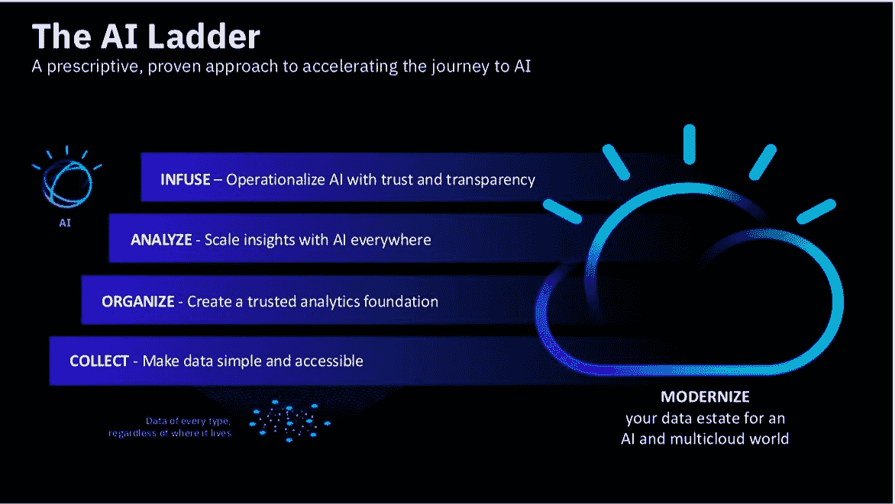

# 在数据科学面试中应该问的问题

> 原文：<https://towardsdatascience.com/questions-you-should-ask-in-a-data-science-interview-379ec068bbd2?source=collection_archive---------21----------------------->

## 询问关于人工智能阶梯的问题

如果你从未做过数据科学家，并试图进入该领域，可能很难判断一个机会是好是坏。这是一个问各种问题的指南，可以帮助你找到答案。

# 人工智能阶梯

罗布·托马斯(IBM 数据和沃森人工智能总经理)将采用人工智能的路径定义为人工智能阶梯，它包含 4 个不同的部分。如果要在一个组织中恰当地采用人工智能，梯子上的每一步都必须在下一步之前完成。这个阶梯代表了 AI 所依赖的信息架构。我相信你的问题应该围绕人工智能阶梯的每个部分，因为理解阶梯(以及公司在阶梯上的位置)对于理解你可能在公司做什么是至关重要的。这里有一个人工智能阶梯的概述和一些你可以问的非威胁性问题来衡量这一点。

[https://www.ibm.com/downloads/cas/3QLWB4QK](https://www.ibm.com/downloads/cas/3QLWB4QK)

# 收集

没有数据就没有数据科学！有趣的是，公司并不总是拥有大量简单且可访问的数据，但仍在寻求雇佣数据科学家。我认为他们沉浸在人工智能的兴奋中，忘记了基础是数据。要通过第一关，公司必须拥有易于访问的数据。

几年前，我申请了一家大宗商品交易公司的数据科学职位，当时我还年轻，对数据科学还不熟悉，我问了一个问题，一开口就觉得很愚蠢——“你们都有什么样的数据？”这实际上是一个非常好的问题。事实证明，这家大约有 40 人的公司处理的是保存在一个位置的许多 excel 文件，没有版本控制，没有编程，每个表格都需要根据其他表格的变化频繁更新。我不确定有多少公司是这样运作的，但我确信即使是最没有经验的人读到这里也会担心。这家公司确实存在与数据相关的问题，但这并不意味着他们现在需要一名数据科学家。我认为很大一部分问题是数据科学家被视为可以解决任何数据或技术问题的独角兽，但他们通常不是公司解决数据相关问题所需的*第一*人。毕竟，如果没有道路，你就不会想要一辆汽车。

对于一家希望更好地利用数据的公司来说，首要任务是建立一个集中的事实来源。你实际上应该问“真理是否有一个中心来源？”或者“有数据湖吗？”这将帮助您确定该公司是否拥有开始从事数据科学所需的数据。在我前面提到的商品交易公司的例子中，答案是否定的。即使有，你可能还是想问一些额外的问题来确定你不负责保证数据的存在。我建议也问“有数据库管理员吗？”回答其中一个问题会让你更好地了解公司希望你做什么。在某些情况下，这些问题是没有用的。如果你在谷歌面试，问他们“有数据库管理员吗？”你会得到一些有趣的表情。如果你问一家咨询公司这个问题，它也可能没有意义，因为这个答案因公司的特定客户而异。

# 组织

一旦明确了数据的存在和可访问性，接下来您需要询问的是数据质量和组织。人工智能依赖于大量干净的数据，询问关于数据组织的问题不仅可以帮助你确定公司是否准备好进行机器学习，还可以帮助你确定公司是否准备好进行基础分析。简单分析是最容易实现的，如果你不确定公司有足够干净的数据，那么你可能会陷入困境。虽然您可能必须完成许多涉及数据清理和组织的任务，但其中一些应该由其他人来处理。像“有数据管家吗？”将帮助您确定是否要执行大量与数据科学无关的数据相关任务，如治理、保护和法规遵从性。

# 分析

这是你应该完全参与的人工智能阶梯的一步。它有有趣的 ML 内容，可能最初会引起你对数据科学的兴趣。在这一部分，我会问你将建立什么样的模型，我会让你的主题知识发光。你对公司业务的兴奋和好奇在这里很重要。虽然我建议你问的其他问题是为了让你了解公司，但你在这里问的问题实际上是为了让公司了解你。如果你能问一些有趣的问题，或者对公司的流程有新的想法，你就是最棒的。不幸的是，这是我在这一部分能给你的最具体的建议，因为最佳问题因公司而异。

# 鼓舞

最后，在现有的过程和软件中注入你的工作是很重要的，没有注入的步骤，你的工作将永远不会被使用，或者只是停留在报告中。为了确定你可能参与其中，我会问“有机器学习工程师吗？”机器学习工程师协助你的模型生产化。如果没有人做这件事，那么这通常是数据科学家的责任。这对你的工作来说可能是也可能不是一件有趣的事情，但是它绝对需要你额外的技能。另一个问题是“你如何将模型投入生产？”或者“模型是如何部署的？”最后，在这一部分，我建议问“如何监控模型？”在许多情况下，受监控和可解释的人工智能不仅在信任方面，而且在法律合规性方面都至关重要。

# 结论

总的来说，你可能已经注意到询问公司的其他数据工作是一个好主意。从“数据团队中还有哪些职位”开始是一个好问题，但如果你没有得到一个直截了当的答案，我会深入问一些更具体的问题，以帮助你找出该公司在人工智能阶梯上的位置。一家公司在阶梯上的位置和其他与数据相关的角色为你提供了最好的线索，让你知道你需要什么样的技能以及你将做什么。记住面试应该是双向的——你给一家公司留下多少印象，它就应该给你多少印象。