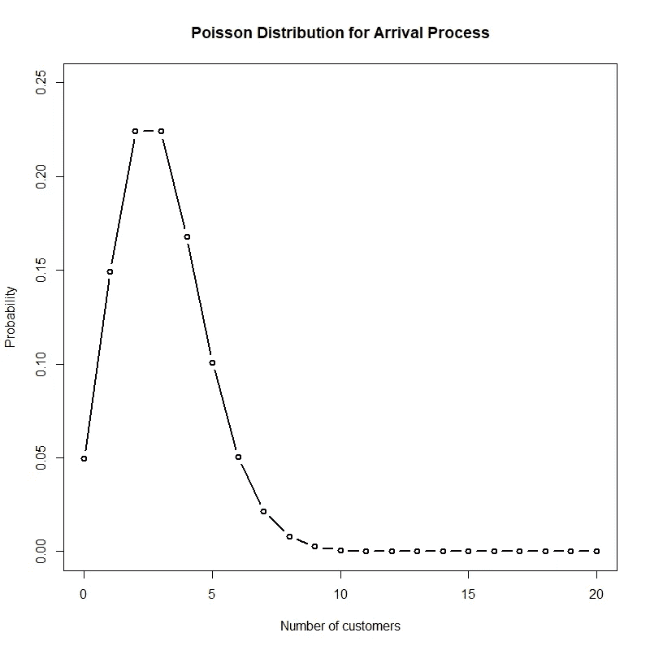
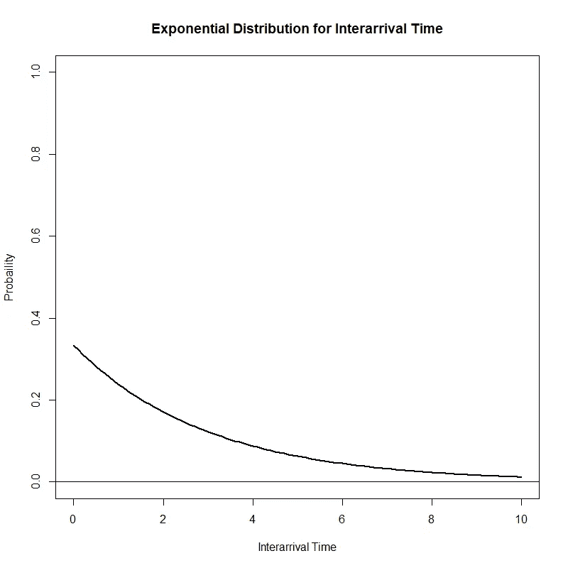
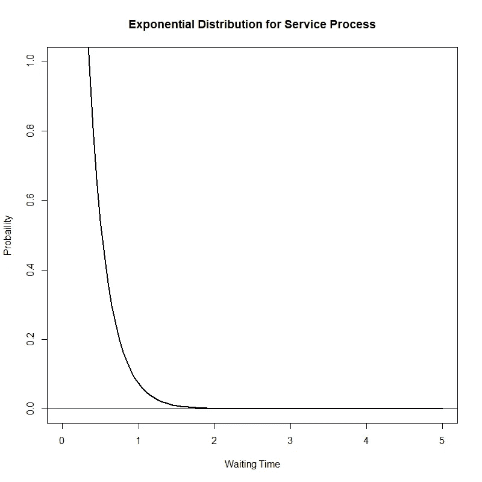

# 带 R 的排队模型

> 原文：<https://towardsdatascience.com/queueing-models-with-r-a794c78e6820?source=collection_archive---------12----------------------->

## r 代表工业工程师

## 探索“排队”R 包

图片由 Hal Gatewood 拍摄，可在 [Unsplash](https://unsplash.com/photos/Nzb4LBsctyQ) 获得

# 排队论:导论

排队论是对排队等候的数学研究。排队论和模拟一样，是最广泛使用的运筹学和管理科学技术。其主要目标是建立一个模型来预测队列长度和等待时间，以做出与资源管理和分配相关的有效业务决策，从而提供给定的服务。

# 排队系统的组成部分

排队系统由三部分组成:到达过程、服务机制和排队规则。

*   **到达流程**:描述客户如何到达系统，以及客户到达的分布
*   **服务机制**:由服务器数量、每个服务器是否有自己的队列或有一个队列为所有服务器提供服务以及客户服务时间的分布来表达
*   **排队规则**:指服务员完成当前顾客的服务后，从队列中选择下一个顾客的规则(如 *FIFO* :先进先出；*后进先出*:后进先出；基于优先级；随机选择)

# **排队模型符号**

任何队列系统的两个主要输入是:

*   **λ**(*λ*):每个时间段的平均到达人数(即平均到达率)
*   ( *管理部门*):每个时间段平均服务的客户数(即平均服务率)

对排队系统进行分类的标准符号系统是 A/B/c/k/m，其中:

*   ***A*** 表示到达过程的概率分布
*   ***B*** 表示服务流程的概率分布
*   ***c*** 代表通道(服务器)的数量
*   ***k*** 表示排队系统中允许的最大顾客数
*   ***m*** 代表客户总数的最大值

***A*** 和 ***B*** 的常见选项有:

*   ***M*** 为泊松到达分布(即指数到达间隔分布)或指数服务时间分布
*   ***D*** 为确定性或常量值
*   ***Ek*** 为一阶的厄朗分布 *k*
*   ***G*** 对于均值和方差已知的一般分布

当没有指定 ***k*** 和 ***m*** 时，假设它们是无穷大。

[*排队*](https://cran.r-project.org/web/packages/queueing/queueing.pdf) R 包包含多个用于分析排队系统的函数。对于下面的例子，让我们考虑最简单的排队系统:M/M/1，泊松到达率为每分钟 3 个顾客，指数服务时间为每分钟 4 个顾客，只有一个服务员。我们来看看 R 代码！

## **M/M/1 结果**

## **汇总输出术语**

*   ***RO***(***ρ***):整体系统利用率
*   ***P0*** :所有服务器空闲的概率
*   *:长期平均排队顾客数*
*   ****【Wq】***:长期平均排队时间*
*   ****X*** :系统吞吐量*
*   ****L*** :系统长期平均客户数*
*   ****W*** :系统长期运行的平均时间*
*   ****【Wqq】***:排队模型中有队列时的长期平均排队时间*
*   ****Lqq*** :排队模型中有队列时的长期平均排队顾客数*

*既然我们已经用*报告*函数获得了最相关的性能度量，那么绘制到达和服务流程的分布将会很有意思。再来看看下面的 R 代码！*

## ***到达过程的泊松分布图***

**

## ***间隔时间的指数分布图***

**

## ***服务流程的指数分布图***

**

# *总结想法*

*根据所研究系统的复杂性，建立数学模型来预测队列长度和等待时间可能是一项具有挑战性的任务。*

*与前面分析的例子一样， *queueing* R 包只需要几行代码就可以从多个排队系统中研究和获得结果。虽然有其他可用的模拟软件可能需要您购买许可证(例如[竞技场](https://www.arenasimulation.com/)、[西米奥](https://www.simio.com/index.php))，但 R 代表了执行基本模拟研究的另一种有效工具。*

**—**

**如果你觉得这篇文章有用，欢迎在*[*GitHub*](https://github.com/rsalaza4/R-for-Industrial-Engineering)*上下载我的个人代码。你也可以直接在 rsalaza4@binghamton.edu 给我发邮件，在*[*LinkedIn*](https://www.linkedin.com/in/roberto-salazar-reyna/)*上找到我。有兴趣了解工程领域的数据分析、数据科学和机器学习应用的更多信息吗？通过访问我的媒体* [*简介*](https://robertosalazarr.medium.com/) *来探索我以前的文章。感谢阅读。**

**——罗伯特**