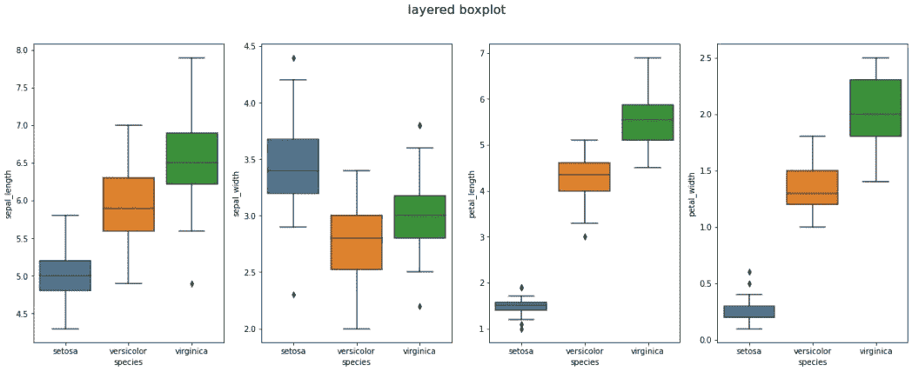

# 快速脏数据可视化工具箱

> 原文：<https://towardsdatascience.com/quick-and-dirty-data-visualization-toolbox-a2e24f201e29?source=collection_archive---------35----------------------->

## 我给有抱负的数据科学家和分析师的建议

## 用这个工具箱开始你的探索


来源: [Unsplash](https://unsplash.com/photos/hpjSkU2UYSU)

> *我们大多数人需要听音乐才能理解它有多美。但通常这就是我们展示统计数据的方式:我们只展示音符，不演奏音乐。—汉斯·罗斯林*

数据可视化对于理解数据分析之美至关重要。通过数据可视化，我们的利益相关者了解我们分析的影响。这有助于他们集中注意力，做出明智的决定。

然而，尽管它很重要，我总是收到有抱负的数据科学家关于他们如何开始探索数据分析的问题。

> 简单，数据可视化。

## 快速脏数据可视化工具箱

由于存在适用于各种数据集类型的常见场景，我将重点演示这些代码片段，以便您可以轻松地即插即用。

每当我进行新的数据探索和深入研究时，这些代码片段都来自我在 Google 和 Visa 的个人工作经验——这是我快速和肮脏数据可视化的工具箱。

到本文结束时，您应该开始实现这些代码，并更快、更有效地可视化您的数据。不管您的数据有多干净，您都可以直接运行这些代码并提取见解。

如果您想在 Iris 数据集和 [HR 保留数据上进一步试验这些工具，请随时访问 Colab 链接并运行它们。](https://www.google.com/search?q=who%27s+quitting+medium&rlz=1C1GCEA_enSG866SG866&oq=who%27s+quitting+medium&aqs=chrome..69i57j69i59j69i64l3.5829j0j7&sourceid=chrome&ie=UTF-8)

[](https://colab.research.google.com/drive/1_5JgUkvrJKZwYGoNrKjpqonu5IBJL0hN?authuser=1#scrollTo=evx30_CG-pA-) [## 谷歌联合实验室

### 编辑描述

colab.research.google.com](https://colab.research.google.com/drive/1_5JgUkvrJKZwYGoNrKjpqonu5IBJL0hN?authuser=1#scrollTo=evx30_CG-pA-) 

> 就这样，让我们开始吧！

# 图书馆要求

我总是推荐 Matplotlib 和 Seaborn 来完成 80%以上的典型数据可视化。如果您使用 Colab，这些库已经为您预先安装好了。如果没有，请在您的包管理器上运行以下命令。

```
pip install matplotlib
pip install seaborn
```

# 圆形分格统计图表

饼图对于显示要素间的计数类分布非常有用。这对于研究目标变量类的分布和根据我们的先验知识进行健全性检查非常有用。

例如，如果我们分析 Iris 数据集中的三个类，我们期望每个类的计数相似。但是在 Gmail 垃圾邮件/垃圾邮件检测中，我们预计会出现偏斜的类别分布。垃圾邮件的数量应该少于火腿的数量。

**当…** 存在分类目标变量时，您应该使用此选项。


实施饼图

# 分布图

分布图显示连续的特征分布，以直观地检测异常值、偏斜度和峰度。

它不仅帮助您了解当前分布，还帮助您了解异常值或边缘情况(如负值)。这有助于您理解数据集并设计后续的数据清理和转换。

**当……**有 n 个连续特征时，你应该用这个。


# 分层箱线图

分层箱线图是另一种分布可视化工具，可以直观显示每个类别的不同分布，并快速找到关键模式。

在下面的可视化中，只需快速浏览一下，您就知道`class ‘setosa’` 在萼片 _ 长度、花瓣 _ 长度和花瓣 _ 宽度中的分布非常低。

这使您能够快速了解什么是重要的，并允许您对数据清理和转换工作进行优先级排序。

**当……**有 n 个连续特征和分类目标特征时，应使用此选项。



# 因子图

Factorplot 可视化每个类别的分类计数分布，并快速找到关键模式。这是一个全新的可视化工具，不需要定制。

**当…** 存在一个带有分类目标特征的分类特征时，应使用此选项。


# 热图

热图显示了 n 个连续特征之间的相关性。与 pd 结合。DataFrame.corr()，它可视化了哪些功能相互关联。

相关性分析的目标是让您了解哪些特征相互关联，哪些特征可能会妨碍洞察生成和模型学习。

在下面的例子中，*最后数字 _ 项目*与*最后 _ 评估*和*平均 _ 每月 _ 小时*高度相关。这是有道理的，因为你的项目越多，你需要工作的时间就越多。

如果您将这些特征转储到回归学习模型(GLM)中，而没有正确处理它们的相关性，回归将夸大这两个特征的重要性，这两个特征本质上发送相同的信号。

**当…** 有 n 个连续特征时，应使用此选项


# 配对图

Seaborn pairplot 在每个要素对中运行类分布。Pairplot 是一种直观显示多个要素之间分布的快速方法。

潜在的警告是，如果你有许多功能，它可能是嘈杂的。但是您可以使用诸如主成分分析(PCA)之类的特征选择技术来修复和过滤特征。

**当…** 目标变量有 n 个连续特征时，应使用此选项


Seaborn 配对图

# 箱线图和散点图

这种集成进一步促进了特征到特征的关系，以影响目标变量。基于您的假设(来自 pairplot 或您自己的观察)，您可以选择这些特征并快速绘制。

**在下面的示例中，您可以很快看到有 3 个决定员工离职的聚类:**

*   平均每月工作时间长，满意度低→过度工作和不满足
*   平均月小时数低，满意度中等→表现不佳
*   高平均月小时数，高满意度→超额完成

**即使没有聚类 ML 模型，散点图也为我们提供了关于员工辞职原因的见解和假设:**

*   更好的工作生活平衡(过度工作和不满足)
*   工作中更好的挑战(后进生)
*   更好的职业机会(超额完成者)

**当…** 有两个连续特征和目标变量时，你应该使用这个。这应该与你的假设相匹配。


# 最后的想法


来源 [Unsplash](https://unsplash.com/photos/s4F5A55xbmg)

我相信这些代码很容易在您的第一次数据探索中直接实现。这个可视化工具箱将为您提供一个良好的开端，让您在探索和可视化数据时变得更加自信。

一如既往，如有任何问题，请通过 Linkedin 联系我。如果时间允许，我很乐意回答你的问题。

索利·德奥·格洛丽亚

# 关于作者

Vincent Tatan 是一名数据和技术爱好者，拥有在 Google LLC、Visa Inc .和 Lazada 开展微服务架构、商业智能和分析管道项目的相关工作经验[。](https://bit.ly/2I8jkWV.?source=post_page---------------------------)

Vincent 是土生土长的印度尼西亚人，在解决问题方面成绩斐然，擅长全栈开发、数据分析和战略规划。

他一直积极咨询 SMU BI & Analytics Club，指导有抱负的数据科学家和工程师，并为企业开发产品开放他的专业知识。

最后，请通过[**LinkedIn**](http://www.linkedin.com/in/vincenttatan/?source=post_page---------------------------)**，**[**Medium**](https://medium.com/@vincentkernn?source=post_page---------------------------)**或** [**Youtube 频道**](https://www.youtube.com/user/vincelance1/videos?source=post_page---------------------------) 联系文森特