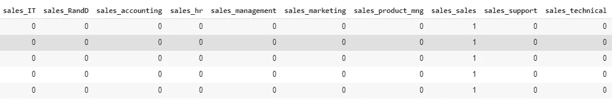
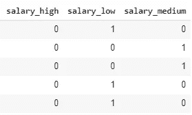
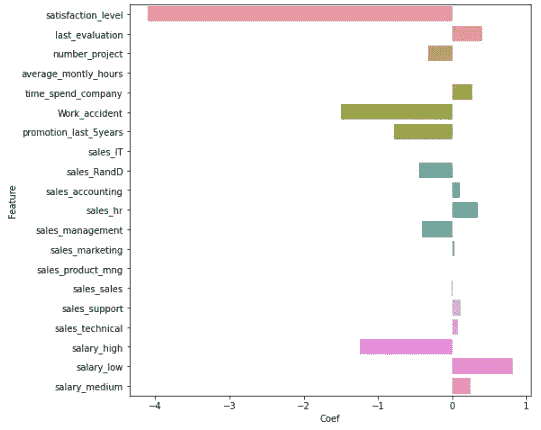
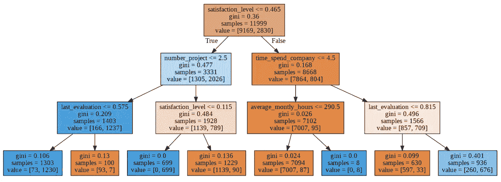
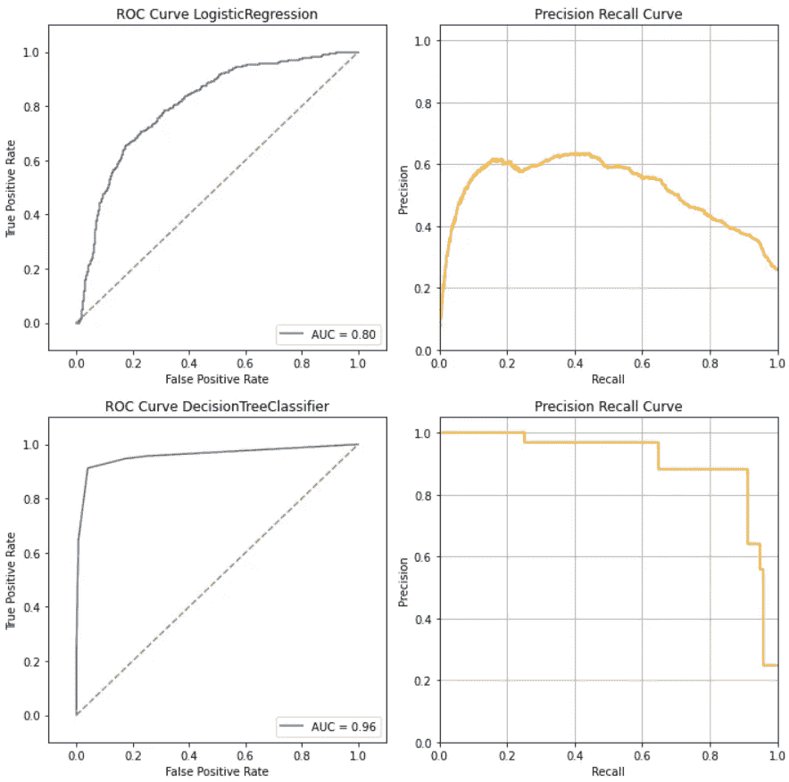
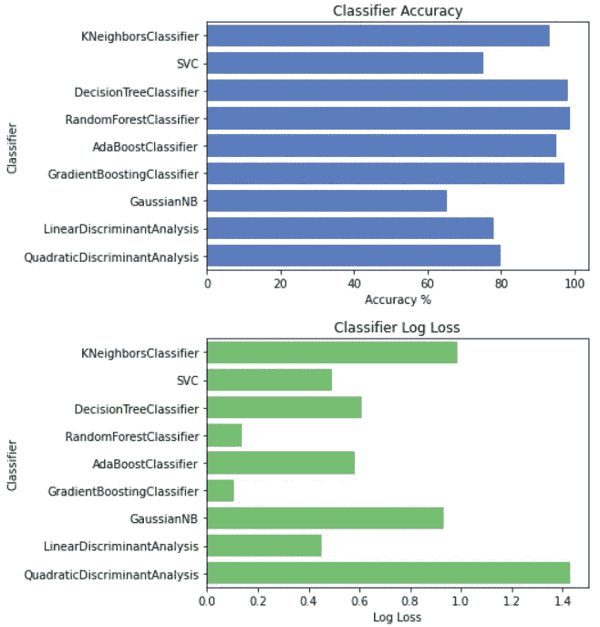

# 用于分类问题的快速脏 ML 工具箱

> 原文：<https://towardsdatascience.com/quick-and-dirty-ml-toolbox-3650d34cf0e0?source=collection_archive---------37----------------------->

## 我给有抱负的数据科学家和分析师的建议

## 用这个工具箱启动你的 ML


来源: [Unsplash](https://unsplash.com/photos/Ua9AK-pZ5cw)

> 就像 100 年前电力几乎改变了一切一样，今天我实际上很难想到一个我认为 AI(人工智能)在未来几年内不会改变的行业。”~ **吴恩达**

机器学习始终是成为一名成功的数据科学家和分析师的重中之重。通过机器学习，我们学会了如何运行程序，将原始数据转化为见解和预测。

然而，当你开始分析某个案例时，你会从哪里开始呢？

在这篇文章中，我想写一篇关于 ML 工具箱的文章，让你开始在一个新的数据集中探索 ML。ML 是一个迭代的过程；大多数时候，你需要通过商业问题来细化你的 ML 操作。

我真诚地希望这篇文章能够成为您对任何数据集进行初步探索的起点。我还根据自己的经验和反复探索创建了数据可视化工具箱，帮助您启动数据项目。

[](/quick-and-dirty-data-visualization-toolbox-a2e24f201e29) [## 快速脏数据可视化工具箱

### 用这个工具箱开始你的探索

towardsdatascience.com](/quick-and-dirty-data-visualization-toolbox-a2e24f201e29) 

# 快速和肮脏的 ML 工具箱

这些是我在 Google 和 Visa 的数据探索中反复出现的代码片段——我的快速和肮脏的 ML 探索工具箱。

到本文结束时，您应该实现这些代码并运行 ML exploration 的初始迭代。你可以按照这些步骤，提取见解。

以下是初步探索的流程:

1.  数据准备
2.  ML 培训
3.  ML 评估
4.  (奖金)多分类器实验

在这种情况下，我们将使用[人力资源保留数据](https://www.google.com/search?q=who%27s+quitting+medium&rlz=1C1GCEA_enSG866SG866&oq=who%27s+quitting+medium&aqs=chrome..69i57j69i59j69i64l3.5829j0j7&sourceid=chrome&ie=UTF-8) t 来模拟典型的分类目标。

> 谁会离开你的公司

请随意访问这个 Colab 链接并运行它们。

[](https://colab.research.google.com/drive/1HCvusxHM-m4TJBS7VK7dDkfVyCYg6weU?authuser=1#scrollTo=nRvAoF-7B_Sl) [## 谷歌联合实验室

### 编辑描述

colab.research.google.com](https://colab.research.google.com/drive/1HCvusxHM-m4TJBS7VK7dDkfVyCYg6weU?authuser=1#scrollTo=nRvAoF-7B_Sl) 

> *就这样，让我们开始吧！*

# 图书馆要求

## 导入 Matplotlib 和 Seaborn 来讲述故事

对于那些不了解 Seaborn 的人来说，我很惭愧没有早点告诉你们。在我看来，这是每个数据分析师和科学家都需要熟悉的最大宝藏之一！(不开玩笑！).

Seaborn 将允许您在几秒钟内创建惊人的图形和可视化。因此，作为有效的数据科学家/分析师，这是一个非常重要的工具，可以帮助你提高讲故事的技巧。

> *Seaborn 是基于*[*matplotlib*](https://matplotlib.org/)*的 Python 数据可视化库。它提供了一个高层次的界面来绘制有吸引力的和信息丰富的统计图形。— Seaborn Pydata Org*

## 导入 SkLearn for ML 工具包

Scikit Learn (SkLearn)是一个用于 python 的 ML 库。它具有模块化的功能，您需要这些功能来运行各种 ML 特性，如分类、聚类和回归。

SkLearn 使用 Python 科学库，如 NumPy 和 SciPy，并支持算法，如 SVM(支持向量机)、决策树和逻辑回归。

对于本教程，我们将重点讨论决策树和逻辑回归，因为它们提供了直观的可视化表示和简单的实现。大多数时候，他们已经足够“好”了。

## 我的建议

我总是推荐，SkLearn，Matplotlib 和 Seaborn 来完成> 80%的典型数据可视化。如果你使用 Colab，这些库都为你准备好了。如果没有，请在您的包管理器上运行以下命令。

```
pip install matplotlib
pip install seaborn
pip install sklearn
```

# 数据准备

## 虚拟化你的分类变量

> 假设您有一个“大学名称”专题，其中包括诸如“哈佛”、“乔治亚理工学院”、“新加坡国立大学”等标签。对于基于距离的最大似然法，如逻辑回归和 K 近邻法(KNN)，你是如何表示它们的？

当您有一个分类变量(非数字)时，您将需要创建多个虚拟特征来将分类替换为数字特征。

实体模型化删除了编码变量，并将唯一的整数值添加到 is_[feature]变量中(例如:is_harvard_graduate，is_yale_graduate)。这些用 0(假)或 1(真)表示，用于基于距离的 ML。

**当……**您将分类目标变量用于基于回归/距离的 ML 时，您应该使用这种方法。



虚拟销售和工资分类特征

## 特征选择

> 想象一下小型创业公司的人力资源保留问题。你有责任预测谁将离开你的公司。你收集了所有你能想到的数据:他们的家庭背景、工作经历和过去一年的表现。
> 
> 你很高兴，因为你有 100 多个特征，并觉得足以将它们输入神经网络。

这是**维度诅咒的陷阱(** [理查德·e·贝尔曼](https://en.wikipedia.org/wiki/Richard_E._Bellman) ) **。**实际上，当你有一个宽数据集但数据集短(n_features 大但数据量小)的时候。很容易使你的 ML 模型过拟合，因为它会记住给定唯一特征集的所有观察值。

解决方案是减少特性集的大小。这允许模型忽略不相关的特征并学习相关的特征。

## 现在，选择哪些功能？

我们使用一种简单的算法，称为递归特征消除(RFE)。该方法逐个重新运行特征的过滤，直到集合被替换为给出最佳可学习性的集合。

想象一下你的学校篮球俱乐部。每年，教练都会召集感兴趣的学生，并在每次季后赛中淘汰一些。最终的结果是一组具有一致的技能和团队合作的玩家来执行。

> 您可以根据功能集在一个集合中的重要性对其进行排序。

**当…** 有大量低观测值的特征倾向于过度拟合您的 ML 模型时，您应该使用此方法。

## 列车测试分离

> 想象一下你最近的学术考试。你是怎么准备的？有没有把所有模拟考试答案都背下来但期末考试表现不好的情况？如果是，你需要理解你的模拟考试(训练)以产生期末考试(测试)的结果。

拆分训练和测试数据集对于评估模型准确表示现实的能力非常重要。

这是一个试金石，我们用它来知道模型是欠拟合还是过拟合。

*   **训练集**提供了一个已知输出和一般化数据。
*   **测试集**评估我们的模型在未知数据集上的表现。
*   **验证集**测试调优评估和再培训。

**当…** 您评估任何 ML 模型时，您都应该使用这个。

# ML 培训

## 逻辑回归

> 想象一下你现在办公室里的同事。你能选出 3 个最有可能离开小公司的人吗？
> 
> 你选择了千禧一代(20-30 岁)吗？
> 
> 如果我根据过去 1 年的表现向您展示谁表现出色，您觉得如何？你能猜得更好吗？

逻辑回归是一种基于概率的模型，它使用最大似然作为距离函数。它计算在给定输入的情况下预测某个值的概率。

在我看来，最好的用例之一是确定适当的权重。它们最好地解释了特征 X 的权重，这对于基于评分的检测系统(信用风险或逃跑风险)来说是方便的。

> 警告:小心道德问题(阅读[数学毁灭武器](https://www.amazon.com/Weapons-Math-Destruction-Increases-Inequality/dp/0553418815)

在下面的结果中。我们观察到，满意度 _ 结果、工作 _ 事故和工资水平对预测员工外逃风险有重要影响。

**当…** 运行基于回归的模型、分析其系数以及预测分类问题时，您应该使用此工具。



## 决策图表

决策树的目标是将数据分成组，从而最大限度地获取信息。

决策树的最大优势是直观和容易获得洞察力，即使是未经清理和非标准化的数据。它不受离群值和具有规则的分割顶部特征的影响。

在我看来，它的最佳用例是找到最能解释某一类的概要。比如离职员工的症状有:低 _ 满意度，低 _ 末位 _ 评价。

**当…** 您运行基于规则的模型，分析其分类剖析规则，并预测分类问题时，您应该使用此工具。



# ML 评估

## 混淆度量和初步评估统计

混淆度量将模型预测与现实进行比较，这使我们能够了解模型性能并回答业务问题—数据学校:

*   **真阳性(TP):** 我们预测他会离开(他确实离开了)。
*   **真正的否定(TN):** 我们预测他不会离开(他没有离开)
*   **假阳性(FP):** 我们预测他会离开(但他没有离开)——第一类错误。
*   **假阴性(FN):** 我们预测他不会离开(但他确实离开了)——第二类错误。
*   **进一步统计**:准确率、误分类率、精确度和召回率

**当…** 你评估任何模型的分类问题时，你应该使用这个。


## AUC ROC 曲线

AUC(曲线下面积)ROC(最佳曲线)在设置模拟中设置阈值，以测量分类判断的置信度。它通过给出一个百分比来说明模型能够在多大程度上区分类别。

AUC 越高，模型的预测就越有把握。从逻辑上讲，对于医疗和高风险环境，您希望 AUC 很高，以显示对每个判决的高度信任

而在垃圾邮件检测中，这种高标准可能是不必要的。

**当…** 您在将模型投入生产之前分析模型的分类问题并确定可信度时，您应该使用此工具。



具有精确回忆曲线的 ROC-AUC

# (奖金)多分类器实验

在大多数情况下，您希望试验各种类型的分类模型，并确定性能最佳的模型。有许多基本款和套装款可供选择，例如:

1.  KNeighborsClassifier —基于实例的 ML，根据观察与其他实例的接近程度来预测类。
2.  支持向量分类器-尝试基于具有最大分离距离的核来分离类。
3.  决策树分类器——基于规则的 ML，通过分割特征来基于规则预测类别，启发式地给出最佳信息增益。
4.  随机森林分类器-决策树集成，依赖于在不同数据和特征集上运行的多个模型。
5.  Ada Boost 分类器——决策树集成，它混合多个特征树桩，从头开始形成树集成。
6.  等等

**当…** 您想要试验哪个模型给出最高的准确性(预测质量)和最小的对数损失(信息增益)时，应使用此选项。



# 最后的想法


来源: [Unsplash](https://unsplash.com/photos/GaprWyIw66o)

我相信这些代码很容易在您的第一次数据探索中直接实现。这个可视化工具箱将为您提供一个良好的开端，让您在探索和可视化数据时变得更加自信。

一如既往，如果你有任何问题，请通过 [Linkedin](http://www.linkedin.com/in/vincenttatan/?source=post_page---------------------------) 联系我。如果时间允许，我很乐意回答你的问题。

索利·德奥·格洛丽亚

# 关于作者

文森特用 ML @ Google 对抗网络滥用。文森特使用高级数据分析、机器学习和软件工程来保护 Chrome 和 Gmail 用户。

除了在谷歌的工作，Vincent 还是《走向数据科学媒体》的特约撰稿人，为全球 50 万以上的观众提供有抱负的 ML 和数据从业者的指导。

在空闲时间，文森特在佐治亚理工学院攻读硕士学位，并为铁人三项/自行车旅行进行训练。

最后，请通过 [**LinkedIn**](http://www.linkedin.com/in/vincenttatan/?source=post_page---------------------------) **，**[**Medium**](https://medium.com/@vincentkernn?source=post_page---------------------------)**或** [**Youtube 频道**](https://www.youtube.com/user/vincelance1/videos?source=post_page---------------------------) 联系文森特