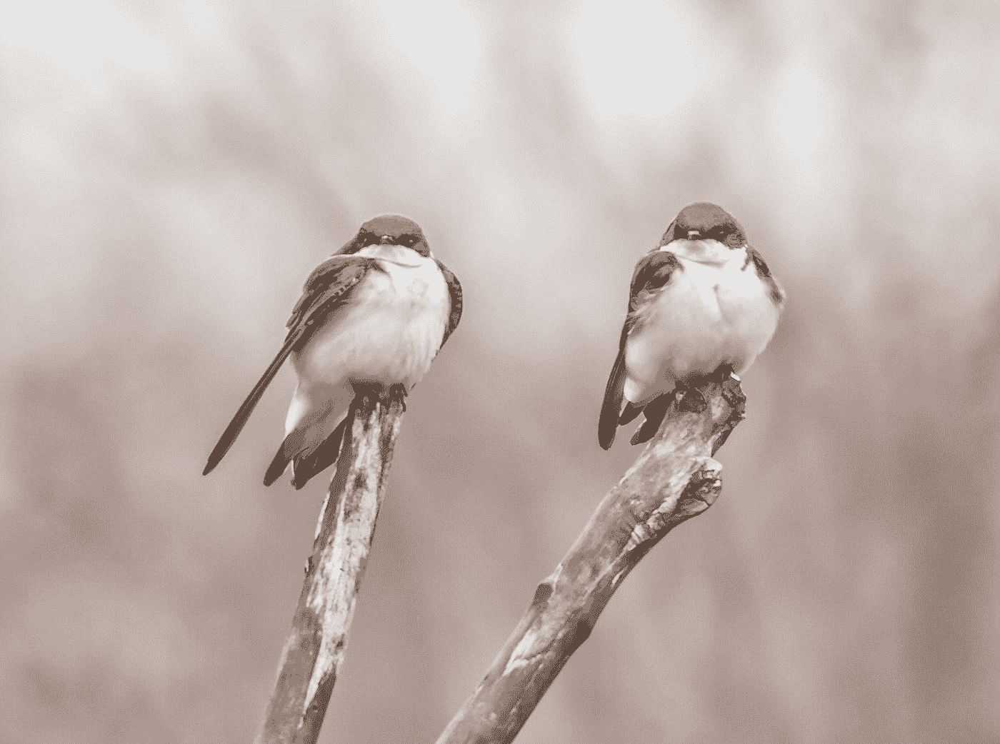
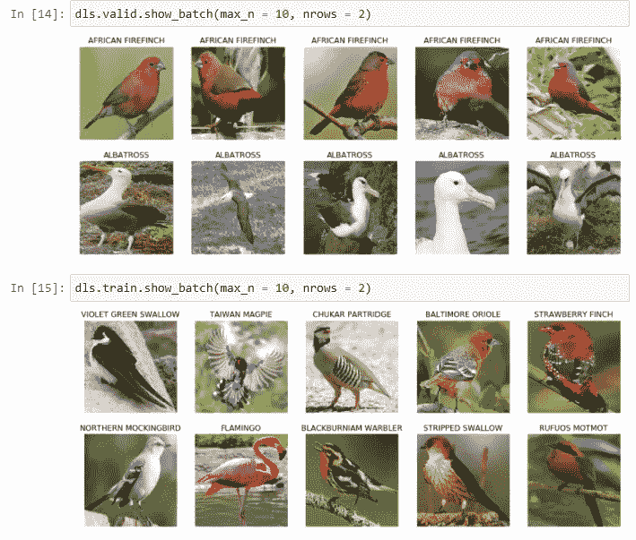
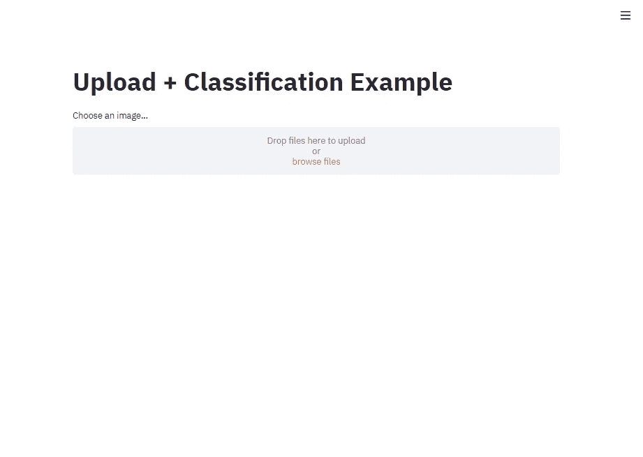
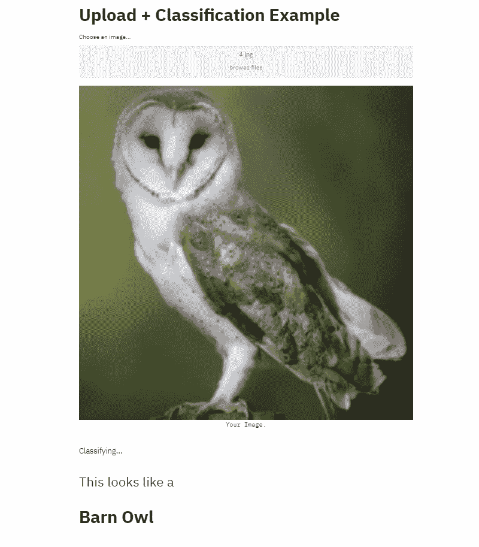

# 快速简单的深度学习 WebApp

> 原文：<https://towardsdatascience.com/quick-and-easy-deep-learning-webapp-762f92f19f46?source=collection_archive---------49----------------------->

## 使用 fastai 和 streamlit 训练和部署深度学习图像分类模型


锡德·巴拉钱德朗在 [Unsplash](https://unsplash.com?utm_source=medium&utm_medium=referral) 上拍摄的照片

你有没有想过在一个项目中使用深度学习，并以互动的方式展示你的成果？你想开始你的深度学习之旅，并作为一个工作应用快速看到你的结果吗？让我告诉你怎么做。

使用 Python 部署小型数据驱动或机器学习应用程序的最简单方法之一是 streamlit。Streamlit 允许您只使用几行代码创建具有大量功能的 web 应用程序，我将在一分钟后演示。

[](https://www.streamlit.io/) [## Streamlit -创建数据应用程序的最快方式

### Streamlit 是一个面向机器学习和数据科学团队的开源应用框架。在…中创建漂亮的数据应用程序

www.streamlit.io](https://www.streamlit.io/) 

现在涵盖了部署部分，但机器或深度学习呢？如果你想深入学习，fast.ai 是一个很好的起点。他们的 MOOC，现在也是他们的书，特别是 fastai 图书馆，为你提供了开始深度学习之旅所需的一切。

[](https://www.fast.ai/) [## 主页

### 2020 年 10 月 20 日更新:NumFOCUS 已经向我道歉了。我接受他们的道歉。我不接受他们的断言，即“在…

www.fast.ai](https://www.fast.ai/) 

我想向您展示，使用最先进的深度学习模型，构建一个交互式分类 WebApp 有多快多容易。为此，我将从 Kaggle 获得 [225 个鸟类物种数据集](https://www.kaggle.com/gpiosenka/100-bird-species)，
在其上训练一个深度学习模型，然后在 streamlit 应用程序中使用该模型。



由 [Dulcey Lima](https://unsplash.com/@dulceylima?utm_source=medium&utm_medium=referral) 在 [Unsplash](https://unsplash.com?utm_source=medium&utm_medium=referral) 上拍摄的照片

现在我意识到，从技术上来说，对这么多鸟类进行分类并不是一件容易的事情，而且这个模型也远非完美，如果你想得到真正好的结果，你就必须更深入地研究。我只想给你提供一个分类应用教程，不使用 MNIST，时尚 MNIST，CIFAR-10 或 fastai MOOC 已经使用的任何东西。本教程不是告诉你如何在 Kaggle 排行榜上获得鸟类图像分类的榜首。我更愿意向您展示如何以初学者友好的方式构建端到端的东西。

第一步是下载数据。
数据集包含 4 个名为“合并”、“测试”、“训练”和“有效”的文件夹。在每个文件夹中，我们可以找到 225 个子文件夹，每个物种一个。文件夹名称稍后将提供标签。“合并”文件夹包含所有图像，所以对我们来说用处有限。

让我们把重点放在我们任务的培训和验证文件夹上。

# 数据准备和模型培训

下一步是加载我们的数据，预处理它并训练我们的模型。如果你是一个初学者，这听起来可能很多，可能令人不知所措，但是 fastai 让它变得出奇的简单。

我们首先导入 fastai.vision.all 包。请注意，我这里用的是`import *`。我知道这可能产生的问题，**我不建议将它用于 jupyter 笔记本之外的任何探索和实验。一旦我们探索、训练并保存了模型，我们将不会在 WebApp 文件中再次使用这种导入。**

```
from fastai.vision.all import *#set the path where our data can be found
path = Path("D:/datasets/birds/archive (2)")#check if the path is working by extracting one image
im = Image.open(path / "train/CROW/001.jpg")
im.to_thumb(224,224) #this should display your image
```

现在，我们可以构建一个数据块和数据加载器，以我们的模型可以处理的方式加载数据。在 fastai 中，这是通过 DataBlock 类和 dataloaders 完成的。`GrandparentSplitter()`告诉数据块对训练集使用“train”中的所有文件，对验证集使用“valid”中的所有文件。

```
birds = DataBlock(
        blocks = (ImageBlock,CategoryBlock),
        get_items = get_image_files,
        splitter = GrandparentSplitter(train_name = "train", valid_name = "valid"),
        get_y = parent_label, #get labels from folder names
        item_tfms = Resize(224) #resize images to 224x224
)#use a dataloader to get the images
dls = birds.dataloaders(path)
```

这将是检查一切是否如预期进行的好时机。我们将查看验证和训练数据的前 10 张图片，看看是否所有内容都已正确加载。

```
dls.valid.show_batch(max_n = 10, nrows = 2)dls.train.show_batch(max_n = 10, nrows = 2)
```

您的输出应该如下所示:



图片作者。

注意，训练数据已经被混洗用于训练，而验证数据没有，也不需要被混洗。

我们的分类器将不得不在真实环境中处理的大多数图片都不会是配得上国家地理特征的完美图像(例如，当有人想使用你的应用程序来找出他们拍了哪只鸟的照片时)。因此，我们应该对数据进行一些转换。使用`birds.new()`,我们可以添加新的图像或转换后的图像。使用`RandomResizedCrop`我们可以添加从原始图片中随机裁剪的图片，使用`batch_tfms = aug_transforms()`我们可以为整批图片添加变换，这些变换是一些有用的标准图像增强，如改变亮度、倾斜、拉伸和挤压图片。

```
birds = birds.new(
        item_tfms = RandomResizedCrop(224, min_scale = 0.5),
        batch_tfms = aug_transforms())#we again load the data 
#I set num_workers = 0 in order to run the torch code on my local #machine, this may not be necessary for you
dls = birds.dataloaders(path, num_workers = 0)#look at some of the transformations
dls.train.show_batch(max_n = 15, nrows = 3, unique = True)
```

其中一些图片可能看起来有点奇怪，但你也可以找到一些“还可以，但远非理想”的图片，这些图片可能类似于你的 WebApp 用户稍后上传的内容。

好了，我们有了数据，我们对它进行了一些预处理。是时候选择一个模型并训练它了。

Fastai 非常强调使用预训练的模型并对其进行微调。这通常比从头开始训练更好更快地得到结果。这里我们将使用在 ImageNet 数据集上预先训练的 ResNet34。因此，我们的模型已经“看到”了图片，也“知道”了一只鸟的样子。我们可以利用这一点，对模型进行微调，对不同种类的鸟类进行分类。

```
learn = cnn_learner(dls, resnet34, metrics=error_rate).to_fp16() 
#to_fp16() works well for my local system, might not be necessary for you#lets train and tune the model for 5 epochs
learn.fine_tune(5)
```

有关`fine_tune()`方法的深入解释，请参见 [fastai](https://docs.fast.ai/) 文档。

一旦模型被训练，我们可以检查它犯了哪种错误，查看它在训练时间内的损失，当然也可以使用测试集来查看它在新数据上的表现。你绝对应该做所有这些事情。如果你不知道怎么做，可以查看 fast.ai 教程或 MOOC。

然而，我在这里不讨论这些步骤，因为主要的焦点不是模型训练和评估，而是展示如何创建一个工作的应用程序。

这个模型做得很好。对我来说，错误率(在验证集上)是 0.02，这相当于 98%的准确率。请注意，准确性并不总是最好的指标，如果你想训练一个模型，你应该研究更多的指标。

是时候保存我们的模型并进入下一个阶段了:构建 WebApp。

```
learn.export(fname = "first_model.pkl")
```

您可能应该找到一个更有意义的名称，尤其是如果您有多个模型的话。

# Streamlit 应用

我们将使用如上所述的 streamlit。要在本地托管您的应用程序，请打开您的终端或命令/anaconda 提示符，导航到您的 Python 文件所在的目录并键入`streamlit run {your_file_name}.py`。

该应用程序应该在 localhost:8501 下可用。

我们将需要 streamlit，numpy，PIL 和 fastai.vision 来运行一切。

```
import streamlit as st
import numpy as np
from PIL import Image
from fastai.vision.all import load_learner, Path
```

我们的应用程序的开始应该有标题。在 streamlit 中，这就像输入`st.title("Your chosen title")`一样简单

我们的应用程序的下一部分是文件上传，这是快速和方便的:`uploaded_file = st.file_uploader("Choose an image...", type="jpg")`

```
st.title("Upload + Classification Example")uploaded_file = st.file_uploader("Choose an image...", type="jpg") #file upload
```

我们现在基本上已经完成了应用程序的第一个状态，如下所示:



作者图片

为了整合我们的分类，我们首先需要加载模型。

```
learn_inf = load_learner(Path("first_model.pkl"))#load trained model
```

现在让我们对图像进行分类，并创建一些输出。

代码检查是否有上传的文件，一旦是，图像文件被转换，以便让我们的模型使用`.predict()`方法预测它的标签。

一旦我们有了一个预测，我们就用使用标准降价格式的`st.write()`为我们的用户创建一些输出。我还添加了一个小的 if 语句，以获得更好的语法。

```
#classification
if uploaded_file is not None:
    #image transformation and prediciton
    img = Image.open(uploaded_file)
    st.image(img, caption='Your Image.', use_column_width=True)
    image = np.asarray(img)
    label = learn_inf.predict(image) 
    #label[0] accesses the actual label string
    #output display
    st.write("")
    st.write("Classifying...")
    #check for vowels in the names for correct grammar
    if label[0][0] in "AEIOU":
        st.write("## This looks like an")
    else:
        st.write("## This looks like a")
    #our labels are in capital letters only
    st.title(label[0].lower().title())
```

上传图片后，WebApp 看起来应该是这样的:



太好了！现在我们有了一个使用我们深度学习模型的正常运行的本地 WebApp！比用笔记本阅读要酷多了！

你可以部署它，但是你可能需要做一些改变，关于 GPU 的使用等等。

这是应用程序的完整代码:

```
###imports
import streamlit as st
import numpy as np
from PIL import Image
from fastai.vision.all import load_learner, Path## You may need these to deploy your model on e.g. heroku if you are coming from a windows machine
#import pathlib
#temp = pathlib.WindowsPath
#pathlib.WindowsPath = pathlib.PosixPath###App
##file upload and model loading
st.title("Upload + Classification Example")uploaded_file = st.file_uploader("Choose an image...", type="jpg") #file uploadlearn_inf = load_learner(Path("first_model.pkl"))#load trained model#learn_inf.model.cpu() # use this if you want to deploy the model somewhere without using a GPU, you may need pytorch cpu##classification
if uploaded_file is not None:
    #image transformation and prediction
    img = Image.open(uploaded_file)
    st.image(img, caption='Your Image.', use_column_width=True)
    image = np.asarray(img)
    label = learn_inf.predict(image)
    #label[0] accesses the actual label string
    #output display
    st.write("")
    st.write("Classifying...")
    #check for vowels in the names for correct grammar
    if label[0][0] in "AEIOU":
        st.write("## This looks like an")
    else:
        st.write("## This looks like a")
    #our labels are in capital letters only
    st.title(label[0].lower().title())
```

你现在知道如何构建一个基于深度学习的图像分类 App 了吧！

Streamlit 提供了许多功能，您可以添加更多功能或显示更多数据，或者稍微改变布局，进行实验和探索。Fastai 还提供了大量的功能，我建议您也去探索一下。

我希望这篇文章对您有所帮助，现在我请求您:

**探索、实验、构建您自己的应用并展示您所学到的知识！**

-梅林