# 快速简单地解释逻辑回归

> 原文：<https://towardsdatascience.com/quick-and-easy-explanation-of-logistics-regression-709df5cc3f1e?source=collection_archive---------5----------------------->

## 对逻辑回归的简单解释，我们为什么需要它，如何评估它的性能，以及在 python 中使用逻辑回归构建多类分类


资料来源:Muskaan Arshad

# 逻辑回归

它是一种使用自变量预测因变量的预测算法，就像线性回归一样，但不同之处在于因变量应该是分类变量。

**自变量可以是数字或分类变量，但因变量总是分类的**

逻辑回归是一种统计模型，它使用逻辑函数来模拟条件概率。

对于二元回归，给定自变量 X，我们计算因变量 Y 的条件概率

可以写成 ***P(Y=1|X)或者 P(Y=0|X)***

***这读作 Y=1，给定 X 的条件概率或者 Y=0，给定 X 的条件概率***

***P(Y |X)近似为应用于输入特征的线性组合的 sigmoid 函数***

逻辑回归的一个例子是发现一个人是否会拖欠他们的信用卡付款。一个人拖欠信用卡付款的概率可以基于未决的信用卡余额和收入等。

于是，我们可以写出***【P(默认=是|余额)***

当***【P(default = yes)≥0.5，*** 那么我们就说这个人会拖欠自己的货款。

当***P(default = yes)<***0.4 时，那么我们就说这个人不会拖欠他们的付款。

概率总是在 0 和 1 之间。在二元分类的情况下，拖欠付款和不拖欠付款的概率总和为 1

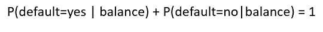

**Logistic 回归可用于二元分类或多类分类。**

*二元分类是指当我们有两种可能的结果时，比如一个人感染了新冠肺炎或者没有感染新冠肺炎。在多类分类中，我们有多种结果，比如一个人可能患了流感或过敏，或者感冒或新冠肺炎。*

# 逻辑回归的假设

*   数据中没有异常值。[异常值](https://medium.com/datadriveninvestor/finding-outliers-in-dataset-using-python-efc3fce6ce32)可以通过分析独立变量来识别
*   独立变量之间没有相关性(多重共线性)。

# 逻辑回归函数

**Logistic 回归使用 logit 函数，也称为 log-odds**；它是几率的对数。比值比是存在事件 B 时事件 A 的比值和不存在事件 B 时事件 A 的比值。

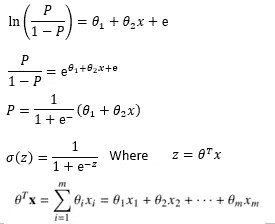

logit 或逻辑函数

*   p 是事件 Y 发生的概率。P(Y=1)
*   P/(1-P)是优势比
*   θ是一个长度为 m 的参数

Logit 函数估计 0 到 1 之间的概率，因此逻辑回归是一种非线性变换，看起来像下面显示的 S 函数。

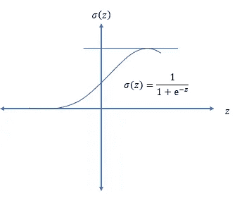

逻辑回归函数

可以使用最大似然估计(MLE)框架来估计逻辑函数的参数“θ”。MLE 搜索与独立变量 x 的联合概率最匹配的参数。

MLE 将为我们提供参数“θ”的值，该值将使拖欠付款的人的概率最大化，接近 1，使所有不拖欠付款的人的概率最大化，接近 0。

# 评价二元分类性能的混淆矩阵

混淆矩阵是一个表格，它告诉我们模型预测的不同类别存在多少实际值和预测值。也被称为**误差矩阵。**

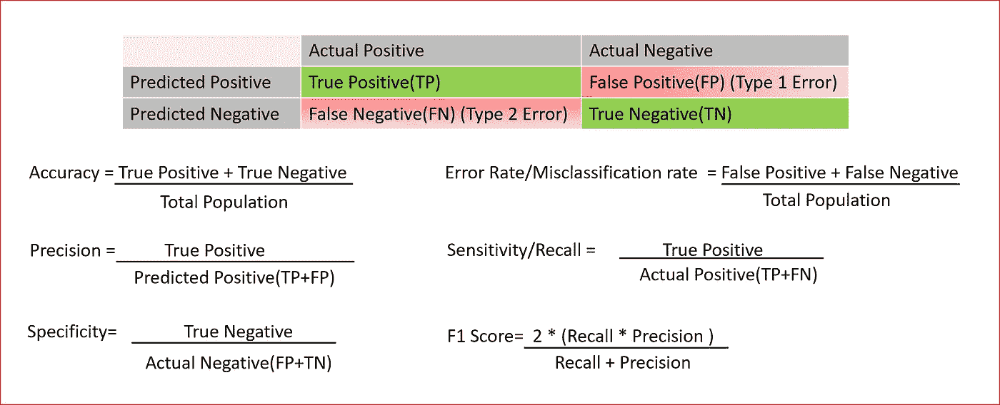

混淆矩阵或误差矩阵以及不同的度量标准

解释关键术语

**真阳性**:当一个女性怀孕了，而我们预测她怀孕了

**真否定**:当一个男性没有怀孕，而我们预测他没有怀孕

**假阴性**:当女性怀孕，但我们预测她没有怀孕。又称**2 型错误。**

**假阳性**:男性不可能怀孕，但我们预测他怀孕了。也称为**类型 1 错误**

# 在 Iris 数据集上实现逻辑回归

数据可以从[这里](http://archive.ics.uci.edu/ml/machine-learning-databases/iris/)下载

**导入所需的库**

```
**import pandas as pd
import numpy as np
from matplotlib import pyplot as plt
import seaborn as sns
from sklearn.model_selection import train_test_split****%matplotlib inline**
```

**读取数据**

从[链接](http://from sklearn.linear_model import LogisticRegression from sklearn.model_selection import train_test_split)下载数据，保存在 CSV 文件中，并添加标题。

```
**dataset=pd.read_csv("iris.csv")**
dataset.info()
```

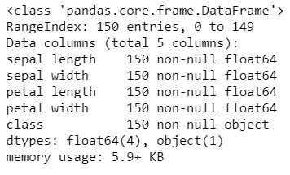

显示数据集中的几行

```
dataset.head(5)
```

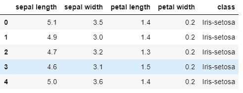

**使用可视化进行数据分析**

将数据可视化，以便更好地理解自变量和因变量

```
sns.boxplot(x="class",y="petal length",data=dataset)
plt.show()
```

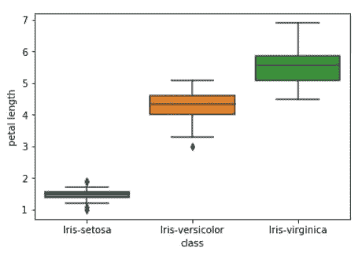

使用花瓣长度和花瓣宽度的不同种类鸢尾的散点图

```
sns.scatterplot(x='petal length', y='petal width', hue="class", data=dataset)
```

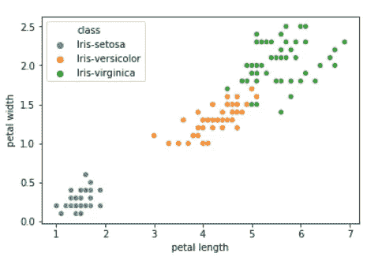

利用萼片长度和萼片宽度绘制不同种类鸢尾的散点图

```
sns.scatterplot(x='sepal length', y='sepal width', hue="class", data=dataset)
```

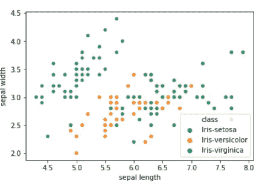

E

**将虹膜的类别从分类编码为数值**

目标变量是代表鸢尾植物类别的字符串。我们将分类字符串数据编码成数值，以便模型理解

```
**from sklearn.preprocessing import LabelEncoder
le= LabelEncoder()
y_encoded=le.fit_transform(y)**
```

打印目标变量的编码值。

```
y_encoded
```

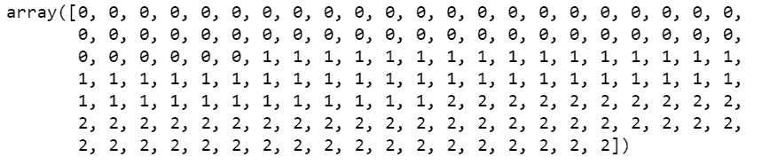

***我们有一个多类分类问题，因为鸢尾植物*** 类有三个不同的值

**将数据集分为训练和测试数据集**

```
**from sklearn.model_selection import train_test_split
X_train, X_test, y_train, y_test= train_test_split(X,y_encoded,test_size=0.2)**
```

## 使用逻辑回归训练数据集

我们正在使用逻辑回归为多类分类训练数据集

```
**from sklearn.linear_model import LogisticRegression
clf = LogisticRegression(random_state=0).fit(X_train, y_train)**
```

**预测测试数据的虹膜类别**

```
**y_pred=clf.predict(X_test)**
```

**评估逻辑回归模型的性能**

使用混淆矩阵来评估多类分类的性能

```
**from sklearn.metrics import confusion_matrix
cnf_matrix=confusion_matrix(y_test, y_pred, labels=[0,1,2])
cnf_matrix**
```

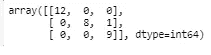

混淆矩阵

这个输出没有太大帮助，所以我们将数字目标变量反向转换回原来的类名

```
**y_pred_orig= le.inverse_transform(y_pred)**
```

我们还编写了一个函数，以更易读的格式显示混淆矩阵

```
**def plot_confusion_matrix(cm, classes,
                          title='Confusion Matrix',
                          cmap=plt.cm.Greens)**:

    import itertools

    print('Confusion Matrix')
    plt.imshow(cm, interpolation='nearest', cmap=cmap)
    plt.title(title)
    tick_marks = np.arange(len(classes))
    plt.xticks(tick_marks, classes, rotation=90)
    plt.yticks(tick_marks, classes)
    fmt = '.2f' 
    thresh = cm.max() / 2.
    for i, j in itertools.product(range(cm.shape[0]), range(cm.shape[1])):
        plt.text(j, i, format(cm[i, j], fmt),
                 horizontalalignment="center",
                 color="white" if cm[i, j] > thresh else "black")plt.ylabel('Actual label')
    plt.xlabel('Predicted label')
    plt.tight_layout()
```

**显示混淆矩阵**

```
**plt.figure()
plot_confusion_matrix(cnf_matrix, classes=le.classes_,
                      title='Confusion matrixfor Iris test data')**
```

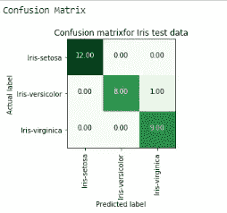

## 结论:

逻辑回归用于二元或多类分类，目标变量必须是分类变量。

## 参考资料:

[https://web . Stanford . edu/class/archive/cs/cs 109/cs 109.1178/讲师讲义/220-logistic-regression . pdf](https://web.stanford.edu/class/archive/cs/cs109/cs109.1178/lectureHandouts/220-logistic-regression.pdf)