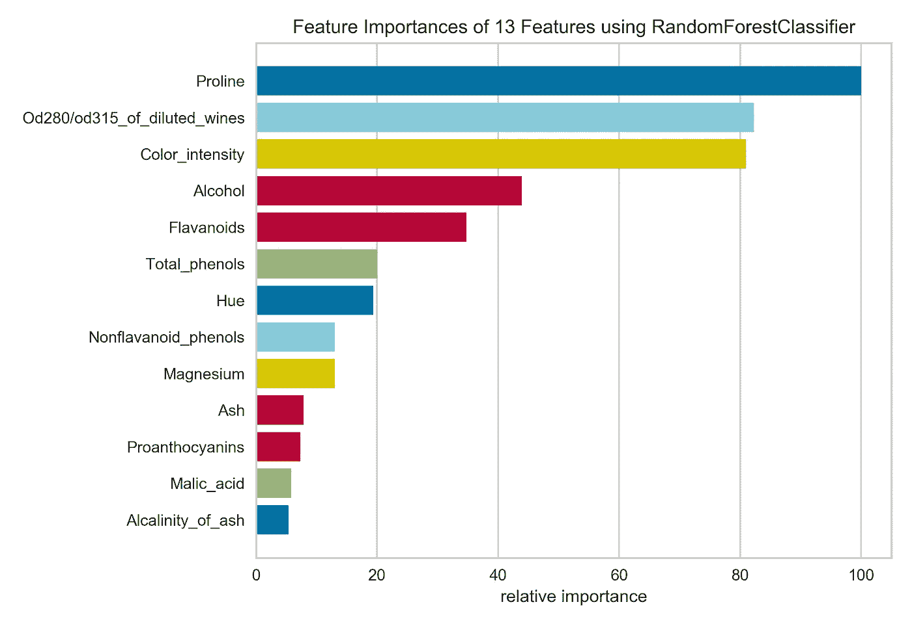
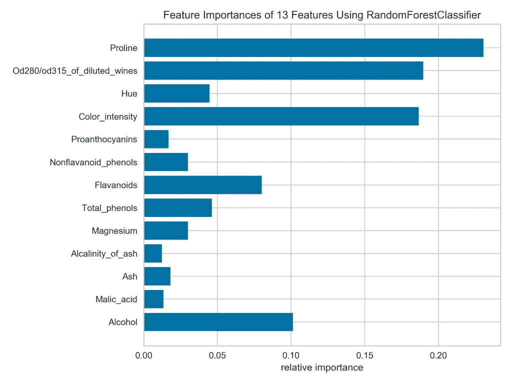
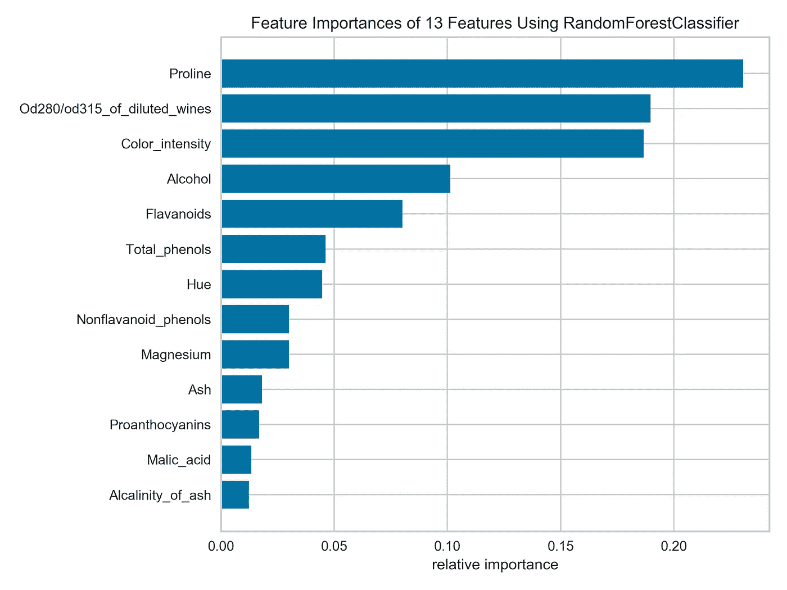
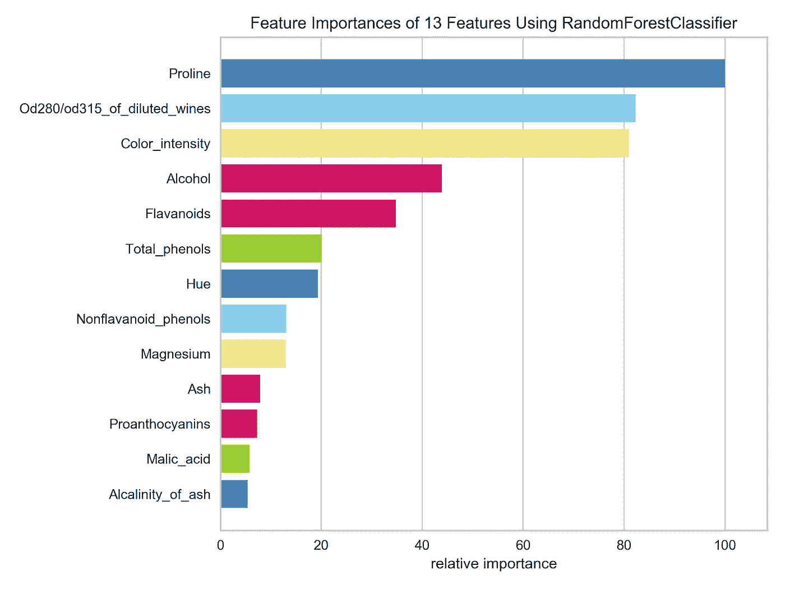
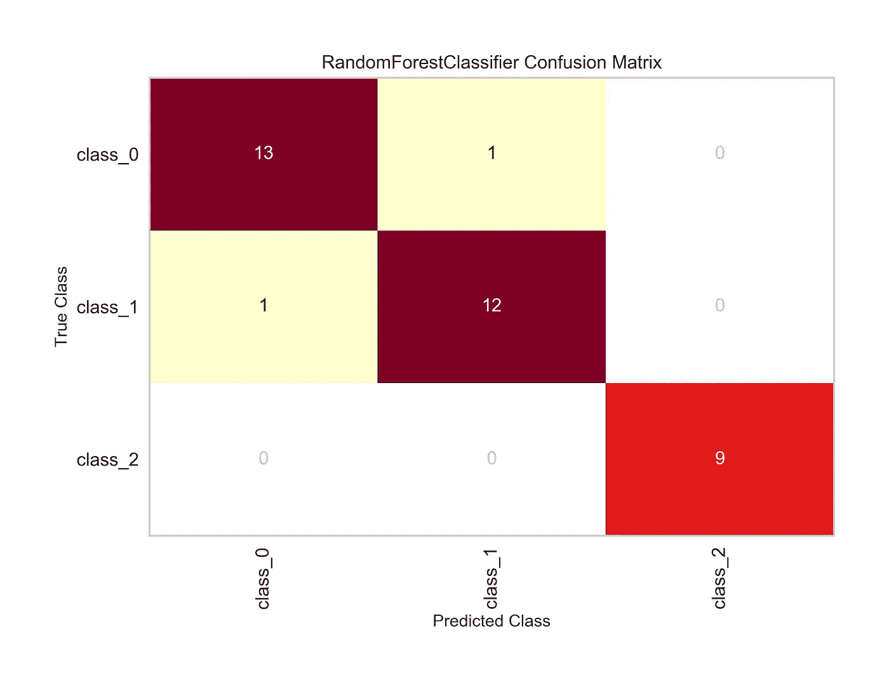
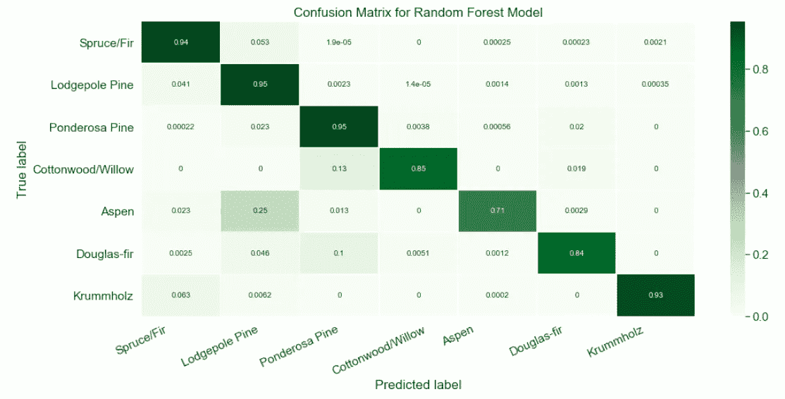
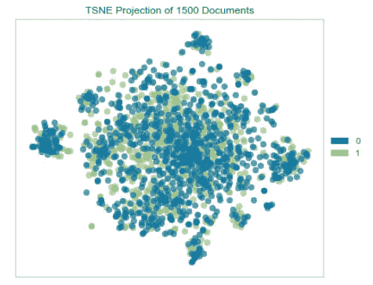

# 使用 Yellowbrick 进行快速简单的模型评估

> 原文：<https://towardsdatascience.com/quick-and-easy-model-evaluation-with-yellowbrick-295cb0752bce?source=collection_archive---------26----------------------->

## 回顾一下机器学习工作流程的便捷工具


JR 克里奇摄，2016。

我偶尔会遇到一个 Python 包，它有可能简化我经常做的一项任务。当这种情况发生时，我总是很兴奋地尝试它，如果它很棒，就分享我的新知识。

几个月前，我在浏览 Twitter 时，看到了一条关于模型可视化包 Yellowbrick 的推文。我试过，喜欢，现在把它纳入我的机器学习工作流程。在这篇文章中，我将向你展示它能做什么的几个例子(你也可以随时去[查看文档](https://www.scikit-yb.org/en/latest/quickstart.html))。

# 快速事实

关于 Yellowbrick 的一些快速事实:

*   其目的是模型可视化，即帮助您直观地了解给定模型如何处理您的数据，以便您可以就是否选择该模型或如何调整它做出明智的选择。
*   它的界面很像 [scikit-learn](https://scikit-learn.org/stable/) 的界面。如果您熟悉实例化模型、使其适合训练数据、然后在一行代码中进行评分或预测的工作流程，那么您将很快学会 Yellowbrick。
*   Yellowbrick 包含基于 [Matplotlib](https://matplotlib.org/) 的“visualizers”(一个特定于该包的类)，用于主要类型的建模应用，包括回归、分类、聚类、时间序列建模等。，因此可能有一个可以帮助您处理大多数日常建模情况。

# 总体意见

总的来说，我喜欢使用 Yellowbrick，因为它为我节省了一些日常任务的时间。例如，我有自己的代码来可视化特性的重要性或生成一个颜色比例的混淆矩阵，我从一个项目复制到另一个项目，但是 Yellowbrick 让我可以用更少的代码行快速轻松地生成一个有吸引力的图。

当然，这种简单实现的缺点是，您无法像自己编码那样控制图形的外观。如果视觉化只是为了你的利益，很好；但是，如果您需要以任何方式操纵情节，请准备好钻研文档。当然，这是一个公平的交易，但是在你开始之前要考虑你的地块的最终用户，这样你就不用做两次了(一次在 Yellowbrick，一次在 Matplotlib/Seaborn/等等)。).

说到做事两次，我们来看看 Yellowbrick v. Matplotlib 中同样的可视化套路。

# Yellowbrick 诉 Matplotlib 的特征重要性

对于这个小案例研究，我将为 UCI 葡萄酒数据集拟合一个随机森林分类器[，然后使用一个柱状图来可视化每个特征对于预测的重要性。数据集很小(178 行，13 列)，分类的目的是基于各种特征预测一种葡萄酒包含三种栽培品种中的哪一种。](https://archive.ics.uci.edu/ml/datasets/Wine)

首先，基础知识:

```
# Import basic packages
import pandas as pd
import numpy as np
import matplotlib.pyplot as plt

# In Jupyter Notebook, run this to display plots inline
%matplotlib inline

# Get the dataset from sklearn
from sklearn.datasets import load_wine
data = load_wine()

# Prep features and target for use
X = data.data
X = pd.DataFrame(X)
X.columns = [x.capitalize() for x in data.feature_names]

y = data.target
```

在上面的代码中，我使用 sklearn 的内置 load_wine()类获取数据，并将其分成特性(X)和目标(y)。请注意，我采取了额外的步骤，将 X 转换为 DataFrame，并给列起了漂亮的大写名称。这将使我的生活更容易的时候，建立情节。

先来看看 Yellowbrick 的套路。我将实例化一个 RandomForestClassifier()和一个 FeatureImportances()可视化工具，然后调整可视化工具并显示绘图。

```
# Import model and visualizer
from yellowbrick.model_selection import FeatureImportances
from sklearn.ensemble import RandomForestClassifier# Instantiate model and visualizer
model = RandomForestClassifier(n_estimators=10, random_state=1)
visualizer = FeatureImportances(model)# Fit and display visualizer
visualizer.fit(X, y)
visualizer.show();
```

这就是你得到的:



在四行代码中(不包括导入语句)，我得到了一个看起来不错的特性重要性图。我一眼就可以看出，脯氨酸对于识别品种非常重要，而苹果酸和灰分的碱度则不重要。

一些小小的抱怨:

*   颜色不能传达任何真实的信息，所以如果我手工编写代码，我会让所有的条形保持相同的颜色。
*   x 轴已被重新标记，以最重要功能的重要性百分比来表示每个功能的相对重要性。所以脯氨酸，最重要的特征，在 100%，灰分的碱度在 5%左右。我更愿意看到由随机森林模型计算出的要素重要性值，因为即使是最重要的要素也只能解释数据中很小一部分的差异。黄砖图掩盖了绝对特征的重要性，有利于呈现相对重要性，我们可以从图中条形的长度推断出相对重要性！

现在，让我向您展示如何在 Matplotlib 中手工构建完全相同的图。我将从拟合 RandomForestClassifier()开始:

```
# Fit a RandomForestClassifier
from sklearn.ensemble import RandomForestClassifier
model = RandomForestClassifier(n_estimators=10, random_state=1)
model.fit(X, y)
```

注意，我用与上面相同数量的估计器和随机状态实例化了模型，所以特性重要性值应该完全相同。

下面是我在绘制特性重要性时通常使用的基本代码:

```
# Plot feature importances
n_features = X.shape[1]
plt.figure(figsize=(8,6))
plt.barh(range(n_features), model.feature_importances_, align='center') 
plt.yticks(np.arange(n_features), X.columns) 
plt.xlabel("relative importance")
plt.title('Feature Importances of 13 Features Using RandomForestClassifier')
plt.show();
```

情节是这样的:



请注意，默认情况下，所有的条形都是相同的颜色，x 轴代表实际的要素重要性值，这是我喜欢的。不幸的是，这些条没有按照我喜欢的从最宽到最窄的顺序排列。例如，看着当前的图，我很难判断非类黄酮酚或镁更重要。

让我们看看如何在 Matplotlib 中精确地再现 Yellowbrick 图。首先，我要按照重要性对特性进行排序。这很棘手，因为 model.feature_importances_ 只是返回一个没有标签的值数组，其顺序与数据帧中要素的顺序相同。为了对它们进行排序，我需要将值与特性名称相关联，排序，然后将它们分割回来传递给 Matplotlib。

```
# Zip and sort feature importance labels and values
# (Note that reverse=False by default, but I included it for emphasis)
feat_imp_data = sorted(list(zip(X.columns, model.feature_importances_)), key=lambda datum: datum[1], reverse=False)

# Unzip the values and labels
widths = [x[1] for x in feat_imp_data]
yticks = [x[0] for x in feat_imp_data]
n_features = X.shape[1]

# Build the figure
plt.figure(figsize=(8,6))
plt.barh(range(n_features), widths, align='center') 
plt.yticks(np.arange(n_features), yticks) 
plt.xlabel("relative importance")
plt.title('Feature Importances of 13 Features Using RandomForestClassifier')
plt.show();
```

一个快速但重要的提示:看到我是如何按照*升序*排列特性重要性的了吗？这是因为 Matplotlib 会从底部开始绘制它们。相信我，因为我学到了一个艰难的方法:如果你想以*降序*顺序(从上到下)显示值，将它们以*升序*顺序传递给 Matplotlib。



那就好读多了！现在，如果我*真的*想要复制 Matplotlib 中的 Yellowbrick 图，我还需要提供颜色和 x-tick 标签，并删除水平网格线。

```
# First set up colors, ticks, labels, etc.
colors = ['steelblue', 'yellowgreen', 'crimson', 'mediumvioletred', 'khaki', 'skyblue']
widths = [x[1] for x in feat_imp_data]
xticks = list(np.linspace(0.00, widths[-1], 6)) + [0.25]
x_tick_labels = ['0', '20', '40', '60', '80', '100', '']
yticks = [x[0] for x in feat_imp_data]
n_features = len(widths)# Now build the figure
plt.figure(figsize=(8,6))
plt.barh(range(n_features), widths, align='center', color=colors)
plt.xticks(xticks, x_tick_labels)
plt.yticks(np.arange(n_features), yticks) 
plt.grid(b=False, axis='y')
plt.xlabel("relative importance")
plt.title('Feature Importances of 13 Features Using RandomForestClassifier')
plt.show();
```



如果你想知道，我花了大约一个小时的时间在 Matplotlib 重建 Yellowbrick 地块。这包括从最大到最小对条形进行排序，猜测颜色并努力按正确的顺序排列，将 x 轴刻度和标签重置为 100%刻度，并删除水平网格线。

这个故事的寓意:如果一个黄砖地块能满足你的需求，那么这是一个比通过 Matplotlib 更快的方法。当然，在控制粒度方面，你永远也不会胜过普通的 Matplotlib。

# 黄砖带来更多乐趣

使用 Yellowbrick，您可以做更多的事情来可视化您的机器学习模型；请务必[查阅文档](https://www.scikit-yb.org/en/latest/quickstart.html)。以下是几个简单的例子:

**例 1** :一个颜色编码的混淆矩阵(使用与上面相同的葡萄酒数据和随机森林模型)。

```
# Import what we need
from sklearn.model_selection import train_test_split
from yellowbrick.classifier import ConfusionMatrix# Split the data for validation
X_train, X_test, y_train, y_test = train_test_split(X, y, test_size=0.2, random_state=1)# Instantiate model and visualizer
model = RandomForestClassifier(n_estimators=10, random_state=1)
matrix = ConfusionMatrix(model, classes=['class_0', 'class_1', 'class_2'])# Fit, score, and display the visualizer
matrix.fit(X_train, y_train)
matrix.score(X_test, y_test)
matrix.show();
```



这是我在最近的机器学习项目[中使用的代码](https://github.com/jrkreiger/random-forest-trees)来自己构建类似的东西。注意，我的函数获取真实值和预测值，我必须事先计算这些值，而 Yellowbrick 从。score()方法。

```
# Define a function to visualize a confusion matrix
def pretty_confusion(y_true, y_pred, model_name):
    '''Display normalized confusion matrix with color scale.

    Edit the class_names variable to include appropriate classes.

    Keyword arguments:
    y_true: ground-truth labels
    y_pred: predicted labels
    model_name: name to print in the plot title

    Dependencies:
    numpy aliased as np
    sklearn.metrics.confusion_matrix
    matplotlib.pyplot aliased as plt
    seaborn aliased as sns
    '''

    # Calculate the confusion matrix
    matrix = confusion_matrix(y_true, y_pred)
    matrix = matrix.astype('float') / matrix.sum(axis=1)[:, np.newaxis]

    # Build the plot
    plt.figure(figsize=(16,7))
    sns.set(font_scale=1.4)
    sns.heatmap(matrix, annot=True, annot_kws={'size':10}, cmap=plt.cm.Greens, linewidths=0.2)

    # Add labels to the plot
    class_names = ['Spruce/Fir', 'Lodgepole Pine', 'Ponderosa Pine', 'Cottonwood/Willow', 'Aspen', 'Douglas-fir', 'Krummholz']
    tick_marks = np.arange(len(class_names))
    tick_marks2 = tick_marks + 0.5
    plt.xticks(tick_marks, class_names, rotation=25)
    plt.yticks(tick_marks2, class_names, rotation=0)
    plt.xlabel('Predicted label')
    plt.ylabel('True label')
    plt.title('Confusion Matrix for {}'.format(model_name)) 
    plt.tight_layout()
    plt.show();# Plot the confusion matrix
pretty_confusion(y_true, y_pred, 'Random Forest Model')
```



**例 2** :显示两类文本如何重叠的 t-SNE 图。关于数据和模型我就不在这里赘述了，不过你可以[在我的 GitHub](https://github.com/jrkreiger/helpful-reviews) 上查看相关项目。

```
# Import needed packages
from sklearn.feature_extraction.text import TfidfVectorizer
from yellowbrick.text import TSNEVisualizer# Prepare the data
tfidf = TfidfVectorizer()
X = tfidf.fit_transform(data.text)
y = data.target# Plot t-SNE
tsne = TSNEVisualizer()
tsne.fit(X, y)
tsne.show();
```



我甚至不知道这在 Matplotlib 中会有多难，因为我从未尝试过。我从 Yellowbrick 得到的结果足以回答我的问题，我能够获得这些信息并迅速继续前进。

我希望你能抽出时间来试验一下[黄砖](https://www.scikit-yb.org/en/latest/index.html)。在使用它的过程中，我获得了乐趣并学到了一些新的模型可视化技术，我打赌您也会这样。

*跨贴自*[*【jrkreiger.net】*](http://jrkreiger.net)*。*