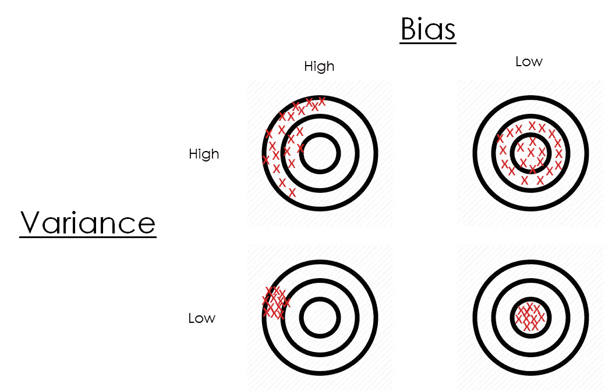
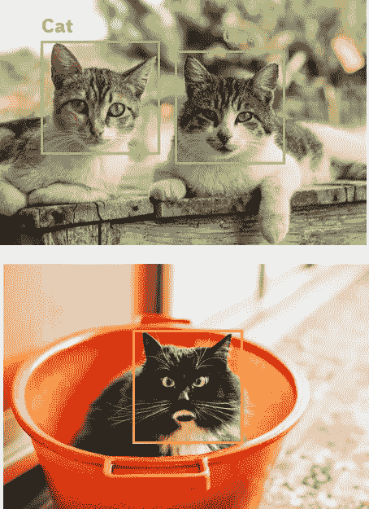

# 快速偏差/方差权衡

> 原文：<https://towardsdatascience.com/quick-bias-variance-trade-off-d4895b126b08?source=collection_archive---------22----------------------->

## 偏差/方差的权衡很容易解释

这篇文章将解释机器学习中最常见的问题之一:偏差/方差权衡。我们将看到它是什么，为什么在建立机器学习模型时考虑它是重要的，我们将直观地解释它，并且不需要数学。

图片来自 [Unsplash](https://unsplash.com/photos/X4zx5Vc_LZU)

# 偏差/方差的权衡是什么？

如上所述， ***偏差/方差权衡*** 是在构建将使用**监督机器学习模型**进行预测的应用时必须解决的最常见问题之一。

这是一个与我们的模型的误差以及它们的灵活性有关的问题。总的问题表示为权衡，因为通常不可能同时改善我们模型的偏差和方差:通常当一个下降时，另一个上升，反之亦然。

# 为什么偏差/方差权衡很重要？

我们希望我们的机器学习模型在投入生产时尽可能准确。这意味着减少它可能犯的错误是很重要的，这种错误有三个主要方面:

来源: [Codecogs](https://www.codecogs.com/latex/eqneditor.php)

这个公式的含义如下:我们模型的整体误差可以分为三项；**方差误差**，偏差误差**和**不可约误差**。最后一个是不能通过玩我们的模型或数据来减少的误差，它通常是由于数据中的噪声或因为模型的性能不能再进一步提高(即，它已经达到了与特定任务的顶级人类专家相同的性能)。**

知道了这一点，很明显，我们有两种方法来减少总误差:由于我们不能减少不可约误差，我们必须减少来自方差或偏差的误差。

查看这些错误的另一种方式如下:在某些任务上人类水平的表现(由标记数据的人类产生的错误)和我们的模型在该训练数据上产生的错误之间的差异是由于我们的模型的偏差而产生的错误。我们的训练误差和测试数据误差之间的误差差是我们的模型由于方差而产生的误差。

人为误差和训练误差之间的差异是偏差误差，训练误差和测试误差之间的差异是方差误差。自制人物。

让我们看看这些误差来自哪里，我们如何减少它们，以及它们之间的权衡。

# 直观地解释了偏差/方差权衡

好了，我们已经简要描述了偏差/方差权衡，让我们看看这些术语的含义，然后深入描述这个问题:

*   ***偏差:*** 我们模型的偏差与它对数据所做的假设有关，与它在被训练时对数据的拟合程度有关。具有高偏差的模型不能很好地拟合训练数据，具有有限的灵活性，或者对于我们所拥有的数据来说极其简单，通常导致高训练误差。

> *偏差告诉我们我们的模型有多接近现实。*

*   ***方差:*** 我们的模型的方差与它如何根据它用于训练的数据样本改变其结果有关。具有高方差的模型可以很好地拟合特定的数据，因此它难以推广到看不见的数据，从而导致较高的测试误差。

> 方差告诉我们我们的模型对训练数据有多敏感。

下图通常用于说明什么是方差和偏差:

偏差/方差靶心的图示。来自[平面图标](https://www.flaticon.com/search?word=bullseye)的图标。

对这个图的解释如下:每个镖靶给我们一个我们的模型表现如何的想法；红叉代表预测，越靠近靶心(棋盘的中心)越好。

*   当我们有**高方差和高偏差**时，我们的预测会非常分散，不会靠近中心。我们的模型没有对任何数据样本做出好的预测。
*   当我们有**高方差和低偏差**时，我们的预测是分散的，但围绕着棋盘的中心，所以它们中的一些击中了靶心，而另一些没有。在某些数据上，我们的模型预测得很好，但在其他数据样本上却不是这样。
*   **高偏差和低方差**意味着我们的预测很接近，但不在棋盘的中心。一般来说，我们的模型预测不好，尽管它对不同的样本做出了类似的预测。
*   **低方差和低偏差**意味着我们的预测接近且集中:这是最好的情况，我们的模型对各种数据都预测得很好。

现在让我们看一个真实世界应用程序的例子，以获得对问题的直觉。

想象一下，我们正在构建一个识别图像中的猫的应用程序，如果我们用**高偏差**训练一个模型，它会非常糟糕地预测猫的图像，独立于你用来训练它的猫数据样本。

我们的第一个模型，有很高的偏差，会预测这只狗是一只猫。原始图像来自 [Unsplash](https://unsplash.com/photos/aI_1QIO-LA0) 。

具有**高方差**的模型可以很好地预测特定的猫物种(例如),但当面对与之前训练的猫图像不太接近的猫图像时，它会出错。这对新来的猫来说太笼统了。

我们的第二个模型具有很高的方差，可以很好地预测某些种类的猫(上图),但对其他种类的猫(下图)预测很差。原始图片来自 [Unsplash](https://unsplash.com/photos/4Tjk111E4xw) 。

最后，具有**低方差和低偏差**的模型将很好地独立预测它所训练的数据样本；在我们的例子中，它将足够概括地解释动物是猫还是狗，而不会被不同的猫物种所欺骗。

我们的最后一个低方差模型很好地分类了不同种类的猫。来自 [Unsplash](https://unsplash.com/photos/2JcixB1Ky3I) 的原图。

## 高偏差/方差模型示例

现在我们知道了什么是偏差和方差，它们之间的关系，以及直觉，让我们看看一些具有高方差/偏差的模型的例子。

正如我们所说的，**具有高偏差的模型不能很好地拟合训练数据**。可能遭受该问题的模型例如是*线性模型*，因为它们假设特征和目标变量之间的线性关系并不总是存在。

如果您不熟悉线性回归，您可以在这里了解它:

 [## 线性回归解释

### [ —线性回归简单解释— ]

towardsdatascience.com](/linear-regression-explained-d0a1068accb9) 

在下图中，我们可以看到一个线性回归模型拟合的数据，显然没有线性相关性:因此，我们的模型将有很大的偏差，不会表现得很好。

适合非线性数据线性模型。自创形象。

具有**高方差**的模型是*决策树*例如:它们为训练数据的样本创建特定的分支和分裂，这些分支和分裂是特定于该数据的。此外，如果我们让决策树永远增长，它将增长与数据样本一样多的叶子节点，为每个数据点创建特定的路径。这意味着，当它找到一个新样本时，如果它与训练数据的任何样本的特征值都不完全匹配，它将不会很好地对其进行分类。

您可以在以下文章中找到对决策树的简单解释:

 [## 决策树解释

### 学习机器学习决策树的所有知识

towardsdatascience.com](/decision-trees-explained-3ec41632ceb6) 

这是决策树总是有某种停止条件(N 个离开节点、离开节点上的最小样本、最大深度……)的主要原因。通过这样做，我们使我们的树在新的数据点上更好地一般化。

## 如何解决偏差/方差问题

正如我们已经看到的，将训练数据拟合得太好会导致高方差但低偏差。没有很好地拟合训练数据会导致高偏差和低方差。我们如何解决高偏差或高方差的问题？

如果我们有一个**高偏差**(高训练误差)，我们可以做以下事情来尝试解决这个问题:

*   **改变我们模型的优化算法**。
*   做好**超参数调谐**。(运行粗网格搜索，然后围绕第一个搜索的最佳结果运行更具体的搜索)。
*   切换**型号类型**

如果我们有**高方差**(高测试误差)，我们可以尝试以下一些解决方案:

*   **正则化**我们的算法使用 L1 或 L2 正则化、删除、树修剪等…
*   **获取更多数据**进行训练，或尝试数据扩充技术。
*   也可以试试**不同型号的**。

# 结论和其他资源

*我们已经看到了什么是偏差/方差权衡，它如何与我们的机器学习模型相关联，各种示例，以及如何解决它。如果您想更深入地了解它，请查看以下资源:*

 [## WTF 是偏差-方差权衡？(资料图)

### 课后无意中听到:“偏差-方差权衡听起来是不是像历史纪录片中一个条约的名字？”…

elitedatascience.com](https://elitedatascience.com/bias-variance-tradeoff)  [## 机器学习中偏差-方差权衡的温和介绍——机器学习掌握

### 监督机器学习算法可以通过偏差-方差权衡的透镜得到最好的理解。在这个…

machinelearningmastery.com](https://machinelearningmastery.com/gentle-introduction-to-the-bias-variance-trade-off-in-machine-learning/) 

就这些，我希望你喜欢这个帖子。请随时在推特上关注我。还有，你可以看看我在数据科学和机器学习上的帖子[**这里**](https://medium.com/@jaimezornoza) 。好好读！