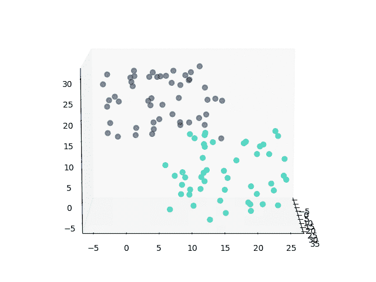
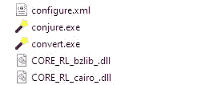
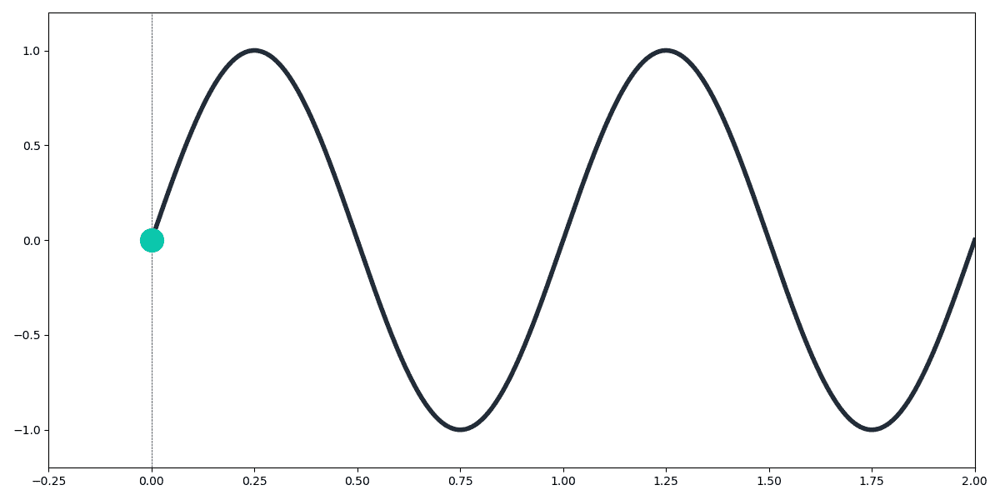
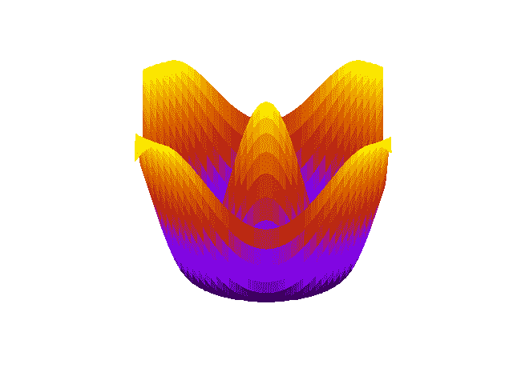

# 快速代码:导出 Matplotlib 动画

> 原文：<https://towardsdatascience.com/quick-code-exporting-matplotlib-animations-49cd0ecf32ba?source=collection_archive---------11----------------------->

## 如何将动画 Matplotlib 图形导出为 GIF 文件



Matplotlib 的一个经常被忽略的特性。动画在数据可视化方面开辟了一个全新的世界。让我们能够显著提高我们工作的影响力。

上图是使用以下代码创建的:

如果您尝试在 Python 中运行它，您可能会得到下面的`ValueError: unknown file extension: .gif`。这是因为 Matplotlib 本身不支持 gif。

幸运的是，这个问题的解决方案非常简单。

# 循序渐进

我们首先从[这里](https://imagemagick.org/script/download.php#windows)为 Windows 用户下载 **ImageMagick** (其他操作系统可以在同一网站找到)。这将用于把我们的动画人物转换成 gif。


像安装其他程序一样运行可执行文件并安装，记下它的安装位置。对我来说，这是`C:\Program Files\ImageMagick-7.0.9-Q16`。

现在，我们需要更新 Matplotlib 的配置文件来使用 ImageMagick 进行 GIF 导出。要查找该文件位置，请切换到 Python 并键入:

```
import matplotlib
matplotlib.matplotlib_fname()
```


这将给你配置文件`matplotlibrc`的位置。用文本编辑器打开它。现在，要启用 **GIF** 支持，找到这一行:

```
#animation.convert_path:  convert
```



现在用 ImageMagick 的`convert.exe`文件的路径替换`convert`。这存储在 ImageMagick 目录的顶层。对我来说，这一行变成了:

```
animation.convert_path:  C:\Program Files\ImageMagick-7.0.9-Q16\convert.exe
```

*   *注意，您必须取消对该行的注释，否则它将被忽略。*

现在，您可以在 Python 代码中将 Matplotlib 动画`anim`保存为 GIF 格式，只需:

```
anim.save('animation.gif', writer='imagemagick')
```

现在我们可以分享精彩的动画 Matplotlib 情节！看看这些例子:

## 正弦波



## 表面旋转



我希望这个快速教程已经有用，让我知道你是否有任何问题！

# **有用链接**

我为那些想了解 Matplotlib 中可用的动画工具的人提供了一些有用的链接。

## **动画文档:**

[https://matplotlib.org/3.1.1/api/animation_api.html](https://matplotlib.org/3.1.1/api/animation_api.html)

## 动画教程:

[https://jakevdp . github . io/blog/2012/08/18/matplotlib-animation-tutorial/](https://jakevdp.github.io/blog/2012/08/18/matplotlib-animation-tutorial/)

## **Matplotlib 中关于动画的优秀文章:**

[](/animations-with-matplotlib-d96375c5442c) [## Matplotlib 动画

### 动画是展示一种现象的有趣方式。我们人类总是被动画和…

towardsdatascience.com](/animations-with-matplotlib-d96375c5442c)