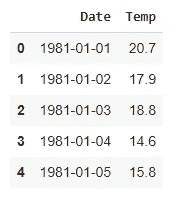
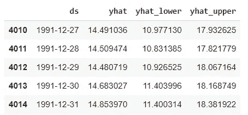
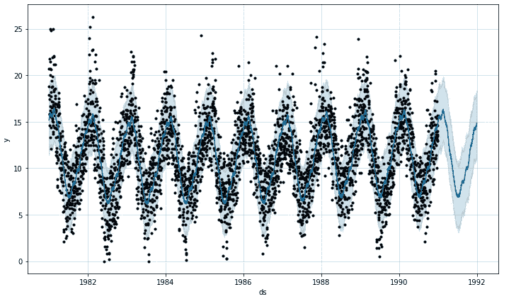

# 用脸书预言家进行快速预测——只需 10 行代码

> 原文：<https://towardsdatascience.com/quick-forecasting-with-facebook-prophet-under-10-lines-of-code-4b23df30e517?source=collection_archive---------51----------------------->


照片由[萨曼莎·加德斯](https://unsplash.com/@srosinger3997?utm_source=medium&utm_medium=referral)在 [Unsplash](https://unsplash.com?utm_source=medium&utm_medium=referral) 上拍摄

## Python 和 R 程序员的预测

我以前用的是 [Rob J Hyndman 的](https://cran.r-project.org/web/packages/fpp2/index.html) `[fpp2](https://cran.r-project.org/web/packages/fpp2/index.html)` [预测包](https://cran.r-project.org/web/packages/fpp2/index.html)。相当多。它仍然是我的首选预测库。我如此喜欢它的原因是它广泛覆盖了预测技术，并且是一本无价的开放书籍，里面有所有预测理论。时间序列学术研究所需的几乎所有东西都在那里。

但这也是软件包的缺点，它对初学者不友好。谁想造一辆车只是为了在路上开？

然后[脸书先知](https://facebook.github.io/prophet/)出现了。

预言家对预测练习做了令人难以置信的简化。你可以开箱即用，而不需要理解很多理论，正如你将在下面看到的。

该软件包使用起来非常直观，对于业务预测尤其强大。您甚至可以指定影响业务活动的周末、特殊日子和事件(例如超级碗)。

Cherry 在上面，Prophet 有 python 和 R 编程语言两种版本！

让我们快速演示一下。

# 1.安装软件包

我是用 Python 做的，所以你所需要的只是用于操作数据的`pandas`包。

当然还有`Prophet`。

```
# improt libraries
import pandas as pd
from fbprophet import Prophet
```

# 2.导入和格式化数据

我要使用的数据集是一个时间序列，由 1981 年到 1990 年之间的 10 年中记录的每日最低温度组成。

```
# import data
df = pd.read_csv("[https://bit.ly/3hJwIm0](https://bit.ly/3hJwIm0)")# check out first few rows
df.head()
```

如您所见，datarame 只有两列，一列在时间维度上，另一列在观察值上。



需要一些数据格式化。`Prophet`要求日期时间列命名为“ds”，观察列命名为“y”。

让我们重命名这两列。

```
# data formating
df = df.rename(columns = {"Date": "ds", "Temp": "y"})
```

# 3.模型结构

与 [Scikit Learn](https://scikit-learn.org/stable/) 算法类似，`Prophet`遵循简单的“实例化→拟合→预测”工作流程进行预测。

```
# instantiate model
m = Prophet()# fit model to data
m.fit(df)
```

您可以使用参数，但是要构建您的第一个开箱即用的预测模型，就像这两行代码一样简单。

# 4.预测

现在您已经有了模型，可以做预测了。

就像建立模型一样，预测也是两行代码。在第一行中，创建一个空的数据框架来存储预测值。在第二行中，您将空数据帧传入模型，模型将使用预测值填充行。

```
# make a forecast dataframe 
future = m.make_future_dataframe(periods = 365)# make a forecast
forecast = m.predict(future)
```

预测已经完成，现在可以在数据框架中查看预测值。

```
# check out forecast values
forecast[['ds', 'yhat', 'yhat_lower', 'yhat_upper']].tail()
```

列名很直观—

*   ds:预测时间步长；
*   yhat:预测值
*   yhat_lower & yhat_upper:置信区间



预测数据框架

# 5.测绘

最好是将数据和预测值可视化，看看它们是否吻合。

同样，这只是一行代码。

```
# plot
fig1 = m.plot(forecast)
```

在下图中，每个黑点代表原始观测值，深绿色线代表预测模型，浅绿色线代表置信区间。



历史和预测值

那里！你用 10 行代码就做出了一个真正的预测模型！

# 下一步是什么？

在这篇文章中，我并不打算深入研究这个模型，而是想让人们相信，即使你对理论知之甚少，建立一个预测模型也并不复杂。

下一步，你可以探索其他功能——它们有一个非常容易理解的[文档](https://facebook.github.io/prophet/docs/quick_start.html)。我特别鼓励人们去探索特殊的日子和事件是如何影响天气预报的(当然不是温度！而是商业活动)。

正如我所说的，您可以在 Python 和 R 编程环境中实现这个包，这给了您一些额外的自由。

欢迎在[推特](https://twitter.com/home)或 [LinkedIn](https://www.linkedin.com/in/mab-alam/) 上关注我。