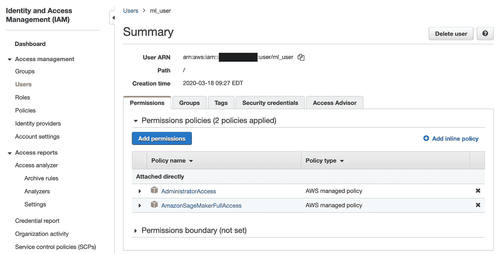
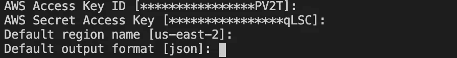
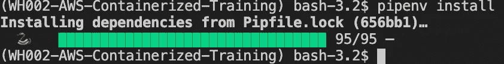
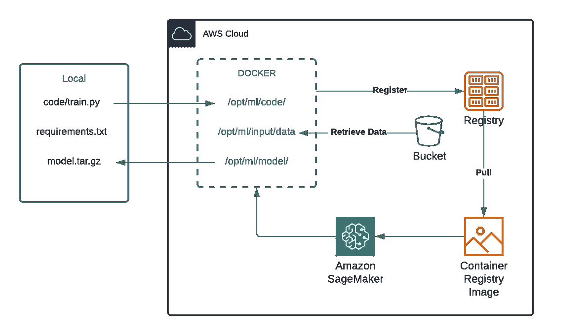
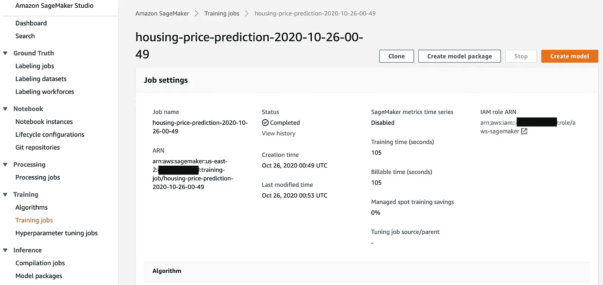

# AWS Sagemaker 中的文档化培训快速指南(带代码示例)

> 原文：<https://towardsdatascience.com/quick-guide-to-dockerized-training-in-aws-sagemaker-with-code-example-94909c17556c?source=collection_archive---------50----------------------->

## [理解大数据](https://towardsdatascience.com/tagged/making-sense-of-big-data)

## 带上您自己的代码，只需几个步骤就可以利用云计算的强大功能！

由 [Guillaume Bolduc](https://unsplash.com/@guibolduc?utm_source=unsplash&utm_medium=referral&utm_content=creditCopyText) 在 [Unsplash](https://unsplash.com/s/photos/container?utm_source=unsplash&utm_medium=referral&utm_content=creditCopyText) 上拍摄的照片

训练一个模型是乏味的，尤其是当训练脚本耗尽了你所有的计算机能力，你除了等待什么也做不了的时候。这种情况总是发生在我身上——无论是在我开始模型构建过程时，还是在我通过参数调整最终确定模型时。幸运的是，大型云供应商提供了在云中培训和部署您的模型的解决方案，而不必使用您的本地容量。AWS、Azure 和 GCP 都有类似的产品，我在这里使用 AWS Sagemaker 来展示如何使用自己的容器化 docker 来训练云中的模型。

谈到配置，云培训通常是我的噩梦。不同的云供应商有不同的存储、实例和 API 结构，这意味着我们必须通读手册和开发指南才能正常工作。我开始用 Sagemaker 的时候也有这种感觉。但是，我发现 Sagemaker SDK 非常强大，而不是查看他们的控制台并试图在 UI 中找到解决方案。Sagemaker 的典型用法或宣传用法是通过它们的预建算法。但是除非你只是购买一个基线模型，否则你必须使用你自己的模型代码。当然，你可以研究他们的手册，学习如何调整或修改他们的算法 API，但我相信还有更有效的方法。

所以我创建了这个初学者指南来展示一种利用 Sagemaker 训练实例的方法，同时保持使用 docker 训练自己代码的能力。希望解决方案能帮助到有需要的人！

## 先决条件

这个练习需要一些先决条件。如果您以前使用过 Sagemaker SDK，可以跳过这一部分。否则，请仔细遵循设置。

*   **AWS CLI 安装&设置**

检查此[链接](https://docs.aws.amazon.com/cli/latest/userguide/install-cliv2-mac.html)，根据您使用的系统按照说明下载并安装 AWS CLI。本教程中的示例是使用 Mac-OS。

如果您没有 AWS 帐户，您可以免费注册一个(注意:这将需要您的信用卡信息，并确保阅读 [free-tier](https://aws.amazon.com/free/?trk=ps_a134p000003yBfvAAE&trkCampaign=acq_paid_search_brand&sc_channel=ps&sc_campaign=acquisition_US&sc_publisher=google&sc_category=core&sc_country=US&sc_geo=NAMER&sc_outcome=acq&sc_detail=%2Baws%20%2Bfree&sc_content=Cost_bmm&sc_segment=438195701024&sc_medium=ACQ-P|PS-GO|Brand|Desktop|SU|AWS|Core|US|EN|Text&s_kwcid=AL!4422!3!438195701024!b!!g!!%2Baws%20%2Bfree&ef_id=Cj0KCQjw28T8BRDbARIsAEOMBcwCR5zop0jeg0l-y_gNpAIpY2hDfRX6e6Vh4evFgjOkWi7cb-ZFRDIaAmeoEALw_wcB:G:s&s_kwcid=AL!4422!3!438195701024!b!!g!!%2Baws%20%2Bfree&all-free-tier.sort-by=item.additionalFields.SortRank&all-free-tier.sort-order=asc) 优惠，以防产生任何费用)。

登录到控制台并导航到 IAM。创建一个用户并附加 SagemakerFullAccess 策略。另外，在**安全凭证**下创建一个**访问密钥**，并下载凭证。csv 文件。

AWS IAM 控制台

安装 AWS CLI 后，您可以使用凭据进行设置。您刚刚设置的 csv 文件。在终端中，键入以下内容:

`aws configure`

如果您的用户没有使用 MFA，只需填写从凭证文件中获得的信息，就可以了。否则，请在配置文件中添加您的 MFA 配置文件。

请检查您的配置。如果您的 CLI 设置正确，您应该会看到您的帐户下面列出了 bucket。

`aws s3 ls`

*   **Pipenv 设置**

这一步是可选的，因为您可以针对您的环境使用其他方法。但是，我将简要介绍如何设置 Pipenv 环境，以便让您能够轻松地理解。

1.  在这里克隆我的回购。
2.  在您喜欢的 SDE 中打开项目。我正在使用 VSCode。
3.  用 pip 安装 pipenv。`pip install pipenv`
4.  用 Python 解释器初始化 pipenv 环境。我使用的是 3.7 版本。使用`pipenv --python 3.7`进行初始化。
5.  用`pipenv install`安装依赖项。

设置正确，它应该导致这样的事情。

## 模型结构

这个例子将使用[房价:高级回归技术](https://www.kaggle.com/c/house-prices-advanced-regression-techniques)数据集，它包含 79 个变量来预测每套房子的最终价格。在比较了一堆模型之后，xgboost 回归器脱颖而出，我们的工作是在训练脚本中微调回归器。RMSE 将是模型选择的标准。

## 码头工作总结

如果您不熟悉 Docker，请查看 AWS 的本指南。我们在这里要做的是构建我们自己的 docker 映像，并将其推送到 AWS ECR。Elastic Container Registry 是 AWS 提供的托管服务，用于存储和管理 Docker 映像。为了与 Sagemaker SDK 一起使用，我们需要将 docker 映像推送到 ECR，以允许我们的训练实例从那里提取映像。

*   **Dockerfile**

文档化培训工作流程(图片由作者提供)

上图说明了我们如何设置 Dockerfile 文件。建议在将 docker 映像推送到 ECR 之前，先在本地对其进行测试。

*   **本地文档化培训**

本例将使用 [Sagemaker 训练 API](https://sagemaker.readthedocs.io/en/stable/api/training/estimators.html#sagemaker.estimator.EstimatorBase.fit) 在上述 Docker 映像中测试执行本地训练。

*   **将对接器推到 ECR**

AWS ECR 提供了一个控制台，只需点击几下鼠标就可以设置 Docker 存储库。如果您想使用控制台，请检查[此链接](https://docs.aws.amazon.com/AmazonECR/latest/userguide/repository-create.html)。或者，您可以使用 AWS CLI 通过命令行设置 Docker 存储库。

现在我们的图像设置好了，可以使用了。

## 在 Sagemaker 培训

一旦我们正确设置了前面的所有步骤，Sagemaker 中启动培训的工作流程就相对简单了。首先，我们需要将数据存储在指定的 S3 桶中。您可以在 AWS 控制台中创建一个并上传数据，或者使用 Sagemaker SDK。然后我们利用`sagemaker.estimator`开始训练。

上面的脚本将使用指定的配置启动一个培训作业。检查自由层实例以避免费用。我使用的是“ **ml.c4.xlarge** ”，如果你的账户在两个月内开通，这应该是自由层实例。培训完成后，您可以在 Sagemaker 控制台中查看您的培训工作:

培训作业控制台视图

您还可以在同一个页面的**输出下找到您的 s3 模型工件。**通常，`estimator`会为您创建一个新的存储桶来存储工件，除非您在`output_path`中指定。检查此处的[链接](https://sagemaker.readthedocs.io/en/stable/api/training/estimators.html#sagemaker.estimator.EstimatorBase.fit#input_mode)是否清晰。

这里需要注意的一点是，如果你想从 Docker 中导出你的模型或输出，只需将文件保存到`opt/ml/model`，Sagemaker 会将你想要的输出打包到一个`model.tar.gz`，并上传到输出桶。然后，您可以通过 S3 bucket 控制台或 Python SDK 下载并提取该文件。

一个完整的例子，检查我的回购[这里](https://github.com/zoraxl/WH002-AWS-Containerized-Training)。和平！🤗