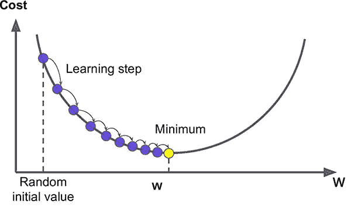
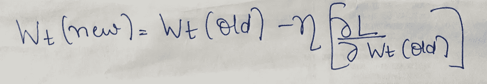
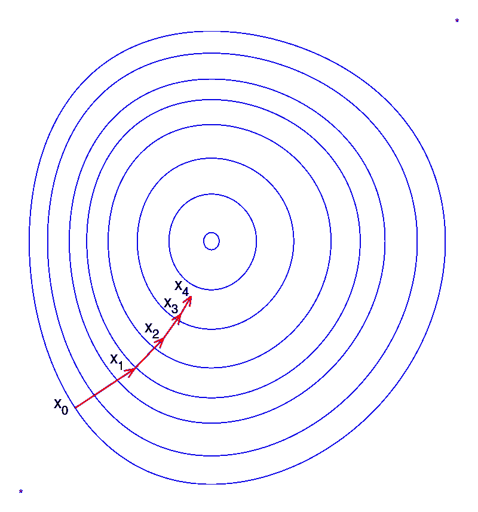
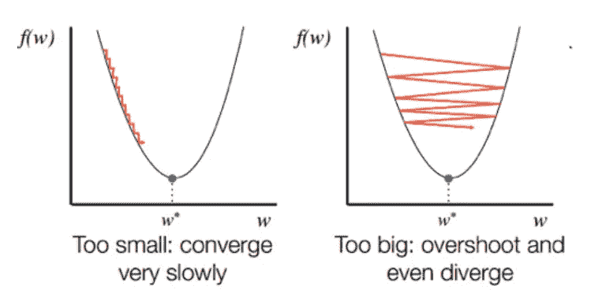
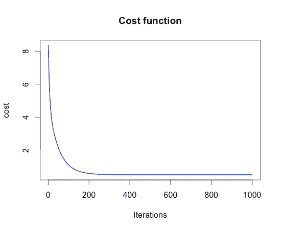
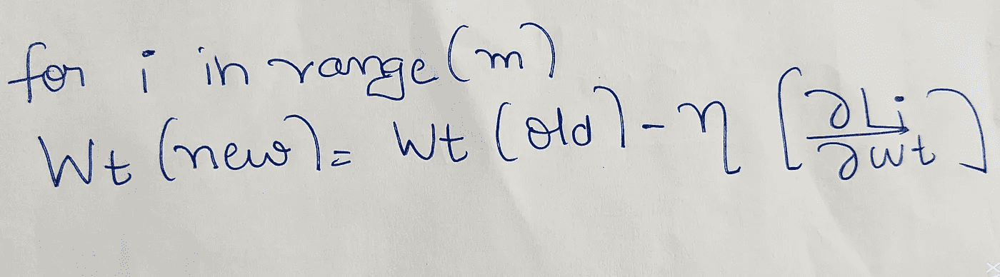
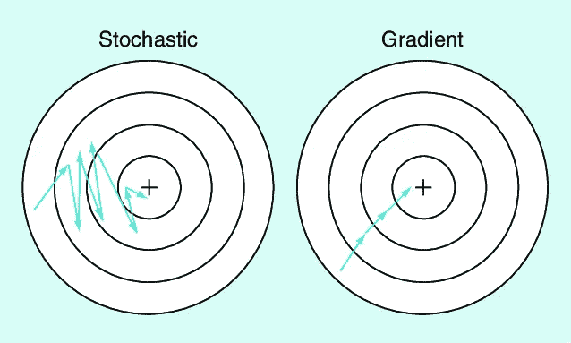
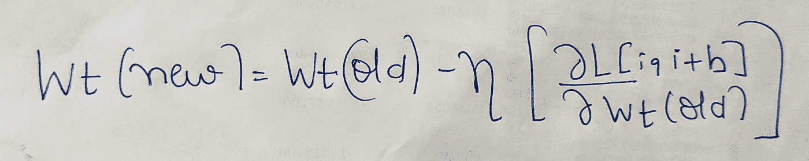
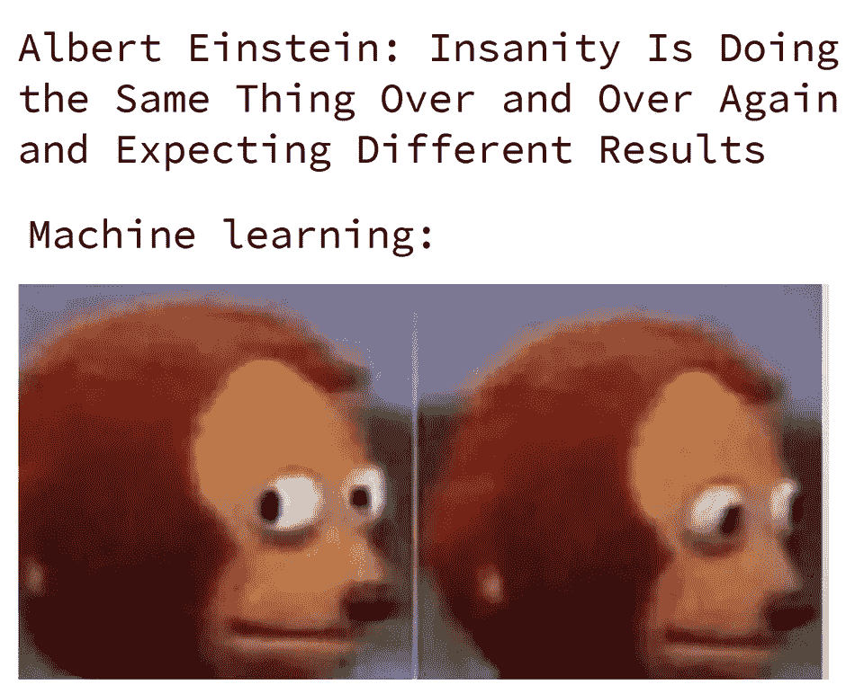

# 梯度下降及其变体快速指南

> 原文：<https://towardsdatascience.com/quick-guide-to-gradient-descent-and-its-variants-97a7afb33add?source=collection_archive---------42----------------------->

## 让我们来理解机器学习中最流行的优化算法，即梯度下降算法及其所有变体。

作者图片

在这篇文章中，我将讨论梯度下降算法。下一篇文章将是这篇文章的延续，我将讨论神经网络中的优化器。为了理解这些优化，深入理解梯度下降是很重要的。

# 内容-

1.  梯度下降
2.  学习速度的选择
3.  批量梯度下降
4.  随机梯度下降
5.  小批量梯度下降
6.  结论
7.  信用

# 梯度下降-

梯度下降是一种一阶迭代优化算法，用于寻找可微函数的局部最小值。为了得到使我们的目标函数最小化的参数值，我们沿着该函数梯度的相反方向迭代移动，或者简单地说，在每次迭代中，我们沿着最陡下降的方向移动一步。每一步的大小由一个称为学习率的参数决定。梯度下降是一阶算法，因为它使用损失函数的一阶导数来寻找最小值。梯度下降适用于任何维数的空间。

图像[来源](http://openaccess.uoc.edu/webapps/o2/bitstream/10609/118526/8/dlopezroblesTFC0620presentaci%C3%B3n.pdf)

梯度下降的步骤-

1.  随机初始化参数(权重和偏差)。
2.  选择学习率('η')。
3.  直到收敛重复这个-

作者图片

其中，'wₜ'是我们必须找到其值的参数，“η”是学习率，l 表示成本函数。

通过重复直到收敛，我们的意思是，重复直到旧的权重值不近似等于它的新值，即重复直到旧值和新值之间的差异非常小。

需要记住的另一件重要事情是，所有权重需要同时更新，因为在计算另一个参数之前更新一个特定参数会导致错误的实现。

一系列等级统计的梯度下降图(来源:维基百科)

# 学习率的选择(η)

选择一个合适的学习值是非常重要的，因为它有助于决定我们在每次迭代中下降多少。如果学习率太小，下降将会很小，因此将会延迟收敛或不收敛。另一方面，如果学习率太大，那么梯度下降将会超过最小点，最终无法收敛。

图片[来源](https://srdas.github.io/DLBook/GradientDescentTechniques.html)

为了检查这一点，最好的方法是在每次迭代时计算成本函数，然后根据迭代次数绘制成本函数。如果成本不断增加，我们需要降低学习率的值，如果成本以非常慢的速度下降，那么我们需要增加学习率的值。

图像[来源](https://1.bp.blogspot.com/-HBWuEkmDjbk/UBGvQ6Bi7RI/AAAAAAAAEGY/3FZp2FFFNas/s1600/cost_function.png)

除了选择正确的学习速率值之外，优化梯度下降的另一个方法是将数据标准化到特定的范围。为此，我们可以使用任何类型的标准化技术，如最小-最大标准化、均值-方差标准化等。如果我们不对数据进行归一化，那么大比例的要素将占主导地位，梯度下降将采取许多不必要的步骤。

可能在你学数学的时候，你一定遇到过一个解决最优化问题的方法，通过计算导数，然后使它等于零，然后用二重导数来检查这个点是最小值点，最大值点，还是一个鞍点。一个问题出现在脑海中，为什么我们不在机器学习中使用该方法进行优化。这种方法的问题是它的时间复杂度非常高，如果我们的数据集很大，那么实现起来会非常慢。因此，梯度下降是首选。

梯度下降寻找一个函数的最小值。如果函数是凸的，那么它的局部极小值就是它的全局极小值。然而，如果函数不是凸的，在这种情况下，我们可能会到达一个鞍点。为了防止这种情况发生，我们可以对梯度下降进行一些优化。

梯度下降的局限性-

1.  梯度下降时收敛速度慢。如果我们试图通过增加学习速率来加速它，那么我们可能会超过局部最小值。
2.  如果我们对一个非凸函数应用梯度下降，我们可能会在局部最小值或鞍点结束。
3.  对于大型数据集，内存消耗会非常高。

梯度下降是机器学习中最常用的优化技术。我们来讨论一下梯度下降的一些变体。

# 批量梯度下降-

批量梯度下降是梯度下降最常见的版本之一。当我们说梯度下降时，通常我们只谈论批量梯度下降。它通过获取数据集中所有可用的数据点来执行计算和更新梯度。对于凸函数来说，它工作得相当好，并且给出了到最小点的直线轨迹。然而，对于大型数据集来说，计算起来既慢又难。

优势-

1.  给最小点一个稳定的轨迹。
2.  小数据集的计算效率。

局限性-

1.  对于大型数据集很慢。

# 随机梯度下降-

随机梯度下降是梯度下降的一种变体，它一次只考虑一个点来更新权重。我们不会一步计算所有数据的总误差，而是计算每个点的误差，并用它来更新权重。因此，基本上它增加了更新的次数，但每次更新所需的计算量会更少。它基于这样的假设，即每一点的误差都是可加的。因为我们一次只考虑一个例子，所以成本会波动，不一定在每一步都会降低，但从长远来看，成本会降低。随机梯度下降的步骤是

1.  随机初始化权重并选择学习率。
2.  重复直到获得近似最小值-

*   随机打乱数据集。
*   对于数据集中的每个点，即如果有 m 个点，那么-

作者图片

对整个数据集进行洗牌是为了减少方差，并确保模型保持通用，减少过度拟合。通过混排数据，我们确保每个数据点在模型上创建一个“独立的”变化，而不会受到它们之前的相同点的影响。

图像[来源](https://www.researchgate.net/figure/Stochastic-gradient-descent-compared-with-gradient-descent_fig3_328106221)

从上面的图像中可以清楚地看到，SGD 将随着大量的波动而达到最小值，而 GD 将遵循一条直线轨迹。

优势-

1.  因为一次只需要处理一个数据点，所以很容易放入内存。
2.  与批量梯度下降相比，它更有规律地更新权重，因此它收敛得更快。
3.  它在计算上比批量梯度下降更便宜。
4.  它避免了非凸函数情况下的局部最小值，因为随机梯度下降引入的随机性或噪声允许我们避开局部最小值并达到更好的最小值。

缺点-

1.  SGD 可能永远不会达到局部最小值，并且可能由于每一步中的大量波动而在它周围振荡。
2.  SGD 的每一步都非常嘈杂，梯度下降在不同的方向波动。

因此，如上所述，在大数据集的情况下，SGD 是比批量 GD 更好的主意，但是在 SGD 中，我们必须在准确性上做出妥协。然而，SGD 有各种各样的变体，我将在下一篇博客中讨论，利用它们我们可以在很大程度上改进 SGD。

# 小批量梯度下降-

在小批量梯度下降中，我们不使用完整的数据集来计算梯度，而是只选择其中的一个小批量。批量的大小是一个超参数，通常选择为 32 的倍数，如 32、64、128、256 等。让我们看看它的方程式-

1.  随机初始化权重并选择学习率。
2.  重复直到收敛-

作者图片

这里的“b”是批量大小。

优势-

1.  比批处理版本更快，因为它一次只考虑一小批数据来计算梯度。
2.  计算效率高，易于存储。
3.  不易因噪音而过度拟合。
4.  像 SGD 一样，它在非凸函数的情况下避免局部最小值，因为由小批量梯度下降引入的随机性或噪声允许我们逃离局部最小值并达到更好的最小值。
5.  它可以利用矢量化。

缺点-

1.  像 SGD 一样，由于噪声，小批量梯度下降也可能不完全收敛于最小值，并可能在最小值附近振荡。
2.  虽然计算小批量梯度下降中的每一步比批量梯度下降快，因为考虑了一小组点，但是从长远来看，由于噪声，需要更多的步骤来达到最小值。

我们可以说 SGD 也是一个小批量梯度算法，批量大小为 1。

如果我们特别比较小批量梯度下降和 SGD，那么很明显，与小批量梯度下降相比，SGD 噪声更大，因此它将波动更大以达到收敛。然而，它的计算成本更低，并且经过一些变化，它可以执行得更好。

# 结论-

在本文中，我们讨论了梯度下降及其变体和一些相关术语。在下一篇文章中，我们将讨论神经网络中的优化器。

作者图片

# 学分-

1.  [https://towards data science . com/batch-mini-batch-random-gradient-descent-7a 62 ecba 642 a](/batch-mini-batch-stochastic-gradient-descent-7a62ecba642a)
2.  [https://towards data science . com/difference-between-batch-gradient-descent-and-random-gradient-descent-1187 f 1291 aa 1](/difference-between-batch-gradient-descent-and-stochastic-gradient-descent-1187f1291aa1)
3.  [https://medium . com/@ diva kar _ 239/random-vs-batch-gradient-descent-8820568 eada 1](https://medium.com/@divakar_239/stochastic-vs-batch-gradient-descent-8820568eada1)
4.  [https://en.wikipedia.org/wiki/Stochastic_gradient_descent](https://en.wikipedia.org/wiki/Stochastic_gradient_descent)
5.  [https://en.wikipedia.org/wiki/Gradient_descent](https://en.wikipedia.org/wiki/Gradient_descent)

作者图片

那都是我这边的。感谢阅读这篇文章。使用的少数图片的来源被提及，其余的是我的创作。请随意发表评论，建议改正和改进。通过 Linkedin 与我联系，或者你可以给我发邮件到 sahdevkansal02@gmail.com。我期待听到您的反馈。查看更多这样的文章我的媒体简介。