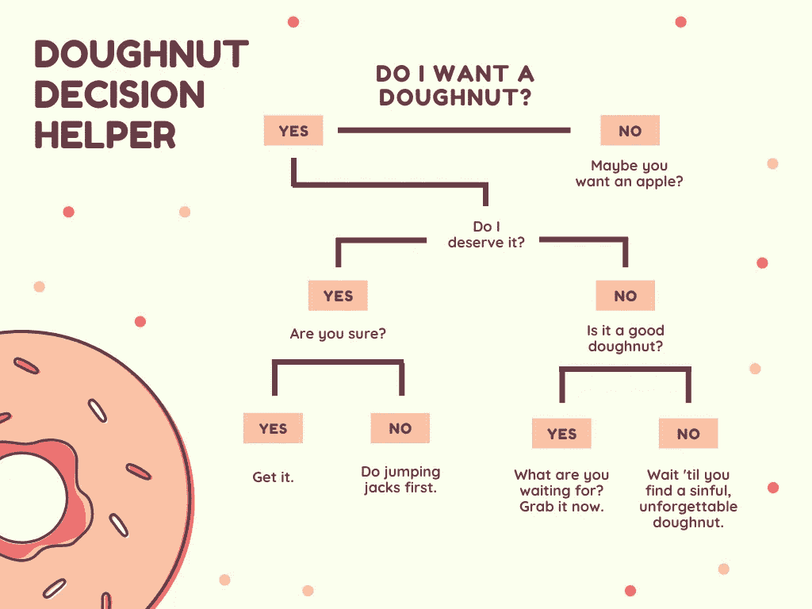
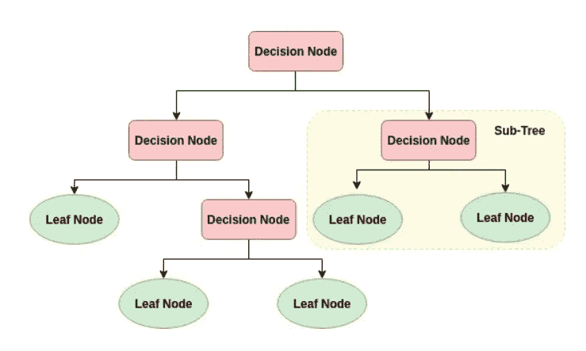
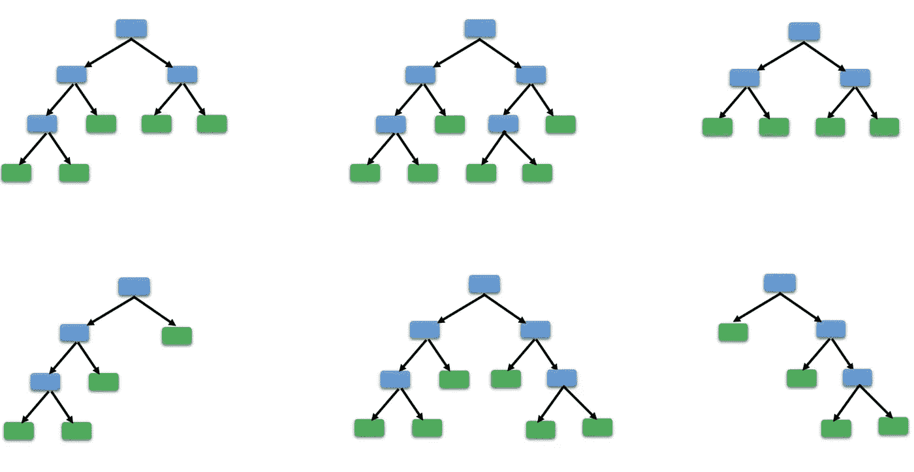
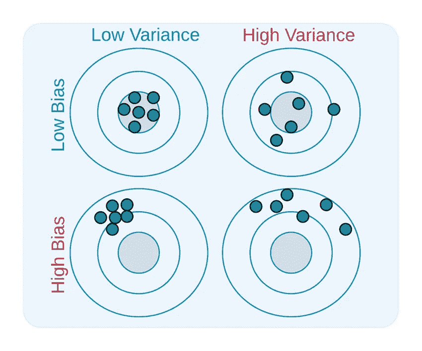

# 随机森林:开始前你需要知道的

> 原文：<https://towardsdatascience.com/quick-intro-to-random-forest-3cb5006868d8?source=collection_archive---------22----------------------->

## 机器学习

弗拉季斯拉夫·巴比延科在 [Unsplash](https://unsplash.com/s/photos/choice?utm_source=unsplash&utm_medium=referral&utm_content=creditCopyText) 上的照片

# 什么是随机森林？

根据官方[文档](https://scikit-learn.org/stable/modules/generated/sklearn.ensemble.RandomForestClassifier.html)::*随机森林是一种元估计器，它在数据集的各个子样本上拟合多个决策树分类器，并使用平均来提高预测精度和控制过拟合。子样本大小始终与原始输入样本大小相同，但样本是用替换的*抽取的。

换句话说，随机森林是一种强大但相对简单的数据挖掘和监督机器学习技术。**它允许从极大的数据集中快速、自动地识别相关信息。**算法最大的优点是依赖于很多预测(树)的集合，而不是信任单个。用随机森林你可以做到:
- C [分类](https://scikit-learn.org/stable/modules/generated/sklearn.ensemble.RandomForestClassifier.html)(输入=分类数据)，每棵树为最终预测投下一票。
- [回归](https://scikit-learn.org/stable/modules/generated/sklearn.ensemble.RandomForestRegressor.html)(输入=连续数据)，树的结果被平均以创建最终预测。

**我们举个现实生活中的例子来解释一下。假设你正在犹豫下次去哪里度假。你决定向你的朋友拉斯姆斯寻求建议。拉斯莫斯会问你，你已经去过哪里，你做了什么，你是否喜欢它，以了解你喜欢做或看到什么样的事情。根据你的回答和他自己的经历，他会给你一些建议。 ***在这里，拉斯姆斯正在做一个决策树*** *来为你提供可能的最佳选择。*于是，为了做出最准确的决定，你和“n”个其他朋友重复操作。他们像拉斯姆斯一样问你一些随机的问题，并给你提供不同的去处。每一个回答都像是为去的地方投了一票。有朋友推荐的一些常见的地方。你收集所有的投票并汇总。你决定去票数最多的地方。 ***在这里，你做的是随机森林。*****

> 换句话说，在做决定之前，你是想向一个人征求建议，还是想向许多不同的人征求意见，然后把他们的答案汇总起来再做决定？

这就是你在使用随机森林时所做的事情。通过累积各种树的预测，您正在授权您的分类/回归。

# 如何建立一个森林？

决策树是随机森林模型的基础。它们很容易理解，因为每个人都有意识或无意识地直观使用它们:

来源:[https://www.canva.com/](https://www.canva.com/)

在数据科学的世界里，决策树一步一步地将数据集分解成更小的子集。最终的结果是一棵有**个决策节点**和**个叶节点**的树。

来源:[“Python 中的决策树分类。”](https://www.datacamp.com/community/tutorials/decision-tree-classification-python)，纳夫拉尼，阿维纳什。2018.

## 决策树的优势

1.  因为直观所以容易理解。
2.  易于解释和可视化，因为它产生了一组规则。
3.  对数字和分类数据都开放
4.  在大型数据集上表现相当好
5.  与 KNN 和其他分类算法相比，以光速工作。

## 决策树的极限

决策树很简单，但相当不准确。选择下一个节点的一个失策，就可能把你推向完全不同的结果。此外，他们还面临着过度拟合的高风险。

> **记住:** [过度拟合](https://en.wikipedia.org/wiki/Overfitting)发生在我们的模型捕捉到数据中的噪声和潜在模式时。当我们在嘈杂的数据集上训练我们的模型时，就会发生这种情况。这些模型具有低**偏差**和高**方差**。

**所以基本上，树越深→对你的数据集越具体→过度拟合的风险越高。**

来源:[数据挖掘博客——Philippe Fournier-Viger](https://www.google.com/url?sa=i&url=http%3A%2F%2Fdata-mining.philippe-fournier-viger.com%2Fsome-funny-pictures-related-to-data-mining%2Foverfitting%2F&psig=AOvVaw14joteF4qLRXuv1taaF_JS&ust=1585058265879000&source=images&cd=vfe&ved=0CAMQjB1qFwoTCODo36ngsOgCFQAAAAAdAAAAABAc)

# 团结则存，分裂则亡

随机森林算法不是创建一个单独的决策树，而是从随机选择的数据集子集创建许多单独的树。这些单独的树中的每一个生成数据子集内的对象的分类/回归。

**它是如何工作的？**

让我们考虑我们总共有 *m* 个特性。

1.  随机选择 *k* 特征，其中 *k* < *m.*
2.  在 *k* 特征中，使用最佳分割点计算节点。
3.  使用最佳分割方法将节点分割成子节点。
4.  重复前面的步骤 *n 次*。
5.  你最终会拥有一片由 n 棵树组成的森林。
6.  将决策树的结果组合在一起(*即自举*)。

随机森林=决策树的简单性*随机性带来的准确性

# 结论——为什么随机森林是这么酷的 ML 算法？

> **对异常值和非线性数据相当稳健**

随机森林通过本质上的宁滨处理离群值。它对非线性特征也漠不关心。

> **很好地处理不平衡数据**

让我们弄清楚，我们离欠采样、过采样或 SMOTE 方法还很远。随机森林所提供的是，根据类在数据集中的存在情况对它们进行反比例加权的可能性。换句话说，如果您有一个少数民族类和一个多数民族类，则少数民族类的权重将比多数民族类大得多(错误率大),以重新平衡其在数据集中代表性不足的事实。

> **降低过度拟合的风险**

每个独立的引导数据集的分类/回归都可能略有错误。然而，由于该算法依赖于所有自举集**的集合，它极大地限制了过拟合，而不会由于偏差而显著增加误差。**让我们更详细地了解如何:

***→对数据集的子样本进行训练:*** 每棵决策树的方差都很高，但偏差很低。但是因为我们平均所有的树，我们也平均方差，所以我们有较低的偏差和一个更温和的方差模型。

***→对*** ***特征的子样本进行训练***
如果我们有 12 个特征，随机森林在每个模型中只会使用一定数量的那些特征。假设 4 乘树，那么 8 个潜在有用的特征被省略。但是由于 Random Forest 是决策树的集合，最终我们的许多或所有特征都会被表示出来。每个树中的特征是随机选择的，以便限制由偏差引起的误差和由方差引起的误差。

> 我们更有可能击中随机森林的目标

来源:[“理解偏差-方差权衡”，](http://scott.fortmann-roe.com/docs/BiasVariance.html)2012 年 6 月，Scott Fortmann-Roe

*感谢阅读！如果你喜欢这篇文章，就按住按钮鼓掌支持我的写作。我总是愿意聊天和喝杯“虚拟”咖啡，所以来关注我的*[*Linkedin*](https://www.linkedin.com/in/aureliegiraud9000/)*。*

 [## 通过我的推荐链接加入 Medium-aurélie Giraud

### 不要错过我的下一篇文章，阅读 Medium 上成千上万的其他作者的文章！我写的是如何使用数据科学…

agiraud.medium.com](https://agiraud.medium.com/membership)