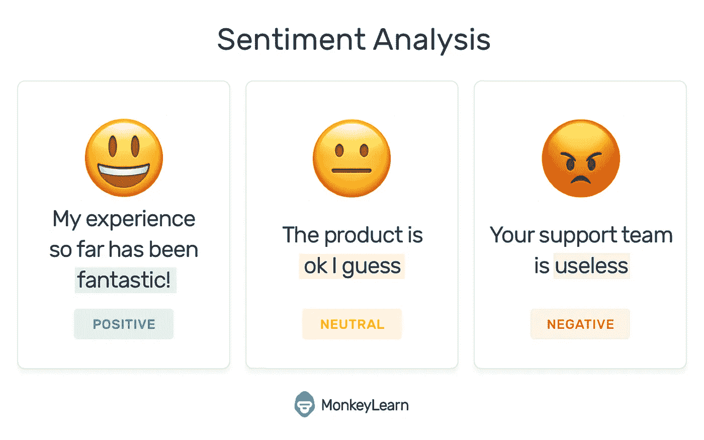
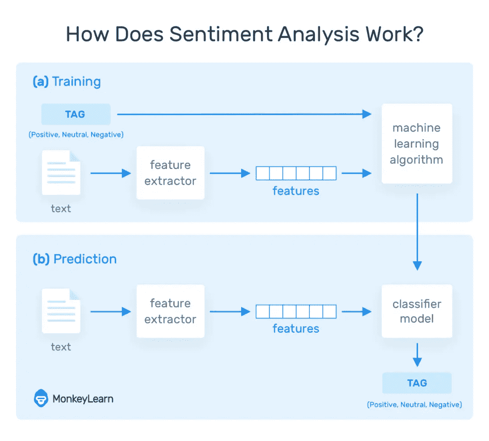
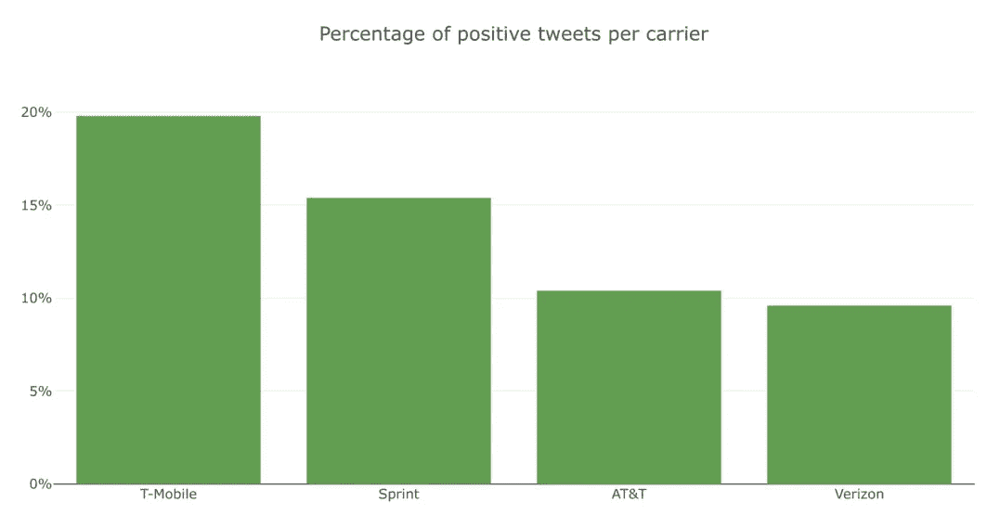
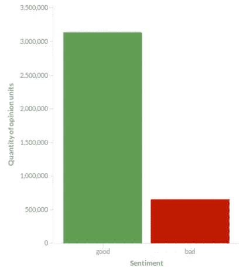
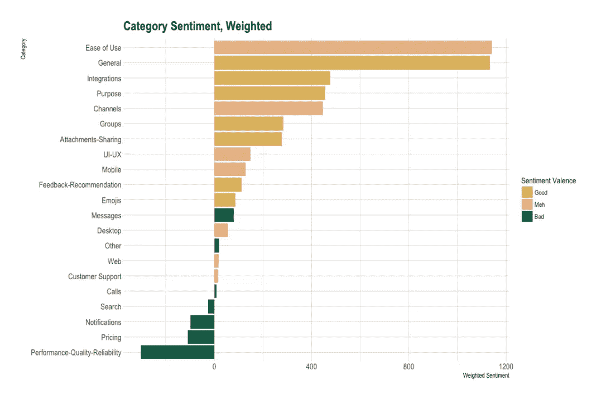

# 情感分析快速入门

> 原文：<https://towardsdatascience.com/quick-introduction-to-sentiment-analysis-74bd3dfb536c?source=collection_archive---------19----------------------->

## 什么是情绪分析，如何执行，以及它如何帮助你的业务。

来源: [MonkeyLearn](https://monkeylearn.com/)

[情感分析](https://monkeylearn.com/sentiment-analysis/)是确定文本是否表达了对产品或主题的正面、负面或中性观点的自动化过程。通过使用情绪分析，公司不必花费大量时间来标记客户数据，如调查回复、评论、支持票和社交媒体评论。

情绪分析有助于公司监控其在社交媒体上的品牌声誉，从客户反馈中获得洞察力，等等！

在这篇文章中，我们将更详细地介绍什么是情绪分析，如何进行情绪分析，以及它如何帮助你的业务。

我们走吧！

# 情感分析是如何工作的？

情感分析使用自然语言处理(NLP)方法和算法，包括:

*   **基于规则的系统:**使用一组手工制作的规则
*   自动系统:依靠机器学习技术从数据中学习
*   混合系统:结合基于规则和自动化的方法

# 基于规则的情感分析系统:

为了识别极性，这种方法使用自然语言处理(NLP)技术(如标记化、词干化和解析)以及手工制作的规则定义了一组规则。

首先，你需要定义两个对立词的列表(例如，负面词如坏、最差、丑等，正面词如好、最好、漂亮等)。一旦一个基于规则的系统被输入这些预定义的列表，它就会计算文本中出现的正面和负面词的数量，如果正面词多于负面词，则返回正面情绪，反之亦然。

然而，这种方法没有考虑文本中的单词序列，例如，“UX 没那么好”。虽然“没那么好”表达的是消极，但基于规则的系统会检测到“很好”这个词，并将其添加到积极的列表中。

现在，作为一个基于规则的系统，您可以实现新的规则来考虑新的词汇和表达，但是系统可能会变得非常复杂，并且很难维护这么多的规则。因此，这些系统需要大量投资来微调和维护。

# 自动情感分析系统

这些系统不依赖于手工制作的规则，而是依赖于机器学习技术，如分类。用于情感分析的分类是一个自动系统，在返回类别之前，需要输入样本文本，例如正面、负面或中性。

实施自动化系统包括两个阶段:

1.  培养
2.  预言；预测；预告

在训练阶段，情感分析模型使用样本数据学习正确地将文本标记为负面的*、中性的*或正面的*。然后，特征提取器将文本转换成特征向量，创建成对的特征向量和标签(例如，肯定的、否定的或中性的)，这些特征向量和标签被馈送到机器学习算法中以生成模型。*

*在预测过程中，特征提取器用于将看不见的文本转换为特征向量，这些特征向量被提供给模型，使其能够进行情感预测。*

**

*来源: [MonkeyLearn](https://monkeylearn.com/)*

# *混合情感分析系统*

*顾名思义，混合系统结合了基于规则的和自动化的技术，并且通常能够提供更准确的结果。*

# *为什么情感分析很重要？*

*公司通过社交媒体、调查、在线评论、电子邮件和其他渠道获得的信息比以往任何时候都多。但是，[您知道这些数据的 80%是非结构化的吗](https://learn.g2.com/structured-vs-unstructured-data)？因此，如果您想分析这些数据以了解客户的意见，您需要首先对其进行排序。*

*例如，假设您刚刚推出了一款新产品，并开展了一项调查来了解客户的想法。该调查非常成功，您收到了 1000 份开放式回复。很好，但是你的资源有限，所以要花很长时间去阅读和分析它们。*

*然而，在分析您的调查回答时，执行情感分析可以节省您的时间、精力和资源。它比手动排序数据更有效，因为它是完全自动化的，这意味着您的团队可以专注于更紧急和重要的任务。*

*让我们更详细地看看情绪分析的好处:*

*   ***可扩展性***

*如今，企业接收海量信息— [每天产生超过 2.5 万亿字节的数据！](https://www.domo.com/learn/data-never-sleeps-5?aid=ogsm072517_1&sf100871281=1)这使得人工代理几乎不可能准确有效地手动分析这些数据。相反，用于情感分析的机器学习模型可以在几秒钟内自动标记你的文本，无论你收到 50 或 5000 条调查回复、评论或社交媒体评论。*

*   ***实时分析***

*紧急问题会经常出现，它们需要被立即处理。例如，推特上的投诉如果像病毒一样传播开来，可能会迅速升级为公关危机。虽然你的团队可能很难在危机发生前识别危机，但机器学习工具很容易实时发现这些情况。*

*   ***一致标准***

*假设您进行了一项客户满意度调查，收到了这样的回复:“支持代理速度很快，但非常粗鲁”。你会怎么标记它？*正*、*负*，还是*空档*？如你所见，手动识别文本的情感并不总是简单明了的。你的一些队友可能会根据他们的信仰和经验对文本进行不同的分类。如果他们感到无聊或疲倦，他们可能会犯错误，甚至随着时间的推移改变他们的标准！*

*另一方面，用于情感分析的机器学习模型在任何时候都应用一致的标准，而且它们永远不会感到累或无聊。*

# *情感分析是用来做什么的？*

*让我们来看看情感分析是如何被使用的:*

# *政治分析*

*情感分析可以用于政治分析。*

*2016 年，全球数百万人在推特上讨论美国大选。我们想了解公众对每位候选人的看法，于是[对所有提及每位候选人](https://monkeylearn.com/blog/trump-vs-hillary-sentiment-analysis-twitter-mentions/)的推文进行了情感分析，例如:*

*   *“据@CBSNews #ClintonVsTrump 报道，@HillaryClinton 将在今晚的总统辩论中收到第一个问题”。
    情绪:*中立*。*
*   *“美国人信任@realDonaldTrump 让我们的经济再次伟大！”。
    情绪:*积极*。*
*   *“种族不和是由包括@realDonaldTrump 的父亲在内的美国人构想、培育、提炼和延续的。现实点吧！”。
    情绪:*消极*。*

*以下是结果图表，显示了一段时间内推特用户对特朗普和克林顿的看法:*

**

*来源: [MonkeyLearn](https://monkeylearn.com/)*

*正如你所看到的，唐纳德·特朗普的被提及次数比克林顿多得多，这表明他在 Twitter 上的存在更多(特朗普每天被提及约 45 万次，而克林顿每天仅被提及 25 万次)。我们还发现，在所有这些推文中，特朗普比克林顿获得了更多的正面提及。*

# *客户服务分析*

*您还可以分析与客户服务相关的情绪。例如，在线对话可以帮助企业了解客户对其品牌、响应时间、整体客户服务等的感受。*

*下面，我们[分析了四家不同电信公司](https://monkeylearn.com/blog/analyzing-customer-support-interactions-on-twitter-with-machine-learning/) (T-Mobile、AT & T、威瑞森和 Sprint)的推文情绪，并得出以下结果:*

**

*来源: [MonkeyLearn](https://monkeylearn.com/)*

*提及电信公司的正面推文百分比。*

*结果显示，T-Mobile 以近 20%的正面推文胜出，Sprint 以 15%的正面提及率位居第二。*

*当将 T-Mobile 的推文与其竞争对手的推文进行比较时，很明显，T-Mobile 在社交媒体上的个人方式会带来更积极的回应，这可能会鼓励其他公司在社交媒体上采用更非正式的个性。*

# *客户反馈分析*

*您还可以使用情绪分析来分析客户反馈，从在线评论到 NPS 调查。*

*假设 Tripadvisor 希望对酒店评论进行情感分析，以探索整体情感。我们对超过 100 万条酒店评论进行了分析，发现了一些有趣的见解:*

*   ***大多数评论是正面的:**在分析的 400 万篇文本中，82%被标记为*正面*。*

**

*来源: [MonkeyLearn](https://monkeylearn.com/)*

*   *伦敦酒店的总体评价最差:伦敦酒店收到的负面评价比其他同等规模城市的酒店多，比如巴黎或马德里。*

**

*来源: [MonkeyLearn](https://monkeylearn.com/)*

*我们还[将 Slack 对 Capterra](https://monkeylearn.com/blog/sentiment-analysis-using-r/) 的评论分为*正面*、*负面*和*中立*三类，并得出以下结果:*

**

*来源: [MonkeyLearn](https://monkeylearn.com/)*

*如您所见，Slack 在*整合*、*渠道*和*群组*等类别中获得更多正面提及，但在*定价*、*呼叫*或*搜索*方面获得更多负面提及。这种类型的分析可以帮助企业获得关于如何改善其服务或产品的重要见解。*

# *包裹*

*简而言之，情绪分析可以在许多方面改善你的业务，从防止公关危机到了解你的客户对你的产品或服务的感受。*

*手动分类不再适用于企业。他们需要快速、准确和高效的自动化系统，能够提供新的见解并为团队提供支持。*

*想马上开始情感分析吗？[免费注册 MonkeyLearn](https://app.monkeylearn.com/accounts/register/) ，开始使用[预先训练的情绪分析模型](https://app.monkeylearn.com/main/classifiers/cl_pi3C7JiL/)，看看它如何将你的数据分类为积极、消极和中立。*