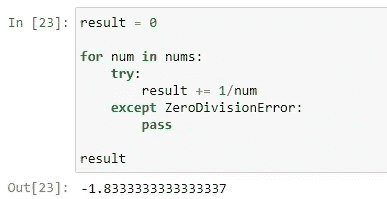

# 快速 Python 技巧:隐藏已知异常，而不尝试 Except

> 原文：<https://towardsdatascience.com/quick-python-tip-suppress-known-exception-without-try-except-a93ec34d3704?source=collection_archive---------5----------------------->


照片由[凯尔·格伦](https://unsplash.com/@kylejglenn?utm_source=medium&utm_medium=referral)在 [Unsplash](https://unsplash.com?utm_source=medium&utm_medium=referral) 上拍摄

## 用 Python 更优雅地处理已知异常。

在 Python 中使用`try ... except ...`块处理异常是非常常见的。它使我们能够在出现问题时应用一些特殊操作。

然而，有一种特殊情况

*   我们知道这种例外可能会发生
*   我们不关心这个例外
*   如果发生了，什么也不做，直接忽略它

如果情况满足上述条件，就不必使用`try ... except ...`来处理异常。相反，Python 内置库`contextlib`提供了一个名为`suppress`的函数来更优雅地处理这个问题。

# 定义问题


由 [Romain Vignes](https://unsplash.com/@rvignes?utm_source=medium&utm_medium=referral) 在 [Unsplash](https://unsplash.com?utm_source=medium&utm_medium=referral) 上拍摄的照片

假设我们有一个可能包含零的数字列表。我们想得到列表中每个数字的倒数，然后对它们求和。如果有零，就忽略它们。

首先，让我们使用随机库来生成这样一个列表。

```
import randomnums = [random.randint(-3, 3) for i in range(20)]
```


上面的代码生成了一个大小为 20 的介于(-3，3)之间的整数列表。请注意，您可以有一个没有任何零的列表。如果发生这种情况，只需生成另一个。在这个实验中，我们需要一些零。

现在，假设我们想得到列表中所有数字的倒数。注意数字零没有倒数。因此，如果我们编写如下代码而不处理异常，将会抛出一个`ZeroDivisionError`。

```
results = [1/num for num in nums]
```


# 使用 Try Except


威尔·斯图尔特在 [Unsplash](https://unsplash.com?utm_source=medium&utm_medium=referral) 上拍摄的照片

解决这个问题最常见和直观的方法是用一个`try ... except ...`块来捕捉`ZeroDivisionError`异常并忽略它。

```
result = 0for num in nums:
    try:
        result += 1/num
    except ZeroDivisionError:
        passresult
```



在上面的代码中，我们捕获了`ZeroDivisionError`异常，并使用`pass`来忽略它。所以，当这个异常发生时，不会抛出任何东西，程序会忽略这个零，继续运行。

# 使用抑制功能


照片由[费德里科·博托斯](https://unsplash.com/@landscapeplaces?utm_source=medium&utm_medium=referral)在 [Unsplash](https://unsplash.com?utm_source=medium&utm_medium=referral) 上拍摄

现在，我将向您介绍另一种方法，它使您的代码更加优雅。

在使用这种方法之前，我们需要先从`contextlib`进口。

```
from contextlib import suppress
```

`suppress`函数需要和`with`语句一起使用，如下所示:

```
result = 0for num in nums:
    with suppress(ZeroDivisionError):
        result += 1/numresult
```


那不是更简洁直观吗？在我看来，它也更“Pythonic 化”。

因此，使用`suppress`函数，作为参数传入的异常将被忽略。

# 为什么我们要用“压制”？

*本节根据@Felix 回复中的一个问题进行了更新。*

简短的回答是:不，你不必使用它。

在问题中，有人问我为什么不按如下方式修复它:

```
result = sum([1/x for x in nums if x != 0])
```

这是绝对正确的。在本文中，我只想创建一个可以演示 suppress 的场景。我的例子并不完美，因为通过上面的解决方案修复比使用 suppress 函数更好。但是我认为 suppress 函数的价值存在于其他场景中。例如，如果列表是这样的:

```
nums = [3, -1, -2, 1, 1, 0, 3, 1, -2, 1, 0, -1, -1, -1, 3, -2, -1, 3, '3', -1] 
```

请注意，倒数第二个位置有一个字符串“3”。现在，我们有两个可能的例外。你也可以用上面的方法处理它:

```
result = sum([1/x for x in nums if x != 0 and type(x) == int]) 
```

或者，使用 suppress 函数，只需添加另一种异常类型:

```
for num in nums:
    with suppress(ZeroDivisionError, TypeError):
        result += 1/num
```

那么，如果有更多可能的例外呢？比起在列表理解中添加越来越多的条件，我相信使用 suppress 更优雅。

此外，如果您有两个以上的可能异常怎么办？或者，假设你不关心异常是什么，只想在它发生时绕过它。

```
for num in nums:
    with suppress(Exception):
        result += 1/num
```


所以，您抑制了任何类型的异常:)

# 限制


马库斯·斯皮斯克在 [Unsplash](https://unsplash.com?utm_source=medium&utm_medium=referral) 上拍摄的照片

但是`suppress`功能是有限制的。也就是说，不能将 for 循环放在如下的`suppress` `with` 语句中。

```
result = 0with suppress(ZeroDivisionError):
    for num in nums:
        result += 1/numresult
```


为什么我们会有不同的结果呢？这是因为一旦异常发生，for 循环就会被中断。尽管异常仍被忽略，但 0 之后的所有数字也将被忽略。

# 思想


照片由[思想目录](https://unsplash.com/@thoughtcatalog?utm_source=medium&utm_medium=referral)在 [Unsplash](https://unsplash.com?utm_source=medium&utm_medium=referral)

在本文中，我分享了一种替代方法，当你只是想捕捉异常并忽略它时，这就是来自 Python 中内置库`contextlib`的`suppress`函数。我认为，就编码风格而言，它更优雅。

然而，我也想提出我对此的一些想法

*   它有一个限制，我们不能在其中放置迭代，比如 for 循环
*   我们需要在使用前导入函数，所以当我们想在代码中的多个地方使用它时，可以使用它

每天我们都能学到一些东西。编码快乐！

[](https://medium.com/@qiuyujx/membership) [## 通过我的推荐链接加入 Medium 克里斯托弗·陶

### 作为一个媒体会员，你的会员费的一部分会给你阅读的作家，你可以完全接触到每一个故事…

medium.com](https://medium.com/@qiuyujx/membership) 

如果你觉得我的文章有帮助，请考虑加入 Medium 会员来支持我和数以千计的其他作者！(点击上面的链接)