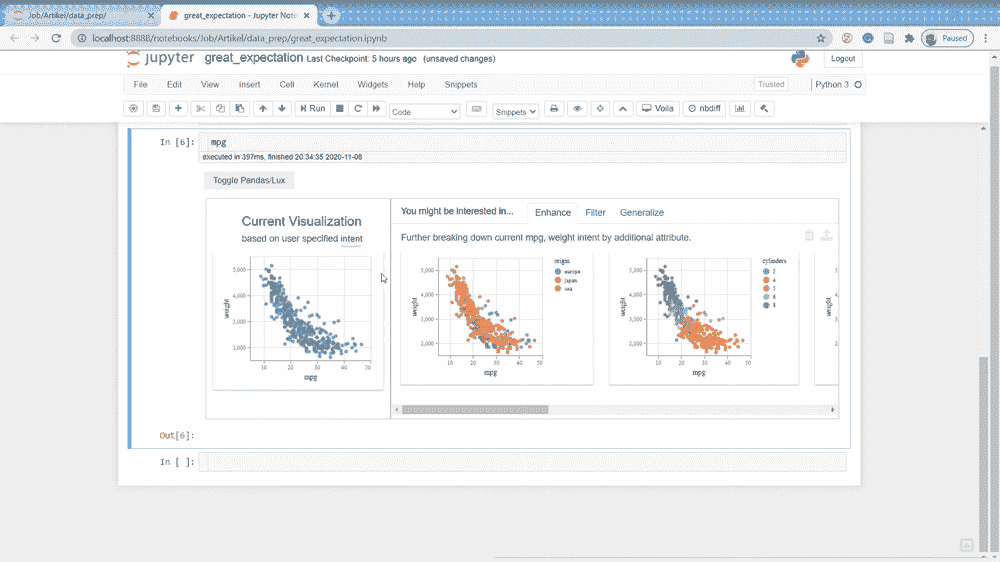
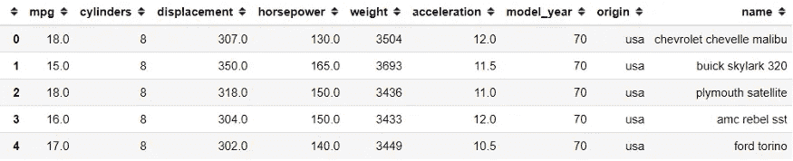
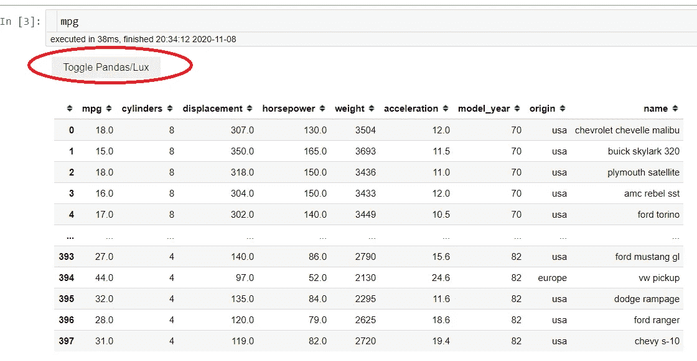
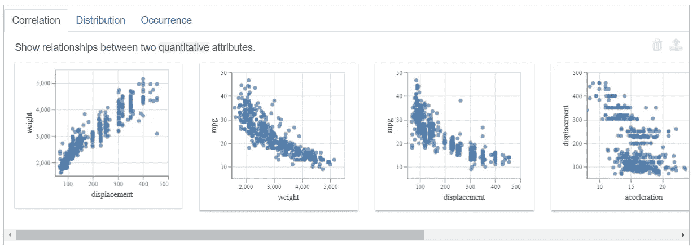
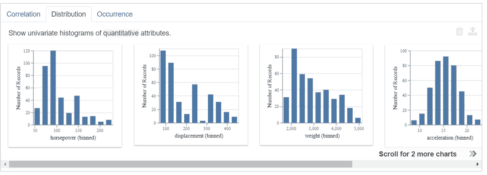
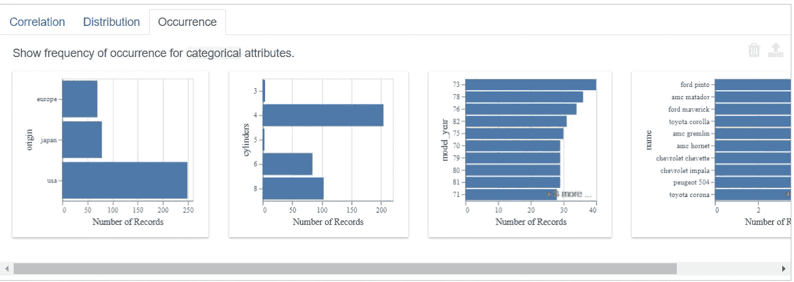
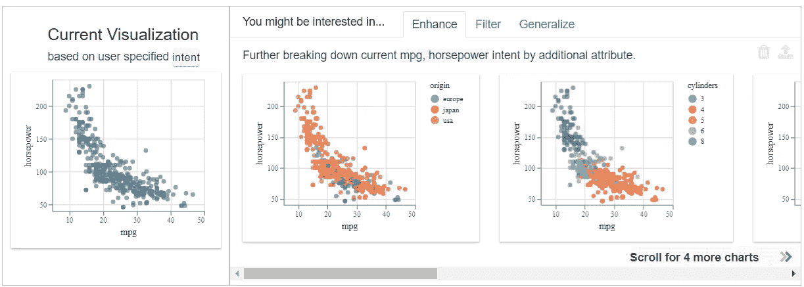
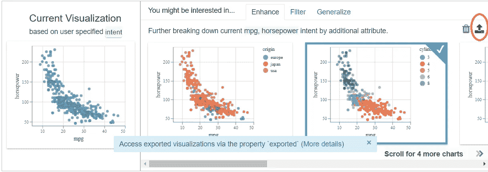
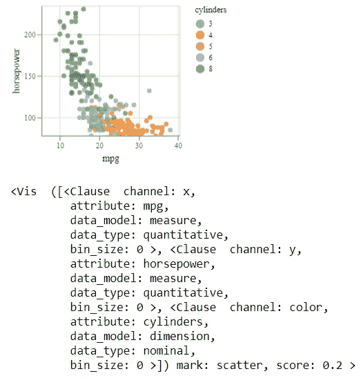

# 使用 Lux 进行基于快速推荐的数据探索

> 原文：<https://towardsdatascience.com/quick-recommendation-based-data-exploration-with-lux-f4d0ccb68133?source=collection_archive---------30----------------------->

## 通过基于一行建议的数据探索，轻松探索您的数据



作者创建的 GIF

作为一名数据科学家，数据探索或 EDA 是我们的日常工作，也是我们拿工资要做的事情。对于数据科学家来说，没有比数据探索技能更重要的技能了(在我看来)。虽然这很重要，但我们知道这个过程很麻烦，有时会浪费时间。此外，很多时候，我们不知道从哪里开始探索数据。

以下面的 mpg 数据集为例:

```
import pandas as pd
import seaborn as sns
mpg = sns.load_dataset('mpg')
mpg.head()
```



作者创建的图像

如果我们不是像我一样的汽车领域的专家，我们从哪里开始探索数据？在这种情况下，我们可以使用 **lux** 包来尝试基于推荐器的 EDA。

如果您想查看另一个开源 EDA 包，也可以在这里查看我的文章。

[](/data-frame-eda-packages-comparison-pandas-profiling-sweetviz-and-pandasgui-bbab4841943b) [## 数据框 EDA 软件包比较:Pandas Profiling、Sweetviz 和 PandasGUI

### 哪些熊猫数据框 EDA 包适合你？

towardsdatascience.com](/data-frame-eda-packages-comparison-pandas-profiling-sweetviz-and-pandasgui-bbab4841943b) 

无论如何，让我们看看如何使用 lux 软件包来帮助我们探索我们的数据。

# 勒克斯

[Lux](https://github.com/lux-org/lux) 是 Python 中的一个开源包，旨在帮助我们根据他们的建议更智能地探索数据。该软件包的目标是那些在探索数据时不知道从哪里开始的人。

让我们从安装包开始。

```
pip install lux-api
```

当您安装完软件包后，我们需要在 jupyter 笔记本中启用 lux 小部件。

```
jupyter nbextension install --py luxwidget
jupyter nbextension enable --py luxwidget
```

现在，让我们尝试使用 Lux 包来研究我们的数据。首先，我们需要导入包，以便在我们的笔记本中自动设置小部件。

```
import lux
```

就像那样，我们已经设置了 Lux 包来与 Pandas 数据框集成。接下来，让我们尝试打开我们的任何一个数据框；让我们用之前用过的 mpg 数据集试试。



作者创造的形象

在 Lux 包中，我们可以看到一个名为“切换熊猫/Lux”的新按钮。试着按下那个按钮。

## **力士基本可视化**



作者创建的图像

自动地，基于我们的数据集创建一组可视化。默认情况下，创建了三个可视化类别；**相关、分布**和**发生**。

**相关性**选项卡包含两个变量之间的所有**数字关系，这些关系通过**散点图**可视化。可以看到上图的例子。**

**分布**选项卡显示一个**单数值变量**，其中变量使用**直方图**可视化。你可以看到下图中的例子。



作者创造的形象

**事件**选项卡显示分类变量的**计数图。它显示了分类变量中的每个类别频率，如下图所示。**



作者创造的形象

## **基于 Lux 推荐的可视化**

除了数据框可视化，我们还可以用 Lux 指定我们感兴趣的属性和值，以指导我们的数据探索的潜在后续步骤。

Ler 说我对' **mpg** '和'**马力**'属性都感兴趣，因为我知道它们是相关的。我们可以在 Lux 包中指定这两者来指导我们使用`.intent`方法，就像下面的行一样。

```
mpg.intent = ['mpg', 'horsepower']
```



作者创造的形象

将意图设置到我们的数据框后，Lux 包为我们提供了可视化建议。我们可以看到三种不同的选择:**增强**、**过滤**、**泛化**。

**增强**选项卡通过**向我们当前的意图**添加额外的变量来显示可视化建议。本质上它显示了另一个变量如何影响我们感兴趣的变量。可以看到上图的例子。

**滤镜**选项卡为您设置的当前意图添加一个滤镜；这是在保持属性(在 X 和 Y 轴上)固定的情况下完成的。建议将向我们展示从另一个变量中筛选出来的变量之间的关系。从下图中可以看到，散点图是由 model_year 变量针对列中的每个类进行筛选的。


作者创造的形象

**generalize** 选项卡删除一个属性以显示更一般的趋势，显示属性的分布。目的是关注我们感兴趣的当前属性。


您也可以尝试数字和分类之间的可变组合。虽然意图的最大变量，你可以指定是三个变量。尽管如此，对您来说，轻松地浏览数据就足够了。

## **Lux 导出可视化**

如果您想将一个可视化图表分离成另一个变量，您可以在 Lux 中完成。我们来看看下图。



作者创建的图像

我们只需要从上面的图像中点击我们想要的图表，直到它们显示出刻度线。之后，点击导出按钮(我给红圈的那个)。这样，我们已经成功地导出了图表。

那么，在哪里访问图表呢？导出的图表实际上存储在我们自己的数据框变量中。让我们试着进入它。

```
#The visualization is stored in the .exported attribute we could access any timevis = mpg.exported[0]
vis
```



作者创造的形象

这样，我们已经将我们的图存储到一个不同的变量中。

# **结论**

[Lux](https://github.com/lux-org/lux) 是一个基于推荐的系统 EDA，可以帮助我们快速处理数据。这个包给了我们所有可能的数据组合，并根据我们自己的意图探索数据，从而帮助了我们。

# 如果你喜欢我的内容，并想获得更多关于数据或作为数据科学家的日常生活的深入知识，请考虑在这里订阅我的[时事通讯。](https://cornellius.substack.com/welcome)

> 如果您没有订阅为中等会员，请考虑通过[我的推荐](https://cornelliusyudhawijaya.medium.com/membership)订阅。