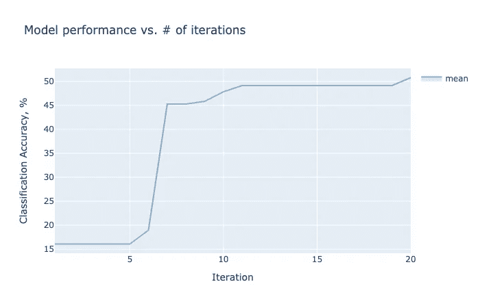
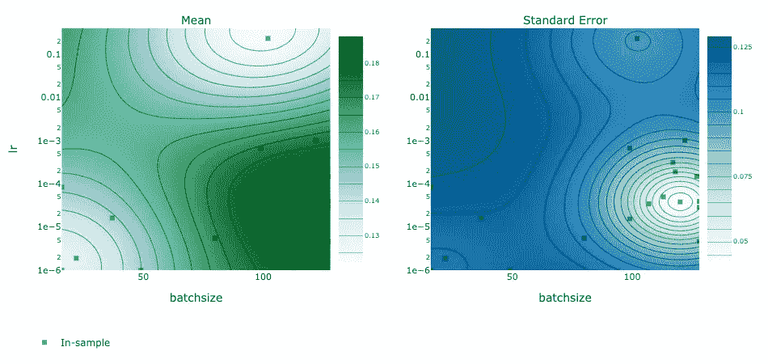

# 快速教程:使用贝叶斯优化调整 PyTorch 中的超参数

> 原文：<https://towardsdatascience.com/quick-tutorial-using-bayesian-optimization-to-tune-your-hyperparameters-in-pytorch-e9f74fc133c2?source=collection_archive---------11----------------------->

## 设计神经网络的更快方法


超参数调音就像调音吉他一样，因为我自己不会调音，所以更愿意使用应用程序。照片由[阿迪·戈尔茨坦](https://unsplash.com/@adigold1?utm_source=medium&utm_medium=referral)在 [Unsplash](https://unsplash.com?utm_source=medium&utm_medium=referral)

超参数是模型中决定模型架构、学习速度和范围以及正则化的参数。

寻找最佳超参数需要一些专业知识和耐心，您经常会发现人们使用网格搜索和随机搜索等令人疲惫的方法来寻找最适合他们问题的超参数。

# 快速教程

我将向您展示如何使用 [Ax](https://ax.dev/) 在 PyTorch 中实现贝叶斯优化，以自动找到针对您的神经网络的最佳超参数集。

我们将使用迁移学习构建一个简单的 CIFAR-10 分类器。大部分代码来自 CIFAR-10 分类器的官方 [PyTorch 初学者教程](https://pytorch.org/tutorials/beginner/blitz/cifar10_tutorial.html)。

我不会深入贝叶斯优化的细节，但你可以在 [Ax 网站](https://ax.dev/docs/bayesopt.html)上研究该算法，阅读[原始论文](https://citeseerx.ist.psu.edu/viewdoc/download?doi=10.1.1.467.8687&rep=rep1&type=pdf)或 2012 年关于其实际用途的[论文](https://arxiv.org/abs/1206.2944)。

# 首先，像往常一样

使用以下工具安装 Ax:

```
pip install ax-platform
```

导入所有必需的库:

下载数据集并构建数据加载器(我建议稍后将训练批量调整为 32 或 64):

让我们通过创建一些辅助函数来看看 CIFAR-10 数据集:

# 培训和评估职能

Ax 需要一个返回训练模型的函数，以及另一个评估模型并返回性能指标(如准确性或 F1 分数)的函数。我们在这里只构建训练函数，并使用 Ax 自己的`evaluate` tutorial 函数来测试我们的模型性能，它返回准确性。如果你愿意，你可以[看看他们的 API](https://ax.dev/api/_modules/ax/utils/tutorials/cnn_utils.html#evaluate) 来模仿他们的评估函数。

接下来，我们编写一个`init_net()`函数，它初始化模型并返回网络准备训练。这里有很多超参数调优的机会。您会注意到`parameterization`参数，它是一个包含超参数的字典。

最后，我们需要一个`train_evaluate()`函数，贝叶斯优化器在每次运行时都会调用它。优化器在`parameterization`中生成一组新的超参数，将其传递给这个函数，然后分析返回的评估结果。

# 优化！

现在，只需指定想要扫描的超参数，并将其传递给 Ax 的`optimize()`函数:

这确实花了一些时间，但与对所有 3 个超参数进行简单的网格搜索相比，这算不了什么。让我们来看看结果:

```
results[INFO 09-23 09:30:44] ax.modelbridge.dispatch_utils: Using Bayesian Optimization generation strategy: GenerationStrategy(name='Sobol+GPEI', steps=[Sobol for 5 arms, GPEI for subsequent arms], generated 0 arm(s) so far). Iterations after 5 will take longer to generate due to model-fitting.
[INFO 09-23 09:30:44] ax.service.managed_loop: Started full optimization with 20 steps.
[INFO 09-23 09:30:44] ax.service.managed_loop: Running optimization trial 1...
[INFO 09-23 09:31:55] ax.service.managed_loop: Running optimization trial 2...
[INFO 09-23 09:32:56] ax.service.managed_loop: Running optimization trial 3......[INFO 09-23 09:52:19] ax.service.managed_loop: Running optimization trial 18...
[INFO 09-23 09:53:20] ax.service.managed_loop: Running optimization trial 19...
[INFO 09-23 09:54:23] ax.service.managed_loop: Running optimization trial 20...{'lr': 0.000237872310800664, 'batchsize': 117, 'momentum': 0.99}
{'accuracy': 0.4912998109307719}
{'accuracy': {'accuracy': 2.2924975426156455e-09}}
```

当动量为 **0.99** 且批量为 **117** 时，我们的最佳学习率似乎是 **2.37e-4** 。那很好。这里你看到的 49.1%的精度并不是模型的最终精度，不用担心！

我们可以更进一步，绘制一些图，显示每个时期的精度(随着参数化的改进而改进)，以及优化器使用等高线图作为两个超参数的函数的估计精度。`experiment`变量属于`Experiment`类型，你一定要[查看文档](https://ax.dev/api/core.html#ax.core.experiment.Experiment)看看它提供的所有方法。

渲染的情节易于理解和互动。等高线图中的黑色方块表示实际采样的坐标。



最后，您可以通过简单地运行下面的脚本来获取具有最佳平均精度的参数集(Ax 称之为“arm”)。

```
Arm(name=’19_0', parameters={‘lr’: 0.00023787231080066353, ‘batchsize’: 117, ‘momentum’: 0.9914986635285268})
```

不要害怕调整你想要的任何东西，比如隐藏层数和大小、漏失、激活功能、解冻深度等等。

快乐优化！