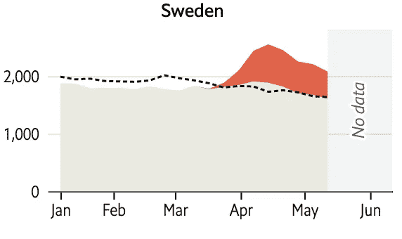
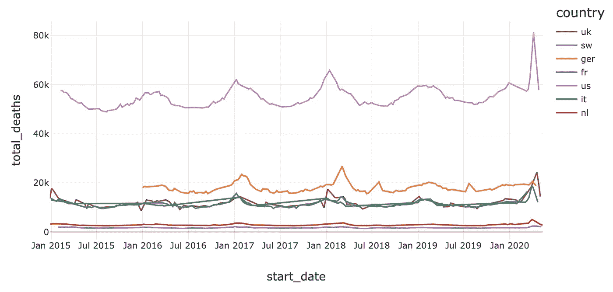
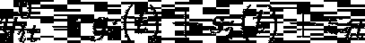
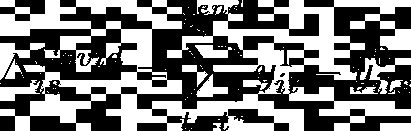
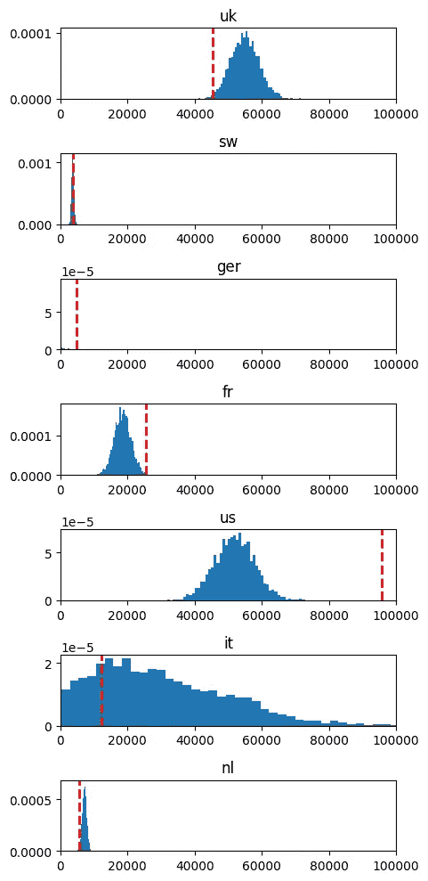
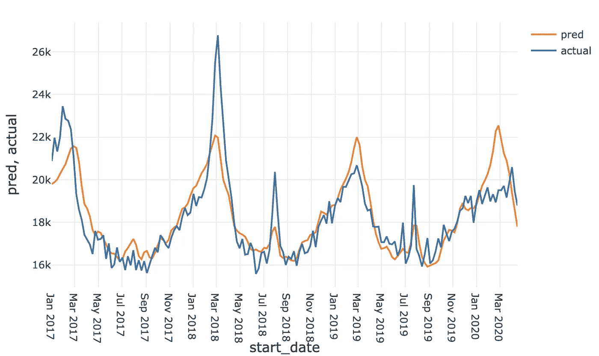

# COVID19 超额死亡率的快速不确定性估计

> 原文：<https://towardsdatascience.com/quick-uncertainty-estimates-for-covid19-excess-mortality-1e39e6c94bd7?source=collection_archive---------55----------------------->

***编者按:*** [*走向数据科学*](http://towardsdatascience.com/) *是一份以数据科学和机器学习研究为主的中型刊物。我们不是健康专家或流行病学家，本文的观点不应被解释为专业建议。想了解更多关于疫情冠状病毒的信息，可以点击* [*这里*](https://www.who.int/emergencies/diseases/novel-coronavirus-2019/situation-reports) *。*

F 还是最近的一个[故事](https://www.economist.com/graphic-detail/2020/04/16/tracking-covid-19-excess-deaths-across-countries) **经济学家**收集了大量的时间序列数据来进行每个国家的 COVID“超额死亡”分析。

使用的方法相当简单:

*   计算数据集中包含的 2020 年之前所有年份的每个国家的每周平均死亡人数
*   计算 COVID 爆发后实际每周死亡人数与“预测”平均每周死亡人数之间的差异
*   从疫情发病开始求和，以获得超额死亡总数。
*   与国家统计局报告的与 COVID 相关的死亡进行比较

根据《经济学人》的模型[https://www . Economist . com/graphic-detail/2020/04/16/tracking-新冠肺炎-超额死亡-跨国家](https://www.economist.com/graphic-detail/2020/04/16/tracking-covid-19-excess-deaths-across-countries)

虽然这是一个有趣的数据新闻，但从数据科学的角度来看，他们的方法有两个主要的问题:

*   任何试图建立基于历史观察的反事实结果的方法都将关键取决于模型的选择。我们怎么知道周均值模型是合理的？
*   我们如何知道观察到的差异不仅仅是由于**采样误差**？(碰巧)。或者更具体地说，我们如何更准确地确定超额死亡的全部后验分布？

因此，在接下来的内容中，我将尝试使用现成的预测工具来快速解决这些问题。幸运的是，《经济学人》已经在 [github](https://github.com/TheEconomist/covid-19-excess-deaths-tracker) 上发布了本文使用的所有数据，所以我们可以马上开始。

# 描述性分析

对所提供数据的快速分析表明，在构建时间序列方面已经做了大量工作，但在将国家来源提供的数据统一到一个共同的每周汇总水平方面仍然存在明显的挑战:图 1 表明，我们缺少数据，而且各国的历史视野不同。

图 1:六个国家每周总死亡人数。start_date 表示各周的第一天。

虽然这可能会在未来提出一些建模挑战(例如，缺少数据，与 ARIMA 不太相符)，但让我们首先评论一下整个过程的一般模式:首先，我们可以看到一个明显的年度模式，在冬季月份前后有年度高峰(德国在 3 月份左右)。其次，我们清楚地看到 2020 年第一季度的峰值，这与疫情的爆发相吻合。第三，更微妙的是，在人口增长和大致不变的死亡率的驱动下，死亡人数存在长期趋势。

为了激励我们的超额死亡数估计，让我们引入一个最小程度的形式主义。假设 y_{it}⁰表示第 t 周和国家 I 的每周死亡人数，如果 COVID19 没有实现，y_{it}表示实际死亡人数。假设 COVID 周期的开始时间为 t*(注意，这类似于回归[不连续设计](https://en.wikipedia.org/wiki/Regression_discontinuity_design#:~:text=In%20statistics%2C%20econometrics%2C%20political%20science,which%20an%20intervention%20is%20assigned.)文献中研究的问题)，则国家 I 的超额死亡率为:

假设 y_{it}可以准确无误地测量(如此盲目地相信国家统计局)，我们仍然无法在不推理反事实数列 y_{it}⁰.的情况下计算上面的表达式为了这个练习的目的，我们采用 facebook 的 [prophet package](https://facebook.github.io/prophet/) 中的假设:即我们假设 y_{it}⁰是由一个(贝叶斯) [GAM](https://en.wikipedia.org/wiki/Generalized_additive_model) 生成的:

而 g_i(t)包含国家特定的趋势成分，s_i(t)表示季节性因素，ε是一个特殊的误差项。Prophet 使用直接[傅立叶分解](https://en.wikipedia.org/wiki/Fourier_series)来处理季节性成分，有关更多详细信息，请查看 my code 和 [Prophet Paper](https://peerj.com/preprints/3190/) (p11)。

为了确保我们对 y_{it}⁰的预测只反映前 COVID dgp，我估计了 2020 年前数据的 g_i(t)和 s_i(t)的参数。此外，我选择了一个线性时间趋势，加上季节性成分，分别具有季度和年度周期。使用 MCMC 和 1000 次复制完成参数估计。

随后，我们可以简单地使用估计后验样本来计算所需的增量。

其中 s 表示蒙特卡罗样本指数，t_i^{end}表示我们数据中国家 I 的最后一个现有时间指数，t*被设置为 2020 年 2 月 1 日。请注意，当然，为了捕捉长期影响，我们需要 y_{it}的更长时间序列，但是，基于当前数据，我们可以在官方 COVID 统计中可视化潜在的过度/不足归因。

最后，将所有的成分放在一起，我们得到了每个国家的估计 COVID 超额死亡率分布，加上一条红色的垂直线表示官方计数。(X 轴的刻度从 0 到 100k。)

图 2:不同国家超额死亡率的分布——注意德国的大部分概率位于零的左边。红色虚线表示特定国家报告的由 COVID 引起的死亡。

图 2 显示超额死亡率报告似乎与我们估计的分布大致一致。美国和德国的数据差异很大，有限的数据使得对意大利的精确估计颇具挑战性。请注意，红色垂直线和我们的分布模式之间的差异不一定表明 COVID 死亡的过度/不足归因:公共卫生服务压力的增加也可能增加不相关疾病的死亡。

# 德国怎么了？

从上面的直方图中可以明显看出，德国 2020 年春季的死亡人数比我们的模型预测的要低得多(因此出现了负的超额死亡人数)。然而，这似乎不是不合理的模型预测的结果，而是 2020 年 3 月和 4 月德国异常低的死亡率。这一时期是否有其他一些共同因素，或者数据来源是否有误，仍有待确定。

德国实际与预测的超额死亡

# 结论和进一步的工作

在这个小练习中，我试图将《经济学人》中的简单结果与更复杂的基于 ts 建模的方法进行对比，这种方法更适合处理季节性计数数据。贝叶斯实现还为我们提供了一种构建预测区间的简单方法。美国和德国报道的死亡人数和估计的死亡人数之间的负差异最大，而英国和意大利似乎略有低估。

尽管我认为贝叶斯 GAM 具有线性趋势和季度/年度季节性成分，可以合理地拟合不同国家，但上述结果取决于时间序列模型的质量(因此可以从进一步的敏感性分析中受益)。我敢肯定，许多研究希望弄清楚对 COVID 的实际影响，我们可以期待大量的论文阐明这个问题。我希望这篇文章和代码能让一些人入门，我期待着你的评论和建议。

代码:

[https://github.com/citizenkeynes/CovidExcessDeath/](https://github.com/citizenkeynes/CovidExcessDeath)