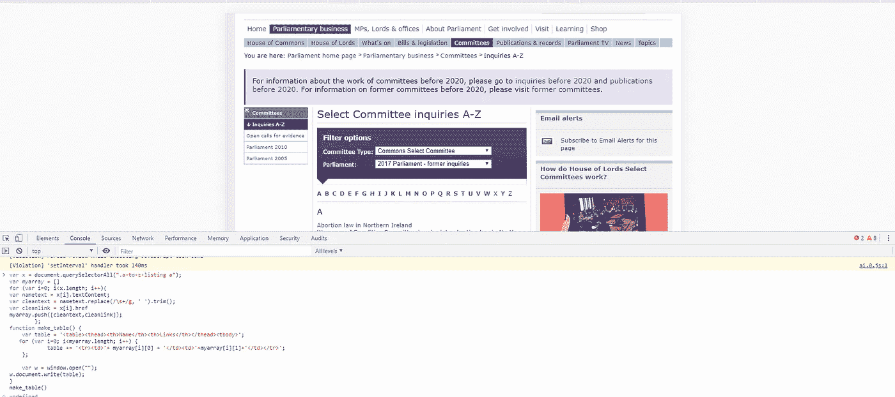
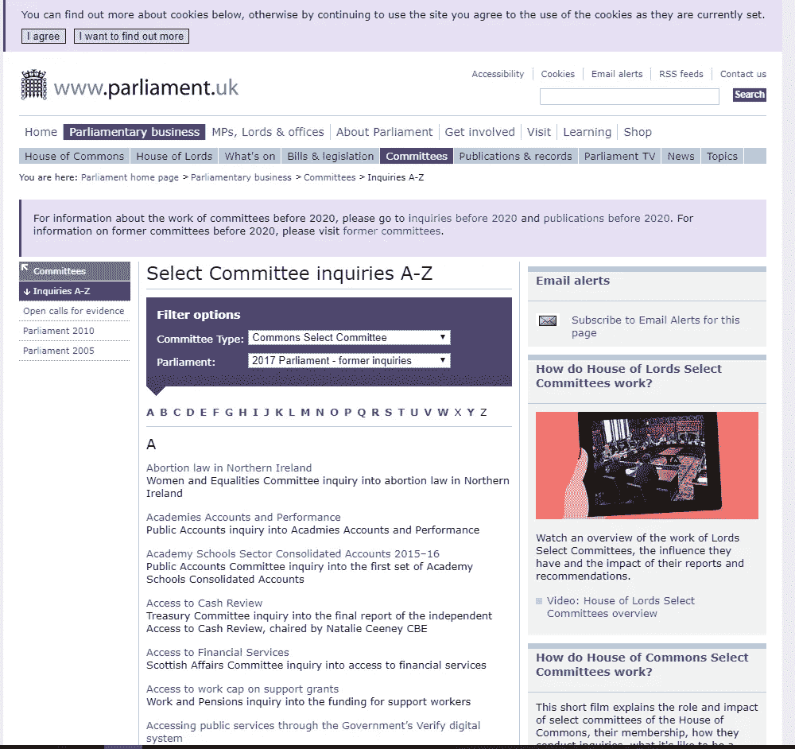
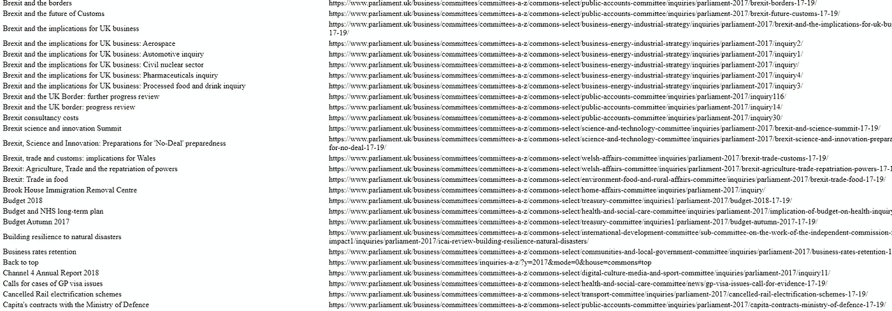

# 使用浏览器控制台快速提取网页中的所有链接

> 原文：<https://towardsdatascience.com/quickly-extract-all-links-from-a-web-page-using-javascript-and-the-browser-console-49bb6f48127b?source=collection_archive---------0----------------------->

## 使用几行 JavaScript 提取网页上的所有超链接，不需要编码环境



使用控制台从网页中提取链接

从网站和文档中提取和清理数据是我的工作，我非常喜欢学习如何使用 Python 和 r 从多个网页甚至多个网站中系统地提取数据。但有时一个项目只需要少量数据，仅来自网站上的一个页面。

以前，当出现这种情况时，我仍然会启动 Python IDE 或 RStudio，编写并执行一个脚本来提取这些信息。这是用大锤砸坚果。常规的旧 JavaScript 足够强大，可以从单个网页中提取信息，并且有问题的 JavaScript 可以在浏览器的开发人员控制台中运行。

在这个例子中，我从一个网页中提取所有链接，因为这是我经常在网页上执行的任务。然而，这段代码同样适用于提取 HTML 文档中的任何其他文本元素类型，只需做一些小的修改。当这段代码运行时，它会在浏览器中打开一个新的选项卡，并输出一个包含每个超链接的文本和链接本身的表格，因此每个链接所指向的内容有一些上下文。

## **你将需要这个项目:**

*   几乎所有过去 10 年生产的浏览器。
*   我将在页面的下方提供一些代码。
*   就是这样！

## 代码及其工作原理

打开你的浏览器(是的，如果你不怕惩罚的话，这在 Internet Explorer 中也能工作)并导航到你想要提取链接的页面。



2017 年议会的特别委员会质询

我用 2017 年议会页面的[特别委员会询问列表作为例子——这是一个有大量链接的页面，作为一个分组，可能对很多人都有用。](https://www.parliament.uk/business/committees/inquiries-a-z/?y=2017&mode=0&house=commons)

现在我们只需要打开开发人员控制台并运行代码。要打开开发人员控制台，您可以按 F12 或者右键单击页面并选择“检查”或“检查元素”，这取决于您选择的浏览器。这将打开控制台，您可以在其中键入或复制并粘贴代码片段。

这是您需要放入控制台的代码片段:

```
var x = document.querySelectorAll("a");
var myarray = []
for (var i=0; i<x.length; i++){
var nametext = x[i].textContent;
var cleantext = nametext.replace(/\s+/g, ' ').trim();
var cleanlink = x[i].href;
myarray.push([cleantext,cleanlink]);
};
function make_table() {
    var table = '<table><thead><th>Name</th><th>Links</th></thead><tbody>';
   for (var i=0; i<myarray.length; i++) {
            table += '<tr><td>'+ myarray[i][0] + '</td><td>'+myarray[i][1]+'</td></tr>';
    };

    var w = window.open("");
w.document.write(table); 
}
make_table()
```

然后只需按下回车键(或 IE 中的运行按钮。但是说真的，你为什么用 IE？！).这将在您的浏览器中打开一个新的选项卡，其中包含您选择的网页中的所有链接文本和超链接。



代码运行后表格的显示方式。

然后，可以将该表复制并粘贴到电子表格或文档中，以便您随意使用。

## 代码在做什么？

下面是代码的分解和每个方面的作用。

```
var x = document.querySelectorAll("a");
var myarray = []
```

在这里，我们找到页面上的所有“a”元素(a 元素是链接),并将它们赋给变量 x。

```
for (var i=0; i<x.length; i++){
var nametext = x[i].textContent;
var cleantext = nametext.replace(/\s+/g, ' ').trim();
var cleanlink = x[i].href;
myarray.push([cleantext,cleanlink]);
};
```

然后我们遍历 x 中的所有“a”元素，对于每个元素，我们试图找到元素和链接的文本内容。

对于文本内容，我们用单个空格替换空白并修剪文本，因为可能有大量空白会使我们的表格不可读。

```
function make_table() {
    var table = '<table><thead><th>Name</th><th>Links</th></thead><tbody>';
   for (var i=0; i<myarray.length; i++) {
            table += '<tr><td>'+ myarray[i][0] + '</td><td>'+myarray[i][1]+'</td></tr>';
    };

    var w = window.open("");
w.document.write(table); 
}
make_table()
```

然后，我们使用函数“make_table()”制作表格。这将创建一个变量 table，它以 HTML 表格和表格标题开始。然后，我们使用 for 循环来添加包含链接文本和超链接的表格行。

然后，我们使用“window.open()”打开一个新窗口，并使用“document.write()”将 HTML 表写入该窗口。

## 但是……？

当前的代码有一个缺点——它需要一个页面上的所有链接。这意味着菜单中的所有链接，任何带你到当前页面不同点的跳转链接，联系人，条款和条件，页面底部的网站地图链接等等…

您可以更具体地在网页的某个区域中查找所有“a”元素。对于上面的委员会查询页面，我们只需更改第一行代码，让查询选择器查看页面的特定区域——可能只是页面中央的 a-z 列表。

为此，右键单击您想要获取链接的页面区域，然后单击“检查”。然后，您应该能够看到该页面元素的名称。在本例中，元素是一个“div ”,带有类“a-to-z-listing”。我们可以简单地更改第一行，在具有“a-to-z-listing”类的元素中查找所有“a”元素:

```
var x = document.querySelectorAll(".a-to-z-listing a");
```

在我的大部分 web 抓取活动中，我仍然会使用 Python 和 R，但是有一种快速简单的方法来从 web 页面中提取信息而不需要打开任何其他应用程序是很有帮助的。

你会用这个代码做什么？有没有更优雅的方法来构造这段代码？请在下面的回复中让我知道。