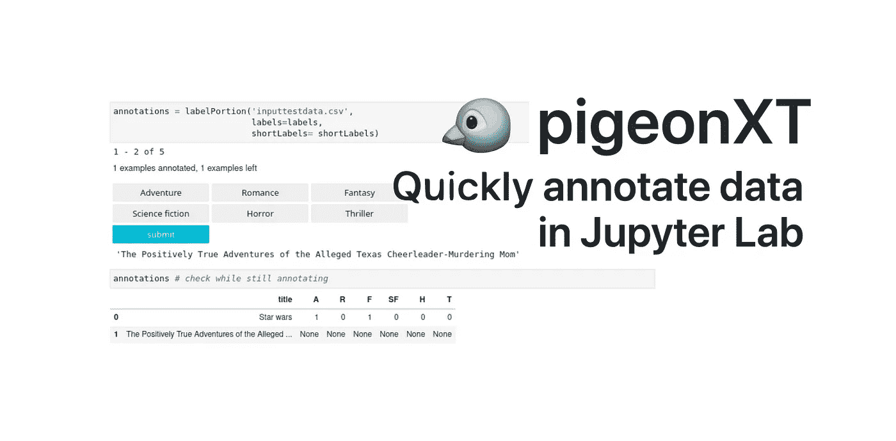
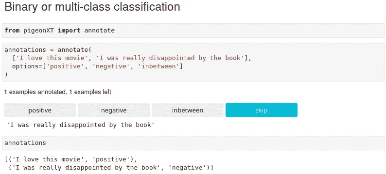
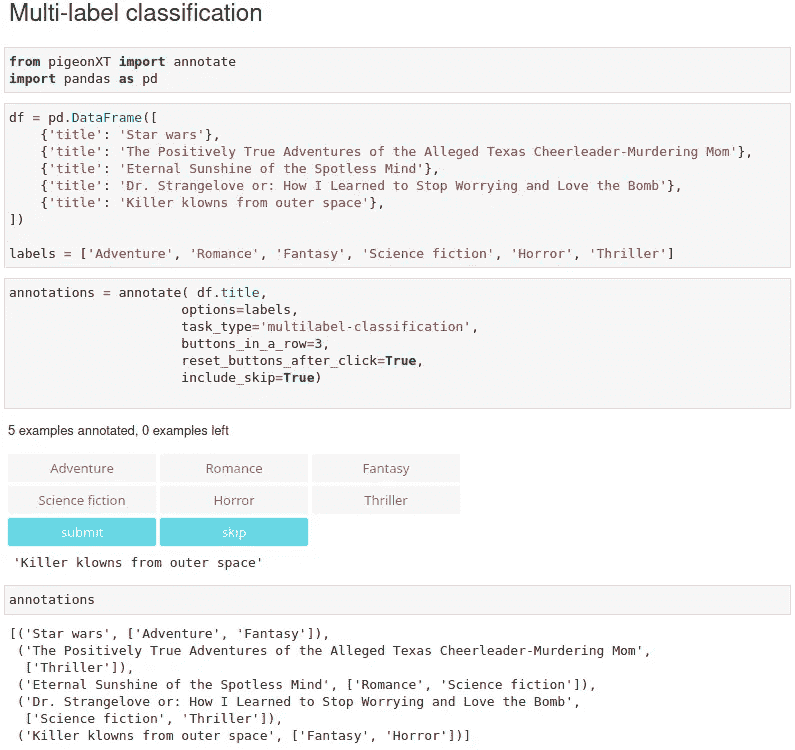
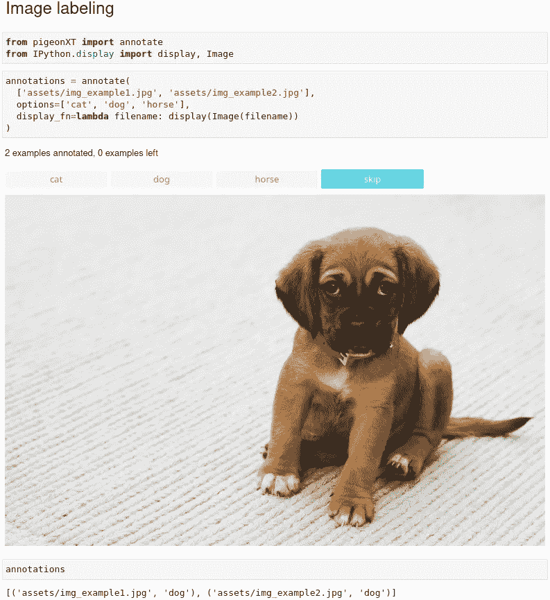
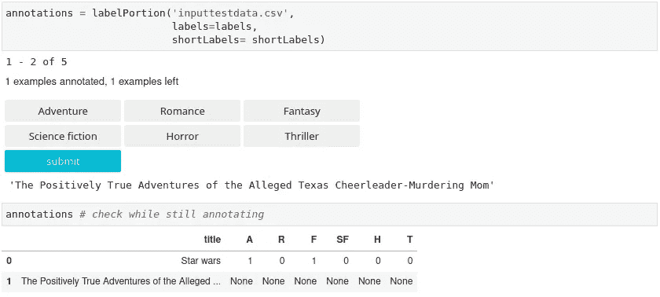

# 在 Jupyter 实验室中快速标记数据

> 原文：<https://towardsdatascience.com/quickly-label-data-in-jupyter-lab-999e7e455e9e?source=collection_archive---------18----------------------->



## 使用 pigeonXT 来标记所有种类的数据

随便问一个人数据科学家是做什么的，他或她可能会回答说数据科学家使用最先进的算法提供数据驱动的解决方案。如果那个随机的人碰巧是(或认识)一个数据科学家，他或她很可能会用这个笑话来回应:80%的时间数据科学家在清理数据，20%的时间数据科学家抱怨不得不清理数据。玩笑归玩笑，数据科学家确实花了很多时间清理和调整数据集，并且通常总是在寻找改进过程。尤其是当一项任务不那么令人兴奋时，比如贴标签。

> 我发现数据标注的过程非常有益(甚至会上瘾)。每次我标记一个例子，我都觉得我的知识、经验和技能被转移到了模型中。“我真的无法理解数据科学家为什么抱怨被要求这么做，”安德里·布尔科夫

对于一个 NLP 项目，我们需要一个工具来将短文本分成一个或多个类别。在短短的五分钟“让我们自己写吧”之后，你很快就会得出结论，Python 社区中可能已经提供了一些东西。事实上，有许多像[标签工作室](https://labelstud.io)或[产品](https://prodi.gy/)这样的解决方案，它们确实是很棒的解决方案，但在我们的品味中太过一般。稍微搜索了一下，我们找到了我们想要的工具:[鸽子](https://github.com/agermanidis/pigeon)由 [Anastasis Germanidis](https://agermanidis.com/) 创造。这非常简单:在 Jupyter 中，你向一个函数输入一个文本列表和一个标签列表，然后弹出一个小部件来遍历每个例子。结果再次以列表形式给出。唯一的缺点是它还不支持多标签。

在 Github 上共享代码最棒的一点是，每个人都可以分享代码并进行修改。不幸的是，Anastasis 没有回复讨论变化和拉请求的电子邮件。因此，我们决定将这些更改发布为 [PigeonXT](https://github.com/dennisbakhuis/pigeonXT) ，Pigeon 的扩展版本。

PigeonXT 目前支持以下注释任务:

*   二元/多类分类
*   多标签分类
*   回归任务
*   字幕任务

任何可以在 Jupyter 上显示的内容(文本、图像、音频、图表等。)可以通过提供适当的`display_fn`参数由 pigeon 显示。

此外，定制挂钩可以附加到每个行更新(`example_process_fn`)，或者当注释任务完成时(`final_process_fn`)。

# 装置

与最初的 Pigeon 一样，扩展的 PigeonXT 被上传到 [Python 包索引](https://pypi.org/project/pigeonXT-jupyter/)，并且可以使用 pip 进行安装。在这篇 blob 帖子中，我们给出了几个例子。要运行这些，我建议首先创建一个新的环境。我们正在使用 Miniconda 管理环境，完整的程序在这里[描述](https://github.com/dennisbakhuis/Tutorials/tree/master/Python_Conda_Pip_Environments)。要创建新环境并安装要求，请在 shell 中键入以下内容:

```
conda create --name pigeon python=3.7
conda activate pigeon
conda install nodejs
pip install numpy pandas jupyterlab ipywidgets
jupyter nbextension enable --py widgetsnbextension
jupyter labextension install [@jupyter](http://twitter.com/jupyter)-widgets/jupyterlab-manager**pip install pigeonXT-jupyter**
```

要启动 Jupyter Lab，只需在同一个 shell 中键入以下内容:

```
jupyter lab
```

# 例子

所有的例子也可以在[我的 Github 页面](https://github.com/dennisbakhuis/pigeonXT)的笔记本中找到。

## 二元或多类文本分类

多类分类或二元分类(如果只提供两个标签)非常简单:



## 多标签文本分类

将多个类标注到同一个示例中称为多标签标注，这与前面的示例几乎相同:



## 图像分类

可以与 Jupyter 交互的任何类型的结构(图像、音频、电影)的分类也可以同样容易地进行标记:



## 带有自定义挂钩的多标签文本分类

虽然自定义挂钩可能会再次增加复杂性，但这里有一个用例示例。当有一个包含 1000 个例子的数据框架要标记时，一次做的事情可能太多了。不仅是身体上的时间，也是为了防止无聊到发疯。在这里，您可以编写一个包装器来包装注释函数，以选择一部分并将该部分保存到磁盘。下一次，它检查输出，并在您停止的地方继续。这部分写在包装器和 final_processing 函数中。

作为一个基于行的钩子函数的例子，我们将标签改为它们的数字等价物，并用每一行更新数据帧。现在，您可以看到数据框中充满了每个步骤。



# 围捕

标注数据有许多有用的工具。我发现的大多数工具都非常完整，但也相对复杂。我们正在寻找一个简单的工具，可以直接从 Jupyter 使用。Pigeon 已经是一个很好的工具了，但是我们需要增加一些功能来满足我们的需求。我们也享受了创建/更改新的 Python 包并与社区共享的小小努力。如果您有任何问题或只是觉得有用，请告诉我。