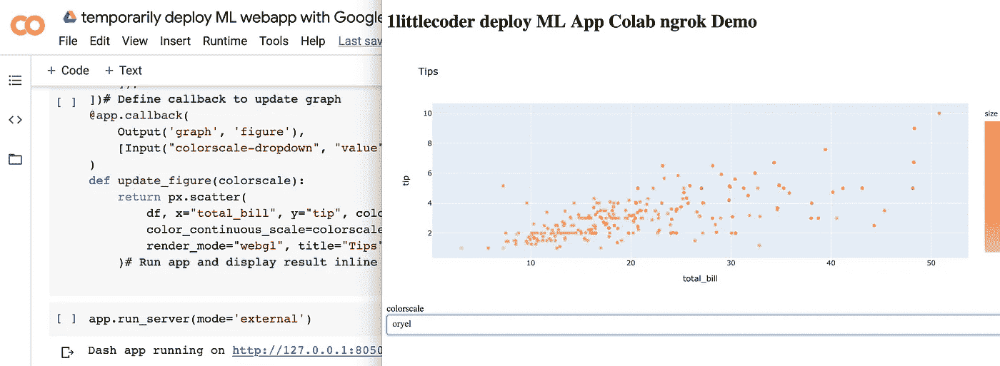

# 免费使用 ngrok 从 Google Colab 快速共享 ML WebApps

> 原文：<https://towardsdatascience.com/quickly-share-ml-webapps-from-google-colab-using-ngrok-for-free-ae899ca2661a?source=collection_archive---------14----------------------->



互联网上有一个笑话，讲的是大多数机器学习模型最终如何出现在 Powerpoint 演示文稿中。如果你是一名数据科学家，你可能无法否认这个事实。但是事情已经开始改变，特别是像 Voila，Streamlit，Dash by Plotly 这样的解决方案。这些是 ML 和数据科学社区内利基的一部分，使数据科学家和机器学习工程师——他们不是 Web 开发人员——能够开发和部署机器学习应用程序(作为 Web 应用程序——如 SaaS)。

# [78%的数据营折扣](https://datacamp.pxf.io/c/2888696/1240322/13294?u=https%3A%2F%2Fpromo.datacamp.com)


## ML Web 应用程序

他们的主要观点是，你可以简单地用你熟悉的 Python 语法编写 web 应用程序(这意味着，不需要`javascript`)。随着这种 ML Web 应用程序开发的开始，许多数据科学家仍然习惯并喜欢在 Jupyter 笔记本上编写代码，而不像 Web 开发人员/软件工程师那样更喜欢像 VSCode 或 Sublime Text 这样的成熟 IDE。使用 Google Colab 开发这种机器学习 Web 应用原型的爱好者也是如此——要么作为爱好项目，要么作为潜在工作机会的任务。具有讽刺意味的是，大多数时候，这些东西是以 Jupyter 笔记本或截图的形式分享的，或者有人不得不费力地将它们部署在`pythonanywhere`或`Heroku`

## ngrok

如果你处于这种情况，这种方法将会非常方便，因为你可以使用公共 URL 与世界上的任何人(暂时)共享你的 ML Web 应用程序。这个黑客使用了一个非常流行的安全隧道解决方案`ngrok`你可以在这里阅读更多关于 ngrok 是什么和它做什么的信息。

基本上，ngrok 获取你的`localhost`上的可用/托管的东西，并通过一个临时的公共 URL 将其公开到互联网上(注意:你可以通过他们的付费服务获得一个永久的 ngrok URL)。所有这一切都以安全的方式进行。为了进一步进行这项工作，你需要一个 ngrok(免费也可以)账户和你的仪表板上的`authtoken`账户。

## 视频教程—[https://www.youtube.com/watch?v=AkEnjJ5yWV0](https://www.youtube.com/watch?v=AkEnjJ5yWV0)

## 如何在 Google Colab 上做到这一点？

虽然很有可能在 Google Colab 上安装`ngrok`然后继续前进，但我选择了一条最短的路径，使用一个名为`pyngrok`的 Python 包装器，它为我们做了很多基本的设置，还让我们可以在命令行/shell 中访问`ngrok`。这意味着你可以通过`!ngrok`在 Google Colab cell 上使用`ngrok`命令(就像你如何访问系统命令一样)

平洛克—[https://github.com/alexdlaird/pyngrok](https://github.com/alexdlaird/pyngrok)

*   在您的 Google Colab 会话上安装 pyngrok python 包

```
!pip install pyngrok
```

*   设置您的 ngrok Authtoken

```
!ngrok authtoken xxxxxxxxxxxxx
```

## 我们的示例 Web 应用程序

对于这个用例，让我们考虑一个使用`jupyterdash`构建的示例 web 应用程序

```
!pip install jupyter-dashimport plotly.express as px
from jupyter_dash import JupyterDash
import dash_core_components as dcc
import dash_html_components as html
from dash.dependencies import Input, Output# Load Datadf = px.data.tips()# Build App
app = JupyterDash(__name__)
app.layout = html.Div([
    html.H1("1littlecoder deploy ML App Colab ngrok Demo"),
    dcc.Graph(id='graph'),
    html.Label([
        "colorscale",
        dcc.Dropdown(
            id='colorscale-dropdown', clearable=False,
            value='plasma', options=[
                {'label': c, 'value': c}
                for c in px.colors.named_colorscales()
            ])
    ]),
])# Define callback to update graph
@app.callback(
    Output('graph', 'figure'),
    [Input("colorscale-dropdown", "value")]
)
def update_figure(colorscale):
    return px.scatter(
        df, x="total_bill", y="tip", color="size",
        color_continuous_scale=colorscale,
        render_mode="webgl", title="Tips"
    )# Run app and display result inline in the notebook
```

*   运行 web 应用程序(在`external`模式下，我们可以获得本地主机端口的详细信息)

```
app.run_server(mode='external')
```

*   在我的例子中，web 应用程序运行在本地主机端口 8050 上
*   从 Python 调用 ngrok 并开始隧道/连接

```
from pyngrok import ngrok# Open a HTTP tunnel on the default port 80
public_url = ngrok.connect(port = '8050')
```

*   打印`public_url`(对象)以获取 web 应用程序正在隧道化的实际公共 URL

```
public_url
```

*   瞧啊。您的 Web 应用程序现在可以在互联网上使用——运行在 Google Colab 上，并在 ngrok 的帮助下显示 URL！
*   是时候与您的朋友/同事或在社交媒体上分享您的 URL，并获得对您的 ML Web 应用程序的反馈了！

## 结束了

本教程的目标是帮助机器学习工程师和数据科学家与世界分享他们的 Web 应用程序开发(暂时)，而没有太多麻烦——实际上，只需要几行 Python 代码和最小的依赖性。请注意，这不是一个生产解决方案，在这种情况下，您可能想知道比简单的隧道更多的东西。但是，嘿，这是开始 ML Web 应用程序开发和分享之旅的良好开端！ ***让我知道你的想法！***

**参考文献**

*   这里用的 Jupyter 笔记本—[https://github . com/amrrs/YouTube-r-snippets/blob/master/temporary _ deploy _ ML _ web app _ with _ Google _ Colab _ and _ ngrok . ipynb](https://github.com/amrrs/youtube-r-snippets/blob/master/temporarily_deploy_ML_webapp_with_Google_Colab_and_ngrok.ipynb)
*   平罗克—[https://github.com/alexdlaird/pyngrok](https://github.com/alexdlaird/pyngrok)
*   恩罗克——https://ngrok.com/