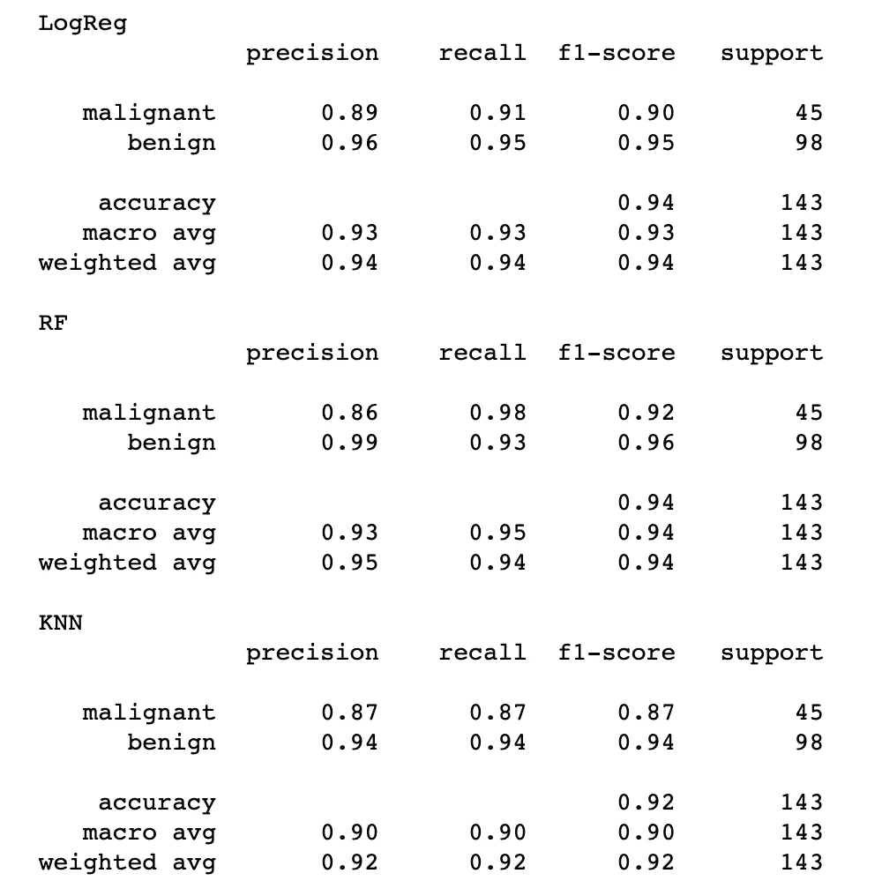
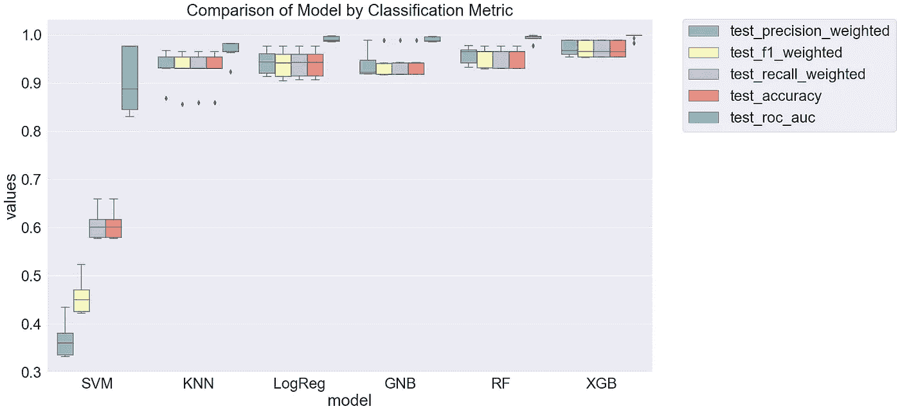
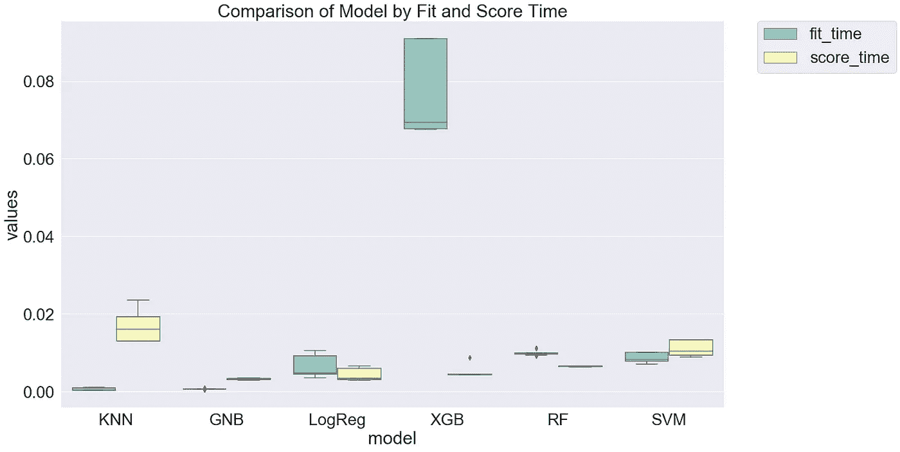
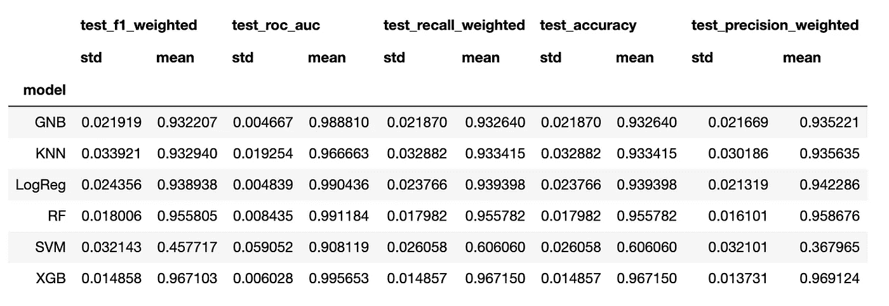
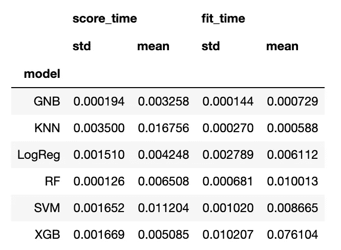

# 快速比较多个模型

> 原文：<https://towardsdatascience.com/quickly-test-multiple-models-a98477476f0?source=collection_archive---------5----------------------->

## 如何高效地训练和评估多个模型

# 介绍

所有数据科学家在从事任何机器学习项目时都必须面对的一个问题是…

> 哪种模型架构最适合我的数据？

有几个理论问题需要考虑。例如，如果您的要素显示出与因变量(目标)的强线性关系，那么线性模型可能最适用。如果关系是非线性的，那么 SVM 或基于实例的分类器(如 K-最近邻)可能是最好的。如果可解释性是至关重要的，基于树的模型可能是正确的选择。此外，还有几个[你应该考虑的实际问题](/do-you-know-how-to-choose-the-right-machine-learning-algorithm-among-7-different-types-295d0b0c7f60)。

出于本文的目的，我将假设您已经知道您是否正在处理一个[监督的](/a-brief-introduction-to-supervised-learning-54a3e3932590)与[非监督的](/unsupervised-learning-and-data-clustering-eeecb78b422a)问题，以及您是否需要[分类](/machine-learning-classifiers-a5cc4e1b0623)或[回归](/introduction-to-machine-learning-algorithms-linear-regression-14c4e325882a)。

不幸的是，对于哪种模式是最好的这个问题，没有明确的答案。当面对不确定性时，我心中的科学家总是诉诸人类最严谨、最可靠的知识发现方法:*实验！*

在本文中，我将向您展示如何在您的数据集上快速测试多个模型，以找到哪些模型可能提供最佳性能，从而使您能够专注于微调和优化您的模型。

# 数据准备

在我们开始任何实验之前，我们需要一个数据集。我将假设我们的问题是一个**监督二进制分类**任务。让我们从 [sklearn](https://scikit-learn.org/stable/) 载入乳腺癌数据集开始吧。

```
from sklearn.datasets import load_breast_cancer
X, y = data = load_breast_cancer(return_X_y=True)
```

接下来，我们需要将数据分成训练集和测试集。我选择了 75/25 的比例。

```
from sklearn.model_selection import train_test_splitX_train, X_test, y_train, y_test = train_test_split(X, y, test_size=0.25, random_state=8675309)
```

我们现在准备运行一些实验！

# 进行实验

我们将快速测试 6 个不同模型对该数据集的拟合度。我选择了测试:

1.  逻辑回归:基本线性分类器(好到基线)
2.  随机森林:集合装袋分类器
3.  k 近邻:基于实例的分类器
4.  支持向量机:最大间隔分类器
5.  高斯朴素贝叶斯:概率分类器
6.  XGBoost:合奏(极限！)提升分类器

为了运行初始实验，我使用了每个模型的默认参数。为了更准确地表示每个模型的拟合程度，需要调整默认参数；然而，出于本文的目的，不调整每个模型会使总体思路更加清晰。

```
from sklearn.linear_model import LogisticRegression
from sklearn.neighbors import KNeighborsClassifier
from sklearn.svm import SVC
from sklearn.ensemble import RandomForestClassifier
from sklearn.naive_bayes import GaussianNB
from xgboost import XGBClassifier
from sklearn import model_selection
from sklearn.utils import class_weight
from sklearn.metrics import classification_report
from sklearn.metrics import confusion_matrix
import numpy as np
import pandas as pddef run_exps(X_train: pd.DataFrame , y_train: pd.DataFrame, X_test: pd.DataFrame, y_test: pd.DataFrame) -> pd.DataFrame:
    '''
    Lightweight script to test many models and find winners:param X_train: training split
    :param y_train: training target vector
    :param X_test: test split
    :param y_test: test target vector
    :return: DataFrame of predictions
    '''

    dfs = []models = [
          ('LogReg', LogisticRegression()), 
          ('RF', RandomForestClassifier()),
          ('KNN', KNeighborsClassifier()),
          ('SVM', SVC()), 
          ('GNB', GaussianNB()),
          ('XGB', XGBClassifier())
        ]results = []
    names = []
    scoring = ['accuracy', 'precision_weighted', 'recall_weighted', 'f1_weighted', 'roc_auc']
    target_names = ['malignant', 'benign']for name, model in models:
        kfold = model_selection.KFold(n_splits=5, shuffle=True, random_state=90210)
        cv_results = model_selection.cross_validate(model, X_train, y_train, cv=kfold, scoring=scoring)
        clf = model.fit(X_train, y_train)
        y_pred = clf.predict(X_test)
        print(name)
        print(classification_report(y_test, y_pred, target_names=target_names))results.append(cv_results)
        names.append(name)this_df = pd.DataFrame(cv_results)
        this_df['model'] = name
        dfs.append(this_df)final = pd.concat(dfs, ignore_index=True)return final
```

这个脚本中有很多东西需要解开。首先，我们创建一个变量`dfs`来保存所有数据集，这些数据集将通过对训练集应用 5 重交叉验证来创建。

接下来，`models`在一个元组列表中，保存每个要测试的分类器的名称和类。在这之后，我们循环遍历这个列表并运行 5 重交叉验证。每次运行的结果都记录在熊猫数据帧中，我们将其添加到`dfs`列表中。必须注意，这里记录的指标是两个类别的*加权平均值*指标。**这对于任何不平衡的数据集都不适用**，因为多数类的性能会盖过少数类。您可能希望调整下面的脚本，只记录感兴趣的类的指标！

为了进一步帮助评估，测试集上的分类报告被打印到屏幕上。最后，我们连接并返回所有结果。



脚本的示例输出

# 评估结果

为了总结我们的分析，我们将分析从`run_exps()`脚本返回的`final`数据帧中的数据。

为了从每个模型中获得更好的度量分布估计，我在 30 个样本上运行了经验自举。此外，我将数据分为两类:性能指标和适合时间指标。下面的代码块实现了这一点。

```
bootstraps = []
for model in list(set(final.model.values)):
    model_df = final.loc[final.model == model]
    bootstrap = model_df.sample(n=30, replace=True)
    bootstraps.append(bootstrap)

bootstrap_df = pd.concat(bootstraps, ignore_index=True)
results_long = pd.melt(bootstrap_df,id_vars=['model'],var_name='metrics', value_name='values')time_metrics = ['fit_time','score_time'] # fit time metrics## PERFORMANCE METRICS
results_long_nofit = results_long.loc[~results_long['metrics'].isin(time_metrics)] # get df without fit data
results_long_nofit = results_long_nofit.sort_values(by='values')## TIME METRICS
results_long_fit = results_long.loc[results_long['metrics'].isin(time_metrics)] # df with fit data
results_long_fit = results_long_fit.sort_values(by='values')
```

我们现在有一些可靠的数据来绘制和分析。首先，让我们从五重交叉验证中绘制我们的性能指标。

```
import matplotlib.pyplot as plt
import seaborn as sns
plt.figure(figsize=(20, 12))
sns.set(font_scale=2.5)
g = sns.boxplot(x="model", y="values", hue="metrics", data=results_long_nofit, palette="Set3")
plt.legend(bbox_to_anchor=(1.05, 1), loc=2, borderaxespad=0.)
plt.title('Comparison of Model by Classification Metric')
plt.savefig('./benchmark_models_performance.png',dpi=300)
```



按模型和指标的箱线图

很明显，支持向量机在所有指标上对我们的数据拟合得很差，而集合决策树模型(Random Forest 和 XGBoost)对数据拟合得很好。

训练和得分时间怎么样？

```
plt.figure(figsize=(20, 12))
sns.set(font_scale=2.5)
g = sns.boxplot(x="model", y="values", hue="metrics", data=results_long_fit, palette="Set3")
plt.legend(bbox_to_anchor=(1.05, 1), loc=2, borderaxespad=0.)
plt.title('Comparison of Model by Fit and Score Time')
plt.savefig('./benchmark_models_time.png',dpi=300)
```



按型号划分的培训和评分时间

哇，SVM 就是不能休息一下！表现最差的车型*和*训练/评分慢！

有趣的是，XGBoost 无疑是训练最慢的；然而，这是最好的表现。我们通常会在性能和训练时间方面进行权衡。考虑需要大量数据和时间来训练的神经网络，但是一般来说*表现得非常好。*

RandomForest 和 GNB 的 KNN 相比速度相对较慢，而 LogReg 的表现排名第二。如果我继续改进模型，我可能会把大部分精力放在 RandomForest 上，因为它的表现几乎与 XGBoost ( *)相同，它们的 95%置信区间可能会重叠！*)但是训练速度快了差不多 4 倍！

如果您希望对这些模型进行更多分析(例如，计算每个指标的置信区间)，您将需要访问每个指标的均值和标准差。你可以在这里找到这些信息。

```
metrics = list(set(results_long_nofit.metrics.values))
bootstrap_df.groupby(['model'])[metrics].agg([np.std, np.mean])
```



每个指标的平均值和标准差

```
time_metrics = list(set(results_long_fit.metrics.values))
bootstrap_df.groupby(['model'])[time_metrics].agg([np.std, np.mean])
```



时间的平均值和标准差

# 结论

现在，您已经有了工具，可以在您的数据上快速测试许多不同的模型，并查看哪些架构可能最适合您。

> 这种比较并不详尽，这一点我怎么强调也不为过！

以上分析只考虑了*意味着*精度、召回率等。在你的实际问题中，你不太可能关心所有类的平均精度，相反，你可能特别关注一个类的精度！此外，必须调整每个模型的超参数，以真正评估它们与数据的拟合程度。

# 参考

[python 中用于统计计算的数据结构](https://conference.scipy.org/proceedings/scipy2010/pdfs/mckinney.pdf)，McKinney，第 9 届科学中的 Python 会议录，第 445 卷，2010 年。

```
@software{reback2020pandas,
    author       = {The pandas development team},
    title        = {pandas-dev/pandas: Pandas},
    month        = feb,
    year         = 2020,
    publisher    = {Zenodo},
    version      = {latest},
    doi          = {10.5281/zenodo.3509134},
    url          = {https://doi.org/10.5281/zenodo.3509134}
}
```

Harris，C.R .，Millman，K.J .，van der Walt，S.J .等人*用 NumPy 进行数组编程*。自然 585，357–362(2020)。DOI:[10.1038/s 41586–020–2649–2](https://doi.org/10.1038/s41586-020-2649-2)。

[sci kit-learn:Python 中的机器学习](http://jmlr.csail.mit.edu/papers/v12/pedregosa11a.html)，Pedregosa *等人*，JMLR 12，第 2825–2830 页，2011 年。

[J. D. Hunter，“Matplotlib:2D 图形环境”，科学计算&工程，第 9 卷，第 3 期，第 90–95 页，2007 年](https://doi.org/10.1109/MCSE.2007.55)。

瓦斯科姆，法学硕士，(2021 年)。seaborn:统计数据可视化。《开源软件杂志》，6 卷(60 期)，3021 页，[https://doi.org/10.21105/joss.03021](https://doi.org/10.21105/joss.03021)

陈，t .，& Guestrin，C. (2016)。XGBoost:一个可扩展的树提升系统。第 22 届 ACM SIGKDD 知识发现和数据挖掘国际会议论文集(第 785–794 页)。美国纽约州纽约市:ACM。[https://doi.org/10.1145/2939672.2939785](https://doi.org/10.1145/2939672.2939785)