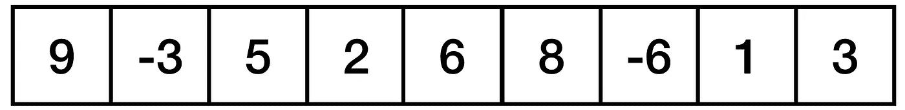
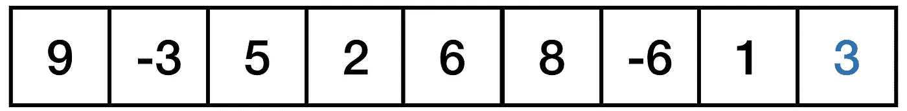
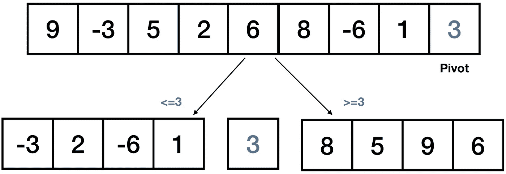
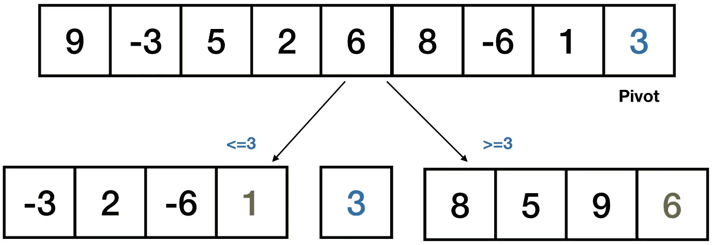
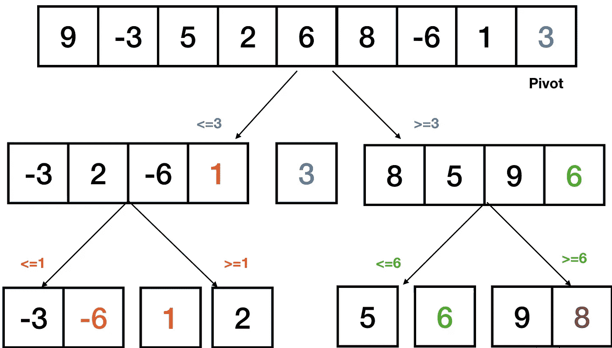
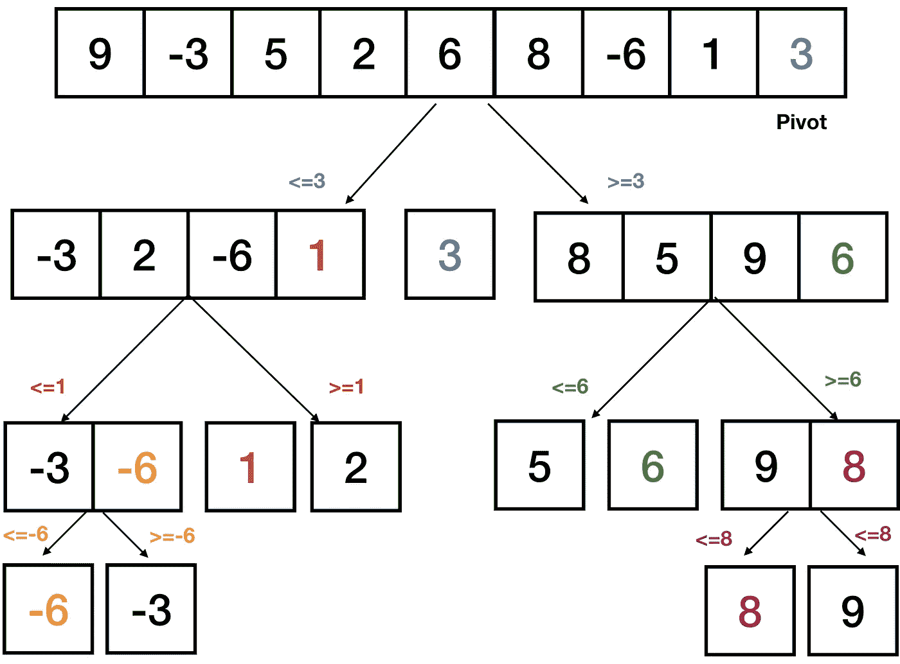
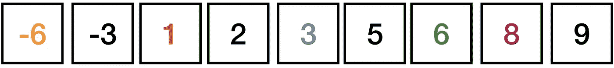
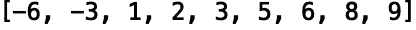

# Python 中的快速排序

> 原文：<https://towardsdatascience.com/quicksort-in-python-dbefa7dcf9cc?source=collection_archive---------8----------------------->

## Python 中“快速排序”的介绍


[来源](https://www.pexels.com/photo/time-lapse-photography-of-brown-concrete-building-842654/)

排序算法是计算机科学中最重要的算法之一。排序涉及对列表或数组中的元素进行排序的任务。排序最常见的用法是数字排序和字典排序。在这篇文章中，我们将讨论如何在 python 中实现一个“快速排序”算法，我们将使用它对列表进行数字排序。

我们开始吧！

“快速排序”算法的基本过程是划分。分区的工作方式是首先选择一个枢轴。枢轴选项包括:

1.  第一元素
2.  最后一个元素
3.  随机元素
4.  中间分子

在选择枢轴后，我们根据枢轴值划分数组的元素。也就是说，对于一个输入数组和 pivot，我们将所有小于 pivot 的元素放在 pivot 之前，将所有大于 pivot 的元素放在 pivot 之后。为了看到这一点，让我们考虑下面的列表:



让我们选择最后一个元素“3”作为我们的轴心:



接下来，我们创建两个子列表，左边的列表包含小于主元的值，右边的子列表包含大于子列表的值:



然后，我们找到子列表的中枢，并重复划分过程。左侧子列表的枢轴是 1，右侧子列表的枢轴是 6:



接下来，我们围绕它们的支点划分子列表:


最后，让我们为最后一组子列表选择枢轴，左边 6 个，右边 8 个:



让我们完成最后一个分区:



我们最终得到了下面的排序列表:



让我们看看如何用 python 实现这个算法。首先，让我们定义我们的配分函数。我们的函数将接受一个列表，一个“低”变量和一个“高”变量。“低”是较小元素的索引(我们将在列表中从这里开始)，而“高”是透视的索引，这将是最后一个元素。我们将最小元素的索引初始化为“低”-1，并将轴心定义为最后一个元素的值:

```
def partition(list,low,high):
    i = (low - 1)
    pivot = array[high]
```

接下来，我们将编写一个从“低”到“高”迭代的“for-loop”:

```
def partition(list,low,high):
    i = (low - 1)
    pivot = array[high]
    for j in range(low, high):
```

接下来，我们检查“for-loop”中当前索引处的值是否小于或等于 pivot。如果当前值小于轴心值，我们将递增较小元素的索引:

```
def partition(input_list,low,high):
    i = (low - 1)
    pivot = input_list[high]
    for j in range(low, high):
        if input_list[j] <= pivot:
            i = i + 1
            input_list[i], input_list[j] =  input_list[j], input_list[i]
```

否则，如果当前值大于中枢，我们将较大的值与中枢交换。我们还返回索引:

```
def partition(input_list,low,high):
    i = (low - 1)
    pivot = input_list[high]
    for j in range(low, high):
        if input_list[j] <= pivot:
            i = i + 1
            input_list[i], input_list[j] =  input_list[j], input_list[i]
    input_list[i+1],input_list[high] = input_list[high],input_list[i+1]
    return (i+1)
```

接下来，让我们定义我们的“快速排序”函数。我们首先检查“低”的值是否小于“高”，如果条件为真，我们定义分区索引:

```
def quickSort(input_list, low, high):
    if low < high:
        partition_index = partition(input_list,low,high)
```

然后我们递归调用“快速排序”并在分区前对元素进行排序:

```
def quickSort(input_list, low, high):
    if low < high:
        partition_index = partition(input_list,low,high)
        quickSort(input_list, low, partition_index - 1)
```

并对分区后的元素进行排序:

```
def quickSort(input_list, low, high):
    if low < high:
        partition_index = partition(input_list,low,high)
        quickSort(input_list, low, partition_index - 1)
        quickSort(input_list, partition_index + 1, high)
```

我们现在可以测试我们的“快速排序”功能。让我们用我们在最初的例子中使用的列表来测试它:

```
input_l = [9, -3, 5, 2, 6, 8, -6, 1, 3]
```

让我们定义我们的“高”变量，它将是列表的长度:

```
list_length = len(input_l)
```

“低”变量将是 0，因为在 python 中列表是零索引的。现在让我们用我们的列表、我们的“低”值(0)和“list _ length”-1 来调用“快速排序”方法:

```
quickSort(input_l, 0, list_length -1)
```

现在我们的数组应该排序了。让我们打印我们的数组:

```
print(input_l)
```



我们看到我们的函数成功地对列表进行了排序。我就讲到这里，但是我鼓励你自己去研究代码。

# 结论

总之，在这篇文章中，我们讨论了快速排序算法，并展示了如何用 python 实现它。如果你有兴趣学习更多关于排序算法的知识，我鼓励你去探索一下 realpython.com，它涉及到其他排序算法，比如“合并排序”、“插入排序”和“冒泡排序”。我希望你觉得这篇文章有用/有趣。这篇文章的代码可以在 [GitHub](https://github.com/spierre91/medium_code/tree/master/data_structures_and_algorithms) 上找到。感谢您的阅读！