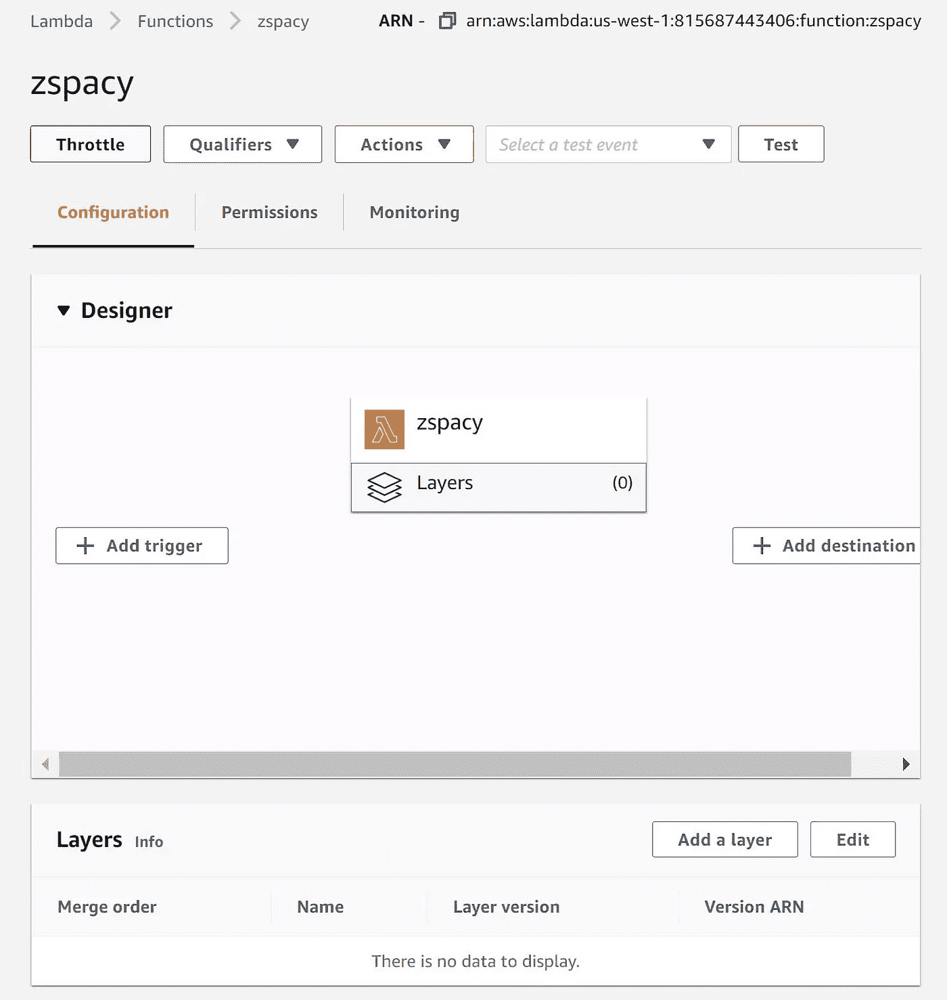
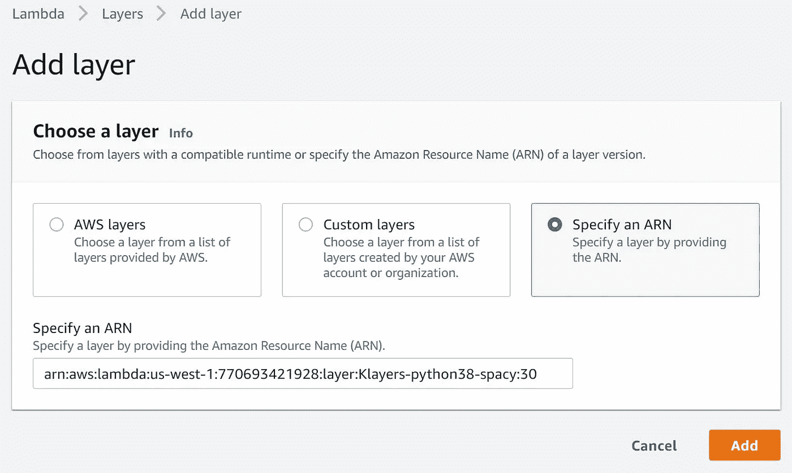
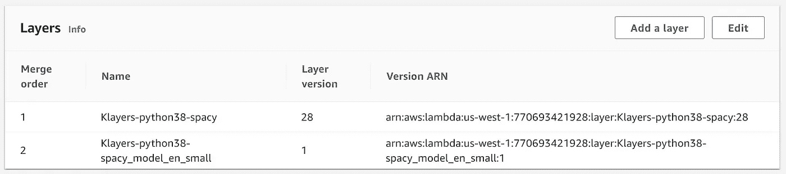
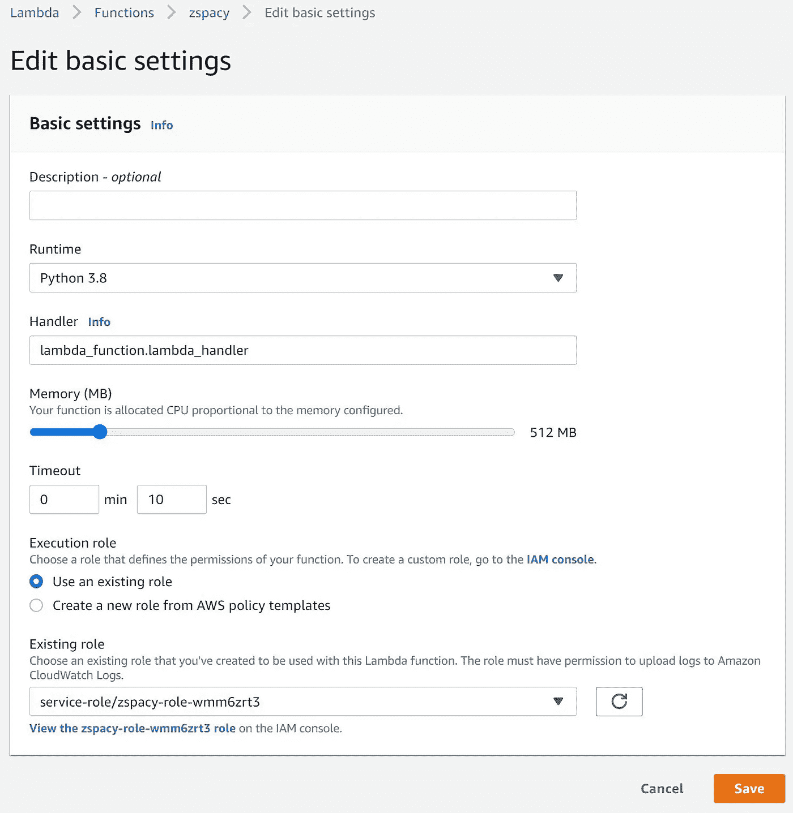
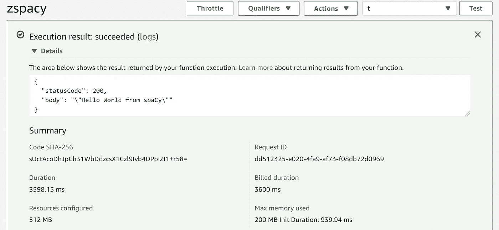
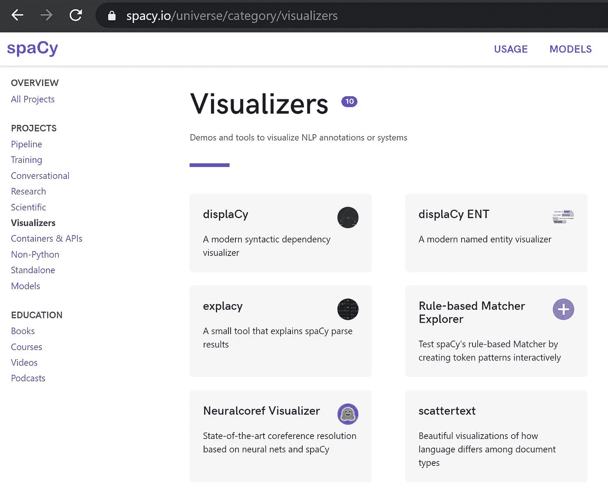

# 快速启动:AWS Lambda 上的空间在 10 分钟内启动并运行

> 原文：<https://towardsdatascience.com/quickstart-spacy-on-aws-lambda-up-and-running-in-10-minutes-e347037a0ef8?source=collection_archive---------27----------------------->

## 使用 spaCy 进行无服务器计算的简单方法


在 [Unsplash](https://unsplash.com/s/photos/osaka?utm_source=unsplash&utm_medium=referral&utm_content=creditCopyText) 上由 [QHUNG TA](https://unsplash.com/@takoyakiboy?utm_source=unsplash&utm_medium=referral&utm_content=creditCopyText) 拍摄的照片

让我们信守承诺，先把事情做好。如果您想进一步阅读，快速入门部分将提供进一步的讨论。我希望这种安排能节省你的时间。

# 快速入门:循序渐进

## I .为空间设置 Lambda 层

*   登录 AWS 帐户。创建新的 Lambda 函数。选择 Python 3.8，并使用默认设置。
*   进入λ*【配置】【设计器】*，点击*图层*。然后点击下方面板上的*【添加图层】*。



图一。AWS Lambda 设计器(截图)|作者图片

*   选择*【指定 ARN】。*使用下面的 ARN 作为空位，然后点击*【添加】*

```
arn:aws:lambda:us-west-1:770693421928:layer:Klayers-python38-spacy:30
```



图二。Lambda ->添加图层(截图)|作者图片

*   重复上述步骤，并添加语言模型层，使用以下 ARN。

```
arn:aws:lambda:us-west-1:770693421928:layer:Klayers-python38-spacy_model_en_small:1
```

*   图层完成后应该是这样的。



图三。空间的 AWS Lambda 图层(截图)|作者图片

## 二。调整和运行 Lambda

*   为 Lambda 中的空间分配更多内存。为内存选择 512 MB，为超时选择 10 秒。



图 4。AWS Lambda 调优(截图)|图片作者

*   将空间导入 Lambda。让我们编写一个 Hello World 函数来测试我们的层是否正常工作。

```
import json
**import spacy**def lambda_handler(event, context):
    **nlp = spacy.load("/opt/en_core_web_sm-2.2.5/en_core_web_sm/en_core_web_sm-2.2.5")**
    doc = nlp("Hello World from spaCy") return {
        'statusCode': 200,
        'body': json.dumps(doc.text)
    }
```

*   结果应该是这样的。您可能会注意到，默认的 128 MB 内存分配是不够的，因为 Hello World 程序使用了 200 MB。



图五。AWS Lambda 执行结果(截图)|图片作者

恭喜你！现在 spaCy 已经可以使用了。如果你已经得到了你所需要的，请随意回到你忙碌的日子。

如果你有时间，我想分享一下我在 NLP(自然语言处理)方面的经验。

# 我为什么选择空间

其实我第一次用 [TextBlob](https://textblob.readthedocs.io/en/dev/) 开始 NLP(自然语言处理)，感觉像是在一个阳光明媚的下午也能学到东西。TextBlob 有一个方便的名词短语提取器，它可以轻松地进行情感分析。我在一个数据可视化项目中使用了 TextBlob，很快就能得到一些结果，这很有趣。

从四月份开始，我开始从事一个计算诗歌项目，它需要对复杂的文学作品进行深入的分析。我发现 TextBlob 不够复杂，无法处理长而复杂的结构。就在那时，我转到了西班牙。

> spaCy 旨在帮助您做真正的工作——构建真正的产品，或收集真正的见解。图书馆尊重你的时间，并尽量避免浪费时间。它易于安装，其 API 简单且高效。我们喜欢把 spaCy 看作是自然语言处理轨道上的 Ruby。— spacy.io

我不确定 Ruby on Rails 的类比是否仍然有意义，但是 spaCy 对我来说工作得很好。看看太空[宇宙](https://spacy.io/universe)，印象相当深刻。



图六。spaCy Universe |图片来自 spaCy.io

# AWS Lambda & spaCy

我的目标是开发一个基于云的应用程序，所以我需要在云上运行 spaCy。Lambda 是 AWS 上最具成本效益的选择，因为它只对请求进入的时间计费。AWS 上的虚拟机将对其所有正常运行时间收费。作为一个强大的软件包，spaCy 非常大，它的默认发行版超过了 Lambda 要求的 250 MB 的限制。

人们已经付出了额外的努力来减小 spaCy 的大小，也有 DIY 说明来将 spaCy 放入 Lambda，但如果你决心要实现它，这需要一些认真的努力。

幸运的是， [Keith Rozario](https://www.keithrozario.com/2019/04/spacy-in-a-lambda-layer.html) 做了一个 ARN 准备用作 AWS 层。这是您在本文的快速入门部分看到的内容。如果你真的用秒表计时，你的结果可能会低于 10 分钟。

干杯！