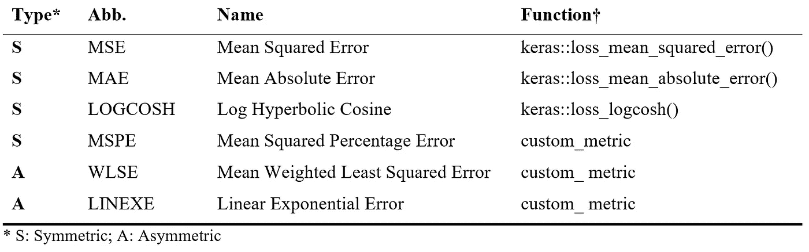
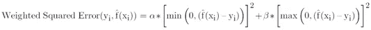
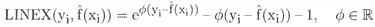
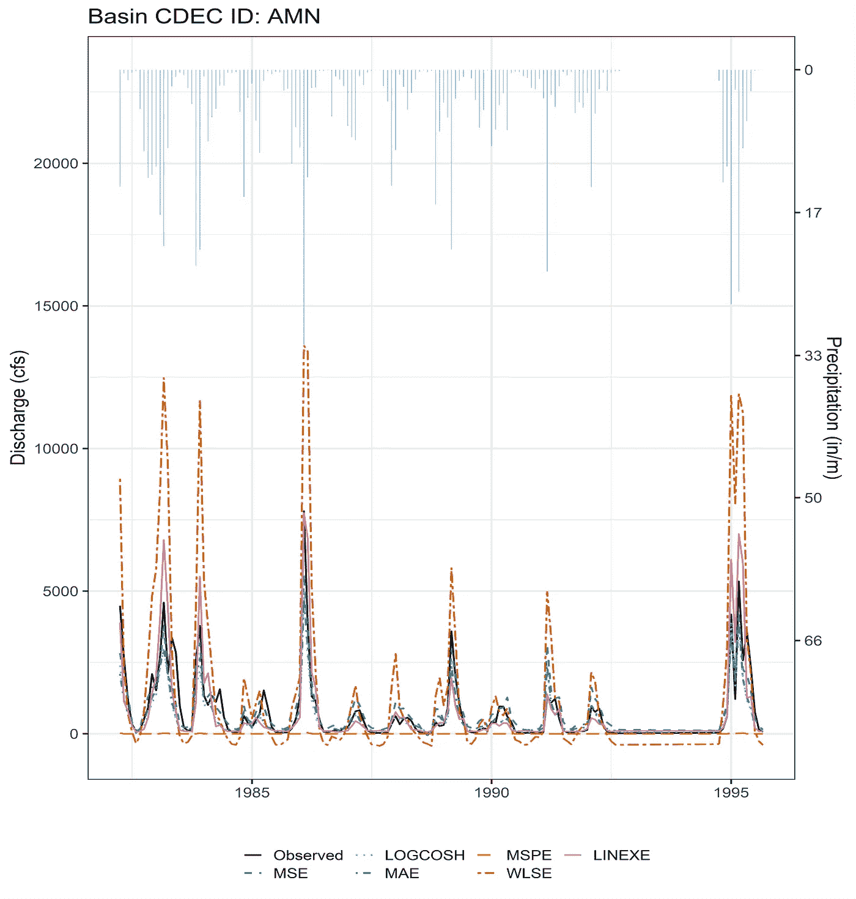

# 古怪的 Keras:R 中 Keras 的定制和非对称损失函数

> 原文：<https://towardsdatascience.com/quirky-keras-custom-and-asymmetric-loss-functions-for-keras-in-r-a8b5271171fe?source=collection_archive---------11----------------------->

## [实践教程](https://towardsdatascience.com/tagged/hands-on-tutorials)

[图片由蒙提洛夫在 [unsplash](https://unsplash.com/@montylov?utm_source=unsplash&utm_medium=referral&utm_content=creditCopyText) 上拍摄]

TL；DR——本教程向您展示如何使用*包装器*函数来构建自定义损失函数，该函数采用除 y_pred 和 y_true 之外的参数用于 r 中的 Keras。请参见线性指数误差(LINEXE)和加权最小二乘误差(WLSE)的示例代码。

# 背景

在统计学习中，损失函数是将非正式的哲学建模目标翻译成正式的数学语言(Hennig & Kutlukaya，2007)。因此，估算中损失函数的选择有些主观，取决于模型的具体应用或使用时的决策。以下是一些需要考虑的损失函数:

# 对称损失

*   **均方误差(MSE)** 是简单最小二乘回归中常见的目标函数，它是一个凸函数，通过平方误差来强调远离大部分数据的点。MSE 对较大误差的惩罚大于较小误差；该函数在尾部比在中部更陡。
*   对于较小的 x，**对数双曲余弦(LOGCOSH)** 或 log(cosh(x))近似为 1/2(x^2，对于较大的 x，【abs(x) — log(2)】。因此，LOGCOSH 的工作方式与 MSE 非常相似，但受偶然的非常不正确的预测的影响较小，在这方面，它类似于**平均绝对误差(MAE)** 。当较大值的估计误差不需要像 MSE 中那样通过平方来惩罚时，LOGCOSH 和 MAE 是有用的。
*   **均方百分比误差(MSPE)** 在相对误差更令人感兴趣的问题中很有用(例如，10/100 的误差比 10/100，000 的误差更令人感兴趣)。然而，MSPE 偏向于较低的预测值，不适合于数据为正偏差的问题(例如，流量总是> =0)。

这是为 MSPE 编写的自定义代码。注意，函数只取 y_true 和 y_pred。

# 不对称损失

当低估和高估相同的绝对误差时，对称函数产生相同的损失。然而，*不对称*损失函数对不同的损失方向应用不同的惩罚。例如，在水文预测中，不对称的损失函数会迫使模型在洪水时高估流量，而在干旱时低估流量，而不是相反。这种方法导致水资源管理者做出更保守的决策，因为模型预测了更多的极端洪水和干旱。

首先，需要一个简单的分类模型将观测值标记为洪水(洪水==1)和干旱(洪水==0)。对于每个流域，整个记录的平均降水量可以指定为一个硬阈值；如果某个月的降雨量低于这个数值，这种现象被称为“干旱”，如果高于这个数值，则被称为“洪水”给定这个名称，现在，不同的损失可以应用于数据中不同位置的预测误差。

# Keras 不对称损失:用包装器向损失函数传递附加参数

让我们从 WLSE(等式 1)开始，其中α和β对于标记为洪水和干旱的观测值具有不同的值。因此，我们将αd、βd、αf 和βf 作为损失函数的输入。

情商。一

现在，快克；Keras 中的损失只能接受两个参数:y_true 和 y_pred，它们分别是目标张量和模型输出张量。然而，如果我们希望损失依赖于其他张量，如α和β向量，我们需要使用函数闭包。这里，wlse loss 函数接受我们想要的任何参数，包装函数返回仅依赖于 y_true 和 y_pred 的函数。

这是与 LINEXE 相同的概念:

LINEXE(等式 2)取决于 phi，对于标记为洪水和干旱的观测值，phi 具有不同的值。因此，我们将 phid 和 phif 作为损失函数的输入。

情商。2

…包装材料:

现在，继续建模。首先，我们定义神经网络模型的架构:

*“trainsetpv”是训练集预测变量。

接下来，我们必须编译并拟合模型。对于对称损耗，我们有:

*“trainsetrv”是训练集响应变量。

…对于对称损耗，我们的工作已经完成！

在不对称损失中，由于我们现在已经标记了观测值(洪水或干旱)，我们需要这种指定来正确地与每个 y_true 和 y_pred 对齐。因此，我们不能再使用在不改变加扰算法以适应标签的情况下对数据进行加扰的迷你批次训练方法。迷你批次的大小由验证分割(例如，0.2)决定，并且仅帮助加速模型训练。为了在没有迷你批次的情况下仍然做出准确的预测，我们可以简单地增加训练时段，并且通过设置 shuffle=FALSE，我们不再有洪水和干旱标签与数据不一致的问题。

现在，预测可以来自:

*“testsetpvs”是测试集预测变量。

# 示例结果

图 1 显示了加利福尼亚州一个河流流域的流量预测，即北福克坝的美国河(White，E. 2020)。我们可以看到 WLSE 和 LINEXE 的不对称损失，预测总是高估洪水而低估干旱！这是我们希望发生的。这样我们可以做出更保守的决定，并为更极端的情况做好准备。

图一。North Fork 大坝美国河流流量的神经网络预测[图片由作者用 ggplot2 制作]。

# 结论

Keras 中的损失只能接受两个参数:y_true 和 y_pred，它们分别是目标张量和模型输出张量。然而，如果我们希望损失依赖于其他张量——如不对称损失的情况——我们需要使用函数闭包。这里，loss 函数接受我们想要的任何参数，并返回仅依赖于 y_true 和 y_pred 的函数。因此，命名为包装器。

一般来说，选择损失函数的灵活性在基于风险的决策中特别有用，在这种情况下，建模的目的是准确预测概率分布，特别是在可能发生高成本后果的尾部。不对称损失函数在这方面证明是有用的。

## 参考资料:

C.关于损失函数设计的一些想法(2007)。REVSTAT–统计杂志，5 (1)，19–39。

E.White，[无资料流域未受损流量预测的统计学习](https://watershed.ucdavis.edu/shed/lund/students/Ellie_White_dissertation2020.pdf) (2020)。博士论文。