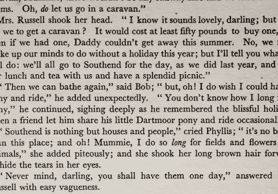
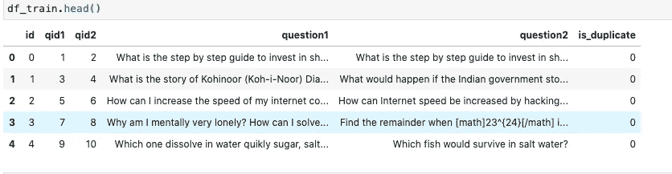
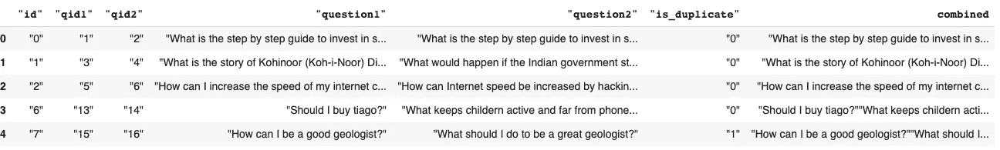
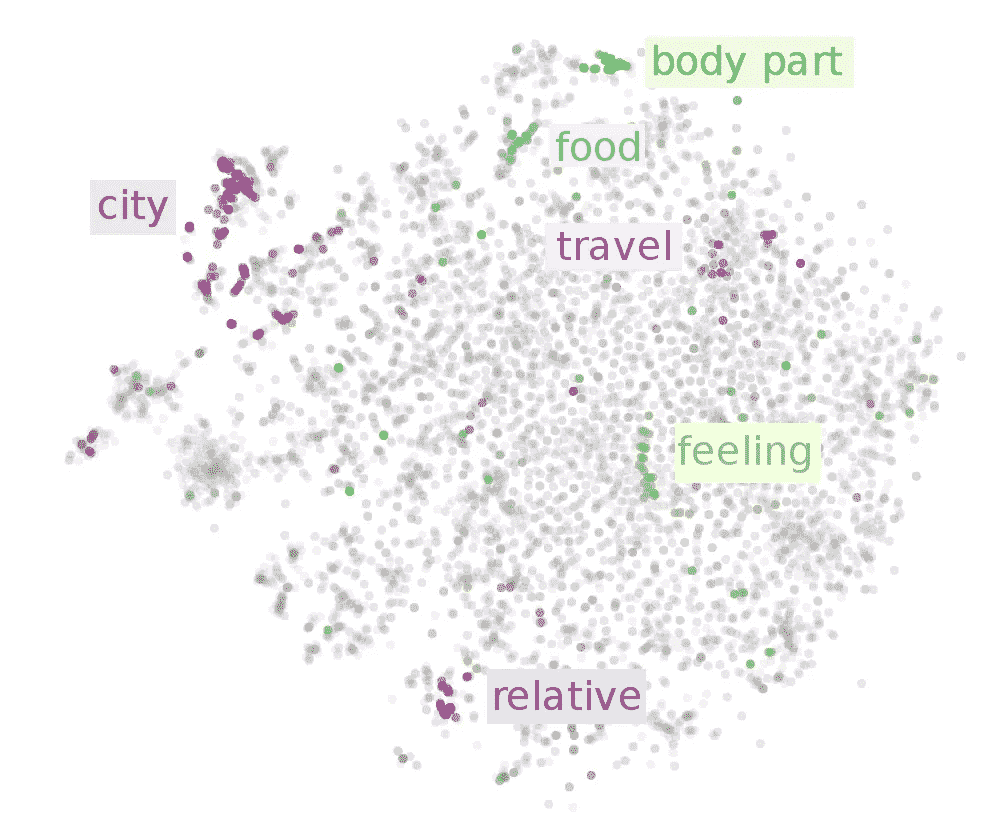
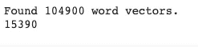
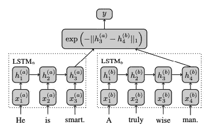
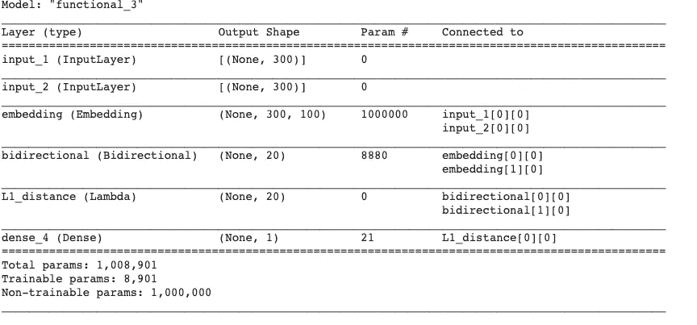
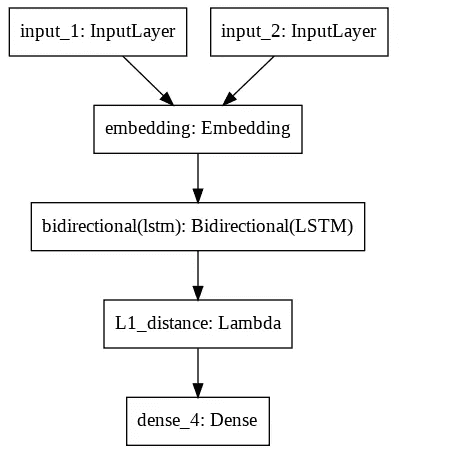
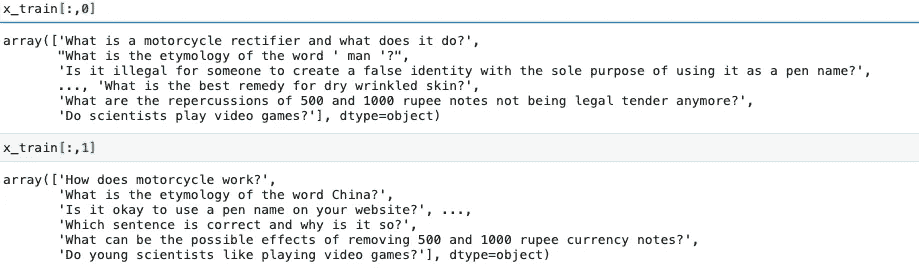

# Quora 问题对:使用暹罗网络检测文本相似性。

> 原文：<https://towardsdatascience.com/quora-question-pairs-detecting-text-similarity-using-siamese-networks-a370f039731b?source=collection_archive---------17----------------------->

## Quora 相似问题:使用暹罗网络检测文本相似性。

E ver 想知道如何使用深度学习计算文本相似度？我们的目标是开发一个模型来检测文本之间的文本相似性。我们将使用 [Quora 问题对数据集。](https://www.kaggle.com/c/quora-question-pairs/data)



【https://unsplash.com/photos/askpr0s66Rg 

# 要求

*   Python 3.8
*   sci kit-学习
*   张量流
*   天才论
*   NLTK

# 资料组

让我们首先从探索数据集开始。我们的数据集包括:

*   **id:** 一对训练集的 id
*   **qid1，qid2** :问题的唯一 id
*   **问题 1** :问题 1 的文本
*   **问题 2** :问题 2 的文本
*   **is _ duplicate**:**1**如果问题 1 和问题 2 含义相同，否则 **0**



我们数据集的预览

# 数据预处理

像任何机器学习项目一样，我们将从预处理数据开始。让我们首先加载数据，并将问题 1 和问题 2 组合起来形成词汇表。

```
def load_data(df):
    question1 = df['"question1"'].astype(str).values
    question2 = df['"question2"'].astype(str).values
    # combined: to get the tokens
    df['combined'] = df['"question1"'] + df['"question2"']
    labels = df['"is_duplicate"'].values
    return question1, question2, labelsquestion1, question2, labels = load_data(df)
question1 = list(question1)
question2 = list(question2)
combined = question1 + question2df.head()
```



我们修改过的数据框

我们也将清理文本一点。

```
**# Remove Non ASCII characters from the dataset.**def cleanAscii(text): return ''.join(i for i in text if ord(i) < 128)
```

# 单词嵌入

> 每个前馈神经网络都将词汇作为输入，并将它们作为向量嵌入到低维空间，然后通过反向传播进行微调，必然会产生作为第一层权重的单词嵌入，这通常被称为*嵌入层(Ruder，2016)*



图片来自[3]

W ord embedding 学习文本的句法和语义方面(Almeida 等人，2019)。由于我们的问题与文本的语义相关，我们将使用单词嵌入作为我们的暹罗网络的第一层。

为此，我们将使用**流行的 GloVe(单词表示的全局向量)嵌入模型**。我们将获得预训练的模型([https://nlp.stanford.edu/projects/glove/](https://nlp.stanford.edu/projects/glove/))并将其作为我们的第一层作为嵌入层加载。

由于手套的最近邻方法(或余弦相似度),它能够捕获语义相似的单词。在我们的模型中，我们将使用使用手套权重开发的嵌入矩阵，并为我们的每个句子获取单词向量。

首先，我们用所有的词汇构建一个标记器。

```
max_words = 10000
tok = Tokenizer(num_words=max_words, oov_token="<OOV>")
tok.fit_on_texts(combined)# Padding sequences to a max embedding length of 100 dim and max len of the sequence to 300sequences = tok.texts_to_sequences(combined)sequences = pad_sequences(sequences, maxlen=300, padding='post')
```

现在假设，我们已经从[这里](https://nlp.stanford.edu/projects/glove/)下载了手套预训练向量，我们用嵌入矩阵初始化我们的嵌入层。

```
max_words = 10000
word_index = len(tok.word_index) + 1
glove_dir = ''
embeddings_index = {}
f = open(os.path.join(glove_dir, 'glove.6B.100d.txt'))for line in f:values = line.split()word = values[0]coefs = np.asarray(values[1:], dtype='float32')embeddings_index[word] = coefsf.close()print('Found %s word vectors.' % len(embeddings_index))print(word_index)# matrixembedding_dim = 100embedding_matrix = np.zeros((max_words, embedding_dim))for word, i in tok.word_index.items():if i < max_words:embedding_vector = embeddings_index.get(word)if embedding_vector is not None:embedding_matrix[i] = embedding_vector
```



输出的屏幕截图

# 模型



图片来自[4]

现在我们已经创建了我们的嵌入矩阵，我们也不会开始建立我们的模型。



模型摘要

```
lstm_layer = tf.keras.layers.Bidirectional(tf.keras.layers.LSTM(lstm_units, dropout=0.2, recurrent_dropout=0.2))# loading our matrix
emb = tf.keras.layers.Embedding(max_words, embedding_dim, input_length=300, weights=[embedding_matrix],trainable=False)input1 = tf.keras.Input(shape=(300,))
e1 = emb(input1)
x1 = lstm_layer(e1)input2 = tf.keras.Input(shape=(300,))
e2 = emb(input2)
x2 = lstm_layer(e2)mhd = lambda x: tf.keras.backend.abs(x[0] - x[1])
merged = tf.keras.layers.Lambda(function=mhd, output_shape=lambda x: x[0],
name='L1_distance')([x1, x2])
preds = tf.keras.layers.Dense(1, activation='sigmoid')(merged)
model = tf.keras.Model(inputs=[input1, input2], outputs=preds)
model.compile(loss='mse', optimizer='adam') 
```

我们使用一个 LSTM 层来编码我们的 100 暗字嵌入。然后，我们计算**曼哈顿距离**(也称为 L1 距离)，然后激活 sigmoid，将输出压缩在 0 和 1 之间。(1 表示最大相似度，0 表示最小相似度)。我们使用 MSE 作为损失函数和 Adam 优化器。



我们的模型结构

# 培养

我们将我们的 train.csv 分割为训练、测试和验证集，以测试我们的模型。

```
def create_data():
    features, labels = df_train.drop(columns=['id', 'qid1', 'qid2', 'is_duplicate']).values, df_train['is_duplicate'].values
    x_train, x_test, y_train, y_test = train_test_split(features, labels, test_size=0.2, random_state=42)
    x_train, x_val, y_train, y_val = train_test_split(x_train, y_train, test_size=0.25, random_state=42)

    return x_train, x_test, y_train, y_test, x_val, y_val
```



问题 1 和问题 2

为了训练我们的模型，我们简单地调用 fit 函数，后跟输入。

```
history = model.fit([x_train[:,0], x_train[:,1]], y_train, epochs=100, validation_data=([x_val[:,0], x_val[:,1]], y_val))
```

# 参考

*   [1][https://arxiv.org/abs/1901.09069](https://arxiv.org/abs/1901.09069)
*   [2][https://nlp.stanford.edu/pubs/glove.pdf](https://nlp.stanford.edu/pubs/glove.pdf)
*   [https://ruder.io/word-embeddings-1/](https://ruder.io/word-embeddings-1/)
*   [4][https://www . aaai . org/OCS/index . PHP/AAAI/aaai 16/paper/download/12195/12023](https://www.aaai.org/ocs/index.php/AAAI/AAAI16/paper/download/12195/12023)