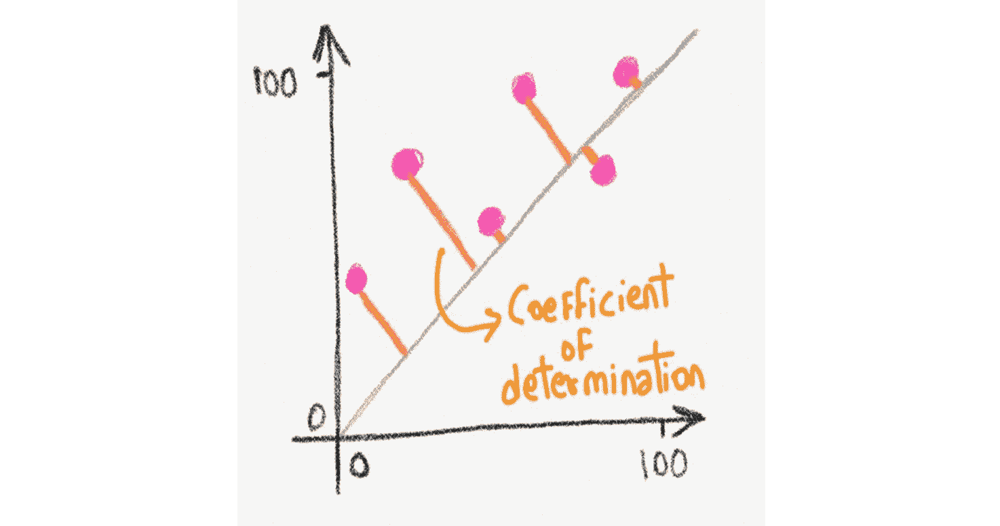
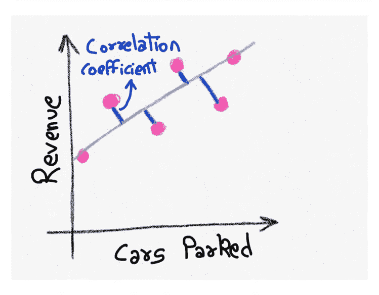
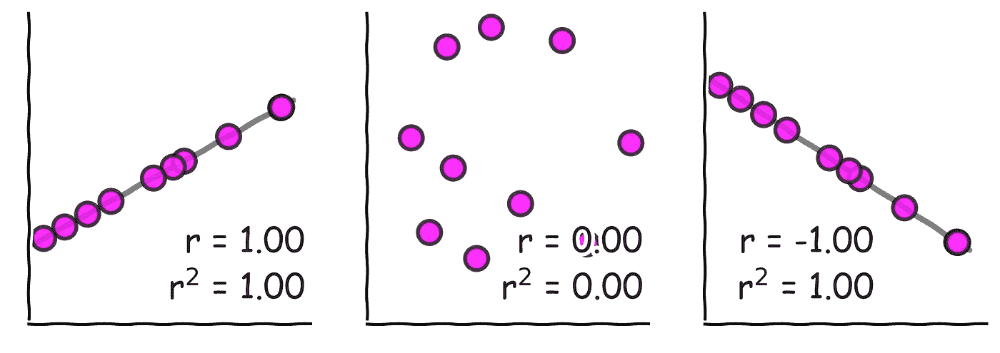
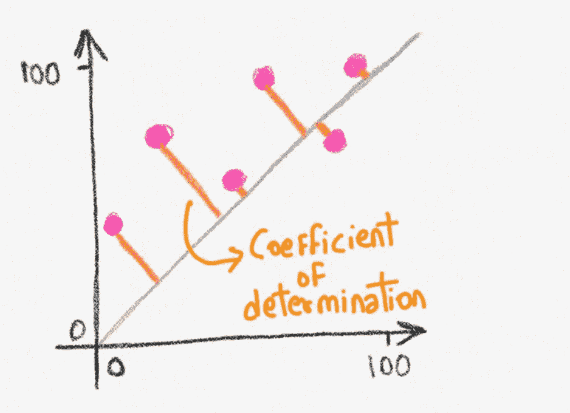
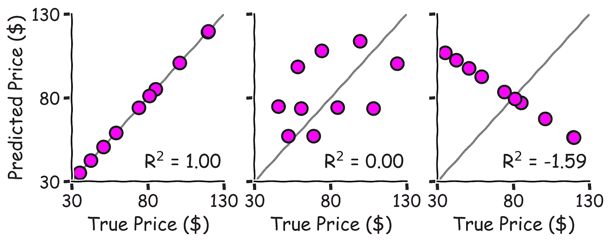
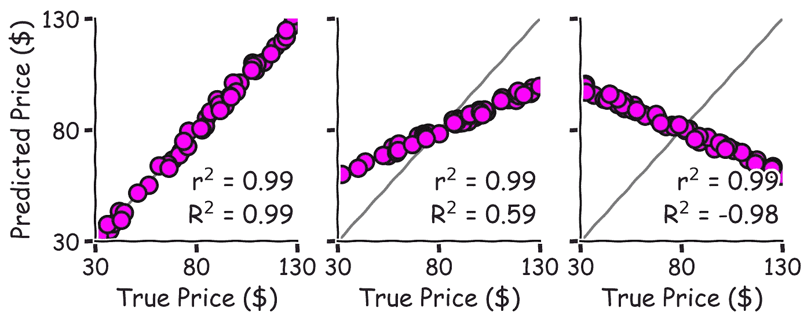

# R 或 R——何时使用什么

> 原文：<https://towardsdatascience.com/r%C2%B2-or-r%C2%B2-when-to-use-what-4968eee68ed3?source=collection_archive---------1----------------------->

## 平方皮尔逊相关系数和决定系数的图形解释，帮助您发现统计谎言

皮尔逊相关系数和决定系数的区别。图片作者。

想象一下，你是一名股票分析师，负责预测沃尔玛季度收益报告前的股价。当你正在努力工作时，你的数据科学家走进来说，他们发现了一个鲜为人知的数据流，提供沃尔玛每天的停车场占用率，这似乎与沃尔玛的历史收入有很好的相关性。你兴奋是可以理解的。你让他们在机器学习模型中使用停车场数据和其他标准指标来预测沃尔玛的股价。

到目前为止一切顺利。

几个小时后，数据科学家回来了，声称经过对模型的仔细验证，它的预测与真实的股票价格有很强的*相关性*。你接受这个模型而不做进一步的调查吗？

我希望不会。

C orrelations 有利于识别数据中的模式，但对于量化模型的性能几乎没有意义，尤其是对于复杂的模型(比如机器学习模型)。这是因为**相关性只告诉我们两个事物*是否跟随*(例如，停车场占用率和沃尔玛的股票)，而不告诉我们它们*如何匹配*(例如，预测和实际的股票价格)。**为此，像决定系数(R)这样的模型性能指标会有所帮助。

在本文中，我们将了解:

1.  什么是相关系数( *r)* 及其平方( *r* )？
2.  什么是决定系数( *R* )？
3.  什么时候使用上面的每一个？

# 1.相关系数:“这个预测器有多好？”

蓝线总和越短，相关系数越接近+1。图片作者。

相关系数有助于量化两个事物之间的相互关系或联系。一些众所周知的相关量是人的体重和身高、房屋价值和面积，以及我们在上面的例子中看到的商店收入和停车场占用率。

最广泛使用的相关系数之一是[皮尔逊相关系数](https://en.wikipedia.org/wiki/Pearson_correlation_coefficient)(通常表示为 *r)* 。从图形上看，这可以理解为“数据离最佳拟合线有多近？”

r 的范围为 1 至+1。灰线是最符合数据的线。图片作者。

1.  如果这些点非常远， *r* 接近于 0
2.  如果点非常靠近直线，并且直线向上倾斜， *r* 接近+1
3.  如果点非常靠近直线，并且直线向下倾斜， *r* 接近 1

注意上图中的坐标轴上有缺失的数字吗？这是因为皮尔逊相关系数与数字的大小无关；它只对相对变化敏感。这种特性通常是可取的，因为变量很少具有相同的大小。例如，沃尔玛的股票价格是几十美元，而停在商店门口的汽车数以千计。

然而，由于皮尔逊相关系数对实际大小的不敏感性，当两个事物确实被期望具有相同的大小时，皮尔逊相关系数可能被滥用来给出错误的置信度。

更糟糕的是，一些人将皮尔逊相关系数的平方带到 0 和+1 之间，并将其称为 *r* 。但这不要与下面解释的决定系数(R)相混淆。

# 2.决定系数:“这个模型有多好？”

橙色线条的总和越长，决定系数越低。图片作者。

与皮尔逊相关系数不同，[决定系数](https://en.wikipedia.org/wiki/Coefficient_of_determination)测量预测值*与*(而不仅仅是*遵循*)观察值的匹配程度。它取决于点和 1:1 线(不是最佳拟合线)之间的距离，如上所示。数据越接近 1:1 线，决定系数越高。

决定系数通常用 R 表示。然而，它不是任何东西的平方。它的范围可以是从任何负数到+1。

r 的范围可以从负无穷大到+1。灰线是两个轴上的量相等的线(也称为 1:1 线)。图片作者。

1.  R = +1 表示预测与观测完全匹配
2.  R = 0 表示预测与观察值平均值附近的随机猜测一样好
3.  负 R 表示预测比随机预测差

因为 R 表示点与 1:1 线的距离，所以*与*取决于数字的大小(与 *r* 不同)。

# 3.什么时候用什么？

**皮尔逊相关系数( *r)* 用于识别事物的模式，而决定系数(R)用于识别模型的强度。**

通过对 *r，*取平方，你得到皮尔逊相关系数的平方( *r* )，它与决定系数(R)完全不同，除非在线性回归的非常[的特定情况下(当来自上述数字的两条灰色线合并，使得蓝色和橙色线相等)。](https://stats.stackexchange.com/questions/83347/relationship-between-r2-and-correlation-coefficient)

因此，皮尔逊相关系数或其平方很少用于评估模型的性能。下图用 3 个例子对此进行了解释。

沃尔玛股票价格的 3 个不同模型的预测。图片作者。

1.  模型 1: R = 0.99 表明它几乎完美地预测了股票价格。
2.  模型 2: R = 0.59 表明它对股票价格的预测很差。然而，如果你只看 r 的话，你可能过于乐观了。这种有偏差的预测在机器学习模型中极为常见。因此，更重要的是将你的预测可视化，而不仅仅是用统计数据来总结它们。
3.  模型 3:R = 0.98 表示比随机猜测 50 美元左右的股价更差。但是，如果你只是看了一眼，你可能会失去所有的钱！附注:信不信由你，与实际趋势相反的股票预测[很常见](https://www.dividend.com/how-to-invest/10-hilariously-wrong-bullbear-calls/)。这也催生了一个全新的领域，叫做反向投资。

# 概述

1.  相关性对于发现数据中的模式和关系是有用的，但是对于评估预测是无用的。
2.  要评估预测，请使用诸如决定系数之类的度量标准，决定系数反映了预测与观测的匹配程度，或者预测解释了观测数据中的多少变化。
3.  皮尔逊相关系数的平方通常不等于决定系数(或 *r* ≠ R)

如果你想要一个关于 R 和 R 之间区别的数学解释，看看迪帕克·汉德尔瓦尔的这篇优秀文章。