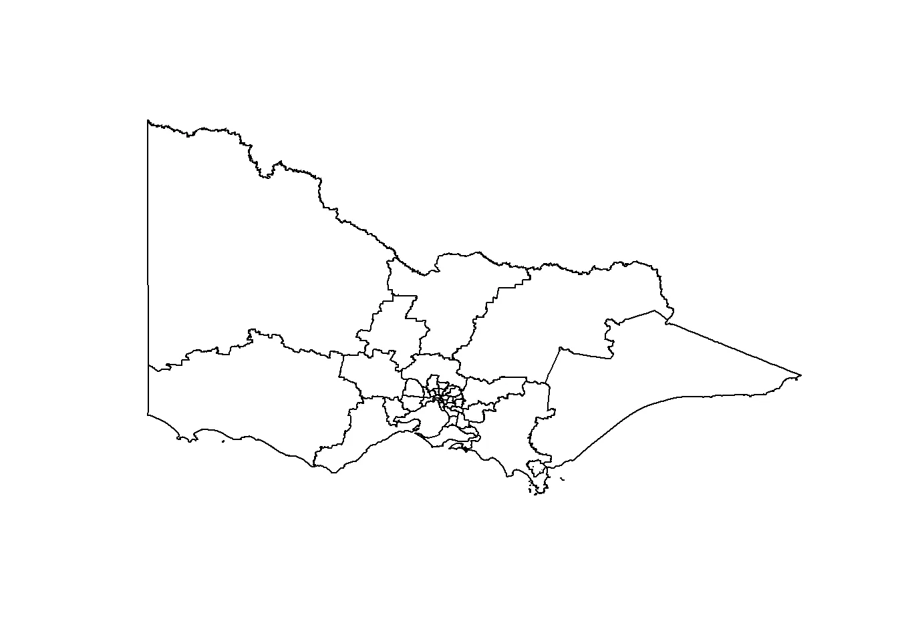
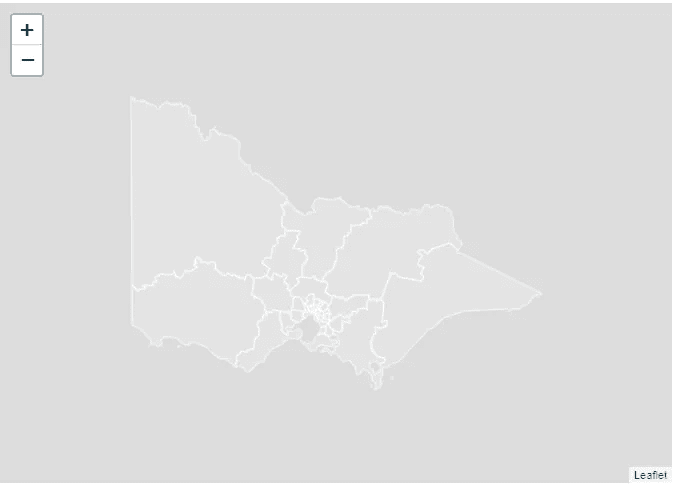
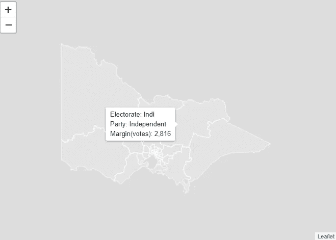
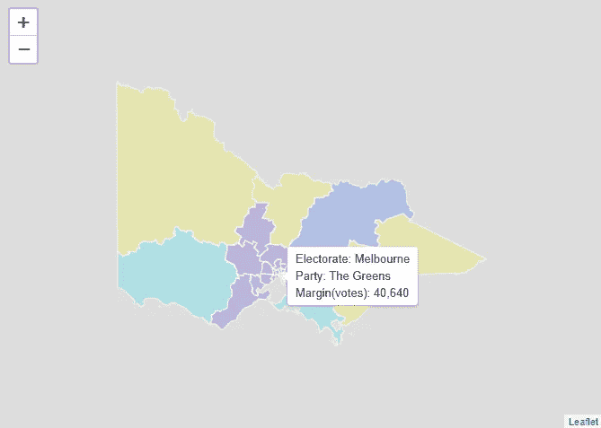
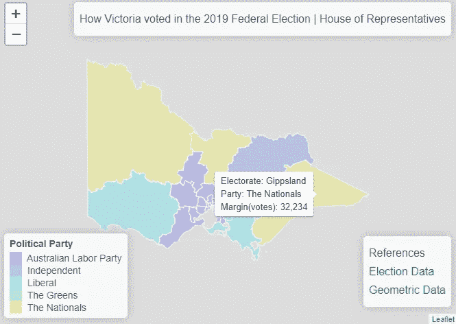

# r 和传单来创建交互式 choropleth 地图。

> 原文：<https://towardsdatascience.com/r-and-leaflet-to-create-interactive-choropleth-maps-8515ef83e275?source=collection_archive---------33----------------------->

## 地理可视化选举数据


照片由[марьянблан| @ marjanblan](https://unsplash.com/@marjan_blan?utm_source=medium&utm_medium=referral)在 [Unsplash](https://unsplash.com?utm_source=medium&utm_medium=referral)

在我开始之前，这里是 Github 页面上完整交互版主机的链接。

 [## 用传单创建交互式地图

ejooco.github.io](https://ejooco.github.io/MapStats.github.io/) 

我先说:这不是一篇关于冠状病毒的文章。

尽管新冠肺炎是世界上的一个大事件，它实际上对数据科学家来说是迷人的，特别是数据可视化。这可能激励了很多人进入这个行业。

在未来几十年，我想象大学和在线课程将使用新冠肺炎数据集来教授数据收集、辩论、可视化、建模等。

但在此之前，真正的数据之王可以说是政治，因此在这里我将向数据可视化的前任统治者致敬，并一步步地向您介绍如何使用 R Studio 和传单库构建交互式 choropleth 地图来显示选举结果。

让我们开始吧！

# **加载项目的库**

```
**library**(rgeos)
**library**(maptools)
**library**(leaflet)
```

# **数据**

我们需要两组不同的数据。一个用于映射几何图形，一个用于选举结果。

我使用的数据来自澳大利亚选举委员会，可以在这里找到:

[](https://aec.gov.au/Electorates/gis/gis_datadownload.htm) [## 联邦选举边界地理信息系统数据免费下载

### 虽然我们已尽力确保本产品中数据的准确性，但数据的所有者(包括…

aec.gov.au](https://aec.gov.au/Electorates/gis/gis_datadownload.htm) [](https://results.aec.gov.au/24310/Website/HouseDivisionalResults-24310.htm) [## 部门结果

### 此表允许您按名称搜索分部。此表可通过选择列标题进行排序，您可以…

results.aec.gov.au](https://results.aec.gov.au/24310/Website/HouseDivisionalResults-24310.htm) 

# 绘制形状文件

使用 maptools 包中的 readShapeSpatial()，我们将形状文件作为它自己需要的参数传入，并将其赋给一个变量。使用 plot()函数来查看它的外观。

```
vicmapdata <- readShapeSpatial(".\\vic-july-2018-esri\\E_AUGFN3_region.shp")
plot(vicmapdata)
```



读取选举数据并将其传递给一个变量

```
electiondata <- read.csv(".\\vic_elect_results.csv")
```

# 数据争论

首先，我们来看看数据的结构

```
summary(electiondata)##      Division  State                  Successful.Party   TCP.Margin
##  Aston   : 1   VIC:38   Australian Labor Party:21      1,090  : 1  
##  Ballarat: 1            Independent           : 1      10,934 : 1  
##  Bendigo : 1            Liberal               :12      11,289 : 1  
##  Bruce   : 1            The Greens            : 1      11,326 : 1  
##  Calwell : 1            The Nationals         : 3      12,134 : 1  
##  Casey   : 1                                           12,453 : 1  
##  (Other) :32                                           (Other):32
```

首先，我不喜欢变量的名字。

```
colnames(electiondata) <- c("Divisions", "State", "Party", "Marginal Votes")summary(electiondata)##     Divisions  State                       Party    Marginal Votes
##  Aston   : 1   VIC:38   Australian Labor Party:21   1,090  : 1    
##  Ballarat: 1            Independent           : 1   10,934 : 1    
##  Bendigo : 1            Liberal               :12   11,289 : 1    
##  Bruce   : 1            The Greens            : 1   11,326 : 1    
##  Calwell : 1            The Nationals         : 3   12,134 : 1    
##  Casey   : 1                                        12,453 : 1    
##  (Other) :32                                        (Other):32
```

这看起来更好接下来，我们将查看 shapefile 数据中的部门名称。这一点很重要，因为 electiondata 部分必须精确地映射到 shapefile 部分

```
summary(vicmapdata)## Object of class SpatialPolygonsDataFrame
## Coordinates:
##         min       max
## x 140.96168 149.97668
## y -39.15919 -33.98043
## Is projected: NA 
## proj4string : [NA]
## Data attributes:
##    E_div_numb       ***Elect_div* **    Numccds          Actual      
##  Min.   : 1.00   **Aston   : 1**   Min.   :267.0   Min.   :100151  
##  1st Qu.:10.25   **Ballarat: 1**   1st Qu.:337.5   1st Qu.:105494  
##  Median :19.50   **Bendigo : 1**   Median :354.0   Median :107416  
##  Mean   :19.50   **Bruce   : 1**   Mean   :359.1   Mean   :106954  
##  3rd Qu.:28.75   **Calwell : 1**   3rd Qu.:387.0   3rd Qu.:109115  
##  Max.   :38.00   **Casey   : 1**   Max.   :467.0   Max.   :112265  
##                  (Other) :32                                   
##    Projected        Total_Popu   Australian   Area_SqKm            Sortname 
##  Min.   :107381   Min.   :0    Min.   :0    Min.   :   40.46   Aston   : 1  
##  1st Qu.:109070   1st Qu.:0    1st Qu.:0    1st Qu.:   80.59   Ballarat: 1  
##  Median :109986   Median :0    Median :0    Median :  170.28   Bendigo : 1  
##  Mean   :110372   Mean   :0    Mean   :0    Mean   : 5987.93   Bruce   : 1  
##  3rd Qu.:111484   3rd Qu.:0    3rd Qu.:0    3rd Qu.: 2619.61   Calwell : 1  
##  Max.   :113924   Max.   :0    Max.   :0    Max.   :81962.21   Casey   : 1  
##                                                                (Other) :32
```

看起来 shapefile 中的分区在变量 Elect_div 下

```
vicmapdata$Elect_div##  [1] Aston       Ballarat    Bendigo     Bruce       Calwell     Casey      
##  [7] Chisholm    Cooper      Corangamite Corio       Deakin      Dunkley    
## [13] Flinders    Fraser      Gellibrand  Gippsland   Goldstein   Gorton     
## [19] Higgins     Holt        Hotham      Indi        Isaacs      Jagajaga   
## [25] Kooyong     La Trobe    Lalor       Macnamara   Mallee      Maribyrnong
## [31] Mcewen      Melbourne   Menzies     Monash      Nicholls    Scullin    
## [37] Wannon      Wills      
## 38 Levels: Aston Ballarat Bendigo Bruce Calwell Casey Chisholm ... Wills
```

到目前为止一切顺利。election data＄Divisions 和 vicmapdata＄Elect _ div 都有 38 个级别，这是一个好的开始。我们可以在这种规模下手动检查它们，但如果我们检查整个国家，或者一个更大的国家呢？我们需要明智地做这件事，并让 R 为我们做这些繁重的工作。

**两个数据集中的名称必须完全匹配，这样两个数据集才能正确映射。**

```
setdiff(electiondata$Division, vicmapdata$Elect_div)## [1] "McEwen"
```

我们确实有矛盾。它告诉我们“McEwen”在第一个向量中，但不在第二个向量中。我们先找出第一个向量中“McEwen”的位置，看看第二个向量中对应的位置是什么。

```
which(electiondata$Division=="McEwen")## [1] 31
```

所以在 31 号位置。另一个向量的 31 号位置是什么？

```
vicmapdata$Elect_div[31]## [1] Mcewen
## 38 Levels: Aston Ballarat Bendigo Bruce Calwell Casey Chisholm ... Wills
```

好的，它很小，但是第一个向量有一个 E，第二个向量有一个 E。为了留在代码中，并且不必手动修复(记住这需要可伸缩)，我们将把数据从一个向量映射到另一个向量(现在我们知道其他一切都是相同的)

```
vicmapdata$Elect_div <- electiondata$Divisions
```

现在，让我们像以前一样进行检查，以确保值匹配

```
setdiff(electiondata$Division, vicmapdata$Elect_div)## character(0)
```

那更好！

# 创造视觉效果

有趣的部分来了！我们将使用传单，而不是我们上面使用的绘图功能。我们会把我们的“受害者地图数据”传给它。当我们设置 stroke=True 时，addPolygons 将为我们绘制边界。我们将使用 1.5 粗细的白线

```
leaflet(vicmapdata) %>%
  addPolygons(
    stroke = TRUE, 
    color = 'White', 
    weight = 1.5, 
    )
```

(点击页面顶部的链接查看互动版)



此时，我们有两个数据变量。1 用于映射数据，我们刚才已经演示过了。现在，我们需要将我们的选举数据映射到绘图上。

首先，我们将创建标签。这意味着当我们将鼠标悬停在某个选民上时，它会告诉我们相关的统计数据。我们使用一些 HTML 工具来格式化渲染后的图形。

```
mylabels <- paste(
  "Electorate: ", vicmapdata$Elect_div, "<br/>",
  "Party: ", electiondata$Party, "<br/>",
  "Margin(votes): ", electiondata$`Marginal Votes`
) %>%
  lapply(htmltools::HTML)
```

现在，我们将把 mylabels 变量插入到之前的传单代码块中

```
leaflet(vicmapdata) %>%
  addPolygons(
    stroke = TRUE, 
    color = 'White', 
    weight = 1.5, 
    label = mylabels,
    labelOptions = labelOptions( 
      style = list("font-weight" = "normal", padding = "3px 8px"), 
      textsize = "13px", 
      direction = "auto"
    )
    )
```

(点击页面顶部的链接查看互动版)



到目前为止一切顺利。现在我们将添加一些颜色。我创建了一个名为 factpal(因子调色板)的变量。我们使用传单库中的 colorFactor 函数。topo.colors(5)告诉该函数，我们需要 topo.colors 调色板中的 5 种颜色，unique()允许我们将一种颜色分配到特定级别。在这种情况下，我们希望同一个获胜政党的所有选民都被分配相同的颜色。

```
factpal <- colorFactor(topo.colors(5), unique(electiondata$Party))
```

现在我们将 factpal 函数插入到传单代码块中

```
leaflet(vicmapdata) %>%
  addPolygons(
    fillColor = ~factpal(electiondata$Party), 
    stroke = TRUE, 
    color = 'White', 
    weight = 1.5, 
    label = mylabels,
    labelOptions = labelOptions( 
      style = list("font-weight" = "normal", padding = "3px 8px"), 
      textsize = "13px", 
      direction = "auto"
    )
    )
```

(点击页面顶部的链接查看互动版)



看起来更好了

从这里开始，我们只需要添加一些文本和一个图例。

文本:我们需要一个标题和一些数据的参考链接

图例:哪些颜色等同于哪个政党

下面是文本标签的代码。我们本质上只是在 HTML 中进食

```
htmltitle <- "<h5> How Victoria voted in the 2019 Federal Election | House of Representatives</h5>"references <- "<h5>References</h5><a target='_blank' href='https://results.aec.gov.au/24310/Website/HouseDivisionalResults-24310.htm'><h5>Election Data</h5></a><a target='_blank' href='https://aec.gov.au/Electorates/gis/gis_datadownload.htm'><h5>Geometric Data</h5></a>"
```

现在，我们只需插入上面的标题和参考数据，并在 addLegend 函数下添加图例，如下图所示。

```
leaflet(vicmapdata) %>%
  addPolygons(
    fillColor = ~factpal(electiondata$Party), 
    stroke = TRUE, 
    color = 'White', 
    weight = 1.5, 
    label = mylabels,
    labelOptions = labelOptions( 
      style = list("font-weight" = "normal", padding = "3px 8px"), 
      textsize = "13px", 
      direction = "auto"
    )
    ) %>%
  addLegend( pal=factpal, 
             values=~electiondata$Party, 
             opacity=0.3, 
             title = "Political Party", 
             position = "bottomleft" 
             ) %>%
  addControl(html=htmltitle, position = "topright") %>%
  addControl(html=references, position = "bottomright")
```

(点击页面顶部的链接查看互动版)



# 可能的延续

1.  添加时间刻度以显示选举结果随时间的变化
2.  创建另一个视觉效果来查看哪些选民易手了
3.  扩大到整个澳大利亚

# 如果你正在读这封信，说明你已经看完了

感谢您的阅读。云中见。

埃蒙

推特@ejooco

https://github.com/ejooco