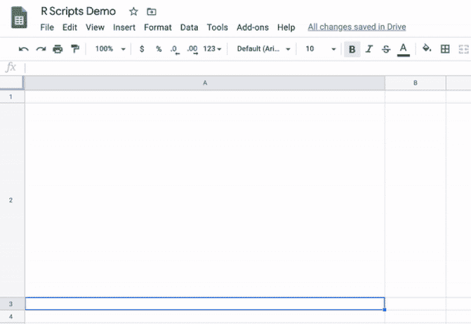
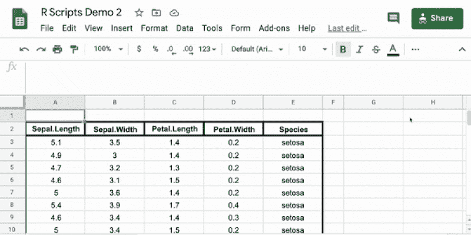
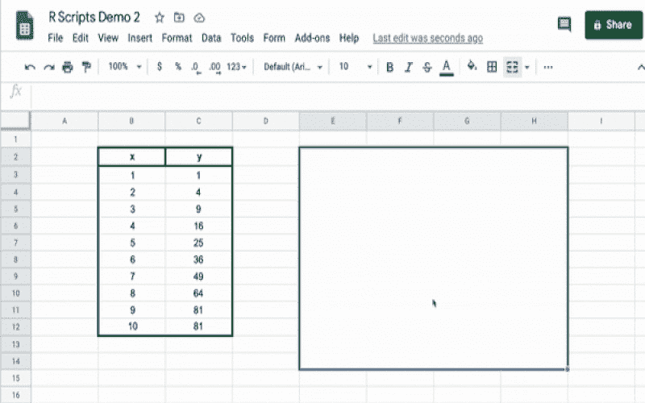
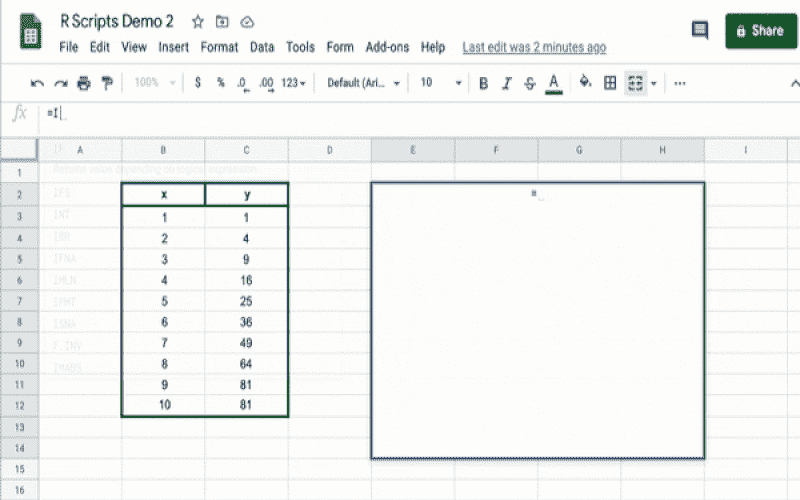
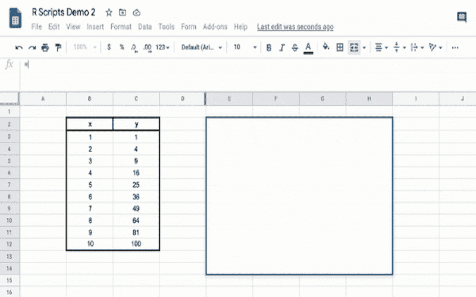
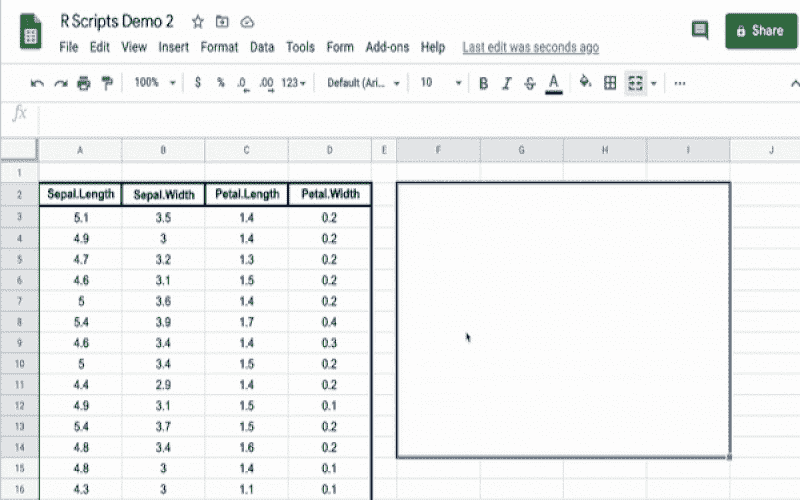
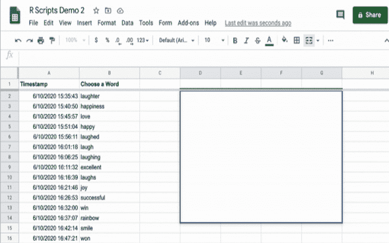
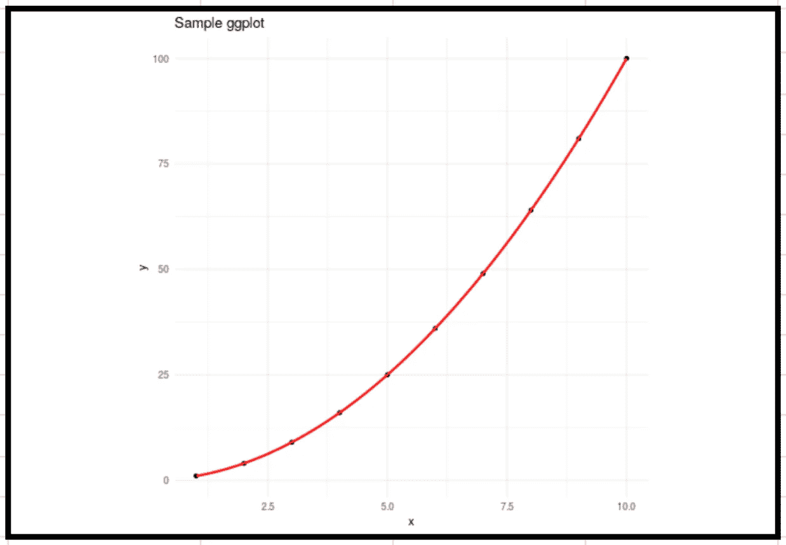
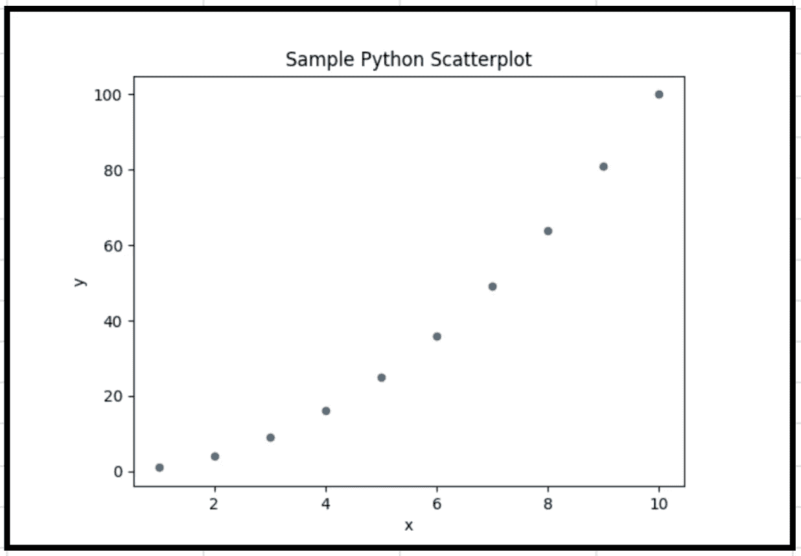

# 谷歌工作表中的 r 和 Python 绘图

> 原文：<https://towardsdatascience.com/r-and-python-plotting-in-google-sheets-255e974aed91?source=collection_archive---------38----------------------->

## 使用自定义 Google Sheets 函数来改进绘图


卢卡斯·布拉塞克在 [Unsplash](https://unsplash.com?utm_source=medium&utm_medium=referral) 上的照片

# 上次

这是关于在 Google Sheets 公式中使用 R 和 Python 函数的 n 部分系列的第 2 部分。如果您还没有阅读第 1 部分，[在 Google Sheets 公式中使用 R 和 Python](/using-r-and-python-in-google-sheets-formulas-b397b302098)，我建议您去看看所有对您有用的魔法。总之，通过在 Google Cloud Run 中设置一个简单的 API 并创建 Google Apps 脚本函数来调用您的 API，您可以使用 R 和 Python 代码来支持自定义 Google Sheets 单元格公式。在初始设置之后，在任何 Google Sheet 中使用 R 和 Python 都是快速而简单的。

以下是一些亮点。



作者图片


作者图片



技术上不在第 1 部分，但本着同样的精神。作者图片

# 在谷歌工作表中绘图(以及更多)

正如我之前所说的，我认为谷歌工作表是惊人的。我袖手旁观这一声明，并警告说，在谷歌工作表中绘图是非常糟糕的。它花费了最长的时间，甚至有一个合理的线性回归可用，图形选项是非常有限的。然而，现在您可以通过使用以前开发的技术，使用 R 和 Python 在 Google Sheets 中动态地创建漂亮的图形。事实上，许多生成图像文件的函数都可以在 Google Sheets 公式中使用，只需很少的额外设置。

这里有一些例子。

1.  **基地 R 标绘**



作者图片

2. **ggplot2 绘图**



作者图片

3.**使用 matplotlib 进行 Python 绘图**



作者图片

4.**k-均值聚类图**



作者图片

5.**字云**



作者图片

# 这是如何工作的？

Google Sheets 函数 IMAGE 将图像的 URL 作为参数，并将其显示在单元格内。基于第 1 部分中的技术，[自定义 Google Apps 脚本函数](https://developers.google.com/apps-script/guides/sheets/functions) rplot 和 pyplot 对设置在 [Google Cloud Run](https://cloud.google.com/run) 上的 my /rplot 和/pyplot 端点进行 API 调用。这些 API 调用将 rscript 和 pyscript 参数作为代码运行，生成输出的 PNG，通过它们的 API 将 PNG 上传到[imgur.com](https://imgur.com/)[，并返回上传图像的 URL。](https://api.imgur.com/)

在 Google Sheets 中开始使用 rplot 或 pyplot 最简单的方法是克隆[my rpyssheets GitHub repo](https://github.com/samterfa/rpysheets)并使用 [GoogleCloudRunner R 包](https://code.markedmondson.me/googleCloudRunner/index.html)为[RS Sheets _ plotting](https://github.com/samterfa/rpysheets/tree/master/rsheets_plotting)目录和 [pysheets_plotting](https://github.com/samterfa/rpysheets/tree/master/pysheets_plotting) 目录部署一个 Google Cloud Run 服务。然后将 Google Cloud Run 服务 URL 复制并粘贴到[这个 Google Sheets 模板](https://docs.google.com/spreadsheets/d/1a2wOFlatsvrdVWg3STfICgZXYAXxc18MRhrIxSrEwb4/copy)中并播放。

```
googleCloudRunner::cr_deploy_run('{LocalPath}/rsheets_plotting/')googleCloudRunner::cr_deploy_run('{LocalPath}/pysheets_plotting/')
```

# 细节

参数 rscript 和 pyscript 是/rplot 和/pyplot 端点的工作平台，并且每个端点都有自己的端点。rscript 参数作为字符串读入，并使用 R 的 [eval()函数](https://www.rdocumentation.org/packages/base/versions/3.6.2/topics/eval)运行，而 pyscript 则混合使用 Python 的 [exec()](https://docs.python.org/3/library/functions.html#exec) 和 [eval()](https://docs.python.org/3/library/functions.html#eval) 函数读入并运行。我知道允许不可信的来源将代码传递给 eval()或 exec()函数是很危险的。根据您的用例，我会考虑如何修改我编写的代码来保护这些功能。

传递给 rscript 和 pyscript 的每个变量都被标识并转换为具有列名、数组、向量或单个值的 dataframe。rscript 和 pyscript 可以修改这些变量，也可以访问内置值，但必须生成图像。因为 R 可以捕获 PNG 文件形式的情节，这是在幕后处理的，所以所有需要做的就是尝试一个情节。然而，据我所知，Python 并没有一种一致的方式将图形捕获到 PNG 中，pyscript 代码必须显式地将图形保存为 PNG 文件。在工作目录中找到的第一个 PNG 文件在后台被上传到 imgur.com。

```
**rplot Google Sheets Formula** =IMAGE(rplot("g <- ggplot(data = a, mapping = aes(x,y)) + geom_point() + geom_smooth(color = 'red') + ggtitle('Sample ggplot') + theme_minimal(); plot(g)", B2:C12))
```



作者图片

```
**pyplot Google Sheets Formula** =IMAGE(pyplot("import matplotlib.pyplot as plt; plot = a.plot(x = 0, y = 1, kind = 'scatter', title = 'Sample Python Scatterplot'); fig = plot.get_figure(); fig.savefig('output.png')", B2:C12))
```



作者图片

# **图像托管**

对于/rplot 和/pyplot，我都使用了 imgur.com 的[图像托管。如果你愿意，你可以使用不同的图片托管网站，但是要使用我上面所做的，你需要一个 imgur 客户端 ID。为了获得一个账户，](https://imgur.com/)[创建一个 imgur 账户](https://imgur.com/register)，然后[添加一个客户到你的账户](https://api.imgur.com/oauth2/addclient)。一旦您有了客户端 ID，您就可以将它复制并粘贴到上面的脚本中，或者您也可以创建一个. creds 目录，其中的文件 imgur.json 以下面的方式定义。

```
{"clientID":"{YourImgurClientID}"}
```

我将我的客户机设置为授权类型“无用户授权的匿名使用”,并简单地上传公开可用的图像用于演示目的。您可以选择上传到私人相册。虽然每次更新谷歌表单上的图片都会为上传的图片生成一个唯一的 imgur URL，这是一种浪费，但每个客户每天可以上传多达 1250 张图片，这对我来说已经足够了。如果您在生产中使用它，您将希望在更新时修改图像，而不是每次上传不同的图像。请记住，如果你想用 imgur.com 赚钱，你有特殊的要求，它不是免费的。

# **资源**

1.  [这是 Google Sheet](https://docs.google.com/spreadsheets/d/1a2wOFlatsvrdVWg3STfICgZXYAXxc18MRhrIxSrEwb4/copy) 您可以简单地复制并使用为 pyscript、pyplot、rscript 和 rplot 预定义的自定义 Google Sheets 函数。所有你需要做的就是粘贴你的 R 和 Python Google Cloud 运行 URL，一旦它们被设置好。
2.  [这里是我的 GitHub repo](https://github.com/samterfa/rpysheets) 上面引用的 R 和 Python 代码。

尽情享受吧！