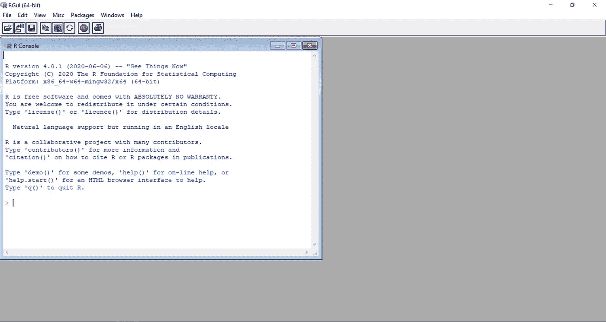
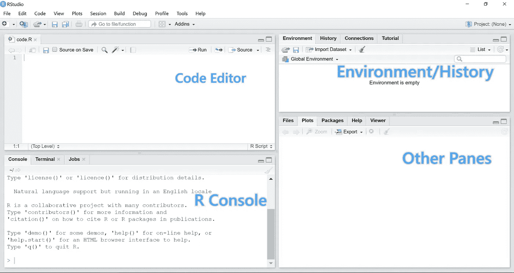
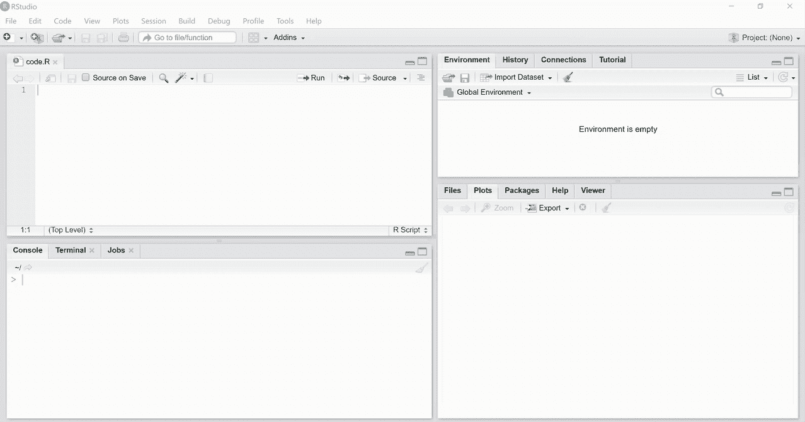

# 101 Munira 数据科学:R 和 RStudio 入门

> 原文：<https://towardsdatascience.com/r-basics-getting-started-with-r-and-rstudio-b47664eb5baf?source=collection_archive---------91----------------------->


桑尼·萨希尔在 [Unsplash](https://unsplash.com?utm_source=medium&utm_medium=referral) 上的照片

这是一个详细的指南，旨在帮助初学者轻松安装 R 和 Rstudio😃。

# R 和 RStudio 有什么区别？

**R** 是**数据科学世界中最流行的**语言**。它是由统计学家开发的，作为数据分析的交互环境。**

RStudio 是一个集成开发环境(IDE ),帮助您更高效地使用 R。它不仅为我们创建和编辑 R 代码提供了编辑器，还提供了许多其他有用的工具，我们将在后面看到。

> Rstudio 是一个交互式桌面环境，但它不是 R，也不包括你下载安装时的 R。

> R 和 RStudio 都可以免费下载安装。

# 1.1 在 Windows 10 上下载 R

要使用 Rstudio，我们首先需要安装 r。

你可以从 CRAN 下载 R，CRAN 代表综合 R 档案网。只需访问 [CRAN 下载](https://cran.r-project.org/)页面，并按照下面 gif 中所示的步骤进行操作:


从 CRAN 网站下载 R

# 1.2 安装 R

下载完最新版本的 R 后，点击下载的文件开始安装。遵循下面 gif 中显示的步骤将帮助您通过选择所有默认选项来安装 R。


在 Windows 10 上安装 R

> 恭喜你！您已经安装了 r。

# 1.3 下载 RStudio

您可以按照以下步骤在 [RStudio 网站](https://www.rstudio.com/products/rstudio/download/)下载 RStudio 的最新免费桌面版本:


下载 RStudio for Windows

# 1.4 安装 RStudio

运行下载的。exe 文件，并在安装过程中为所有默认设置选择“是”,然后按照下面的 gif:

> 别忘了 RStudio 要求预先安装 R。


在 Windows 10 上安装 RStudio

# 2.1 内部 R 与内部 RStudio



R 控制台



RStudio

> 通过查看上面的图片，您现在可能已经意识到为什么最好使用 RStudio IDE 了。

# 2.2 使用 RStudio 入门

您可以从*开始*菜单中打开 RStudio。如果 RStudio 没有出现，您可以像这样搜索它:


在 Windows 10 上启动 R studio

> 使用 R 的方式主要有两种:在 **R 控制台**或者**脚本文件**中编写代码(以. R 扩展名保存的纯文本文件)。

# RStudio 窗格

> 首次启动 RStudio 时，您将看到三个窗格。左窗格显示 R 控制台。右侧顶部窗格包括*环境*和*历史*等选项卡，底部窗格显示五个选项卡:*文件*、*绘图*、*包*、*帮助*和*查看器*(这些选项卡在新版本中可能会有变化)。您可以单击每个选项卡来浏览不同的功能。


Rstudio 窗格

# 2.3 右侧控制台

交互式数据分析通常发生在 R 控制台窗口(在 RStudio 中，左下面板)中，当您在底部大于号旁边的光标处键入命令并按回车键时，命令将在该窗口中进行评估。

> 一旦会话关闭，直接写入控制台的命令将被遗忘。

下面是一个使用控制台进行一些算术计算的快速示例。


在 R 控制台中执行算术计算命令的例子

# 2.4 脚本文件

脚本文件是用**保存的纯文本文件。R** 扩展。为了完整地记录您所做的事情以备后用，最好将您的命令写在一个脚本文件中，并用。r 分机。

# 2.4.1 创建并保存新的脚本 R 文件

要开始一个新的脚本，你可以点击文件菜单，然后新建文件，然后 R 脚本。这将在 RStudio 的左上方打开一个新的窗格，在这里您可以开始编写脚本或 R 代码。

要保存新创建的脚本文件，您可以单击文件菜单，然后在键盘上保存(或按 Ctrl+S)并写入脚本名称。您可以省略。r 扩展名，RStudio 会为您添加。


如何创建和保存新的 R 脚本文件

# 2.4.2 在脚本文件中编写和运行命令

要一次运行一行而不是整个脚本，单击编辑窗格右上角的*运行*按钮或按键盘上的 Ctrl+Enter。

> 编辑完脚本后，不要忘记保存它。



> 要运行整个脚本，请按键盘上的 ctrl+shift+Enter。

# 2.5 安装 R 包

“Base R”是您第一次安装 R 后获得的内容。其他组件可通过软件包获得。然而，因为不是每个人都需要所有可用的功能，R 通过*包*提供不同的组件。

> 您可以安装的许多可用软件包中的一些是用于增强数据处理能力的 **dplyr** 或用于改进数据可视化的 **ggplot2** 。

使用 RStudio 安装 R 包有两种方法。第一个是在 R 控制台中执行以下代码行:

```
install.packages("ggplot2")
```

第二种方法是使用 RStudio 内置的图形界面，你可以从这个界面搜索和下载 CRAN 上的任何 R 包，以及通过 GitHub 等其他库共享的许多 R 包。


安装 R 包

# 装载 R 包

然后我们可以使用`library`函数将已安装的包加载到我们的 R 会话中:

```
**library**(ggplot2)
```

您可以使用以下功能查看所有已安装的软件包:

```
**installed.packages**()
```

你一路赶到这里？！感谢阅读。😆

如果您有任何问题或意见，请在下面留下您的反馈，或者您可以随时通过 [Twitter](https://twitter.com/munniomer) 联系我。在那之前，下一篇文章再见！✋.

# 参考

[](https://www.edx.org/course/data-science-r-basics) [## 数据科学:R 基础

### 在我们的数据科学专业证书课程的第一个，这门课程将向您介绍 R…

www.edx.org](https://www.edx.org/course/data-science-r-basics)