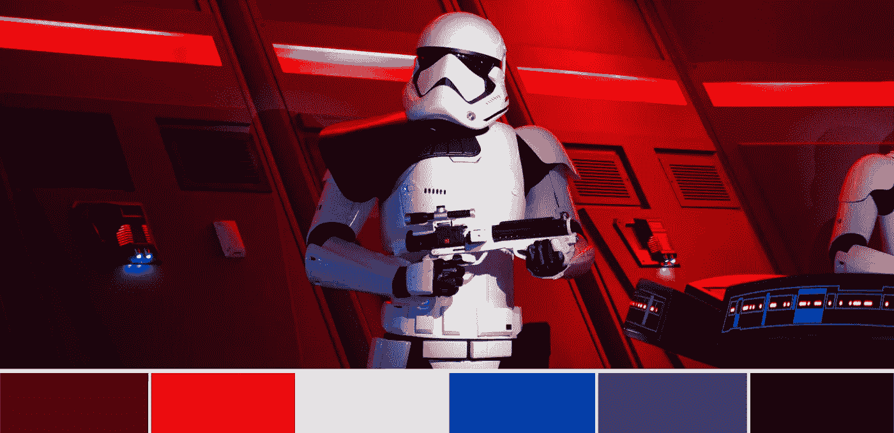
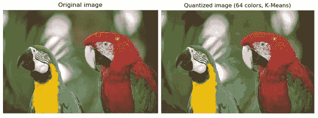
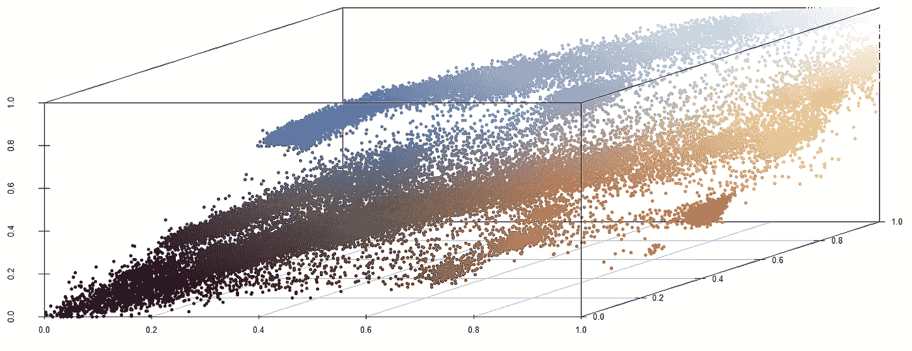
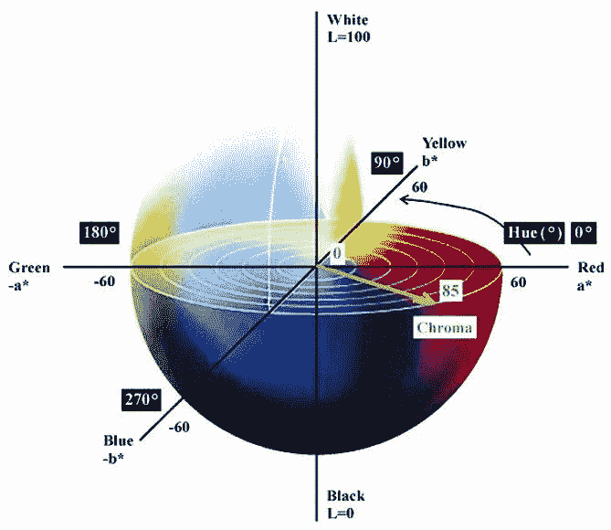
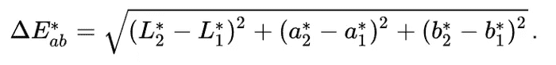
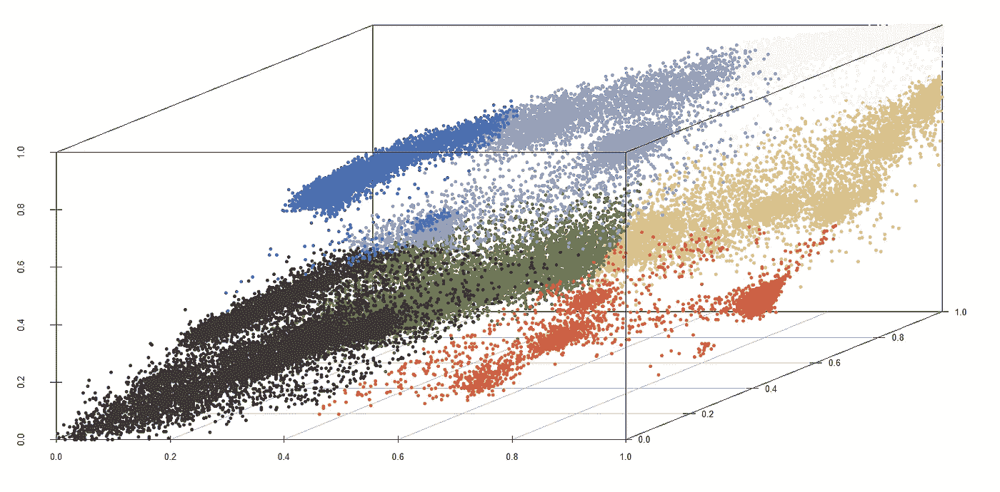
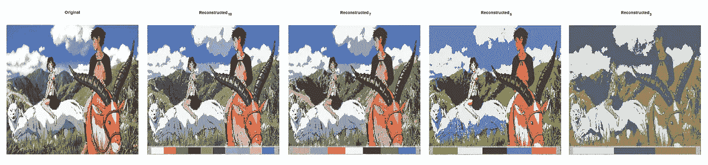
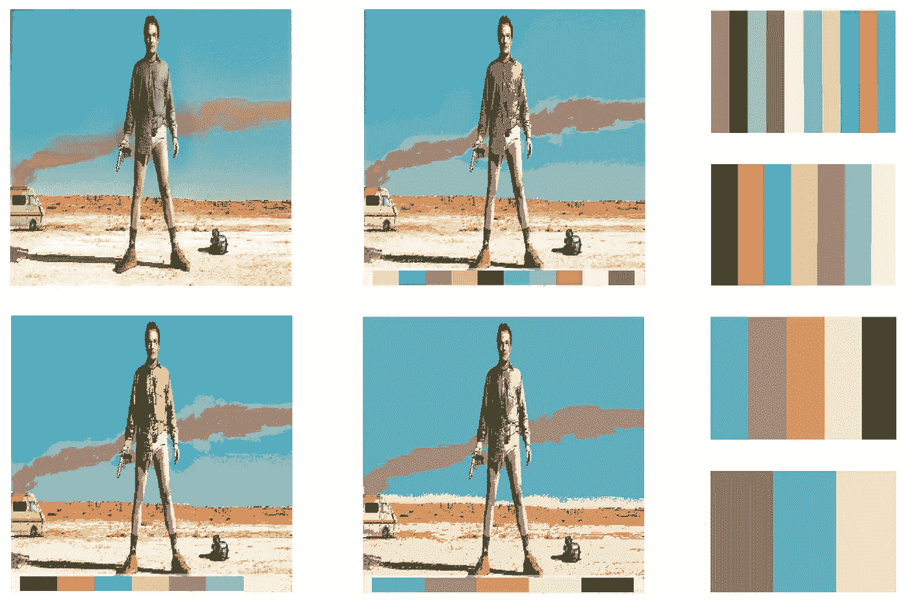
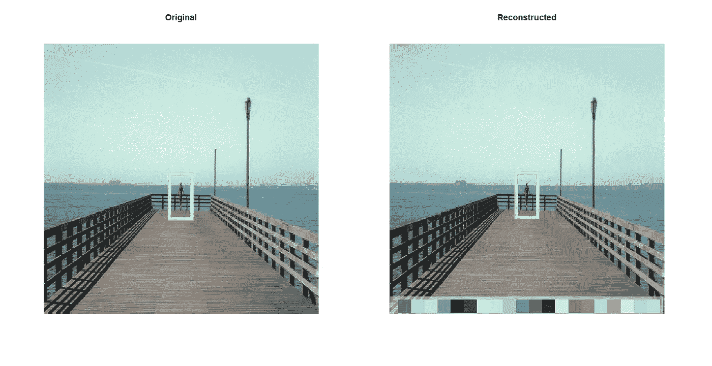

# 用 R 探索电影中的彩色故事:调色板提取

> 原文：<https://towardsdatascience.com/r-color-palette-extraction-3850b3f56152?source=collection_archive---------28----------------------->

调色板提取示例(鸣谢:[布莱恩·麦高恩](https://unsplash.com/@sushioutlaw?utm_source=unsplash&utm_medium=referral&utm_content=creditCopyText)上 [Unsplash](https://unsplash.com/s/photos/star-wars?utm_source=unsplash&utm_medium=referral&utm_content=creditCopyText)

## 如何使用颜色量化理论和无监督机器学习从电影帧中提取调色板

# 0.概述

在《T4》的第一部分中，我们探索了一些从著名电影中挑选出来的**有趣的半音阶例子** **，试图猜测导演们选择背后的原因，并对通过 R 脚本可以做的事情略知一二。**

 [## 探索 R 电影中的彩色故事(上)

### 一次丰富多彩、数据驱动的电影色彩世界之旅

towardsdatascience.com](/exploring-chromatic-storytelling-with-r-part-1-8e9ddf8d4187) 

在[**第二部分**](/the-chromar-package-892b716ee2c9) ，中，我们更加强调介绍 **ChromaR** 工具包的技术细节，这是一个 R 包，可以呈现之前在第一部分中显示的所有彩色可视化效果。

 [## 用 R 探索电影中的彩色故事:ChromaR 包

### 关于如何生成电影框架线和许多其他彩色数据的实用见解

towardsdatascience.com](/the-chromar-package-892b716ee2c9) 

这部**第三部**的基石将是对单个画面的视觉检查，而不是关注整部电影的颜色和色彩模式序列。具体来说，我们的主要目标是从任何输入帧自动生成合适的调色板。

猫怪公主(吉卜力工作室)的调色板，用 ChromaR 提取

首先，让我们从一些颜色理论开始。

# 1.颜色量化

提取调色板都是关于**颜色量化**。在计算机图形中，颜色量化是减少图像中使用的不同颜色数量的过程。

色彩量化示例(鸣谢:[柯达](http://r0k.us/graphics/kodak/)

这种技术通常用于在由于内存限制或[风格选择](https://en.wikipedia.org/wiki/Pixel_art)而只能管理有限颜色的设备上显示多种颜色的图像。
在这些情况下，**找到最有代表性的一组颜色** **对于尽可能高保真地重建原始图片至关重要**。

颜色量化过程可以分为两个步骤:

1.  **选择一个色彩空间**(如 sRGB、HSL、CIELAB 等)。)以数学方式将颜色表示为数字元组。**不同的色彩空间意味着不同的色彩组织策略**。[例如，CIELAB](https://en.wikipedia.org/wiki/CIELAB_color_space) 是一个专门设计的颜色空间，包含普通人可以看到的所有颜色，而 sRGB 是为显示器和打印机设计的。
2.  **选择量化策略**。对三维空间中的点进行分组的最简单的方法是 [**均匀量化**](https://muthu.co/reduce-the-number-of-colors-of-an-image-using-uniform-quantization/) ，其中每个轴被独立处理并被分成 *k* 个大小相等的段，定义了空间的 *k* 个均匀区域。当然，这也是最弱的策略，因为像素/点在颜色空间中不是均匀分布的。
    相反，大多数标准技术将颜色量化视为一个 [**聚类问题**](https://en.wikipedia.org/wiki/Cluster_analysis) ，其中每个像素都被视为颜色空间的一个 n 维点，并根据某种度量(通常是欧几里德距离)分配给一组相似的像素。
    聚类算法的一个有效替代方法是 [**中值切割**](https://en.wikipedia.org/wiki/Median_cut) ，它通过沿最长维度的中点递归切割每组数据来获得调色板。

sRGB 在文章顶部空间表现了幽灵公主的框架。视觉检查足以识别最主要的集群。

# 2.ChromaR 中调色板提取的实现

对于 ***ChromaR*** 包，选择通过 [**K-Means 聚类算法**](https://en.wikipedia.org/wiki/K-means_clustering) ，使用 [**Lab 颜色空间**](https://en.wikipedia.org/wiki/Lab_color_space) 来实现调色板提取，其中欧几里德距离更符合感知差异。

## 色彩空间和度量

在该颜色空间中， *L** 、 *a** 和 *b** 的非线性关系旨在**模拟眼睛的非线性响应**。

立方体 CIE 实验室颜色空间(鸣谢: [2018，Kulku](https://www.researchgate.net/publication/328675252_DETERMINATION_OF_THE_EFFECTS_OF_DIFFERENT_PACKAGING_METHODS_AND_MATERIALS_ON_STORAGE_TIME_OF_DRIED_APPLE)

已经提出了不同的度量来量化适合人类感知的两种颜色之间的差异。这里我们使用了第一个也是最简单的一个， *Delta E 76* ，这是一个标准的欧氏距离。

*三角洲 E 76。不，那不是* [*埃隆马斯克的儿子的名字*](https://www.bbc.com/news/world-us-canada-52557291) *。*

几年来几次迭代改进了这个公式，得出了非常精确(和复杂)的度量标准，如[*Delta E 2000*](http://zschuessler.github.io/DeltaE/learn/)*。*

## k-均值聚类算法

K-means 是一种聚类算法，**使质心和聚类**的其他点之间的距离平方和最小化(方差用作聚类分散的度量)。

簇的数量 k 代表我们调色板的期望大小，其中颜色由每个质心的 RGB/Lab 值决定。

为了简单起见，为 ChromaR 选择的距离度量是我们的 *Delta E 76* 又名欧几里德距离。

用 ChromaR 进行 K-means 聚类后猫怪公主框架的 sRGB 空间表示。每个聚类用其质心的颜色来标识，即其点的平均值。这些是用来生成调色板的颜色。

就像任何其他无监督的机器学习算法一样，K-Means 最终用标签标记我们帧的每个像素。这个标签可以假定的不同值将生成我们的调色板。

更进一步，我们可以使用这些标签用更少的颜色重建输入图像。

不同 k 值下的调色板提取和图像重建

## k-意味着缺点和限制

尽管简单，K-Means 仍然可以产生有竞争力的结果。然而，它并不缺乏缺点和局限性。

K-Means 高度依赖于三个因素:

*   **聚类数** : *k* 是一个输入参数，选择不当可能会产生不良结果
*   **距离度量**:我们决定测量点与点之间差异的方式会影响结果
*   **初始点**:算法不能保证收敛到全局最优，这意味着结果的质量可能取决于初始条件

为了减轻这些缺点的影响，ChromaR 实现了 [**K++算法**](https://en.wikipedia.org/wiki/K-means%2B%2B) ，该算法限制了初始值选择引起的波动，并采用了基于人类感知的颜色空间。

《绝命毒师》(AMC)中的这个标志性场景清楚地表明了选择一个合适的 k 的重要性……绿色去哪里了？

## 使用 ChromaR 生成调色板

本文中显示的所有调色板都是使用运行以下脚本的 [ChromaR 包](https://github.com/detsutut/chroma)生成的:

> 请注意，chromaR 包仍然是一个测试版，必须进行许多改进，以使其 100%可操作。因此，**请报告您遇到的任何 bug** 或问题！

# 结论

自动调色板提取工具确实是我们色彩探索的另一个有用的工具，但很难挑战人类评价的水平。事实上，人类设计的调色板通常显示一些**高级结构**(例如，颜色梯度、组合在一起的色调、颜色之间的高对比度等。)在自动创建的调色板中是完全没有的。

阿罗诺夫斯基的杰作《梦的安魂曲》中的一个资本场景。在这里，一个人造的 5 种颜色的调色板当然会包括从画面中心出现的鲜红色，正如导演自己所希望的那样。相反，机器驱动的聚类即使在 20 色调色板中也难以处理红色，因为衣服覆盖的像素区域非常有限。

然而，在这方面仍有很大的改进余地。例如，**生成对抗网络**(GANs)[可能会帮助](http://colormind.io/blog/generating-color-palettes-with-deep-learning/)生成视觉上更可信的调色板，而像 *Delta E 2000* 这样更复杂的度量标准可能会在聚类中解开类似人类的感知。

即使没有我们温暖、神奇的人情味，我们仍然可以取得令人印象深刻的结果！

 [## 清晰度/色度

### ChromaR 是一个实验性的 R 工具包，用于分析和探索电影或任何其他视频中的彩色故事…

github.com](https://github.com/detsutut/chroma)  [## Tommaso Buonocore —作者—走向数据科学| LinkedIn

### 查看世界上最大的职业社区 LinkedIn 上 Tommaso Buonocore 的个人资料。托马索列出了 5 项工作…

www.linkedin.com](https://www.linkedin.com/in/tbuonocore/)