# R 中的新冠肺炎数据采集

> 原文：<https://towardsdatascience.com/r-interface-to-covid-19-data-hub-244ae056af2c?source=collection_archive---------65----------------------->

## 跨政府来源收集数据，检索政策措施，与世界银行公开数据、谷歌和苹果移动报告接口。

***编者注:*** [*走向数据科学*](http://towardsdatascience.com/) *是一份以研究数据科学和机器学习为主的中型刊物。我们不是健康专家或流行病学家，本文的观点不应被解释为专业建议。想了解更多关于疫情冠状病毒的信息，可以点击* [*这里*](https://www.who.int/emergencies/diseases/novel-coronavirus-2019/situation-reports) *。*


KOBU 机构在 [Unsplash](https://unsplash.com/s/photos/coronavirus-data?utm_source=unsplash&utm_medium=referral&utm_content=creditCopyText) 上拍摄的照片

新冠肺炎数据中心[由 R 构建，支持任何语言，提供了一个全球范围的、细粒度的、统一的数据集，有助于更好地了解新冠肺炎。用户可以立即从多个官方来源下载最新的结构化历史每日数据。这些数据每小时被处理一次，并以 csv 格式保存在](https://covid19datahub.io/)[云存储](https://covid19datahub.io/articles/data.html)中，以便于从 Excel、R、Python…和任何其他软件中访问。所有的资料来源都有适当的记录，连同他们的引用。

在本教程中，我们将探索与新冠肺炎数据中心的接口。

## 快速入门

```
# install the package
install.packages("COVID19")

# load the package
library("COVID19")

# additional packages to replicate the examples
library("ggplot2")
library("directlabels")
```

## 数据

使用`covid19`功能检索数据。默认情况下，它按国家下载全球数据，并打印相应的数据源。

```
x <- covid19()
```

使用`verbose = FALSE`隐藏数据源

```
x <- covid19(verbose = FALSE)
```

返回一个包含几列的表格:累计确诊病例数、检测数、恢复数、死亡数、每日住院数、强化治疗数、需要通气的患者数、政策措施、地理信息、人口数和外部标识符，以便使用其他来源轻松扩展数据集。更多细节请参考[文件](https://covid19datahub.io/articles/doc/data.html)。

## 干净的数据

默认情况下，通过用`NA`值填充缺失的日期来清除原始数据。这确保了所有地点共享相同的日期网格，并且没有一天被跳过。然后，`NA`值被替换为之前的非`NA`值或`0`。

*例*:按国家绘制确诊病例。

```
ggplot(data = x, aes(x = date, y = confirmed)) +
  geom_line(aes(color = id)) +
  geom_dl(aes(label = administrative_area_level_1), method = list("last.points", cex = .75, hjust = 1, vjust = 0)) +
  scale_y_continuous(trans = 'log10') +
  theme(legend.position = "none") +
  ggtitle("Confirmed cases (log scale)")
```

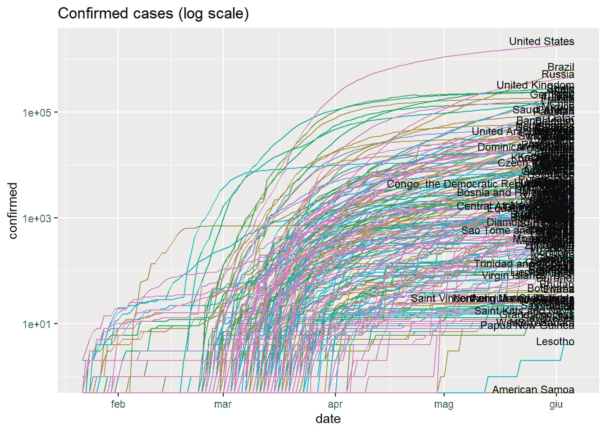

*例*:按国家绘制确诊病例占总人口的比例。

```
ggplot(data = x, aes(x = date, y = confirmed/population)) +
  geom_line(aes(color = id)) +
  geom_dl(aes(label = administrative_area_level_1), method = list("last.points", cex = .75, hjust = 1, vjust = 0)) +
  scale_y_continuous(trans = 'log10') +
  theme(legend.position = "none") +
  ggtitle("Confirmed cases - Fraction of total population (log scale)")
```

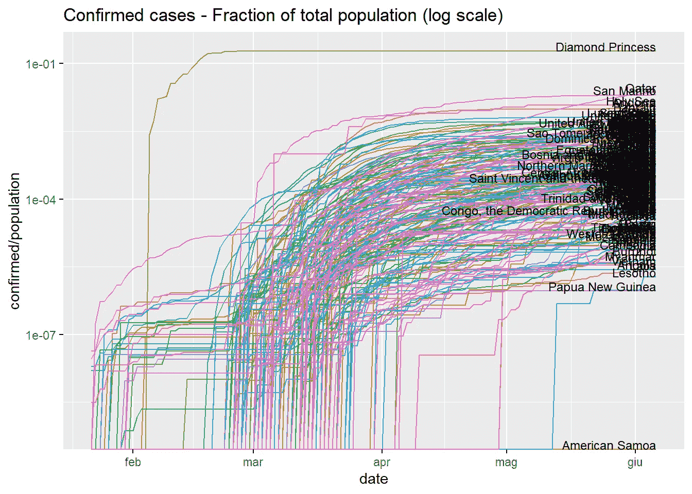

## 原始数据

并不总是建议用以前的非缺失数据填充数据，尤其是在计算比率或处理除数据可视化之外的更复杂的分析时。`raw`参数允许跳过数据清理，按原样检索原始数据，无需任何预处理。

```
x <- covid19(raw = TRUE, verbose = FALSE)
```

该包依赖于来自多个来源的公开可用数据，但这些数据并不总是一致的，例如，确诊病例数大于检测数、累计计数减少等。[新冠肺炎数据中心](https://covid19datahub.io)可以发现数据源之间的不一致，并自动通知当局可能的错误。所有日志都可以在[这里](https://covid19datahub.io/articles/data.html)获得。

*例*:按国家绘制确诊病例，作为检测的一部分。

```
ggplot(data = x, aes(x = date, y = confirmed/tests)) +
  geom_line(aes(color = id)) +
  geom_dl(aes(label = administrative_area_level_1), method = list("last.points", cex = .75, hjust = 1, vjust = 0)) +
  scale_y_continuous(trans = 'log10') +
  theme(legend.position = "none") +
  ggtitle("Confirmed cases - Fraction of tests (log scale)")
```

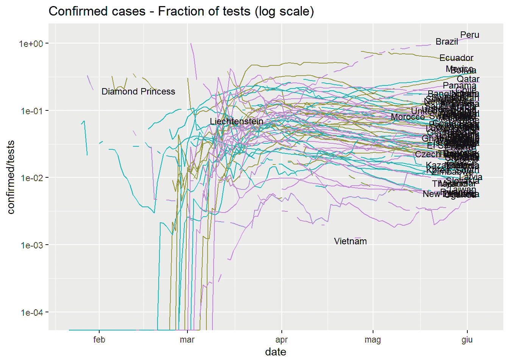

*示例*:按国家绘制死亡率。

```
ggplot(data = x, aes(x = date, y = deaths/confirmed)) +
  geom_line(aes(color = id)) +
  geom_dl(aes(label = administrative_area_level_1), method = list("last.points", cex = .75, hjust = 1, vjust = 0)) +
  scale_y_continuous(trans = 'log10') +
  theme(legend.position = "none") +
  ggtitle("Mortality rate (log scale)")
```

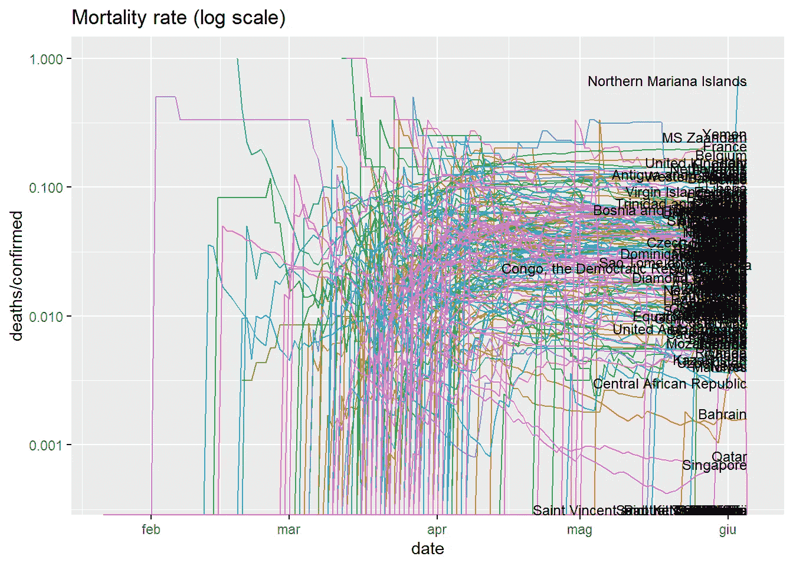

## 复古数据

检索在`end`日期生成的数据集快照，而不是使用最新版本。此选项确保结果的可重复性，并跟踪数据提供者可能做出的更改。示例:检索 2020-06-02 的年份数据。

```
# retrieve vintage data on 2020-06-02 
x <- covid19(end = "2020-06-02", vintage = TRUE, verbose = FALSE)
```

例子:与英国的最新数据比较。

```
# retrieve latest data
y <- covid19(verbose = FALSE)

# add type
x$type <- "vintage"
y$type <- "latest"

# bind and filter
x <- rbind(x, y)
x <- x[x$iso_alpha_3=="GBR",]

# plot
ggplot(data = x, aes(x = date, y = deaths)) +
  geom_line(aes(color = type)) +
  theme(legend.position = "right") +
  ggtitle("UK fatalities")
```

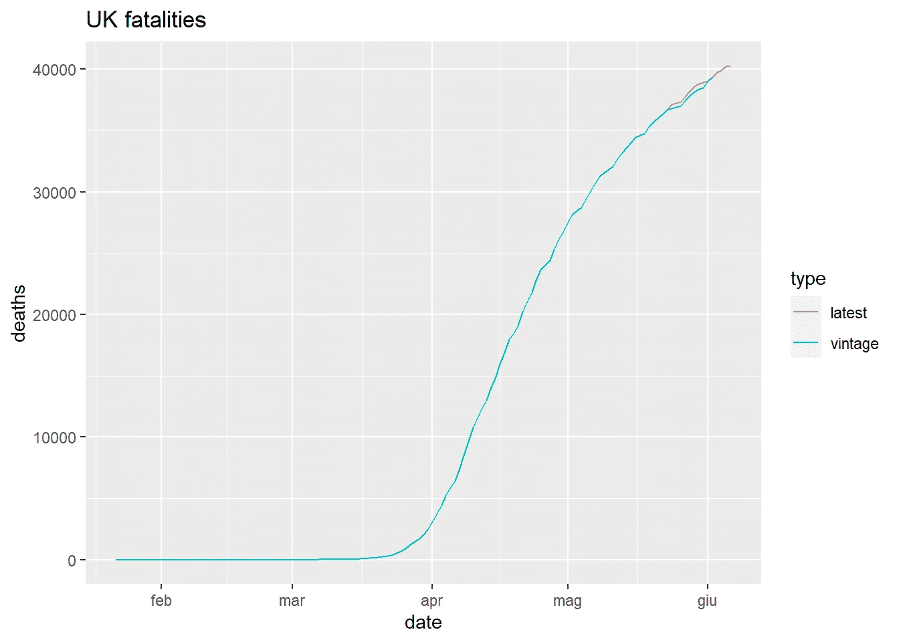

## 行政区域

参数`country`指定要检索的不区分大小写的国家名称或 [ISO 代码](https://github.com/covid19datahub/COVID19/blob/master/inst/extdata/db/ISO.csv) (alpha-2，alpha-3，数字)的向量。

```
# load data for United States, Italy, and Switzerland
x <- covid19(c("United States", "ITA", "ch"), verbose = FALSE)
```

*例*:绘制死亡率。

```
ggplot(data = x, aes(x = date, y = deaths/confirmed)) +
  geom_line(aes(color = id)) +
  geom_dl(aes(label = administrative_area_level_1), method = list("last.points", cex = .75, hjust = 1, vjust = 0)) +
  scale_y_continuous(trans = 'log10') +
  theme(legend.position = "none") + 
  ggtitle("Mortality rate (log scale)")
```

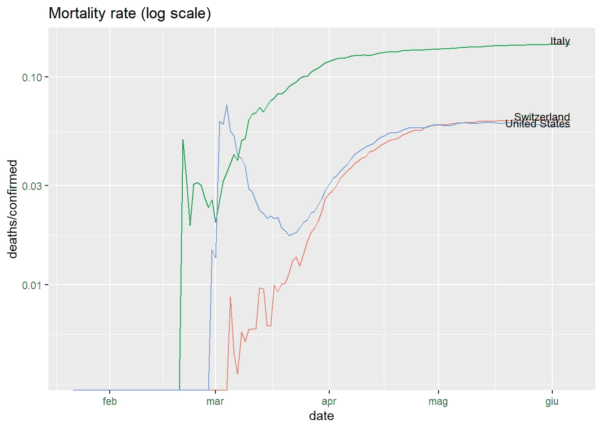

数据在不同的粒度级别上可用:行政区级别 1(顶级行政区，通常是国家)，行政区级别 2(通常是州、地区、县)，行政区级别 3(通常是城市、自治市)。数据的粒度由参数`level`指定。*示例*:检索意大利地区的数据并绘制死亡率。

```
# italy admin area level 2
x <- covid19("ITA", level = 2, verbose = FALSE)

# plot
ggplot(data = x, aes(x = date, y = deaths/confirmed)) +
  geom_line(aes(color = id)) +
  geom_dl(aes(label = administrative_area_level_2), method = list("last.points", cex = .75, hjust = 1, vjust = 0)) +
  scale_y_continuous(trans = 'log10') +
  theme(legend.position = "none") +
  ggtitle("Mortality rate by region (log scale)")
```

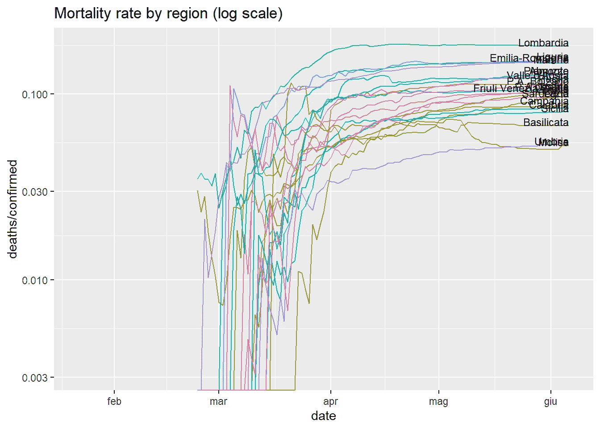

该软件包允许跨国比较。*示例*:绘制意大利地区和瑞士各州的死亡率。根据国家的不同，还支持城市级数据(3 级)。

```
# italy and switzerland admin area level 2
x <- covid19(c("ITA","CHE"), level = 2, verbose = FALSE)

# plot
ggplot(data = x, aes(x = date, y = deaths/confirmed)) +
  geom_line(aes(color = administrative_area_level_1, group = administrative_area_level_2)) +
  geom_dl(aes(label = administrative_area_level_2), method = list("last.points", cex = .75, hjust = 1, vjust = 0)) +
  scale_y_continuous(trans = 'log10') +
  theme(legend.position = "top", legend.title = element_blank()) +
  ggtitle("Mortality rate by region (log scale)")
```

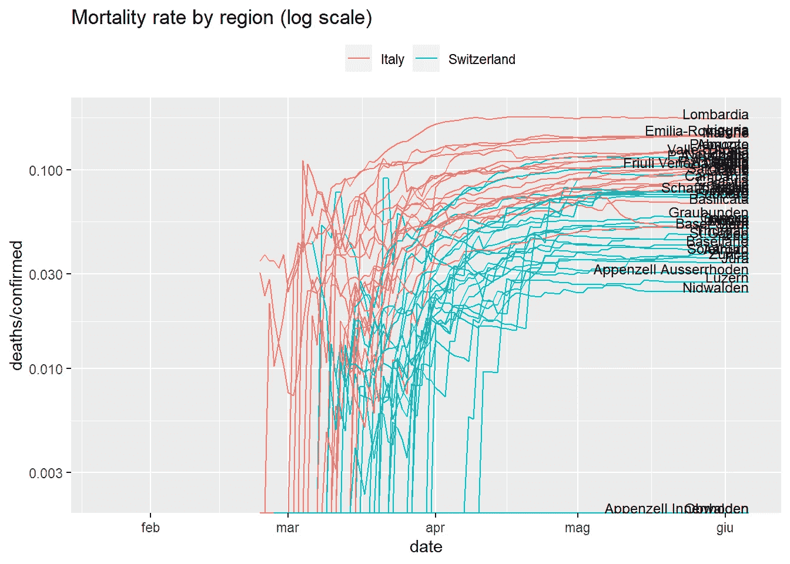

## 政策措施

国家层面的政策由牛津新冠肺炎政府响应跟踪系统获取。管理区域级别 2 和 3 的策略继承自国家级别的策略。详见[文件](https://covid19datahub.io/articles/doc/data.html)。

*示例*:加载美国数据，检测测试政策的变化，并将其与死亡率一起绘制。

```
# US data
x <- covid19("USA", verbose = FALSE)

# detect changes in testing policy
testing_policy_dates <- x$date[diff(x$testing_policy)!=0]

# plot mortality rate and changes in testing policy
ggplot(data = x, aes(x = date, y = deaths/confirmed)) +
  geom_line(aes(color = id)) +
  geom_dl(aes(label = administrative_area_level_1), method = list("last.points", cex = .75, hjust = 1, vjust = 0)) +
  geom_vline(xintercept = testing_policy_dates, linetype = 4) +
  scale_y_continuous(trans = 'log10') +
  theme(legend.position = "none") +
  ggtitle("US mortality rate and changes in testing policy")
```

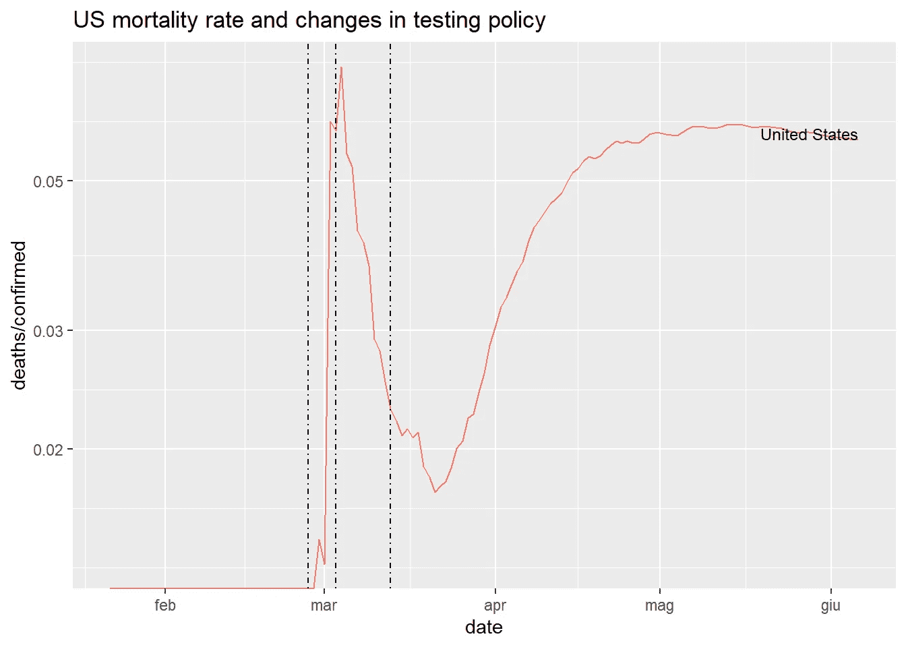

## 世界银行公开数据

数据集可以通过参数`wb`使用[世界银行公开数据](https://data.worldbank.org/)进行扩展，参数`wb`是指标代码的字符向量。可以通过检查相应的 URL 找到代码。例如，这里可用的 GDP 指标[的代码](https://data.worldbank.org/indicator/NY.GDP.MKTP.CD)是`NY.GDP.MKTP.CD`。

*例*:用世界银行指标`NY.GDP.MKTP.CD` (GDP)和`SH.MED.BEDS.ZS`(每千人医院床位)扩展数据集。

```
# download worldwide data + GDP + hospital beds (per 1,000 people)
wb <- c("gdp" = "NY.GDP.MKTP.CD", "hosp_beds" = "SH.MED.BEDS.ZS")
x  <- covid19(wb = wb, raw = TRUE, verbose = FALSE)
```

*例子*:绘制死亡率与医院病床数量的函数关系图。

```
ggplot(data = x, aes(x = hosp_beds, y = deaths/confirmed)) +
  geom_line(aes(color = id)) +
  geom_dl(aes(label = administrative_area_level_1), method = list("last.points", cex = .75, hjust = 1, vjust = 0)) +
  scale_y_continuous(trans = 'log10') +
  xlab("Hospital beds per 1,000 people") +
  theme(legend.position = "none") +
  ggtitle("Worldwide mortality rates (log scale) and number of hospital beds")
```

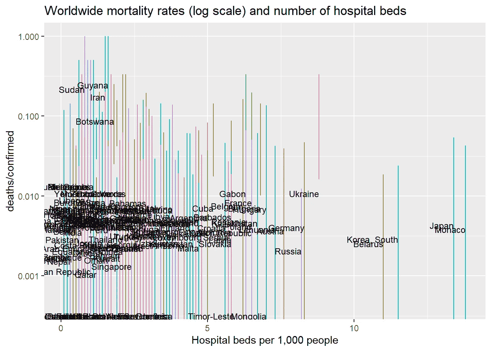

## 谷歌移动报告

数据集可以通过参数`gmr`(Google CSV 文件的 url)用 [Google Mobility Reports](https://www.google.com/covid19/mobility/) 扩展。

```
# at the time of writing, the CSV is available at:
gmr <- "https://www.gstatic.com/covid19/mobility/Global_Mobility_Report.csv"
x   <- covid19("ITA", gmr = gmr, raw = TRUE, verbose = FALSE)
```

*示例*:检测意大利交通政策的变化，并将其与死亡率、确诊病例百分比和谷歌移动指标一起绘制。根据国家/地区，还支持地区或城市级别的移动数据。

```
# detect changes in transport policy
transport_dates <- x$date[diff(x$transport_closing)!=0]

# plot
ggplot(x, aes(x = date)) +
    geom_line(aes(y = confirmed/tests*100, color = "Confirmed/Tested"), size = 1.2) +
    geom_line(aes(y = deaths/confirmed*100, color = "Deaths/Confirmed"), size = 1.2) +
    geom_line(aes(y = residential_percent_change_from_baseline, color = "Residential")) +
    geom_line(aes(y = workplaces_percent_change_from_baseline, color = "Workplaces")) +
    geom_line(aes(y = transit_stations_percent_change_from_baseline, color = "Transit Stations")) + 
    geom_line(aes(y = parks_percent_change_from_baseline, color = "Parks")) +
    geom_line(aes(y = grocery_and_pharmacy_percent_change_from_baseline, color = "Grocery and Pharmacy")) + 
    geom_line(aes(y = retail_and_recreation_percent_change_from_baseline, color = "Retail and Recreation")) + 
    geom_vline(xintercept = transport_dates, linetype = 4) +
    ylab("") +
    theme(legend.position = "bottom", legend.title = element_blank()) +
    ggtitle("ITA - Google mobility and transport policy")
```

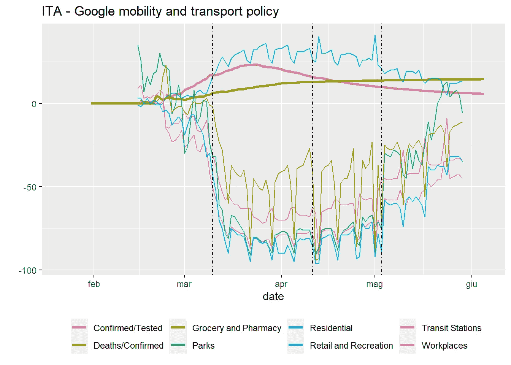

## 苹果移动报告

数据集可以用 [Apple Mobility Reports](https://www.apple.com/covid19/mobility) 通过参数`amr`扩展，这是 Apple CSV 文件的 url。根据国家/地区，还支持地区或城市级别的移动数据。

```
# at the time of writing, the CSV is available at:
amr <- "https://covid19-static.cdn-apple.com/covid19-mobility-data/2009HotfixDev19/v3/en-us/applemobilitytrends-2020-06-03.csv"
x   <- covid19("ITA", amr = amr, raw = TRUE, verbose = FALSE)
```

*示例*:检测意大利交通政策的变化，并将其与死亡率、确诊病例百分比和苹果移动性指标一起绘制。

```
# detect changes in transport policy
transport_dates <- x$date[diff(x$transport_closing)!=0]

# plot
ggplot(x, aes(x = date)) +
    geom_line(aes(y = confirmed/tests*100, color = "Confirmed/Tested"), size = 1.2) +
    geom_line(aes(y = deaths/confirmed*100, color = "Deaths/Confirmed"), size = 1.2) +
    geom_line(aes(y = driving-100, color = "Driving")) +
    geom_line(aes(y = walking-100, color = "Walking")) +
    geom_line(aes(y = transit-100, color = "Transit")) +
    geom_vline(xintercept = transport_dates, linetype = 4) +
    ylab("") +
    theme(legend.position = "bottom", legend.title = element_blank()) +
    ggtitle("ITA - Apple mobility and transport policy")
```

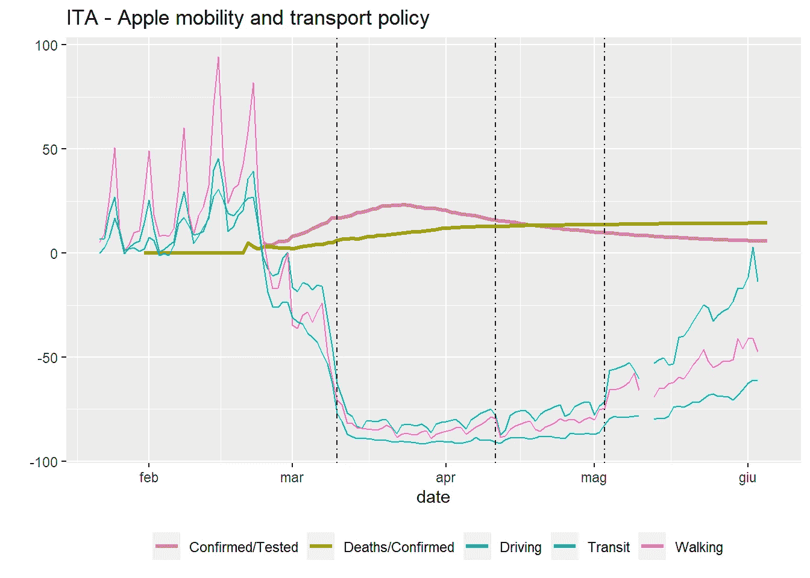

## 规模分析

通过使用`dplyr`包，数据集的结构使得复制多个国家、州和城市的分析变得容易。

```
library("dplyr")
```

加载数据。

```
x <- covid19(raw = TRUE, verbose = FALSE)
```

定义应用于每个组(如国家)的函数，必须返回一个数据帧。例如，该函数可以计算每个国家或地区的 R0。为了简单起见，下面的示例仅限于提取每组的最新死亡人数。

```
f <- function(x, key){
  # x:   the subset of rows for the given group 
  # key: row with one column per grouping variable 

  # code here... 
  example <- tail(x$deaths, 1)

  # return data.frame
  data.frame(id = key$id, example = example)

}
```

定义组，将函数应用于每个组，并绑定结果。

```
y <- x %>% 
  group_by(id) %>% # group by location id
  group_map(f) %>% # apply the function to each group
  bind_rows()      # bind the results
```

打印第一行。

```
head(y, 5)##    id example
## 1 AFG     309
## 2 AGO       4
## 3 ALB      33
## 4 AND      51
## 5 ARE     274
```

## 闪亮的应用程序

`covid19`功能使用内部内存缓存系统，因此数据不会被下载两次。这特别适合交互式框架，比如 Shiny。参见[如何在 5 分钟内构建新冠肺炎数据驱动的闪亮应用](/how-to-build-covid-19-data-driven-shiny-apps-in-5mins-2d7982882a73)。

新冠肺炎数据中心是免费软件，没有任何担保。请确保同意[使用条款](https://covid19datahub.io/LICENSE.html)。

[1]吉多蒂，即阿尔迪亚，d .(2020)。[新冠肺炎数据中心](https://doi.org/10.21105/joss.02376)，《开源软件杂志》，5(51):2376