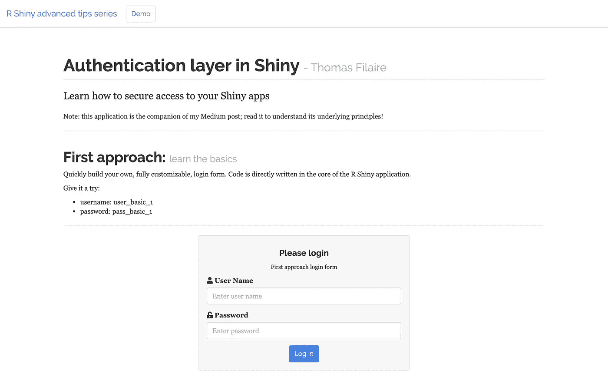

# r 闪亮认证(包括演示应用程序)

> 原文：<https://towardsdatascience.com/r-shiny-authentication-incl-demo-app-a599b86c54f7?source=collection_archive---------2----------------------->

## [实践教程](https://towardsdatascience.com/tagged/hands-on-tutorials)

## 为您的公司创建专业的 web 应用程序



用 R Shiny 构建企业级应用！—此处[提供演示](https://cho7tom.shinyapps.io/authentication/)

## 序文

Shiny 非常强大，可以快速构建交互式 web 应用程序。这也是许多数据科学家的首选技术解决方案，因为它是 R-native。

由于并非所有的网络应用都是公开的，**控制访问的能力应该是任何有抱负的数据科学家的知识的一部分**。

本教程将向你介绍几个选项来通过认证层保护你的应用程序。

**注意**:为了从本教程中获得最大收益，感兴趣的读者应该已经熟悉了基本的 Shiny 原则(例如，反应性，如何使用模块)，web 开发(例如，html 标签和 css)，以及 [RStudio 项目](https://support.rstudio.com/hc/en-us/articles/200526207-Using-Projects)。

## 闪亮的应用伴侣

本教程附带一个 R Shiny 演示应用程序，你可以在这里访问。

**完整代码也在我的** [**bitbucket 账号**](https://bitbucket.org/cho7tom/authentication/src/master/) **上。**

## 简单介绍一下 3 种提议的方法

本教程将介绍几种安全访问 R Shiny web 应用程序的方法。

1.  首先，我将**介绍身份验证的基础知识**，构建我自己的登录表单，在用户提供正确凭证的情况下让应用程序出现(而登录表单消失)。
2.  然后，我会**把登录表单和对应的服务器逻辑打包成一个** [**模块**](https://shiny.rstudio.com/articles/modules.html) 。这将增加应用程序的可读性和可维护性，并使您的登录表单易于跨多个应用程序重用。
3.  第三步，我将**利用**[**shinyauthr**](https://paul.rbind.io/shinyauthr/)**包**，这基本上是第二步的一个实现，增加了一些功能，包括**密码散列**(基于[钠](https://github.com/jeroen/sodium)包)。
4.  最后，我简单提一下**两个**其他方法。

**注意**:为了便于演示，我创建了一个表来直接存储来自 Shiny server 部分的用户名和密码。请记住，在应用程序部署在生产环境中的情况下,**凭证应该加密并存储在数据库中**(数据库连接不在本文讨论范围内)。

# 第一种方法—基础

在本节中，您将学习如何构建自己的登录表单，如下图所示:

访问配套的应用程序来测试它现场[这里](https://cho7tom.shinyapps.io/authentication/)！

我将介绍登录表单的**设计和相应的**服务器逻辑**。代码解释分为 3 个步骤:**

1.  加载所需的包并构建应用主干
2.  构建您自己的完全可定制的登录表单
3.  定义服务器端

## 步骤 1.1 —加载所需的包并构建应用主干

我用了以下 4 个**包** : [闪亮](https://shiny.rstudio.com/)、[亮泽](https://rstudio.github.io/shinythemes/)、[亮泽](https://deanattali.com/shinyjs/)和[不亮泽](https://www.tidyverse.org/)

```
**# 1 - SET THE SCENE**# **load required packages** 
library(shiny)          # web app framework 
library(shinyjs)        # improve user experience with JavaScript
library(shinythemes)    # themes for shiny
library(tidyverse)      # data manipulation
```

然后我使用 [navbarPage](https://www.rdocumentation.org/packages/shiny/versions/1.5.0/topics/navbarPage) 设计了一个简单的应用主干:

```
**# 2 - UI PART****# app backbone**ui <- **navbarPage**(
    title = "R Shiny advanced tips series",
    collapsible = TRUE,
    windowTitle = "R Shiny tips - TFI",
    theme = shinytheme("readable"),        

    **tabPanel**(
        title = "Demo",
        useShinyjs()    # Include shinyjs )
)**# 3 - SERVER PART**server <- function(input, output, session) {}**# 4 - RUN APP**shinyApp(ui = ui, server = server)
```

## 步骤 1.2 —构建您自己的完全可定制的登录表单

登录表单需要以下 3 个组件:

1.  一个文本输入来捕获**用户名**
2.  获取**密码**的密码输入(类似于文本输入，除了文本被隐藏)
3.  一个动作按钮**确认/弱化对应用程序的访问**

这里有一个简单的代码块，您可以根据自己的喜好进行修改。在我的例子中，我主要使用基本的 [bootstrap](https://getbootstrap.com/docs/3.4/getting-started/) 类来使文本居中(*文本居中*)，并给登录表单添加浅灰色背景(*井*)。

登录表单应该位于一个带有“*类容器*的专用 div 中。

还请注意:

*   **应定义一个 id**，以便在认证成功时，登录表单消失。该部分在步骤 1.3 中定义
*   使用 ***tagList()*** 函数在文本输入和密码输入标签旁边添加图标

```
**div**(
    id = "**login-basic**", 
    style = "width: 500px; max-width: 100%; margin: 0 auto;",

    **div**(
        class = "**well**",
        h4(class = "**text-center**", "Please login"),
        p(class = "**text-center**", 
          tags$small("First approach login form")
        ),

        **textInput**(
            inputId     = "ti_user_name_basic", 
            label       = **tagList**(icon("user"), 
                                  "User Name"),
                            placeholder = "Enter user name"
        ),

        **passwordInput**(
            inputId     = "ti_password_basic", 
            label       = **tagList**(icon("unlock-alt"), 
                                  "Password"), 
            placeholder = "Enter password"
        ), 

        div(
            class = "text-center",
            **actionButton**(
                  inputId = "ab_login_button_basic", 
                  label = "Log in",
                  class = "btn-primary"
            )
        )
    )
)
```

## 步骤 1.3 —定义服务器端

服务器端是开发人员将智能注入应用程序、定义和控制预期行为的地方。

我首先构建了一个简单表来存储用户凭证。在这个例子中，我只授予一个用户(“user_basic_1”)访问权限，但是您当然可以定义任意多的 user x 密码组合。

```
# >> insert in server part**# create userbase**user_base_basic_tbl <- tibble(
    user_name = "user_basic_1",
    password  = "pass_basic_1"
)
```

在第二步中，我使用了***event reactive()***函数根据有效凭证(存储在上述用户库中)检查用户的登录和密码。一旦用户单击登录按钮，就会相应地切换真/假布尔参数。

```
# >> insert in server part**# check credentials vs tibble**validate_password_basic <- **eventReactive**(input$ab_login_button_basic, {

   validate <- **FALSE**

   if (input$ti_user_name_basic == user_base_basic_tbl$user_name &&
            input$ti_password_basic == user_base_basic_tbl$password    {validate <- **TRUE**}})
```

基于这个布尔值:

1.  **登录表单会隐藏**，使用***shinyjs::hide()***函数在一个***observe event()***内。这需要一个 id 来引用要隐藏的适当的 UI 部分，这就是我在步骤 1.2 中的注释。
2.  **app 的安全部分会出现**，采用经典的***render ui()***+***ui output()***组合

```
# >> insert in server part**# hide form** **observeEvent**(validate_password_basic(), {
       **shinyjs::hide**(id = "login-basic")
})**# show app** output$display_content_basic <- **renderUI**({

   req(validate_password_basic())

   div(
       class = "bg-success",
       id = "success_basic",
       h4("Access confirmed!"),
       p("Welcome to your basically-secured application!")
   )

})
```

uiOutput 应该插入到 ui 部件中

```
**# app** **uiOutput**(outputId = "display_content_basic")
```

如果到目前为止你已经能够理解并重现这个例子，那么恭喜你。您刚刚构建了第一个登录组件来保护您的 R Shiny 应用程序。

因为这个过程需要大量的代码，这使得你的应用程序很难长期维护，让我们把它打包成一个模块！

## 第二种方法——开发登录模块

既然您已经理解了身份验证的基本原理，并且已经构建了您的第一个登录表单，让我们使**更健壮**和**更容易跨多个应用程序重用**。这可以通过定义一个专用的 [**模块**](https://shiny.rstudio.com/articles/modules.html) 来实现。

> 一个闪亮的模块是一个闪亮应用的一部分。不能直接运行，闪亮的 app 可以。相反，它是作为一个更大的应用程序的一部分(或者作为一个更大的闪亮模块的一部分——它们是可组合的)。—Wiston Chang—r studio 软件工程师

**注意**:本教程不会详细介绍如何创建一个模块，我假设读者对它的[的关键概念](https://shiny.rstudio.com/articles/modules.html)有点熟悉。

简而言之，一个模块由两个函数组成，这两个函数代表 1)一段 UI，以及 2)使用该 UI 的服务器逻辑片段——类似于将闪亮的应用程序分为 UI 和服务器逻辑的方式。

查看下面的简短插图，了解第二种方法将会构建什么；如您所见，UI 部分看起来与我在第一种方法中构建的完全相同。然而，它在引擎盖下有所不同:

点击访问配套应用进行现场测试[！](https://cho7tom.shinyapps.io/authentication/)

代码解释分为 4 个步骤:

1.  构建模块
2.  获取模块的源代码
3.  在 UI 部分添加登录表单+应用程序的安全部分
4.  定义服务器端

## 步骤 2.1 —构建模块

这个步骤主要是将我在前面的方法中实现的定制 UI 和相关的服务器逻辑整合到一个单独的 **module_login 中。R** 文件。

下面代码块中需要注意的关键方面:

**UI 部分:**

*   ***NS()*** 的用法:创建模块时所有 UI 函数体都要以此行开头。它获取字符串 id 并创建一个名称空间函数。所有 id 名称必须封装在 **ns()** 中。感兴趣的读者可以在这里了解更多
*   该函数使用另一个变量 *title* ，以使**易于定制**登录页面标题，如果您需要在其他未来 R Shiny 应用程序的上下文中使用该模块的话

```
**# UI component**login_ui <- function(id, **title**) {

    ns <- **NS**(id) # namespaced id

    # define ui part
    **div**(
        id = **ns**("login"),
        style = "width: 500px; max-width: 100%; margin: 0 auto;",

        **div**(
            class = "well",

            h4(class = "text-center", **title**),
            p(class = "text-center", 
              tags$small("Second approach login form")),

            **textInput**(
                inputId     = **ns**("ti_user_name_module"),
                label       = tagList(icon("user"), 
                                      "User Name"),
                placeholder = "Enter user name"
            ),

            **passwordInput**(
                inputId     = **ns**("ti_password_module"), 
                label       = tagList(
                                 icon("unlock-alt"), 
                                 "Password"
                              ), 
                placeholder = "Enter password"
            ), 

            **div**(
                class = "text-center",
                **actionButton**(
                    inputId = **ns**("ab_login_button_module"), 
                    label   = "Log in",
                    class   = "btn-primary"
                )
            )
        )
    )
}
```

**服务器部分:**

*   使用 ***{{ }}*** 在函数中使用用户提供的表达式。更多关于这个[的信息，请点击这里](https://dplyr.tidyverse.org/articles/programming.html#how-tos-1)阅读
*   对***shinyjs::hide()***的调用嵌入在模块的服务器部分，因此不再需要像我在第一种方法中那样使用 observeEvent

```
**# SERVER component**validate_pwd <- function(input, output, session, 
                         data, user_col, pwd_col) {

    **# get user and pwd from data/ user_col/ pwd_col information**
    user <- data %>% pull(**{{** user_col **}}**) 
    pwd  <- data %>% pull(**{{** pwd_col **}}**) 

    **# check correctness**
    **eventReactive**(input$ab_login_button_module, {

        validate <- FALSE

        if (input$ti_user_name_module == user &&
            input$ti_password_module == pwd) {
            validate <- TRUE
        }

        **# hide login form when user is confirmed**
        if (validate) {
            **shinyjs::hide**(id = "login")
        }

        validate
    })
}
```

## 步骤 2.2 —源模块

在你的 R Shiny 应用程序中使用一个特定的模块之前，要注意对它进行适当的编译(参见我的 [bitbucket account](https://bitbucket.org/cho7tom/authentication/src/master/) 以了解项目结构):

```
**# source module** 
source("modules/module_login.R")
```

## 步骤 2.3 —在 UI 部分添加登录表单+应用程序的安全部分

登录表单和应用程序的安全部分现在都可以用两行代码在 UI 部分指定，这确保了应用程序的可读性和可维护性。

```
**# login form** as defined in the module
**login_ui**(id = "module_login", title = "Please login"),

**# app** 
**uiOutput**(outputId = "display_content_module")
```

## 步骤 2.4 —定义服务器端

这与 1.3 节非常相似。

我首先构建了一个简单表来存储用户凭证。在这个例子中，我只授予一个用户访问权限，但是您当然可以定义任意多的用户 x 密码组合。

```
# >> insert in server part**# create userbase**user_base_module_tbl <- tibble(
        user_name = "user_module_1",
        password  = "pass_module_1"
)
```

然后，我使用 ***callModule()*** 函数来访问我的模块的服务器端，并传递在哪里搜索登录和密码的信息(通过 data、user_col 和 pwd_col 参数来引用上面的 userbase):

```
**# check credentials vs tibble** 
validate_password_module <- **callModule**(
        module   = validate_pwd, 
        id       = "module_login", 
        data     = user_base_module_tbl, 
        user_col = user_name, 
        pwd_col  = password
)
```

最后，和第一种方法一样，我使用经典的***render ui()***+***ui output()***组合来显示应用程序的安全部分，只要上面定义的布尔***validate _ password _ module()***适当地切换:

```
**# app** 
output$display_content_module <- **renderUI**({

    req(validate_password_module())

    div(
        class = "bg-success",
        id = "success_module",
        h4("Access confirmed!"),
        p("Welcome to your module-secured application!")
    )

})
```

**如果到目前为止你已经能够理解并重现这个例子，那么恭喜你。您已经能够将完全可定制的登录表单打包到一个模块中，您可以在未来的所有 web 应用程序中重用该模块。**

在下一节中，我们将利用现有的认证模块，该模块在 [shinyauthr](https://paul.rbind.io/shinyauthr/) 包中可用。与构建自己的模块相比，主要优势在于:

*   **不需要你掌握建筑模块的艺术**， [shinyauthr](https://paul.rbind.io/shinyauthr/) 让你随时可以使用
*   **能够通过[钠](https://github.com/jeroen/sodium)包加密你的密码**。钠使用哈希算法，这是专门设计来保护存储的密码免受暴力攻击

## 第三种方法——利用 SHINYAUTHR 包

Shinyauthr 是一个提供模块函数的 R 包，可以用来给你闪亮的应用添加一个认证层。如果到目前为止您已经成功地构建了自己的模块，那么第三种方法应该很容易遵循，并且**我推荐您使用这个包来加速您未来的工作**。

查看下面的简短插图，了解第三种方法将会构建什么；虽然它看起来非常类似于方法 1 和 2，但登录表单的可定制性稍差。

访问配套应用程序进行现场测试[点击这里](https://cho7tom.shinyapps.io/authentication/)！

下面的代码解释将指定新的必需包，说明如何更新 ui 部分并详述服务器端。提醒一下，完整的代码可以在[这里](https://bitbucket.org/cho7tom/authentication/src)获得。

## 步骤 3.1 —加载所需的包

除了前面提到的包，您还需要加载 [shinyauthr](https://paul.rbind.io/shinyauthr/) 和[钠](https://github.com/jeroen/sodium)包。

```
library(shinyauthr)     # shiny authentication modules
library(sodium)         # crypto library
```

## 步骤 3.2 —在 UI 部分添加登录表单+应用程序的安全部分

登录表单和应用程序的安全部分现在都可以用两行代码在 UI 部分指定，这确保了应用程序的可读性和可维护性。

*   shinyauthr 包中的 loginUI() 函数与您在第二种方法中构建的函数非常相似。标题(可以定制其他一些参数)
*   应用程序的安全部分通过 **uiOutput()** 函数显示

```
**# login form****shinyauthr::loginUI**(
     id = "authr_login", 
     **title** = h4(class = "text-center", "Please login")
),

**# app** **uiOutput**(outputId = "display_content_authr"),
```

## 步骤 3.3 —定义服务器端

我首先构建了一个简单表来存储用户凭证。在这个例子中，我只授予一个用户访问权限，但是您当然可以定义任意多的用户 x 密码组合。

注意使用***password _ store()***函数从钠包中加密密码。

```
# >> insert in server part**# create userbase**uuser_base_authr_tbl <- tibble(
     user_name = "user_authr_1",
     password  = **sodium::password_store**("pass_authr_1")
)
```

然后我调用了 shinyauthr 包中的两个模块(一个登录表单+一个注销表单)

```
# >> insert in server partlogout_init <- **callModule**(
      module = **shinyauthr::logout**,
      id     = "authr_logout",
      active = reactive(user_auth)
)

credentials <- **callModule**(
      module   = **shinyauthr::login**,
      id       = "authr_login",
      data     = user_base_authr_tbl, 
      user_col = user_name,
      pwd_col  = password, 
      sodium_hashed = TRUE,
      log_out  = reactive(logout_init())
)
```

当调用登录模块时，它返回包含 2 个元素的反应列表:

*   **user_auth** (初始值为假)
*   信息(初始值为空)

我在服务器端创建了一个 reactive 对象来捕捉这些值的变化(特别是，如果用户提供了匹配的用户名和密码，user_auth 将变为 TRUE。)

```
# >> insert in server partuser_auth <- reactive({
        credentials()$**user_auth**
})

user_data <- reactive({
        credentials()$**info**
})
```

最后，我需要在 renderUI()函数中定义应用程序的安全部分，类似于前面的方法。

```
# >> insert in server partoutput$display_content_authr <- **renderUI**({

        req(user_auth())

        div(
            class = "bg-success",
            id = "success_module",
            h4("Access confirmed!"),
            p("Welcome to your shinyauthr-secured application! 
              Notice that password is encrypted.")
        )

})
```

**祝贺您**如果您已经做到了这一步，那么您现在就拥有了一种快速、强大且简单的方法来保护您的应用程序！

# 其他方法

我通常实现上面 3 个详细方法中的一个。

但是，它们并不是唯一的选择，您可能有兴趣探索其他替代方案，例如:

*   [shinymanager](https://datastorm-open.github.io/shinymanager/) (非常类似于 shinyauthr)
*   [完善的](https://polished.tech/)一个非免费的解决方案，为您提供除身份验证之外的几个附加功能，例如:**自定义登录页面、用户管理、单点登录或用户监控**

## 结论

我希望你觉得这个教程有用，请随时留下评论来分享你的首选(也可能是替代)方法。

**想了解更多？**本文是我高级 R 闪亮小贴士系列的第二篇。第一篇文章是关于构建动态 UI 组件的。

## 资源

*   [shinymanager](https://datastorm-open.github.io/shinymanager/) :单一 Shiny 应用的简单安全认证机制。
*   [shinyauthr](https://paul.rbind.io/shinyauthr/) : R 包提供模块函数，可用于为您的闪亮应用添加认证层
*   [完美的](https://polished.tech/):为您闪亮的应用程序添加身份验证
*   [掌握 Shiny](https://mastering-shiny.org/) :这本书补充了 [Shiny 的在线文档](https://shiny.rstudio.com/)，旨在帮助应用程序作者更深入地了解 Shiny
*   [商业科学 202A —使用 R 构建可扩展的应用程序](https://university.business-science.io/p/expert-shiny-developer-with-aws-course-ds4b-202a-r/):一门很棒的在线课程