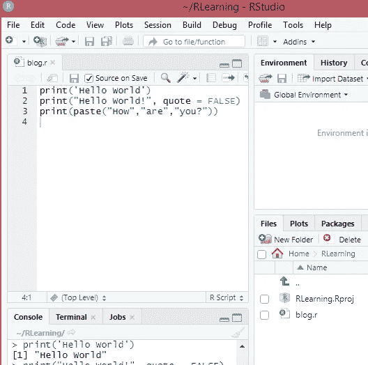
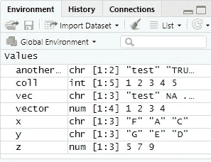
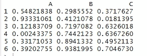
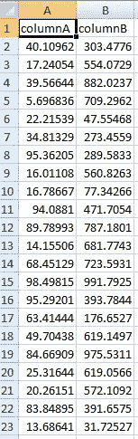
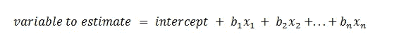
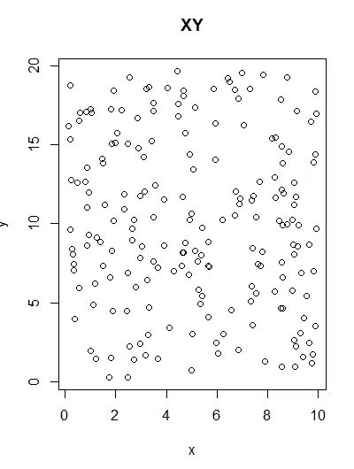
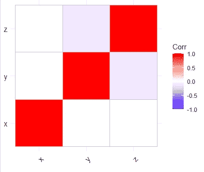
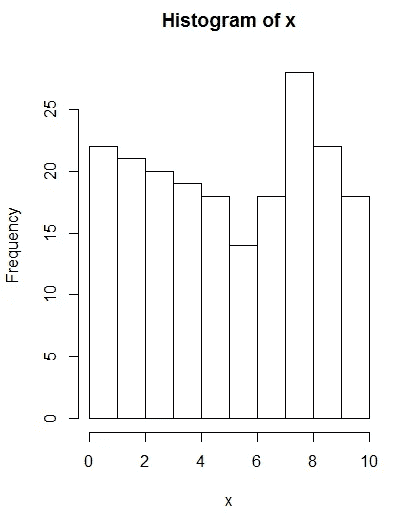
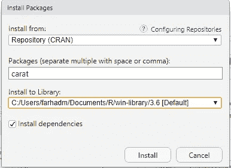
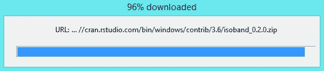

# R -统计编程语言

> 原文：<https://towardsdatascience.com/r-statistical-programming-language-6adc8c0a6e3d?source=collection_archive---------2----------------------->

## 让我们不要让冠状病毒阻止我们学习新技能

如果可能的话，我们应该利用这段时间学习一项新技能。在过去的几周里，我一直在学习编程语言 R。

> 本文旨在概述 R 编程语言以及每个数据科学家都必须熟悉的所有主要概念

# 动机

数据科学和定量开发领域要求我们不断适应和学习新技能，因为它具有高度动态和高要求的性质。在数据科学家的职业生涯中，学习多种编程语言变得非常重要。随后，我选择了学习 r。

本文旨在概述所有关键的主要领域，并从基础开始解释一切。它假设读者不熟悉编程语言 r，或者对编程语言 r 只有初级的理解。

> 我强烈推荐 R，原因有很多，我将在本文中重点介绍


克里斯·迪诺托在 [Unsplash](https://unsplash.com?utm_source=medium&utm_medium=referral) 上拍摄的照片

r 越来越受欢迎，它是最流行的编程语言之一。r 是统计学家为统计学家写的。它可以很好地与其他编程语言如 C++，Java，SQL 集成。此外，R 主要被视为一种统计编程语言。因此，许多金融机构和大型量化组织在研发过程中使用 R 编程语言。

> Python 是一种通用语言，R 可以看作是一种分析性编程语言。

# 1.文章目标

本文将解释关于 R 的以下关键领域:

1.  R 是什么？
2.  如何安装 R？
3.  在哪里编码 R？
4.  什么是 R 包和 R 脚本？
5.  有哪些不同的 R 数据类型？
6.  如何在 R 中声明变量及其作用域？
7.  怎么写评论？
8.  什么是矢量？
9.  什么是矩阵？
10.  什么是列表？
11.  什么是数据框？
12.  R 中不同的逻辑运算
13.  R 中的函数
14.  R 中的循环
15.  读写 R 中的外部数据
16.  在 R 中执行统计计算
17.  在 R 中绘图
18.  R 语言中的面向对象编程
19.  著名 R 图书馆
20.  如何安装外部 R 库
21.  在 R 中绘图

# 让我们开始…

我将从基础开始解释这种编程语言，以使这种语言更容易理解。说了这么多，编程进阶的关键是始终尽可能多的练习。

> 这篇文章应该为读者打下坚实的基础

# 2.R 是什么？

*   r 是一种在 GNU 许可下的自由编程语言。简而言之，R 是一个统计环境。
*   r 主要用于统计计算。它提供了一系列在机器学习领域广泛使用的算法，如时间序列分析、分类、聚类、线性建模等。
*   r 也是一个环境，它包括一套软件包，可用于执行数值计算、图表绘制和数据操作。
*   r 在统计研究项目中大量使用。
*   r 非常类似于 S 编程语言。
*   r 在 UNIX、Windows、MacOS、FreeBSD 和 Linux 平台上编译运行。
*   r 有大量的数据结构、操作符和特性。它提供了从数组到矩阵，从循环到递归，以及与其他编程语言如 C、C++和 Fortran 的集成。
*   可以用 c 编程语言直接更新 R 对象。
*   可以实现新的 R 包来扩展。
*   r 解释程序
*   r 受到 S+的启发，因此如果你熟悉 S，那么学习 r 将是一项简单的任务。

## R 的好处:

除了上面列出的好处，R 还包括:

*   简单易学
*   大量的统计、分析和图形软件包是开源和免费的
*   大量的学术论文及其在 R 中的实现都是可用的
*   世界顶级大学教授他们的学生 R 编程语言，因此，它现在已经成为一个公认的标准，因此，R 将继续增长。
*   与其他语言的集成能力
*   此外，还有大量的社区支持

## R 的局限性:

也有一些限制:

*   r 没有 C++快，而且安全性和内存管理也是个问题。
*   r 有大量的名称空间，有时会显得太多。然而，情况正在好转。
*   r 是一种统计语言，因此不像 Python 那样直观。创建 OOP 不像用 Python 那么简单。

# 让我们开始学习 R

现在，我将在快速跟进部分介绍 R 语言。


乔纳斯·雅各布森在 [Unsplash](https://unsplash.com?utm_source=medium&utm_medium=referral) 上拍摄的照片

# 3.如何安装 R？

您可以在以下位置安装 R:

*   乌布托
*   苹果个人计算机
*   Windows 操作系统
*   一种男式软呢帽
*   一种自由操作系统
*   SLES
*   OpenSUSE

## 第一步是下载 R:

*   打开互联网浏览器
*   去 www.r-project.org 的。
*   写这篇文章时最新的 R 版本是 3.6.3(手持风向袋)。它于 2020 年 2 月 29 日发布。

这些是链接:

*   [下载 R for Linux](https://cran.r-project.org/bin/linux/)
*   [下载适用于(Mac) OS X 的 R](https://cran.r-project.org/bin/macosx/)
*   [下载 R for Windows](https://cran.r-project.org/bin/windows/)

# 4.在哪里编码 R？

有多种图形界面可用。我强烈推荐 R-Studio



R-Studio 的截图

下载 RStudio 桌面:

*   从 https://rstudio.com/products/rstudio/download/[下载 r studio](https://rstudio.com/products/rstudio/download/)
*   RStudio 桌面开源许可是免费的
*   你可以在这里了解更多:【https://rstudio.com/products/rstudio/#rstudio-desktop】T4
*   RStudio 需要 [R 3.0.1+](http://cran.rstudio.com/) 。

如果您使用的是 Windows，它通常会将 R Studio 安装在以下位置:

C:\Program Files\RStudio

# 5.什么是 R 包和 R 脚本？

R 包和 R 脚本是 R 的两个关键组件。

## r 包

因为 R 是一种开源编程语言，所以理解什么是包是很重要的。包本质上是对代码和其他功能的分组和组织。包是一个可以包含大量文件的库。

数据科学家可以通过创建自己的包或增强他人的包来贡献并与他人共享他们的代码。包允许数据科学家重用代码并将其分发给其他人。

> 创建包是为了包含函数和数据集

数据科学家可以创建一个包来组织代码、文档、测试、数据集等。然后该包可以与其他人共享。

网上有上万个 R 包。这些包位于中央存储库中。有许多可用的存储库，如 CRAN、Bioconductor、Github 等。

一个值得一提的存储库是 CRAN。它是一个服务器网络，为 r 存储了大量版本的代码和文档。

一个包包含一个描述文件，其中包含日期、依赖项、作者以及包的版本等信息。描述文件帮助消费者获得关于包的有意义的信息。

*要加载包，请键入:*

```
*library(name of the package)*
```

要使用软件包的函数，请键入软件包的名称::函数的名称。

例如，如果我们想使用“carat”包的函数“AdBCDOne ”,那么我们可以:

```
library(carat)
carat::AdBCDOne()
```

## r 脚本:

R script 是数据科学家编写统计代码的地方。它是一个带有扩展名的文本文件。我们可以称这个脚本为教程。稀有

我们可以在一个包中创建多个 R 脚本。

例如，如果您创建了两个 R 脚本:

1.  博客。稀有
2.  出版。稀有

如果你想调用出版的功能。r 在博客里。然后，您可以使用 source("target R script ")命令来导入发布。r 进入博客。R *:*

```
source("publication.R")
```

## 创建 R 脚本的 R 包

过程相对简单。简单地

1.  创建描述文件
2.  创建 R.scripts 并添加包所需的任何数据集、文档和测试
3.  用 R 脚本编写你的功能
4.  我们可以使用 devtools 和 roxygen2 通过使用以下命令来创建 R 包:

```
create_package("name of the package")
```

# 6.有哪些不同的 R 数据类型？

为了能够有效地使用 R 编程语言，理解 R 中不同的数据类型和结构是至关重要的。本节将阐述这些概念。

## 数据类型:

这些是 R 中的基本数据类型:

1.  **字符**:如“abc”或“a”
2.  **整数**:如 5L
3.  **数字**:如 10.5
4.  **逻辑**:真或假
5.  **复杂**:如 5+4i

我们可以使用 typeof(变量)来查找变量的类型。

要查找元数据，如类型的属性，请使用 attributes(variable)命令。

## 数据结构:

r 中有许多数据结构，最重要的数据结构有:

1.  **vector** :最重要的数据结构，本质上是元素的集合。
2.  **矩阵**:具有行和列的表状结构
3.  **数据框**:用于执行统计操作的表格数据结构
4.  **列出了**:可以保存数据类型组合的集合。
5.  **因子**:表示分类数据

## 当我们开始构建基础时，我将在本文中解释所有这些数据类型和数据结构。

# 7.如何声明变量？

我们可以创建一个变量并给它赋值。变量可以是上面列出的任何数据类型和数据结构。也有其他可用的数据结构。此外，开发人员可以创建他们自己的自定义类。

变量用于存储可以在代码中更改的值。

作为理解的问题，记住 R 中的环境是什么是至关重要的。本质上，环境是存储变量的地方。它是对的集合，其中对的第一项是符号(变量)，第二项是它的值。

环境是分层的(树形结构)，因此一个环境可以有一个父环境和多个子环境。根环境是父环境为空的环境。

我们必须声明一个变量，并用→

```
x <- "my variable"
print(x)
```

这会将“我的变量”的值设置为变量 x，print()函数会输出 x 的值，也就是“我的变量”。

每当我们声明一个变量并调用它时，就在当前环境中搜索它，并在父环境中递归搜索，直到找到该符号。

要创建整数集合，我们可以这样做:

```
coll <- 1:5
print(coll)
```

1 是集合的第一个值，5 是集合的最后一个值。

这将打印 1 2 3 4 5

注意，R-Studio IDE 会跟踪变量:



R 工作室截图

*`*ls()*`*函数可以用来显示当前环境中的变量和函数。**

# *8.怎么写评论？*

*代码中添加了注释，以帮助读者、其他数据科学家和您自己理解代码。*

*注意:始终确保注释不会污染您的脚本。*

*我们可以添加一行注释:*

```
*#This is a single line comment*
```

*我们可以使用双引号添加多行注释:*

```
*"This is a 
multi line comment
"*
```

**注意:在 R-Studio 中，选择要注释的代码，然后按 Ctrl+Shift+C**

**它会自动为你评论代码。**

# *9.什么是矢量？*

*向量是 r 中最重要的数据结构之一。本质上，向量是元素的集合，其中每个元素都需要具有相同的数据类型，例如逻辑(真/假)、数字、字符。*

*我们也可以创建一个空向量:*

```
*x <- vector()*
```

*默认情况下，向量的类型是逻辑的，例如 True/False。下面一行将逻辑打印为矢量类型:*

```
*typeof(x)*
```

*要使用元素创建向量，可以使用 concatenate 函数(c):*

```
*x <- c("Farhad", "Malik", "FinTechExplained")
print(x)*
```

*这将打印:*

*[1]《法尔哈德》
【2】《马利克》
【3】《fintech explained》*

*如果我们想求出一个向量的长度，我们可以使用 length()函数:*

```
*length(x)* 
```

*这会打印出 3，因为向量中有三个元素。*

*要将元素添加到向量中，我们可以将元素与向量结合起来。*

*例如，在带有一个元素“hello”的 vector 的开头添加“world”:*

```
*x <- c("hello")
x <- c("world", x)
print(x)*
```

*这将打印“世界”“你好”*

*如果我们混合元素的类型，那么 R 也将适应向量的类型。向量的类型(模式)将变成它认为最适合向量的类型:*

```
*another_vec <- c("test", TRUE)
print(typeof(another_vec))*
```

*虽然第二个元素是一个逻辑值，但类型将被打印为“字符”。*

*运算也可以在向量上执行。*

*例如，将一个标量乘以一个向量:*

```
*x <- c(1,2,3)
y <- x*2
print(y)*
```

*这将打印 2，4，6*

*我们也可以将两个向量相加:*

```
*x <- c(1,2,3)
y <- c(4,5,6)
z <- x+y
print(z)*
```

*这将打印 5 7 9*

*如果向量是字符，我们想把它们加在一起:*

```
*x <- c("F","A","C")
y <- c("G","E","D")
z <- x+y
print(z)*
```

*它将输出:*

**x+y 错误:二元运算符的非数字参数**

# *10.什么是矩阵？*

*矩阵也是 r 中最常见的数据结构之一。*

*它可以被认为是一个向量的延伸。矩阵可以有多行和多列。矩阵的所有元素必须具有相同的数据类型。*

*若要创建矩阵，请使用 matrix()构造函数并传入 nrow 和 ncol 来指示列和行:*

```
*x <- matrix(nrow=4, ncol=4)*
```

*这将创建一个名为 x 的矩阵变量，有 4 行 4 列。*

*通过在构造函数中传递矩阵，可以将向量转换为矩阵。生成的矩阵将按列填充:*

```
*vector <- c(1, 2, 3)
x <- matrix(vector)
print(x)*
```

*这将创建一个 1 列 3 行的矩阵(每个元素一行):*

*[，1]
【1，】1
【2，】2
【3，】3*

*如果我们想按行或列填充矩阵，那么我们可以显式地传入行数和列数以及 *byrow* 参数:*

```
*vector <- c(1, 2, 3, 4)
x <- matrix(vector, nrow=2, ncol=2, byrow=TRUE)
print(x)*
```

*上面的代码创建了一个 2 行 2 列的矩阵。矩阵按行填充。*

*[，1] [，2]
[1，] 1 2
[2，] 3 4*

# *11.什么是列表和因子？*

*如果我们想创建一个可以包含不同类型元素的集合，那么我们可以创建一个列表。*

## *列表:*

*列表是 r 中最重要的数据结构之一。要创建列表，请使用 list()构造函数:*

```
*my_list <- list("hello", 1234, FALSE)*
```

*上面的代码片段演示了如何用不同数据类型的三个元素创建一个列表。*

*我们可以通过使用索引来访问任何元素，例如:*

```
*item_one = my_list[1]*
```

*这将打印“你好”*

*我们也可以给每个元素起一个名字，例如*

```
*my_named_list <- list(“A”=1, “B”=2)print(names(my_named_list))It prints “A” “B”print(my_named_list[‘A’])It prints 1*
```

## *因素:*

*因素是分类数据，例如是、否或男性、女性或红色、蓝色、绿色等。*

*可以创建因子数据类型来表示因子数据集:*

```
*my_factor = factor(c(TRUE, FALSE, TRUE))
print(my_factor)*
```

*因子也可以排序:*

```
*my_factor = factor(c(TRUE, FALSE, TRUE), levels = c(TRUE, FALSE))
print(my_factor)*
```

*我们还可以用表格的形式打印这些因子:*

```
*my_factor = factor(c(TRUE, FALSE, TRUE), levels = c(TRUE, FALSE))
print(table(my_factor))*
```

*这将打印:*

```
*TRUE FALSE 
    2     1*
```

> *我们已经讨论了文章的一半。让我们继续学习更多的统计学知识*

# *12.什么是数据框？*

*大多数(如果不是全部的话)数据科学项目需要表格格式的输入数据。数据框数据结构可以用来表示 r 中的表格数据。每一列可以包含一个元素列表，每一列可以是彼此不同的类型。*

*要创建 2 列 5 行的数据框，只需执行以下操作:*

```
*my_data_frame <- data.frame(column_1 = 1:5, column_2 = c("A", "B", "C", "D", E"))
print(my_data_frame)column_1 column_2
1        1        A
2        2        B
3        3        C
4        4        D
5        5        E*
```

# *13.R 中的不同逻辑运算符*

*本节概述了常用运算符:*

## *或者:一|二*

*这将检查一个或两个是否为真。*

## *还有:一和二*

*这将检查一和二是否为真。*

## *不是:！投入*

*如果输入为假，将返回真*

## *我们也可以使用、>、isTRUE(输入)等。*

# *14.R 和变量作用域中的函数*

*有时我们希望代码执行一组任务。这些任务可以按功能分组。函数本质上是 r 中的对象。*

*在 R 中，参数可以传递给函数，函数也可以返回一个对象。*

*r 附带了许多内置函数，如 length()、mean()等。*

*每次我们声明一个函数(或变量)并调用它时，在当前环境中搜索它，并在父环境中递归搜索，直到找到该符号。*

*一个函数有一个名字。这个存储在 R 环境中。函数体包含函数的语句。*

> *一个函数可以返回值，并且可以选择接受一些参数。*

*要创建一个函数，我们需要以下语法:*

```
*name_of_function <- function(argument1...argumentN) {
   Body of the function}*
```

*例如，我们可以创建一个接受两个整数并返回一个和的函数:*

```
*my_function <- function(x, y) {
  z <- x + y
  return(z)
}*
```

*要调用该函数，我们可以传入参数:*

```
*z <- my_function(1,2)
print(z)*
```

*这将打印 3。*

*我们还可以为参数设置默认值，以便在参数值未提供的情况下采用其值:*

```
*my_function <- function(x, y=2) {
  z <- x + y
  return(z)
}
output <- my_function(1)
print(output)*
```

*y 的缺省值是 2，因此，我们可以调用这个函数而不用传入 y 的值。*

*需要注意的关键是花括号{...}*

***让我们看一个复杂的例子，我们将使用逻辑运算符***

*假设我们想要创建一个接受以下参数的函数:模式、x 和 y。*

*   *如果模式为真，那么我们要把 x 和 y 相加。*
*   *如果模式为假，那么我们要减去 x 和 y。*

```
*my_function <- function(mode, x, y) {
  if (mode == TRUE)
  {
    z <- x + y
    return(z)
  }
  else
  {
    z <- x - y
    return(z)
  }
}*
```

*要调用函数将 x 和 y 的值相加，我们可以这样做:*

```
*output <- my_function(TRUE, 1, 5)
print(output)*
```

*这将打印 6*

*让我们回顾一下下面的代码。具体来说，请参见 print(z)的位置:*

```
*my_function <- function(mode, x, y) {
  if (mode == TRUE)
  {
    z <- x + y
    return(z)
  }
  else
  {
    z <- x - y
    return(z)
  }
  #what happens if we try to print z
  print(z)
}*
```

*需要注意的关键是，z 是在括号关闭后打印的。*

*变量 z 在那里可用吗？这就把我们带到了函数作用域的话题上！*

*一个函数可以在另一个函数中声明:*

```
*some_func <- function() {
  some_func_variable <- 456 another_func <- function() {
   another_func_variable <- 123
  }
}*
```

*在上面的例子中，some_func 和 another_func 是两个函数。在 some_func 内部声明了另一个 _func。因此，另一个 _func()是 some_func()的私有函数。因此，它不能与外界接触。*

*如果我在 some_func 之外执行另一个 _func()，如下所示:*

```
*another_func()*
```

*我们将会遇到错误:*

**another _ func()中的错误:找不到函数“another _ func”**

*另一方面，我们可以在 some_func()中执行另一个 _func()，它将按预期工作。*

*现在考虑这段代码来理解 r 中作用域的工作原理。*

1.  *some_func_variable 可由 some_func 和 another_func 函数访问。*
2.  *另一个函数变量只能由另一个函数访问*

```
*some_func <- function() {
  some_func_variable <- "DEF"
  another_func <- function() {
    another_func_variable <- "ABC"
    print(some_func_variable)
    print("Inside another func" + another_func_variable)
  }
  print(some_func_variable)
  print("outside another func" + another_func_variable)
  another_func()
}
some_func()*
```

*运行上面的代码会在 R-Studio 中抛出一个异常:*

**>some _ func()
[1]“DEF”
打印错误("在另一个 func 之外"+另一个 _func_variable) :
找不到对象'另一个 _ func _ variable '**

*如错误所述，*未找到另一个 _ func _ 变量。我们可以看到 DEF 被打印出来，这是赋给变量 some_func_variable 的值。**

**如果我们想访问一个全局变量并给它赋值，使用< < -运算符。在父环境框架中搜索变量。如果找不到变量，则创建一个全局变量。**

*要添加未知数量的参数，请使用…*

```
*my_func <- function(a, b, ...)
{ 
  print(c)
}my_func(a=1,b=2,c=3)*
```

# *15.R 中的循环*

*r 也支持控制结构。数据科学家可以给 R 代码添加逻辑。本节重点介绍最重要的控制结构:*

## *对于循环*

*有时候，我们想要迭代集合中的元素。语法是:*

```
*for (i in some_collection) {
  print(i)
}*
```

*在上面的例子中，迭代器可以是列表、向量等。上面的代码片段将打印集合的元素。*

*我们还可以通过使用 seq_along()函数循环遍历一个集合。它接受一个集合并生成一个整数序列。*

## *While 循环*

*有时，我们必须循环，直到满足一个条件。一旦条件为假，我们就可以退出循环。*

*我们可以使用 while 循环来实现所需的功能。*

*在下面的代码中，我们将 x 的值设置为 3，z 的值设置为 0。随后，我们将 z 的值每次递增 1，直到 z 的值等于或大于 x。*

```
*x <- 3z <- 0
while(z < x) {
 z <- z + 1}*
```

## *If Else(可选)*

**If Then Else* 在编程中大量使用。*

*简而言之，条件是在 if 控制模块中评估的。如果为真，则执行其代码，否则执行下一个块。下一个块可以是 Else If 或 Else。*

*如果(条件为真){*

*#执行语句*

*}*

*我们还可以有一个可选的 else:*

*如果(条件为真){*

*#执行语句*

*}*

*else if(另一个条件为真){*

*#执行语句*

*}*

*否则{*

*#执行语句*

*}*

```
*x <- 3
y <- 0if (x == 3) {
   y <- 1}
else if (x<3) {
  y <- 2}
else {
  y <- 3}*
```

## *重复*

*如果我们想要重复一组语句未知的次数(可能直到满足一个条件或者用户输入一个值等等)。)然后我们可以重复/中断语句。休息可以结束迭代。*

```
*repeat {
  print("hello")
  x <- random()
  if (x > 0.5)
  {
    break; #exit the loop
  }
}*
```

*如果我们想跳过一次迭代，我们可以使用下面的语句:*

```
*repeat {
  print("hello")
  x <- random()
  if (x > 0.5)
  {
    next #iterate again 
  }
}*
```

# *16.读写 R 中的外部数据*

*r 提供了一系列的包，允许我们读写外部数据，比如 excel 文件或 SQL 表。本节说明了我们如何实现它。*

## *16.1 读取 Excel 文件*

```
*library(openxlsx)
path <-"C:/Users/farhadm/Documents/Blogs/R.xlsx"
res <- read.xlsx(path, 'Sheet1')
head(res)*
```

*这将显示最上面的行:*

**

*显示 excel 文件内容的代码片段*

## *16.2 写入 Excel 文件*

```
*columnA <- runif(100,0.1,100)
columnB <- runif(100,5,1000)
df <- data.frame(columnA, columnB)
write.xlsx(df, file = path, sheetName="NewSheet", append=TRUE)*
```

*它用名为 NewSheet 的工作表创建了一个新的 excel 文件:*

**

*显示 Excel 内容的代码片段*

## *16.3 读取 SQL 表*

*我们可以从 SQL 表中读取数据*

```
*library(RODBC)
db <- odbcDriverConnect('driver={SQL 
Server};server=SERVERNAME;database=DATABASENAME;trusted_connection=true')
res <- sqlQuery(db, 'SQL QUERY')*
```

## *16.4 写入 SQL 表*

*我们可以写入 SQL 表*

```
*sqlSave(odbcConnection, some data frame, tablename="TABLE", append=TRUE, rownames=FALSE)*
```

# *17.在 R 中执行统计计算*

*众所周知，r 是最流行的统计编程语言之一。理解 r 中的内置统计函数至关重要。本节将概述数据科学家执行的最常见的统计计算。*

## *17.1 填充缺失值:*

*数据科学项目中最常见的任务之一是填充缺失值。我们可以使用 is.na()来查找空的元素(na 或 NAN):*

```
*vec <- c("test", NA, "another test")
is.na(vec)*
```

*这将打印 FALSE TRUE FALSE，表明 NA 中的第二个元素。*

*为了更好地理解它们，is.na()将返回所有为 na 的元素/对象。is.nan()将返回所有的 nan 对象。值得注意的是，南是安娜，但安娜不是南。*

**注意:许多统计函数，如均值、中值等，都有一个参数:na.rm，它表示我们是否要删除 na(缺失值)。**

*接下来的几次计算将基于以下两个向量:*

```
*A <- c(1,2,5,6.4,6.7,7,7,7,8,9,3,4,1.5,0,10,5.1,2.4,3.4, 4.5, 6.7)
B <- c(4,4.1,0,1.4,2,1,6.7,7,5,5,8,9,3,2,2.5,0,10,5.1,4.3,5.7)print(length(A)) #20
print(length(B)) #20*
```

*向量 A 和 B 都包含 20 个元素的数值。*

## *17.2 平均值*

*平均值的计算方法是对集合中的值求和，然后除以值的总数:*

```
*my_mean <- mean(A)
print(my_mean)*
```

## *17.3 中位数*

*Median 是排序集合中的中间值。如果有偶数个值，则是两个中间值的平均值:*

```
*my_median <- median(A)
print(my_median)*
```

## *17.4 模式*

*众数是最常见的值。r 缺少计算模式的标准内置函数。但是，我们可以创建一个函数来计算它，如下所示。*

```
*distinct_A <- unique(A)
matches <- match(A, distinct_A)
table_A <- tabulate(matches)
max_A <- which.max(table_A)
mode<-distinct_A[max_A]
print(mode)*
```

*该函数执行以下步骤:*

1.  *计算集合的不同值*
2.  *然后，它找到每个项目的频率，并创建一个表格*
3.  *最后，它找到出现次数最多的词的索引，并将其作为模式返回。*

## *17.5 标准偏差*

*标准偏差是数值与平均值的偏差。*

```
*sd <- sd(A)
print(sd)*
```

## *17.6 差异*

*方差是标准偏差的平方:*

```
*var <- var(A)
print(var)*
```

## *17.7 相关性*

*相关性有助于我们了解集合之间是否存在关系，以及它们是否随着关系的强度一起移动:*

```
*cor <- cor(A, B)
print(cor)*
```

*我们可以传入特定的相关方法，如 Kendall 或 Spearman。皮尔逊是默认的相关方法。*

**在方法参数中传递相关方法。**

## *17.8 协方差*

*协方差是用来告诉我们变量之间的关系的。*

```
*covariance <- cov(A, B)
print(covariance)*
```

## *17.9 标准化和规范化数据集*

*我们经常需要标准化数据，例如使用最小-最大标准化或使用标准化机制计算 z 值。*

*标准化数据意味着数据集的均值= 0，标准差= 1。它需要从每个观察值中减去平均值，然后除以标准偏差。*

*我们可以使用比例函数。如果我们想从每个观察值中减去平均值，那么将其中心参数设置为真。*

*如果我们想要标准化数据，那么我们需要设置它的 scale 参数为 True。*

```
*normal_A <- scale(A, center=TRUE, scale = FALSE)
print(normal_A)standard_A <- scale(A, center=TRUE, scale = TRUE)
print(standard_A)*
```

## *17.10 回归模型*

*回归模型由于其简单性和可解释性，在机器学习解决方案中越来越受欢迎。本质上，回归模型帮助我们理解不同变量之间的关系。*

*通常，计算一个或多个变量的系数。这些变量是回归变量。它们用于估计和预测另一个变量，即因变量。因变量也称为响应变量。*

*回归数据是通过抽样收集的，用于预测结果:*

**

*   *b *n* 是线性模型可以估计的系数。*
*   *x *n* 是自变量。我们将收集这些变量的数据并输入到模型中。*

*作为一个例子，让我们假设我们收集了温度数据集，并希望预测降雨量。我们可以使用如下所示的线性模型:*

```
*Temperature <- c(1,2,5,6.4,6.7,7,7,7,8,9,3,4,1.5,0,10,5.1,2.4,3.4, 4.5, 6.7)
Rainfall <- c(4,4.1,0,1.4,2,1,6.7,7,5,5,8,9,3,2,2.5,0,10,5.1,4.3,5.7)model <- lm(Rainfall~Temperature)*
```

**注意，如果有多个变量用于预测一个变量，例如使用湿度和温度来预测降雨量，我们可以使用 lm()函数，并将公式设置为:**

```
*Temperature <- c(1,2,5,6.4,6.7,7,7,7,8,9,3,4,1.5,0,10,5.1,2.4,3.4, 4.5, 6.7)
Rainfall <- c(4,4.1,0,1.4,2,1,6.7,7,5,5,8,9,3,2,2.5,0,10,5.1,4.3,5.7)
Humidity <- c(4,4.1,0,1.4,2,1,6.7,7,5,5,8,9,3,2,2.5,0,10,5.1,4.3,5.7)model <- lm(Rainfall~Temperature+Humidity)* 
```

*然后我们可以打印出模型的概要。*

*r 将告诉我们关于残差、系数、它们的标准偏差误差、t 值、F 统计量等等:*

```
*print(summary(model))*
```

*它将打印以下统计数据:*

```
*Call:
lm(formula = Rainfall ~ Temperature)Residuals:
    Min      1Q  Median      3Q     Max 
-4.2883 -2.2512 -0.2897  1.8661  5.4124Coefficients:
            Estimate Std. Error t value Pr(>|t|)   
(Intercept)   4.8639     1.3744   3.539  0.00235 **
Temperature  -0.1151     0.2423  -0.475  0.64040   
---
Signif. codes:  
0 ‘***’ 0.001 ‘**’ 0.01 ‘*’ 0.05 ‘.’ 0.1 ‘ ’ 1Residual standard error: 2.933 on 18 degrees of freedom
Multiple R-squared:  0.01239, Adjusted R-squared:  -0.04248 
F-statistic: 0.2258 on 1 and 18 DF,  p-value: 0.6404*
```

*根据上面的例子，降雨量是-0.1151 *温度+ 4.8639*

*如果我们想要使用模型来估计新值，我们可以使用 predict()函数，其中第一个参数是模型，第二个参数是我们想要预测降雨量的温度值:*

```
*temperature_value <- data.frame(Temperature = 170)
rainfall_value <-  predict(model,temperature_value)
print(rainfall_value)*
```

## *17.11 贝叶斯模型*

*贝叶斯模型使用概率来表示未知。目的是输入数据以估计未知参数。*

*举个例子，假设我们想确定一家公司的股票明天值多少钱。让我们也考虑一下，我们用公司销售额这个变量来估计股票价格。*

*在这种情况下，股票价格是未知的，我们将使用公司的销售额来计算股票的价格。*

*我们可以收集历史销售和股票价格的样本，并使用它来找到这两个变量之间的关系。在现实世界的项目中，我们会添加更多的变量来估计股票价格。*

*需要理解的关键概念是条件概率和贝叶斯定理。文章中解释了这些概念:*

*[](/understanding-probability-and-statistics-the-essentials-of-probability-for-data-scientists-459d61a8da44) [## 理解概率和统计:数据科学家的概率基础

### 为统计学家解释概率的关键概念

towardsdatascience.com](/understanding-probability-and-statistics-the-essentials-of-probability-for-data-scientists-459d61a8da44) [](/understanding-probability-and-statistics-central-limit-theorem-and-convergence-for-data-scientists-653c53145400) [## 理解概率和统计:数据科学家的中心极限定理和收敛

### 本文是“理解概率与统计”系列文章的第二篇。它侧重于 CLT 和…

towardsdatascience.com](/understanding-probability-and-statistics-central-limit-theorem-and-convergence-for-data-scientists-653c53145400) 

本质上，我们试图做的是使用股价的先验概率来预测使用似然数据和标准化常数的后验概率。

```
install.packages("BAS")
library(BAS)
StockPrice <- c(1,2,5,6.4,6.7,7,7,7,8,9,3,4,1.5,0,10,5.1,2.4,3.4, 4.5, 6.7)
Sales <- c(4,4.1,0,1.4,2,1,6.7,7,5,5,8,9,3,2,2.5,0,10,5.1,4.3,5.7) model <- bas.lm(StockPrice~Sales)
print(summary(model))
```

注意，我们安装了 BAS 包，然后使用了 BAS 库。然后显示结果:

```
 P(B != 0 | Y) model 1     model 2
Intercept      1.00000000  1.0000  1.00000000
Temperature    0.08358294  0.0000  1.00000000
BF                     NA  1.0000  0.09120622
PostProbs              NA  0.9164  0.08360000
R2                     NA  0.0000  0.01240000
dim                    NA  1.0000  2.00000000
logmarg                NA  0.0000 -2.39463218
```

可以使用参数`prior`指定回归系数的不同先验分布，包括

*   《BIC》
*   “AIC
*   " g 优先"
*   "超重力"
*   “超 g 拉普拉斯”
*   “超 g-n”
*   《JZS》
*   " ZS-空"
*   “ZS-完整”
*   "电子商务本地"
*   “e B-全球”

## 17.12 生成随机数

要在一个范围内生成随机数，请使用 runif 函数。这将打印 100 个介于 0.1 和 10.0 之间的随机数

```
random_number <- runif(100, 0.1, 10.0)
print(random_number)
```

我们还可以使用 sample()函数生成替换或不替换的项目和数字。

## 17.13 泊松分布

我们可以使用泊松分布，并使用家庭为泊松分布的 *glm* 模型:

```
output <-glm(formula = Temperature ~ Rainfall+Humidity,
             family = poisson)
print(summary(output))
```

结果将被打印出来:

```
Deviance Residuals: 
    Min       1Q   Median       3Q      Max  
-3.2343  -0.8547  -0.1792   0.8487   1.8781Coefficients: (1 not defined because of singularities)
            Estimate Std. Error z value Pr(>|z|)    
(Intercept)  1.69807    0.17939   9.466   <2e-16 ***
Rainfall    -0.02179    0.03612  -0.603    0.546    
Humidity          NA         NA      NA       NA    
---
Signif. codes:  
0 ‘***’ 0.001 ‘**’ 0.01 ‘*’ 0.05 ‘.’ 0.1 ‘ ’ 1(Dispersion parameter for poisson family taken to be 1)Null deviance: 35.460  on 19  degrees of freedom
Residual deviance: 35.093  on 18  degrees of freedom
AIC: InfNumber of Fisher Scoring iterations: 5
```

## 17.14 正常分布

有几种方法可以生成正态分布的数据。最常见的方法是使用样本大小、平均值和标准差调用 rnorm 函数:

```
y <- rnorm(100, 0, 1)
```

## 17.15 远期替代

向前替换是用于求解线性方程组的常见过程:Lx = y

在这种情况下，L 是具有非零对角线元素的下三角系数矩阵 L。

有两个函数可以帮助我们向前和向后替换。

r 有 forwardsolve(A，b)用于下三角 A 上的前向替换，有 backsolve(A，b)用于上三角 A 上的后向替换。

具体来说，它们是:

```
backsolve(r, x, k = ncol(r), upper.tri = TRUE,
             transpose = FALSE)
forwardsolve(l, x, k = ncol(l), upper.tri = FALSE,
             transpose = FALSE)
```

*r:上三角矩阵:R x = b
l:下三角矩阵:L x = b*

这两个三角矩阵都给出了我们试图求解的系数。

x:这是矩阵，它的列给出了方程的右边。

k:这是要求我们使用的 r 的列数和 x 的行数。

upper.tri: TRUE 然后使用 r 的上三角形部分。

转置:如果为真，那么我们试图为 y 求解 r' * y = x

输出将与 x 的类型相同，因此，如果 x 是一个向量，那么输出将是一个向量，否则，如果 x 是一个矩阵，那么输出将是一个矩阵。

## 17.16 T 检验

t 测试可以通过使用 t.test()函数来执行。

例如，R 中的单样本 t 检验可以通过使用`t.test(y, mu = 0)`来运行，其中 y 是我们想要检验的变量，而`mu`是由零假设指定的平均值:

```
Humidity <- c(4,4.1,0,1.4,2,1,6.7,7,5,5,8,9,3,2,2.5,0,10,5.1,4.3,5.7)t.test(Humidity, mu = 5) 
```

上面的代码测试湿度是否≤5 的平均值。这是无效假设。

结果是:

单一样本 t 检验

数据:湿度
t = -1.1052，df = 19，p 值= 0.2829
备选假设:真均值不等于 5
95%置信区间:
2.945439 5.634561
样本估计:
x 的均值
4.29

# 18.在 R 中绘图

这一节将解释在 r 中绘制图表是多么容易。

## X-Y 散点图

我生成了以下数据:

```
x<-runif(200, 0.1, 10.0)
y<-runif(200, 0.15, 20.0)print(x)
print(y)
```

代码片段将绘制图表

```
plot(x, y, main='Line Chart')
```



XY 散点图

## 相关图

```
install.packages('ggcorrplot')library(ggcorrplot)
x<-runif(200, 0.1, 10.0)
y<-runif(200, 0.15, 20.0)
z<-runif(200, 0.15, 20.0)data <- data.frame(x,y,z)
corr <- round(cor(data), 1)ggcorrplot(corr)
```



## 柱状图

```
x<-runif(200, 0.1, 10.0)
hist(x)
```



# 19.R 语言中的面向对象编程

本节将概述 R 中面向对象编程的概念。理解 R 中如何创建对象是至关重要的，因为它可以帮助您以更简单的方式实现可伸缩的大型应用程序。

在 R 编程语言中需要理解的首要概念是一切都是对象。

函数也是一个对象，如函数部分所解释的。因此，我们必须定义一个函数来创建对象。关键是在对象上设置 class 属性。

r 支持面向对象的概念，比如继承。一个类可以是一个向量。

在 r 中有几种创建类的方法。我将围绕创建 S3 类演示最简单的形式。这包括创建一个属性列表。

在我解释如何构建一个完整的类之前，让我们以一种简化的方式回顾一下步骤:

*   第一步是创建一个命名列表，其中每个元素都有一个名称。每个元素的名称都是该类的一个属性。作为一个例子，这是我们如何在 R 中创建一个人类类:

```
farhad <- list(firstname="Farhad", lastname="Malik")
class(farhad) <- append(class(farhad), "Human")
```

*   我们创建了一个具有以下属性的人类类的实例:名字设置为法尔哈德，姓氏设置为马利克。
*   要打印 Human object 实例的 firstname 属性，我们可以这样做:

```
print(farhad$firstname)
```

*   现在，让我们转到另一个重要的概念。我们如何为对象创建一个实例方法？

关键是使用命令:UseMethod

这个命令通知 R 系统搜索一个函数。一个对象可以有多个类，UseMethod 使用实例的类来确定要执行哪个方法。

让我们创建 GetName 函数，该函数返回名和姓的连接字符串:

```
#This is how you create a new generic function
GetName <- function(instance)
{
  UseMethod("GetName", instance)
}#This is how you provide a function its body
GetName.Human <- function(instance)
{
  return(paste(instance$firstname,instance$lastname))
}GetName(farhad)
```

最后，让我们创建一个具有属性 firstname 和 lastname 的类 Human。它将有一个函数:GetName()，返回名字和姓氏。

技巧:创建一个返回列表的函数，并将属性作为参数传递给函数。然后使用 UseMethod 命令创建方法。

```
Human <- function(firstname, lastname)
{
  instance <- list(firstname=firstname, lastname=lastname)
  class(instance) <- append(class(instance), "Human")
  return(instance)

}
GetName <- function(instance)
{
  UseMethod("GetName", instance)
}
GetName.Human <- function(instance)
{
  return(paste(instance$firstname,instance$lastname))
}
farhad <- Human(firstname="farhad", lastname="malik")
print(farhad)
name <- GetName(farhad)
print(name)
```

这将打印:

```
> print(farhad)
$firstname
[1] "Farhad"$lastname
[1] "Malik"attr(,"class")
[1] "list"  "Human"
> 
> 
> name <- GetName(farhad)
> print(name)
[1] "Farhad Malik"
```

**如果我们想创建一个新的类 OfficeWorker，它从 Human 类继承并为 GetName()方法提供不同的功能，该怎么办？**

我们可以通过以下方式实现这一目标:

```
Human <- function(firstname, lastname)
{
  instance <- list(firstname=firstname, lastname=lastname)
  class(instance) <- append(class(instance), "Human")
  return(instance)

}OfficeWorker <- function(firstname, lastname)
{

  me <- Human(firstname, lastname)

  # Add the class
  class(me) <- append(class(me),"OfficeWorker")
  return(me)
}
```

如果我们创建一个办公人员的实例并打印该实例，它将打印以下内容:

```
worker = OfficeWorker(firstname="some first name", lastname="some last name")
print(worker)> print(worker)
$firstname
[1] "some first name"$lastname
[1] "some last name"attr(,"class")
[1] "list"         "Human"        "OfficeWorker"
```

注意，实例的类是 list、Human 和 OfficeWorker

要为办公室工作人员创建不同的功能，我们可以覆盖它:

```
GetName <- function(instance)
{
  UseMethod("GetName", instance)
}
GetName.Human <- function(instance)
{
  return(paste(instance$firstname,instance$lastname))
}
GetName.OfficeWorker <- function(instance)
{
  return(paste("Office  Worker",instance$firstname,instance$lastname))
}
```

这将打印:

```
> GetName(worker)
[1] "some first name some last name"
```

# 20.如何安装外部 R 包

安装一个 R 包非常简单。

我们所要做的就是键入以下命令:

```
install.packages("name of package")
```

要安装多个软件包，我们可以向 install.packages 命令传递一个向量:

```
install.packages(c("package1","package2"))
```

例如，CARAT 是最流行的机器学习包之一。

R-Studio 使得安装包变得极其容易。要安装 CARAT，点击右下角的软件包标签，然后点击安装按钮。

输入“克拉”并点击安装



将出现对话框，指示正在安装软件包:



安装软件包后，您可以在控制台窗口中看到它:

```
The downloaded binary packages are in
 C:\Users\AppData\Local\Temp\Rtmp8q8kcY\downloaded_packages
```

要删除软件包，请键入:

```
remove.packages("package name")
```

# 21.著名 R 图书馆

除了本文提到的 R 库和内置的 R 函数之外，我还推荐了大量有用的 R 包:

1.  **预言家**:预测、数据科学和分析项目
2.  **Plotly** :用于图形
3.  **看门人**:用于数据清理
4.  **插入符号**:用于分类和回归训练
5.  **Mlr** :用于机器学习项目
6.  **润滑**:用于时间序列数据
7.  **Ggpolot2** :用于可视化
8.  **Dplyr** :用于操作和清除数据
9.  预测:处理分类数据时
10.  **Dplyr** :用于数据操作

# 22.摘要

本文解释了关于 R 的以下关键领域:

1.  R 是什么？
2.  如何安装 R？
3.  在哪里编码 R？
4.  什么是 R 包和 R 脚本？
5.  有哪些不同的 R 数据类型？
6.  如何在 R 中声明变量及其作用域？
7.  怎么写评论？
8.  什么是矢量？
9.  什么是矩阵？
10.  什么是列表？
11.  什么是数据框？
12.  R 中不同的逻辑运算
13.  R 中的函数
14.  R 中的循环
15.  读写 R 中的外部数据
16.  在 R 中执行统计计算
17.  在 R 中绘图
18.  R 语言中的面向对象编程
19.  著名 R 图书馆
20.  如何安装外部 R 库
21.  在 R 中绘图

我以一种使语言更容易理解的方式从基础开始解释了编程语言 R。说了这么多，编程进阶的关键是始终尽可能多的练习。

如果您有任何反馈或意见，请告诉我。*