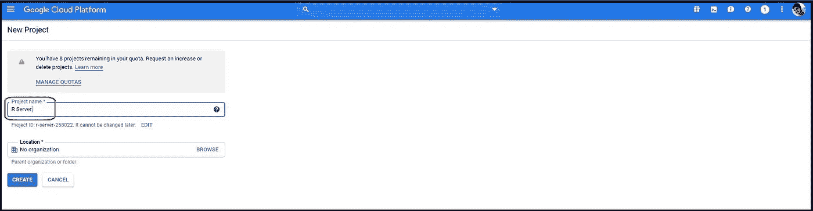
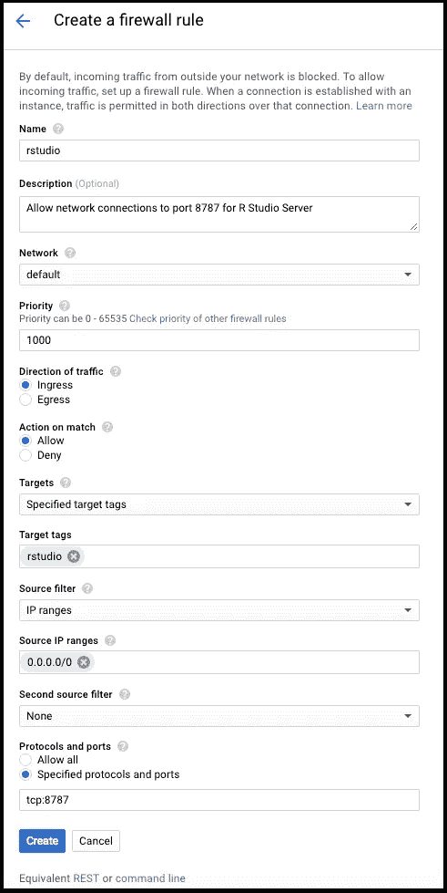
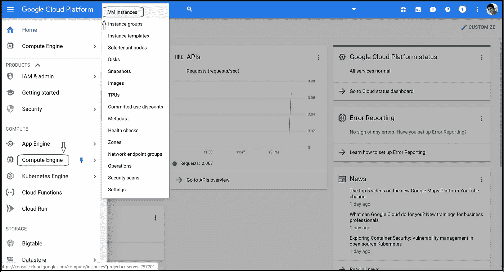
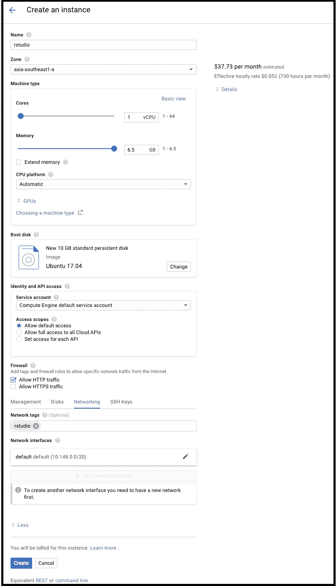
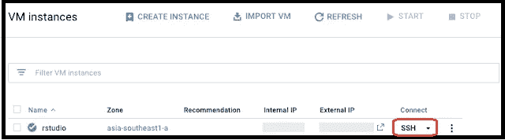
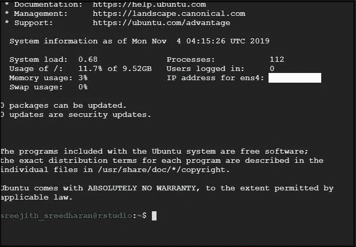
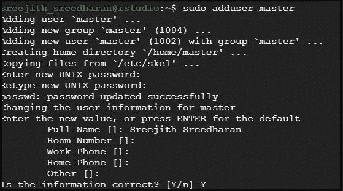
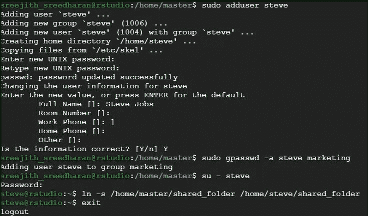
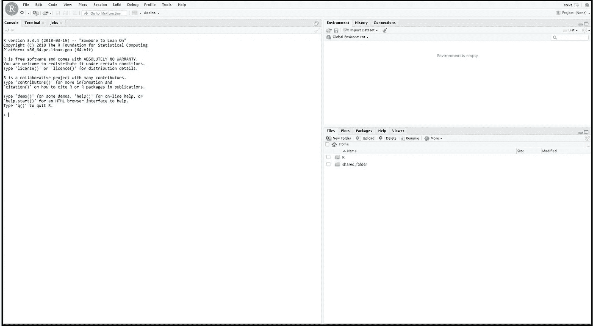
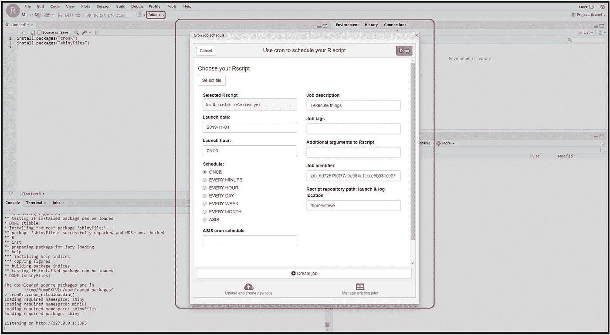

# 谷歌云上的 R Studio 服务器

> 原文：<https://towardsdatascience.com/r-studio-server-on-google-cloud-dd69b8bff80b?source=collection_archive---------6----------------------->


萨法尔·萨法罗夫在 [Unsplash](https://unsplash.com?utm_source=medium&utm_medium=referral) 上拍摄的照片

**目标:**在 Google 云计算引擎的虚拟机实例上建立一个完全可运行的机器学习服务器。

在现实世界中，云计算和机器学习携手构建、转变和扩展预测建模项目。作为一个 Linux 服务器应用程序，R Studio server 是最好的解决方案之一，可以托管在 Google Cloud(或者 Amazon Web Service 或 Azure)上，以集中的方式自动处理 SQL/ R/ Python 中的大量数据。以下是如何在 Google Cloud 上配置全功能 R Studio 服务器的一步一步的方法:

1.  在 Google Cloud 上配置一个虚拟机实例(Ubuntu OS)。
2.  在虚拟机上安装 R and R 工作室服务器。
3.  创建用户和组。
4.  使用 cronR 包调度和运行 R 脚本。

**第一步。在 Google Cloud 上配置一个虚拟机实例(Ubuntu OS):**

步骤 1.1。创建 Google Cloud 项目:登录 [**Google Cloud 控制台**](https://console.cloud.google.com/) 创建项目。



创建谷歌云项目(图片由作者提供)

第 1.2 步。创建防火墙规则:通过导航到“菜单”>“网络”下的“防火墙规则”，在 Google 云计算引擎中创建防火墙规则。配置以下设置:



创建防火墙规则(图片由作者提供)

第 1.3 步。创建虚拟机实例:通过导航到“菜单”>“计算引擎”下的“虚拟机实例”，在 Google Cloud 上设置一个新的虚拟机。



创建一个虚拟机实例(图片由作者提供)

第 1.4 步。虚拟机配置:为新的虚拟机实例命名(例如:“rstudio”)，并选择一个靠近操作区域的区域，以减少网络延迟。因为 R 将所有的工作数据集存储在内存中，所以尽量给 VM 实例提供尽可能多的内存。在“操作系统映像”下，选择一个支持 OpenSSL 1.0 的最新版本的 Ubuntu。R Studio Server 总是通过不安全的 HTTP 连接进行连接。因此，在防火墙下，“允许 HTTP 流量”。最后，单击“Create”启动实例。



虚拟机配置(图片由作者提供)

**第二步。在虚拟机上安装 R and R 工作室服务器:**

第 2.1 步。SSH 连接:在 Google Compute Engine 的 VM instances 窗口中，单击新实例旁边的“SSH”。这将启动命令提示符。



SSH 连接(作者图片)

步骤 2.2。更新 apt:更新 apt 以确保我们有最新的软件包可以和 Ubuntu 一起使用。

```
sudo apt-get update
sudo apt-get upgrade
```

第 2.3 步。安装 R and R 工作室服务器:

```
sudo apt-get install r-base r-base-dev
```

在运行下面几行代码之前，检查一下最新版本的 [**RStudio 服务器**](https://rstudio.com/products/rstudio/download-server/debian-ubuntu/) 。安装所有支持包:

```
sudo apt-get install gdebi-core
wget [https://download2.rstudio.org/server/bionic/amd64/rstudio-server-1.2.5019-amd64.deb](https://download2.rstudio.org/server/bionic/amd64/rstudio-server-1.2.5019-amd64.deb)
sudo gdebi rstudio-server-1.2.5019-amd64.deb
sudo apt-get install libcurl4-openssl-dev libssl-dev libxml2-dev
```

**第三步。创建用户和群组**

使用 R studio server 的最大好处之一是，它为我们提供了一个在集中式云框架中与同行协作的窗口。向虚拟机实例添加用户，以便其他人可以同时使用 R Studio 服务器。

第 3.1 步。创建一个组:创建一个组(例如:“marketing”)将使管理团队共享的文件夹和文件变得更加容易。

```
sudo addgroup marketing
```

第 3.2 步。创建主用户:创建主用户背后的整个想法是，当同事和同事加入或离开我们时，“主用户”将仍然拥有所有的共享文件。

```
sudo adduser master
```



创建一个主用户(图片由作者提供)

第 3.3 步。创建共享文件夹:

```
cd /home/master
sudo mkdir shared_folder
sudo chown -R master:marketing shared_folder/
sudo chmod -R 770 shared_folder/
```

第 3.4 步。添加用户并将他们链接到一个共享文件夹:这里我将 Steve 作为一个例子添加到最近创建的“marketing”组中。Steve 的个人文件夹已链接到“主用户的共享文件夹”。

```
sudo adduser steve
sudo gpasswd -a steve marketing
su - steve
ln -s /home/master/shared_folder /home/steve/shared_folder
exit
```



添加用户并将他们链接到共享文件夹(图片由作者提供)

就是这样！我们在 Google Cloud 上使用 R Studio 服务器很好。为了在浏览器上打开 R studio 服务器，遵循 URL 语法: [*http://【外部*](/[External)*IP】:8787*。例如，如果新配置的虚拟机实例的外部 IP 是 35.185.161.49，那么我们的 R Studio 服务器 URL 将是:[*http://35.199.10.210:8787/*](http://35.199.10.210:8787/)



R Studio 服务器(图片由作者提供)

**第四步。使用 cronR 包调度和运行 R 脚本:**

安装 cronR 包以在 R Studio 服务器中生成任务调度器。使用该插件自动化虚拟机实例中的任何脚本。

```
install.packages("cronR")
install.packages("shinyFiles")
```



cronR 包(图片由作者提供)

第五步:下一步是什么？

我们刚刚在云中完成了机器学习框架的设置。以下是一些建议，说明我们可以做些什么来扩展这种数据建模和预测分析工作流:

1)从内部(CRM 数据库)或外部数据源(第三方供应商，如尼尔森评级或脸书和谷歌广告集)提取、转换和加载数据集到谷歌云计算引擎。

2)用 SQL、R 或 Python 构建数据模型(使用 Reticulate 和 sqldf 包将 python/SQL 脚本源化到 R studio 服务器中)。

3)在源自云的数据模型上构建监督的或无监督的或强化的机器学习算法。使用 cronR 包实现端到端工作流的生产化。将数据集存储在云数据库中。

4)最后，构建一个 BI 仪表板，可视化预测模型(可以是从预测下个月的销售额或流失率到使用无监督聚类模型对客户数据库进行分类的任何内容)。如果感兴趣，可以通过 REST API 将这个实时预测 BI 模型作为一个小部件嵌入到 web/移动应用程序中。

**关于作者**

[](https://srees.org/about) [## Sreejith Sreedharan - Sree

### 数据爱好者。不多不少！你好！我是 Sreejith Sreedharan，又名 Sree 一个永远好奇的数据驱动的…

srees.org](https://srees.org/about) 

如果您在理解上述配置方面需要任何帮助，请随时联系我。乐于分享我所知道的！希望这有所帮助:)