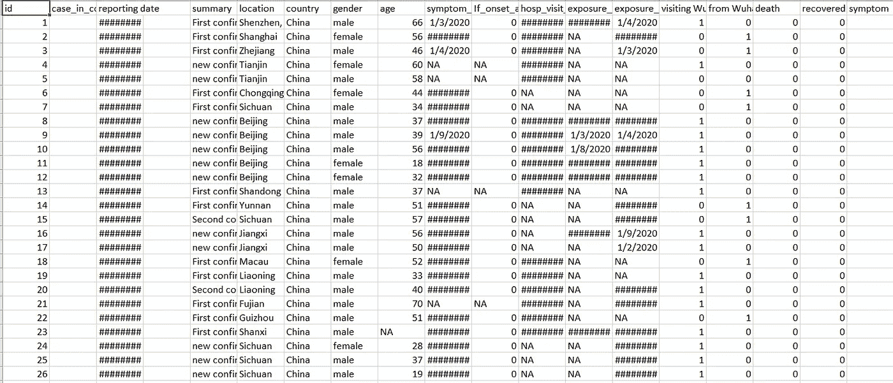
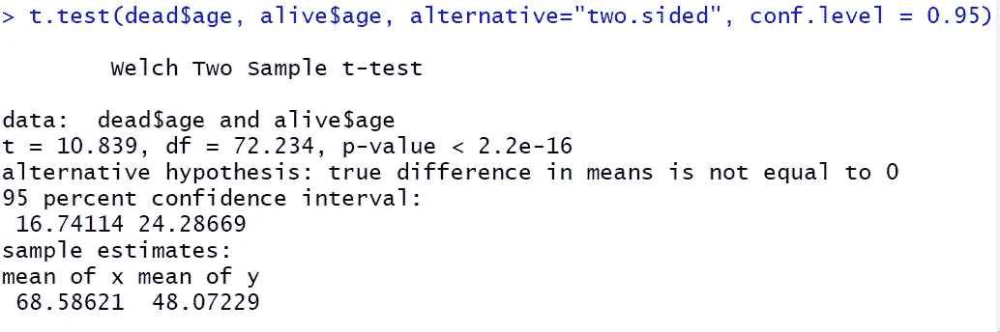
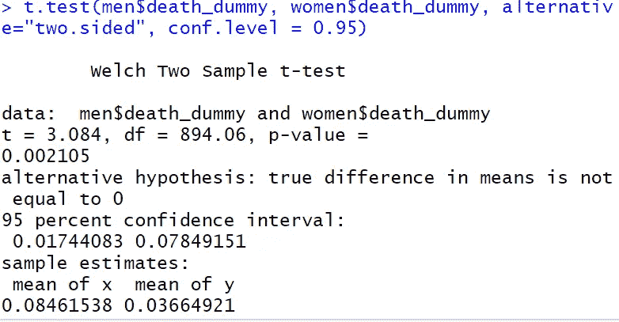

# r 教程:分析新冠肺炎数据

> 原文：<https://towardsdatascience.com/r-tutorial-analyzing-covid-19-data-12670cd664d6?source=collection_archive---------9----------------------->

## 在现实世界中使用 R 的介绍

[来源](https://pixabay.com/photos/entrepreneur-idea-competence-vision-1340649/)

这学期我在耶鲁上计量经济学导论课，我们利用 R 和统计学来分析各种数据集。因此，当我在家与自己保持社交距离时，我认为将我在新冠肺炎数据集上学到的一些技术应用起来会很有趣。

我在 Kaggle 上使用了[这个页面，发现了一个 CSV 数据集，你可以在这里](https://www.kaggle.com/sudalairajkumar/novel-corona-virus-2019-dataset/version/25#COVID19_line_list_data.csv)获得[。](https://www.kaggle.com/sudalairajkumar/novel-corona-virus-2019-dataset/download/uMF6QnlPB7ScS6BxTw1I%2Fversions%2Fe03zBLHwzT7b8fR01UTk%2Ffiles%2FCOVID19_line_list_data.csv?datasetVersionNumber=25)

让我们看一下数据:

我们有大约 1000 例新冠肺炎病例的数据。我们可以看到每个感染者的年龄，挡泥板，他们是否恢复或死亡，以及其他许多事情。对于本教程，我们将只看其中的几个专栏。让我们用这个 CSV 文件创建一个文件夹，并启动 RStudio。

在 RStudio 中，要导入数据集，我们将转到文件->导入数据集->从文本(基本)。找到您的 CSV 文件，然后单击“导入”您将在 RStudio 的控制台中看到这样一行:

我们将把这一行复制到我们的主 R 脚本中，我将把它保存为脚本。与我们的 CSV 文件放在同一个文件夹中。

为了方便起见，我将把数据框变量重命名为“data”我还将清除所有现有的变量，导入一个名为 Hmisc 的库，并使用它的 describe 函数来更好地理解我们的数据。

如果您运行这段代码，您将在控制台中看到大量信息。例如，我们有 1085 行。如果我们查看死亡部分，我们会看到有 14 个不同的值。这可能看起来有点奇怪，但是死亡一栏要么是 0(没有死亡)，要么是 1(没有死亡)，或者仅仅是患者的死亡日期。这很难做到，因为我们想要全是 0 和 1。

让我们通过向数据集添加一个 death_dummy 列来解决这个问题，它只包含值 0 和 1。

我们还计算了数据集的死亡率，运行后结果是 5.8%。在本教程的第一部分，我们将分析死亡和未死亡的人的年龄。

# 年龄

媒体声称新冠肺炎的老年人比年轻人更容易死亡。这是真的吗？让我们用数据集检查一下。首先，我们将我们的数据集分成活着的患者和已经去世的患者，并比较平均年龄。这段代码将为我们做这件事:

请注意，na.rm=TRUE 意味着跳过特定列(在本例中为 age)为 na(或没有值)的行。运行这个程序后，我们得到存活者的平均年龄是 48 岁，而死亡的平均年龄是 68.6 岁。

好的，所以数据确实显示在我们的样本中，那些死去的人年龄更大。但是这对于所有人来说都是真的吗？我们有多大把握这是真的？

我们可以使用 t.test 命令来衡量我们的信心，看看我们是否可以信任我们的方法。在这种情况下，我们将使用 95%的置信区间。

这个简单的命令非常强大。注意，我们给出了活着的病人和死去的病人的年龄。我们来分析一下输出。

查看置信区间，我们可以 95%肯定地说，已经死亡和没有死亡的患者之间的年龄差异是从 16.7 岁到 24.3 岁。现在，看看 p 值。快 0 了。这意味着，在零假设(即两组的年龄相等)下，我们有大约 0%的机会从这个样本中随机获得这样的极端结果。出于这个原因，我们可以合理地拒绝零假设(在 0.05 的常规显著性水平下)，并说死于新冠肺炎病的人确实比没有死于该病的人更老。现在，我们来看看性别！

# 性别

这个会很像。我们想知道男性和女性的死亡率是否相似。让我们再次分割数据并进行 t 检验:

我们将原始数据分成两组。计算平均值后，我们看到数据集中男性的死亡率为 8.5%，而女性为 3.7%。这真是出乎意料。还是那句话，我们能相信这个数据吗？下面是 t.test 输出:

我们 95%的置信区间表明，平均死亡率将比女性高 1.7%至 7.8%。p 值为 0.002 意味着我们可以拒绝男性和女性死亡率相同的无效假设，因为 0.002 < 0.05.

There have been articles written that men indeed do have a higher coronavirus death rate. [这里的](https://www.cnn.com/2020/03/24/health/coronavirus-gender-mortality-intl/index.html)是其中之一，如果你感兴趣的话。

# 结论

正如您所看到的，R 帮助我们非常容易地对重要的数据集进行统计分析。感谢您的阅读！