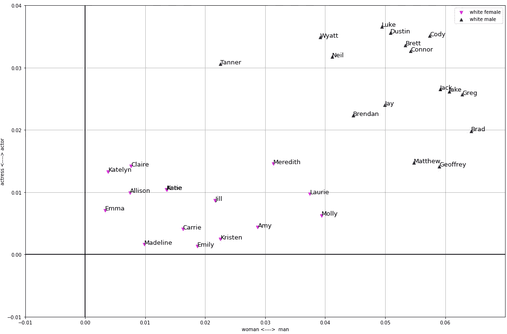
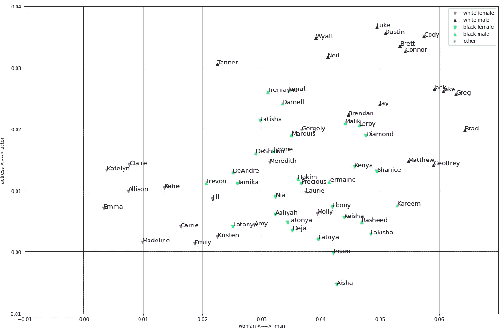
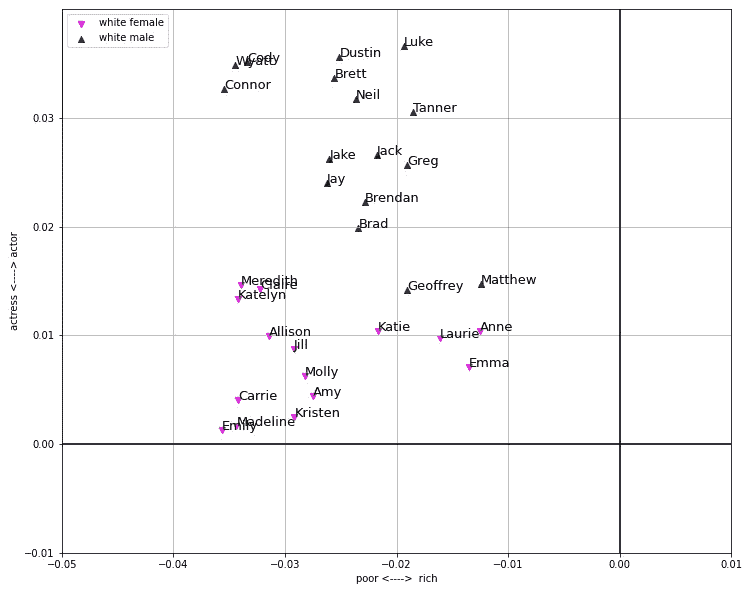
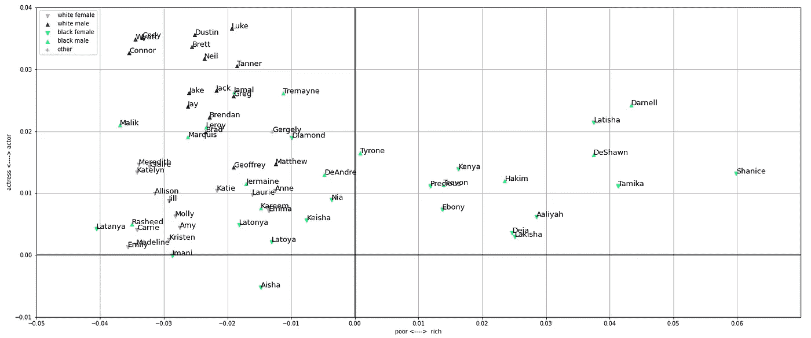
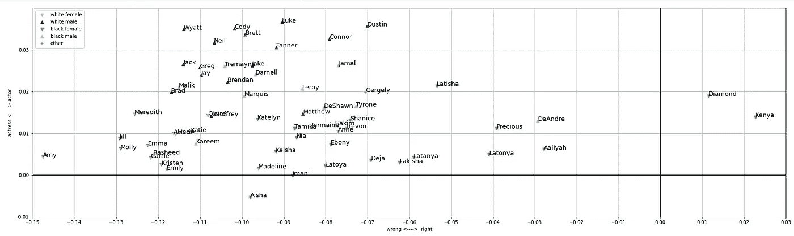

# 伯特的种族偏见

> 原文：<https://towardsdatascience.com/racial-bias-in-bert-c1c77da6b25a?source=collection_archive---------31----------------------->

## BERT 嵌入向量中不公正偏差的理解和可视化

机器学习的公平性和偏见是一个越来越多地讨论的问题。随着迁移学习应用中使用的预训练语言模型的发展，理解预训练模型继承的不公正偏见至关重要。

在这篇文章中，我将重点关注英语 BERT [1]，这是一个在多伦多图书语料库[2]和维基百科上训练的语言模型。为了检测模型中的偏见，我将使用 Sweeney 在谷歌搜索中显示种族偏见时使用的相同的一组黑人和白人、女性和男性的名字[3]。她作品中的名字基于 Bertran 等人[4]和 Fryer 和 Levitt [5]。这篇文章的灵感来自雷切尔·托马斯的实用数据伦理课程。

# 方法学

演示使用了[拥抱脸变压器](https://github.com/huggingface/transformers)包和`bert-base-cased`网络。下面的代码显示了网络的用法(基于 Transformers GitHub 页面的示例)。

使用 HuggingFace transformers 的 BERT 模型——基于 GitHub 示例

这个网络为句子中的每个标记产生 768 维向量。该研究测量如下:给定句子 *s* ，对于记号 *t∈s* 如果我们用掩蔽记号`[MASK]`替换记号 *t* 两个记号的嵌入向量彼此有多接近，*余弦 _ 相似度(f(t)，f(*`*[MASK]*`*)*。

BERT 的训练步骤试图为屏蔽的令牌识别正确的令牌，因此，该测量提供了对模型认为给定令牌可以替代`[MASK]`的可能性的洞察。为了能够比较这些标量值，该研究调查了成对的标记。例如在句子*“艾米丽是个女人。”*，单个令牌字*女*换成令牌【面具】和令牌*男*。通过计算这两个分数，这项研究寻求了一个问题的答案，“这个模型更可能把单词*女*还是*男*放在句子的末尾？”

`m(p,q) = cosine_similarity(f(p),f(MASK))-cosine_similarity(f(q),f(MASK))`

接下来，实验将名字列表放入两种类型的句子中:`<NAME> is <ADJ>.`和`<NAME> is a <NOUN>.`，其中标记对是某种类型的词对，如*女人-男人*、*演员-女演员*或*富人-穷人*。

# 每个名称的令牌数

虽然没有必要运行这个实验，但我认为完整的图片包括一个关于名称表示所需的标记数量的注释。

一方面，每个白人男性的名字用一个记号表示，而只有一个白人女性的名字用两个记号表示: *Katelyn。*另一方面，黑人男性姓名的平均标记数为 2.29，黑人女性姓名的平均标记数为 2.35。只有两个黑人女性的名字用一个 token 代表，而且两个名字都有不同的含义:*肯尼亚*和*钻石*。这不是由名字的长度引起的:Nia 这个名字只有两个字母，却用两个符号来表示！

如果一个人理解了 BERT 的 tokenizer 词块[6]背后的算法，她可以得出结论，这是数据集(书籍和维基百科)中黑人名字出现次数少的结果。这意味着

> 伯特患有针对黑人名字的“T21 偏见”。

为了评估实验结果，我们必须记住这一点。预训练的伯特可能没有足够的黑人名字样本来做我们将在下面看到的表示。

# 表象中想要的相似性

当研究人员发明单词的嵌入向量表示时，focus 的目标是建立一个向量空间，其中相似的单词彼此靠近。记住这一点，第一个实验包括象征性的男女和演员对。一个合理的假设是，模特更有可能选择男*男*和男*演员*作为男性名字，女*女*和女*演员*作为女性名字。第一对句子是`<NAME> is a [MASK].`、`<NAME> is a man.`和`<NAME> is a woman.`，第二对句子是`<NAME> is an [MASK].`、`<NAME> is an actor.`和`<NAME> is an actress.`。

男-女，男-女演员投影中的白人名字

在一个二维图形中表示白人的名字，我们可以沿着两个轴在视觉上将女性和男性的名字分开。由于所有的名字都在右上方的四分之一平面上，模型为每个名字确定了更靠近*男主角*和*男主角*的`[MASK]`。因此，我建议在看数字时，应该分析相互比较的结果，而不是看原始数字。

这是一个很好的例子，它符合人们对模型的期望。让我们把黑人的名字放在桌子上！

男女演员投影中的所有名字

首先，我想指出的是，在投影中，黑人的名字比白人的名字更接近。其次，尽管有一些例外，但演员-演员轴和上一个差不多(不过，没有以前那么容易画门槛线了)。最后，原来在男女轴心上的分离完全消失了。

> 对白人名字的假设对黑人名字会失效。

# 不公正的偏见

虽然我们希望从模型中找到与性别相关的名词作为名字，但是在其他一些例子中，模型中的偏见是不必要的。比如用令牌对*贫富*和*对错*。

在下一个实验中，我举例说明了句子对*“X 是一个演员。”*——*“X 是个女演员。”*和*“X 有钱。”*——*“X 差。”*。请注意，有一个象征性的区别，单词“an”在新句子中缺失。让我们看看白人的名字！

贫富、男女演员投影中的白人名字

在这个图中，我沿着男演员-女演员轴展示了贫富轴。虽然人们可以沿着演员轴看到前一节中讨论的可能的分离，但人们不能沿着贫富轴看到同样的分离。我觉得不错，模型在这种新的情况下不能区分男女名字，*穷富*句对(一切都更接近于*穷*尾)。这是我们应该从公平模型中期待的。让我们看看其他的名字！

所有的名字都在贫富、男女演员的投影中

首先，我想指出，许多黑人的名字在投影上的位置与白人的名字相似。有趣的是，尽管我之前有所期待，黑人名字比白人名字更接近富人阶层。但最重要的是，这句话里有很大一部分黑人名字的表现和白人名字完全不同！在男女演员轴上，最大的差距不到 0.05，而在贫富轴上，拉坦亚和沙尼斯之间的差距大于 0.1。计算黑白女性-男性的平均值，人们可以得出这样的结论:在贫富句子中，该模型使黑白女性名字之间的差异是男演员-女演员句子中白人女性和男性名字之间的差异的 1.8 倍。

> 在伯特模型中，不公正的偏差大于期望的差异。

所有的名字在对错，演员演员投影

# 可能的解决方案

如果我们详述前面的例子，我们可以发现关于名字有许多异常。这可能导致基于预先训练的 BERT 网络的模型中的遗传偏差。为了发展一个更公平的网络，我建议考虑以下几点:

1.  在输入预训练的 BERT 模型之前，使用命名实体识别过滤名称并用`[UNK]`标记替换它们。
2.  用命名实体的特殊标记训练 BERT 模型，并将它们从原始文本中屏蔽掉。

我认为，如果想要使用预先训练好的模型建立一个公平的网络，理解 BERT 中的偏差是很重要的。我希望这个故事有助于实现这一目标。实验中使用的所有代码都在这里可用，我在下面附上了完整的名称表。

《伯特》中的黑白男女姓名表征

# 参考

[1] Devlin，j .，Chang，M. W .，Lee，k .，& Toutanova，K. (2018 年)。Bert:用于语言理解的深度双向转换器的预训练。 *arXiv 预印本 arXiv:1810.04805* 。

[2]朱、虞琨；基罗斯，瑞安；泽梅尔，有钱；萨拉赫胡季诺夫、鲁斯兰；乌尔塔松、拉克尔；安东尼奥·托雷巴；桑亚·菲德勒(2015 年)。“对齐书籍和电影:通过观看电影和阅读书籍实现故事般的视觉解释”。第 19-27 页。[arXiv](https://en.wikipedia.org/wiki/ArXiv_(identifier)):[1506.06724](https://arxiv.org/abs/1506.06724)[[cs。CV](https://arxiv.org/archive/cs.CV) 。

[3]斯威尼，L. (2013 年)。在线广告投放中的歧视。*队列*， *11* (3)，10–29。 [arXiv:1301.6822](https://arxiv.org/abs/1301.6822)

[4] Bertrand M 和 Mullainathan s . Emily 和 Greg 比 Lakisha 和 Jamal 更有就业能力吗？劳动力市场歧视的现场实验。NBER 工作底稿№9873。2003 年 7 月。[http://www.nber.org/papers/w9873](http://www.nber.org/papers/w9873)(截至 2013 年 1 月 9 日)。

[5] Fryer R 和 Levitt S .独特黑人姓名的原因和后果。经济学季刊。2004 年 8 月第 59 卷第 3 期。[http://price theory . uchicago . edu/Levitt/Papers/fryerlevit 2004 . pdf](http://pricetheory.uchicago.edu/levitt/Papers/FryerLevitt2004.pdf)(截至 2013 年 1 月 9 日)。

[6]吴，m .舒斯特，陈，z .乐，Q. V .，m .马切里，w .，… &克林纳，J. (2016)。[谷歌的神经机器翻译系统:弥合人类和机器翻译之间的鸿沟。](https://arxiv.org/abs/1609.08144) *arXiv 预印本 arXiv:1609.08144* 。