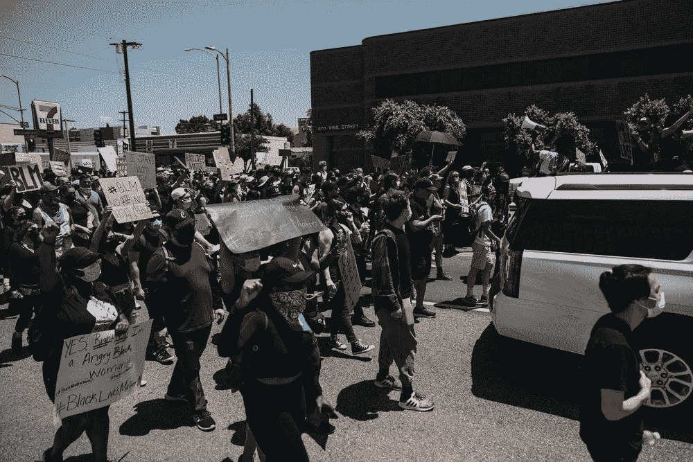
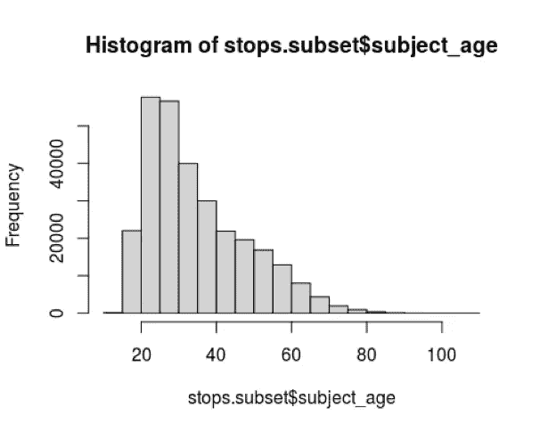
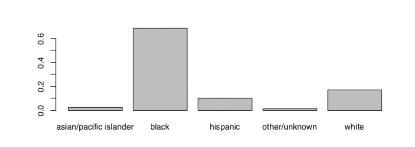

# 警察拦截和搜查中的种族差异

> 原文：<https://towardsdatascience.com/racial-disparities-in-police-stops-and-searches-e58319f278a2?source=collection_archive---------27----------------------->

## [变更数据](https://towardsdatascience.com/tagged/data-for-change)

## 多年来警察拦截和搜查的统计分析，以确定警察是否对少数群体有偏见



由[内森·杜姆劳](https://unsplash.com/@nate_dumlao?utm_source=unsplash&utm_medium=referral&utm_content=creditCopyText)在 [Unsplash](https://unsplash.com/s/photos/black-lives-matter?utm_source=unsplash&utm_medium=referral&utm_content=creditCopyText) 上拍摄的照片

# 摘要

这份报告旨在调查与黑人或西班牙裔等少数民族相比，警察队伍是否对白人有种族偏见。我分析了斯坦福开放警务项目的数据，该项目收集了 2013 年至 2017 年间宾夕法尼亚州费城警察拦截的标准化数据。我评估了警察做出的有偏见的决定，其基础是检查警察搜查被拦下的司机的频率，以及这些搜查是否能成功找到违禁品。原始数据包含司机的年龄、性别、种族/民族、停车位置以及警察是否搜查过他们等信息。

# 介绍

几十年来，警察队伍中的种族偏见一直是一个有争议的话题。然而，最近警察拦截和搜查的消息导致了针对无辜美国黑人的暴力事件。例如，46 岁的手无寸铁的美国黑人乔治·弗洛伊德(George Floyd)因涉嫌使用假钞被一名警察杀害。由于警察对黑人的歧视，这一事件在世界范围内引发了抗议和愤怒。

对拦截和搜查率的数据进行评估，可以为是否存在针对少数群体的种族歧视提供证据。另一个策略是评估成功识别违禁品的搜索比例。如果成功搜查少数族裔的比例少于白人，这可能表明警察搜查少数族裔的证据不足。为了缩小分析范围，我将数据细分为 2017 年的车辆警察停车。

# 数据集解释

在这份数据中，2014 年 1 月 1 日至 2017 年 12 月 31 日期间，宾夕法尼亚州费城发生了 1，756，587 次警察拦截。2017 年，这些警察站中有 294，060 个是车辆警察站。



**图 1**

直方图(图 1)显示了司机的年龄分布。数据向右倾斜。这表明，与老年人相比，年轻人更容易被警察拦下。被停止的平均年龄约为 35 岁。



**图 2**

图 2 显示了驾驶员的种族/民族分布。黑人司机的比例过高，因为大约 69%的拦截都是针对黑人司机进行的。只有 17%的停车是对白人司机进行的，10%是对西班牙裔司机进行的。然而，这可能是因为费城的大部分人口是黑人。

被拦下的司机 70%是男性，30%是女性。

# 结果和数据分析

> **进行搜索**

## **卡方检验分析**

下面是卡方测试分析的代码块。这用于检查司机的种族/民族是否取决于警察是否会搜查司机。“假”表示未被搜索的驾驶员人数，“真”表示被搜索的驾驶员人数。

```
##  Pearson's Chi-squared test
 ## 
 ## data:  search.conducted.table
 ## X-squared = 430.36, df = 4, **p-value < 2.2e-16****# Expected values for each race/ethnicity**chisq.test(search.conducted.table)$expected##        
 ##                       white       black      hispanic     
 ##   FALSE              47745.775   190926.34   28194.879    
 ##   TRUE               2723.225    10889.66     1608.121**#Residual plot**chisq.test(search.conducted.table)$resid##        
 ##                         white      black    hispanic 
 ##   FALSE              3.0764323  -2.4243816   0.6081798     
 ##   TRUE             -10.3478119  10.1514171  -2.5465819
```

***假设检验***

H0:进行搜查的警察与司机的种族/民族之间没有联系

H1:进行搜查的警察与司机的种族/民族有关联

设α= 0.05。x 检验统计量的 p 值非常显著(卡方检验的 p < 2.2e-16). There is sufficient evidence to reject the null hypothesis and conclude that there is an association between the police conducting a search and the driver’s race/ethnicity.

Based on the residuals, more Black individuals than expected were searched. Less White individuals than expected were searched.

***假设***

满足卡方检验的假设。有理由相信样本是独立的，因为这些人是在费城的部分地区取样的。所有预期值都大于 10。

## 逻辑回归分析:进行搜索

下面是逻辑回归分析的代码块，用于预测司机被拦下后是否会被搜索。一个模型被用来估计警察搜查司机和司机的种族/民族之间的联系，调整混杂变量性别和年龄。

```
## 
 ## Call:
 ## glm(formula = search_conducted ~ subject_race + subject_age + 
 ## subject_sex, family = binomial(link = "logit"), data = stops.subset
 ## 
 ## Deviance Residuals: 
 ##     Min       1Q   Median       3Q      Max  
 ## -0.5829  -0.4007  -0.2894  -0.2184   3.4213  
 ## 
 ## Coefficients:
 ##                             Estimate Std. Error z value Pr(>|z|)    
 ## (Intercept)               -1.9656439  0.0774345 -25.385  < 2e-16 ***
 ## subject_raceblack          0.7817956  0.0735729  10.626  < 2e-16 ***
 ## subject_racehispanic       0.5594270  0.0777094   7.199 6.07e-13 ***
 ## subject_raceother/unknown  0.2212841  0.1079140   2.051   0.0403 *  
 ## subject_racewhite          0.4758386  0.0764091   6.228 4.74e-10 ***
 ## subject_age               -0.0418716  0.0008089 -51.762  < 2e-16 ***
 ## subject_sexfemale         -1.0650471  0.0234808 -45.358  < 2e-16 ***
 ## ---
 ## Signif. codes:  0 '***' 0.001 '**' 0.01 '*' 0.05 '.' 0.1 ' ' 1
 ## 
 ## (Dispersion parameter for binomial family taken to be 1)
 ## 
 ##     Null deviance: 123230  on 293539  degrees of freedom
 ## Residual deviance: 117002  on 293533  degrees of freedom
 ##   (520 observations deleted due to missingness)
 ## AIC: 117016
 ## 
 ## Number of Fisher Scoring iterations: 6
```

***斜率系数和 P 值的解释***

由于模型中包含了年龄，因此模型截距没有有意义的解释。模型截距表示警察搜索 0 岁男性和亚洲/太平洋岛民种族的预测对数概率。预测警察搜查新生儿的概率是不合理的。

黑人的斜率表明，在保持年龄和性别不变的情况下，警察搜查一名黑人的估计对数概率比搜查一名亚裔/太平洋岛民的概率高 0.78。

黑人和西班牙裔的斜率高于白人的斜率。例如，警察搜查一个黑人的对数概率是警察搜查一个白人的对数概率的 1.36 倍。如果双方都是 35 岁的男性。

这表明警察更可能搜查少数民族而不是白人。

每个种族/民族的斜率系数的 p 值小于α= 0.05。因此，这些数据提供了证据，证明警察搜查司机与司机的种族/族裔有显著关联。

> **搜查违禁品**

## 双样本比例检验

下面是双样本比例测试的代码块。这用于确定拥有违禁品的白人个体的比例是否低于黑人个体。如果成功搜查黑人的比例低于白人，这表明警察搜查少数民族的证据不足。

```
#conduct test
 prop.test(successes, n)## 
 ## 2-sample test for equality of proportions with continuity correction
 ## 
 ## data:  successes out of n
 ## X-squared = 6.8023, df = 1, **p-value = 0.009104**
 ## alternative hypothesis: two.sided
 **## 95 percent confidence interval:
 ##  -0.046884129 -0.005958199**
 ## sample estimates:
 **##   prop 1    prop 2 
 ## 0.2237007 0.2501219**
```

***假设检验***

p1 代表在被搜查的黑人个体中拥有违禁品的黑人个体的比例。

p2 表示在被搜查的白人个体中，拥有违禁品的白人个体的比例。

H0 : p1 = p2
哈:p1 不等于 p2

设α= 0.05。检验统计的 p 值显著(p= 0.009104)。有足够的证据拒绝零假设，并得出结论，两个种族群体之间的比例存在差异。

基于 p1 和 p2 的比较，拥有违禁品的白人个体的比例高于黑人个体。

***置信区间***

比例差异的 95%置信区间为(-0.047，-0.006)。在 95%的置信度下，白人个体相对于黑人个体拥有违禁品的比例的差异被区间(-0.047，-0.006)捕获。间隔不包含 0。这与差异的统计学显著证据一致。

***比例测试的假设***

下面是检查每个种族拥有违禁品的司机数量的代码块。“假”表示没有携带违禁品的驾驶员人数，“真”表示携带违禁品的驾驶员人数。

```
(table(searches$subject_race, searches$contraband_found))##                         
 ##                          FALSE TRUE
 ##   asian/pacific islander   147   48
 ##   black                   9276 2673
 ##   hispanic                1202  304
 ##   other/unknown            137   29
 ##   white                   1538  513
```

满足成功-失败条件。对于置信区间和假设检验，每个种族/民族群体发现违禁品的预期成功和失败次数都超过 10 次。假设样本是独立的是合理的。

## 逻辑回归分析:识别违禁品

下面是逻辑回归分析的代码块，用于预测司机在被搜查后是否会持有违禁品。一个模型被用来估计警察识别违禁品和司机的种族/民族之间的关系，调整了性别和年龄这两个混淆变量。

```
## 
 ## Call:
 ## glm(formula = contraband_found ~ subject_race + subject_age + 
 ##     subject_sex, family = binomial(link = "logit"), data = stops.subset)
 ## 
 ## Deviance Residuals: 
 ##     Min       1Q   Median       3Q      Max  
 ## -0.8486  -0.7355  -0.7030  -0.6152   2.0279  
 ## 
 ## Coefficients:
 ##                            Estimate Std. Error z value Pr(>|z|)    
 ## (Intercept)               -0.767719   0.177718  -4.320 1.56e-05 ***
 ## subject_raceblack         -0.156001   0.168090  -0.928 0.353365    
 ## subject_racehispanic      -0.290847   0.178694  -1.628 0.103605    
 ## subject_raceother/unknown -0.452432   0.263905  -1.714 0.086460 .  
 ## subject_racewhite          0.074991   0.174405   0.430 0.667210    
 ## subject_age               -0.010238   0.001929  -5.308 1.11e-07 ***
 ## subject_sexfemale         -0.215671   0.058023  -3.717 0.000202 ***
 ## ---
 ## Signif. codes:  0 '***' 0.001 '**' 0.01 '*' 0.05 '.' 0.1 ' ' 1
 ## 
 ## (Dispersion parameter for binomial family taken to be 1)
 ## 
 ##     Null deviance: 16875  on 15827  degrees of freedom
 ## Residual deviance: 16816  on 15821  degrees of freedom
 ##   (278232 observations deleted due to missingness)
 ## AIC: 16830
 ## 
 ## Number of Fisher Scoring iterations: 4
```

***解释斜率系数和 P 值***

黑人的斜率表明，在保持年龄和性别不变的情况下，警察识别黑人违禁品的估计对数概率比亚裔/太平洋岛民低 0.156。

白人的斜率表明，在保持年龄和性别不变的情况下，白人警察识别违禁品的估计对数概率比亚洲/太平洋岛民高 0.075。

黑色人种的斜率为负，白色人种的斜率为正。这表明白人比黑人更有可能拥有违禁品。

每个种族/民族的斜率系数的 p 值大于α= 0.05。因此，没有足够的证据证明警察识别违禁品与司机的种族/民族有显著的联系。

# 结论

基于 2013 年至 2017 年宾夕法尼亚州费城 1756587 名被拦司机的数据，有证据表明，这些结果表明对黑人司机存在偏见。这项研究特别研究了司机的种族/民族是否取决于警察是否会搜查司机。与白人相比，黑人和西班牙人更有可能被搜查。该数据还评估了每个种族/民族中拥有违禁品的个人比例。结果显示，白人拥有违禁品的比例高于黑人。因此，根据较少的证据可以合理地得出结论，警察正在搜查少数民族。

严格地说，这个结果适用于居住在宾夕法尼亚州费城的人们。将这些结果推广到宾夕法尼亚州的其他地方也是合理的，因为该州的治安策略是相同的。由于被拦下的司机被搜查的速度不同，因此推广到所有其他州是不合适的。所以其他州的警察不一定对少数民族有偏见。