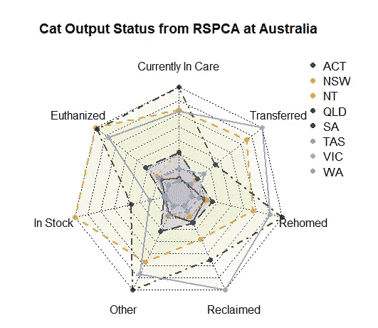
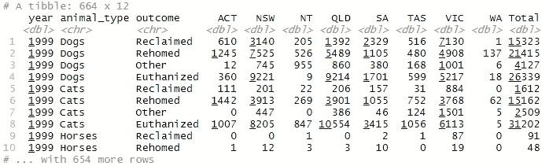
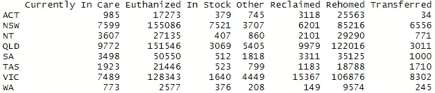
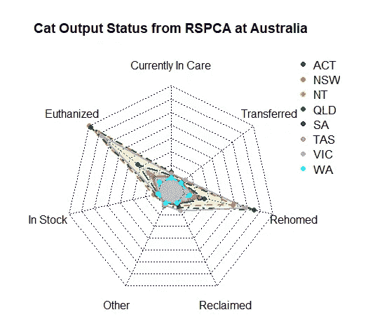

# R 中的雷达图

> 原文：<https://towardsdatascience.com/radar-chart-in-r-222c30866b1b?source=collection_archive---------17----------------------->

凯利·西克玛在 [Unsplash](https://unsplash.com/?utm_source=unsplash&utm_medium=referral&utm_content=creditCopyText) 上的照片

## 如何使用 fmsb 库创建图表？

D 数据可视化对于从数据中获得洞察力非常重要。我们可以使用许多图表，例如条形图、直方图、折线图、雷达图等等。它的使用取决于我们想要达到的目的。

雷达图或蜘蛛图是一种在二维图表中显示多元数据的图表，其中每个变量都从同一点开始。

在本文中，我想向您展示如何构建雷达图，从准备数据开始，一直到数据的可视化。对于数据集，我们将使用 R4DS 学习社区在#TidyTuesday 使用的数据集。对于库，我们将使用 fmsb 和 tidyverse 库。最终的图表看起来会像这样，

# 数据描述

我先解释一下数据。这些数据来自#TidyTuesday 活动，该活动是为那些希望提高使用 R 的技能的人举办的，特别是在数据可视化和数据争论方面。它是基于向皇家防止虐待动物协会(RSPCA)的投诉，以及该协会自 1999 年以来做出的结果。它由 3 个数据集组成，例如它们是 animal_outcomes.csv、animal_complaints.csv 和 brisbane_complaints.csv。现在，我们只使用 animal_outcomes.csv 来创建雷达图。

# 该过程

要创建条形图，我们必须首先准备数据集。起初，数据集看起来像这样，

该数据集由 664 行和 12 列组成，其中每行包括年份、动物类型、状态，以及 RSPCA 照顾它们后的结果，无论是被回收还是目前被照顾。

我们想要这样的数据集，

为了让数据集看起来像这样，我们必须用这样的代码预处理数据，

下面是解释。首先，我们必须删除 total 列，该列描述了动物在每个州的每个条件的总和。然后，我们必须过滤只使用猫作为我们的动物类型。然后，我们必须将第 4 列旋转到第 11 列。然后，我们必须通过合计全年的数字来总结每个状态、结果和动物类型的数字。然后，我们扩展列以使数据集更长。最后，我们找出第一和第二列，并将州名设置为行名。

老实说，我们可以将数据作为雷达图的输入，但结果并没有那么好。它看起来像这样，

那不是我们想要的图表。为了解决这个问题，我们可以对每一列进行规范化，使其具有 0–1 的范围。我们可以使用最小-最大缩放，代码看起来像这样，

在我们缩放每一列之后，在使用 graph 函数之前，我们必须再做一个任务。我们必须将图表中每一列的最小值和最大值相加。我们可以将最小值设置为 0，将数据中的最大值设置为 1。代码看起来像这样，

完成后，我们可以使用这些数据来创建我们的图表。要构建它，我们可以使用 fmsb 库中的 radarchart 函数。该函数需要的参数是数据、基于我们的列的轴段的数量、颜色以及线条的宽度。代码看起来像这样，

结果将是这样的，

最后，我们已经完成了雷达图的构建。希望对你有用。如果你有一些问题或者一些建议，可以在下面评论下来。感谢您阅读我的文章。如果你想看我的其他文章，你可以看看下面，

 [## R 中 ARIMA 模型的时间序列预测

### 从勘探到预测 1970 年至 2015 年的二氧化碳排放数据。

towardsdatascience.com](/time-series-forecasting-with-arima-model-in-r-77f4e2ae7abb)  [## 使用 PyTorch 和 Flask 构建预测苹果叶部病害的 Web 应用程序

### 使用预先训练的模型(VGG-16、雷斯网-18 和 AlexNet 架构)构建图像分类器 web 应用。

towardsdatascience.com](/build-a-web-application-for-predicting-apple-leaf-diseases-using-pytorch-and-flask-413f9fa9276a)  [## Python 中的客户细分

### 基于 K-均值聚类算法的图像分割。

towardsdatascience.com](/customer-segmentation-in-python-9c15acf6f945) 

## 参考

[https://www.r-graph-gallery.com/spider-or-radar-chart.html](https://www.r-graph-gallery.com/spider-or-radar-chart.html)