# 径向基函数(RBF)核:定位核

> 原文：<https://towardsdatascience.com/radial-basis-function-rbf-kernel-the-go-to-kernel-acf0d22c798a?source=collection_archive---------0----------------------->

你正在研究一种机器学习算法，比如针对非线性数据集的支持向量机，但你似乎无法找出正确的特征变换或正确的核来使用。嗯，害怕不是因为径向基函数(RBF)核是你的救星。

图一:别担心！RBF 帮你搞定了。【图片来源:Tenor (tenor.com)】

RBF 核是最普遍的核化形式，并且由于其与高斯分布的相似性，是最广泛使用的核之一。用于两点 X₁和 X₂的 RBF 核函数计算相似性或它们彼此有多接近。这个内核可以用数学方法表示如下:

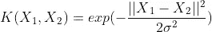

哪里，1。σ'是方差，我们的超参数
2。|| *X₁ - X₂||* 是 X₁和 X₂两点之间的欧几里德(l*₂*-范数)距离

设 d₁₂是 X₁和 X₂两点之间的距离，我们现在可以将 d₁₂表示如下:

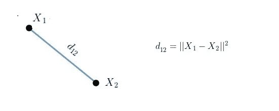

**图 2:空间两点间的距离**【图片由作者提供】

内核等式可以重写如下:

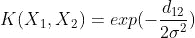

径向基函数核的最大值可以是 1，并且当 d₁₂为 0 时出现，此时点是相同的，即 *X₁ = X₂.*

1.  当这些点相同时，它们之间没有距离，因此它们非常相似
2.  当这些点相距很远时，则核值小于 1 并接近 0，这意味着这些点是不相似的

距离可以被认为等同于相异，因为我们可以注意到，当两点之间的距离增加时，它们就不那么相似了。

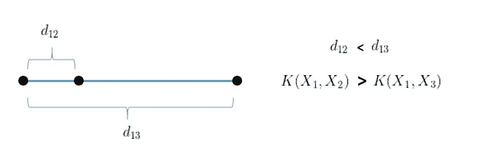

**图 3:相似度随着距离的增加而降低**【图片由作者提供】

重要的是找到正确的“σ”值，以决定哪些点应被视为相似，这可以在个案的基础上证明。

**a】σ= 1**

当σ = 1 时，σ = 1，RBF 核的数学方程如下:

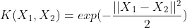

下面给出了该方程的曲线，我们可以注意到，随着距离的增加，RBF 核呈指数下降，并且对于大于 4 的距离为 0。

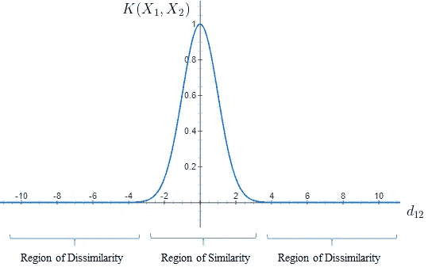

**图 4:σ= 1 的 RBF 核**【图片由作者提供】

1.  我们可以注意到，当 d₁₂ = 0 时，相似性是 1，当 d₁₂增加超过 4 个单位时，相似性是 0
2.  从图中我们看到，如果距离小于 4，这些点可以被认为是相似的，如果距离大于 4，则这些点是不相似的

**b】σ= 0.1**

当σ = 0.1 时，σ = 0.01，RBF 核的数学方程如下:

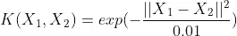

对于σ = 0.1，相似区域的宽度最小，因此，只有当点非常接近时，它们才被认为是相似的。

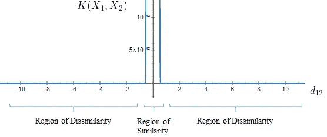

**图 4:σ= 0.1 的 RBF 核**【图片由作者提供】

1.  我们看到该曲线非常陡峭，对于大于 0.2 的距离为 0
2.  仅当距离小于或等于 0.2 时，这些点才被视为相似

**b】σ= 10**

当σ = 10，σ = 100 时，RBF 核的数学公式如下:

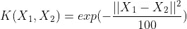

对于σ = 100，相似区域的宽度较大，因为这使得较远的点可以被认为是相似的。

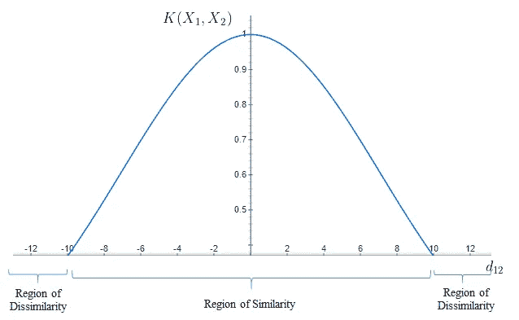

**图 5:σ= 10**的 RBF 核【图片由作者提供】

1.  曲线的宽度很大
2.  对于 10 个单位以内的距离，这些点被认为是相似的，超过 10 个单位，它们就是不相似的

> 从以上情况明显看出，相似区域的宽度随着σ**T5 的变化而变化。
> 为给定数据集找到正确的σ非常重要，可以通过使用网格搜索交叉验证和随机搜索交叉验证等超参数调整技术来实现。**

RBF 核因其与 K-最近邻算法的相似性而广受欢迎。它具有 K-NN 的优点，克服了 RBF 核支持向量机在训练时只需要存储支持向量而不是整个数据集的空间复杂度问题。

RBF 核支持向量机是在 scikit-learn 库中实现的，有两个相关的超参数，“C”代表 SVM，“γ”代表 RBF 核。这里，γ与σ成反比。

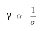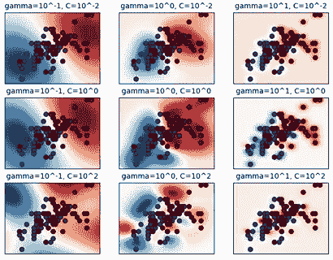

**图 6:虹膜数据集的径向基函数核 SVM**【图片来源:https://scikit-learn.org/】

从图中我们可以看出，随着γ的增加，即σ的减少，对于给定的 c 值，模型往往会过度拟合。

为了实现最佳偏置-方差权衡，找到正确的γ或σ以及 C 值至关重要。

**参考文献:**

1.  SVM 的 Scikit-Learn 实现:[https://sci kit-Learn . org/stable/auto _ examples/SVM/plot _ RBF _ parameters . html](https://scikit-learn.org/stable/auto_examples/svm/plot_rbf_parameters.html)
2.  径向基函数核:[https://en.wikipedia.org/wiki/Radial_basis_function_kernel](https://en.wikipedia.org/wiki/Radial_basis_function_kernel)