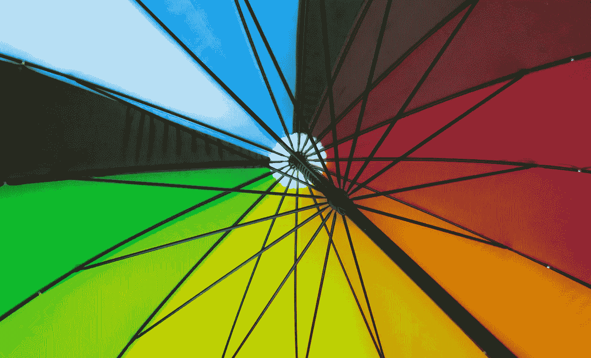
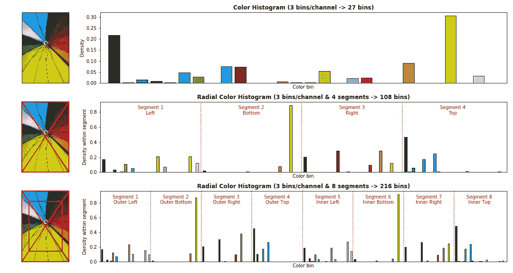

# 径向颜色直方图

> 原文：<https://towardsdatascience.com/radial-color-histograms-a3ab0441516?source=collection_archive---------57----------------------->

## 当颜色、构图和计算对您的计算机视觉问题都很重要时——径向减少图像数据的表示

在 [Unsplash](https://unsplash.com?utm_source=medium&utm_medium=referral) 上由 [Finn-E](https://unsplash.com/@vincentphinny?utm_source=medium&utm_medium=referral) 拍摄的照片

假设您有一个计算机视觉问题，以下情况为真:

*   访问计算是一个限制，所以使用最新的艺术状态 [CNN](https://en.wikipedia.org/wiki/Convolutional_neural_network) 架构不是一个选项。
*   颜色对于解决这个问题很重要，所以[颜色直方图](https://en.wikipedia.org/wiki/Color_histogram)可以用于每个图像的低维表示。
*   但是合成也提供有用的信息，所以您需要一种方法在您的特征空间中保存这些信息。

对于这种情况，使用每个图像的径向颜色直方图表示可能是解决方案。

## 什么是径向颜色直方图？

它就像一个颜色直方图，但有一些关于图像组成的信息。在下图中；颜色直方图(顶部)给出了一个简单的表示，而径向颜色直方图(中间和底部)通过将图像分割成具有相同像素数的片段，保留了一些关于照片布局的信息。

照片由 [Finn-E](https://unsplash.com/@vincentphinny?utm_source=medium&utm_medium=referral) 在 [Unsplash](https://unsplash.com?utm_source=medium&utm_medium=referral) 上拍摄(直方图由作者提供)

## 特征空间

径向颜色直方图产生比颜色直方图更大的特征空间，如果你将图像分割成 X 个部分，那么它将是 X 倍大。

上面的基本示例中，每个[通道](https://en.wikipedia.org/wiki/Channel_(digital_image))使用 3 个面元(每个段提供 3 个面元)，但对于实际应用，您可能需要每个通道 8 个面元的更高粒度(每个段提供 8 个面元)。当你把它分成 8 段时，你得到一个 8*8 = 4096 的特征空间。

与现代 CNN 的输入相比，这种表示仍然微不足道，现代 CNN 通常使用大约 224*224*3=150528 的特征空间。

## 应用程序

1.  更简单的分类任务，您不希望在每幅图像中包含不必要的信息而加重模型的负担。
2.  需要使用大型系综的复杂任务；径向颜色直方图模型可以是有用的齿轮，使用和再训练都很便宜。

## 履行

如果您想批量处理图像，或者只是玩玩用于创建上面图形的代码，请查看`radialColorHistogram`库。

 [## 高斯/径向颜色直方图

### 颜色直方图提供了颜色的表示，但不表示图像的组成。辐射状颜色直方图…

github.com](https://github.com/gmorinan/radialColorHistogram) 

关于使用这种方法有效解决计算机视觉问题的例子，请查看我的文章[迷因视觉:迷因分类的科学](/meme-vision-framework-e90a9a7a4187)。

*这与我在* [*机器医学科技*](https://machinemedicine.com/) *的工作无关。*