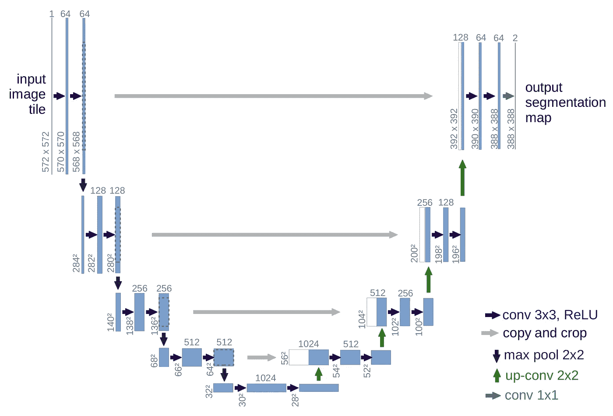
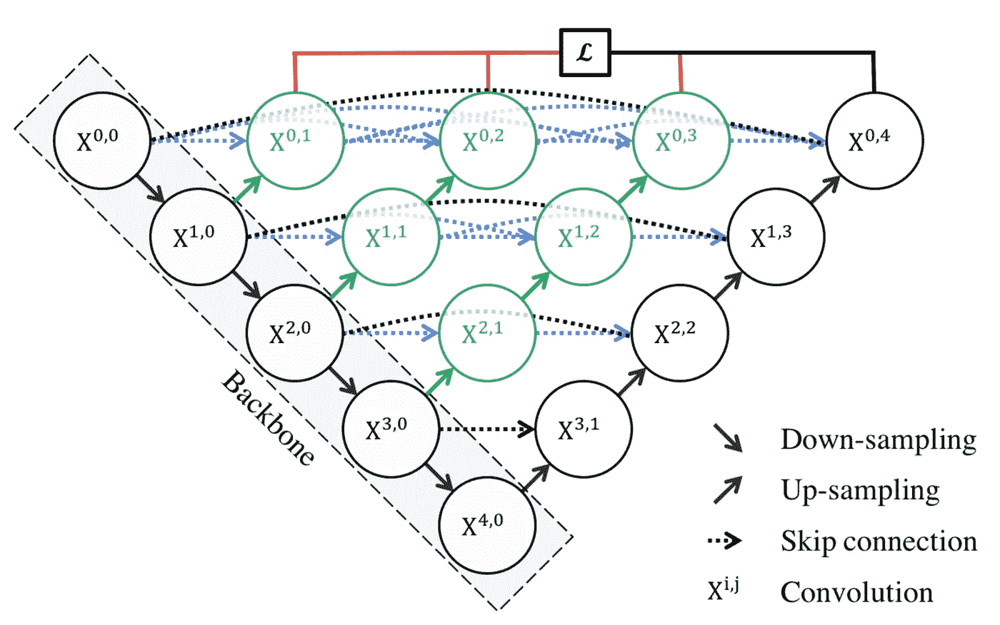
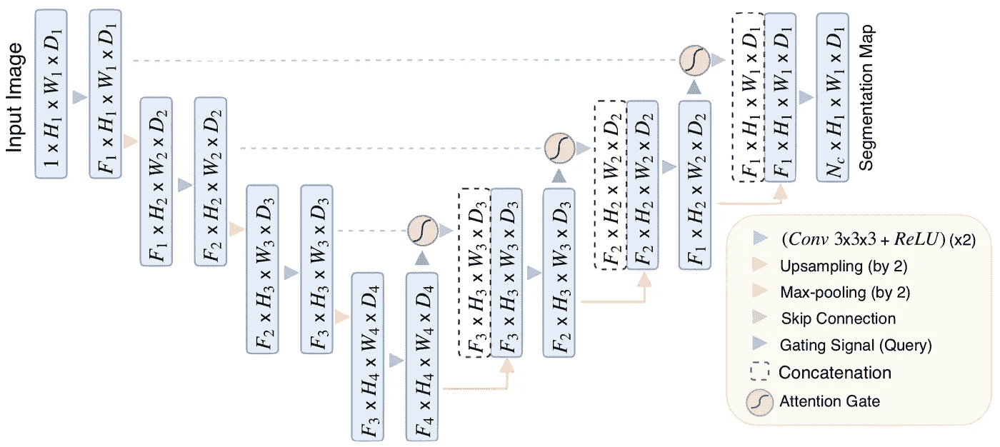
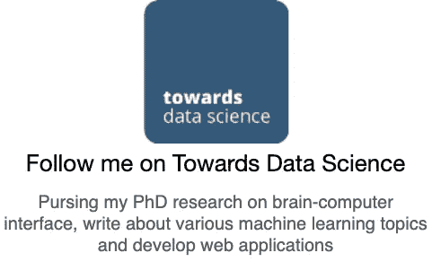

# 放射科医生如何使用计算机视觉诊断新冠肺炎

> 原文：<https://towardsdatascience.com/radiologists-computer-vision-diagnose-covid-cecbcdf96e8f?source=collection_archive---------52----------------------->

## 通过缩短 65%的评估时间，人工智能在抗击新冠肺炎病毒传播方面发挥了关键作用

图片由[穆罕默德·哈桑](https://pixabay.com/users/mohamed_hassan-5229782/?utm_source=link-attribution&utm_medium=referral&utm_campaign=image&utm_content=4382746)拍摄，来自[皮克斯拜](https://pixabay.com/?utm_source=link-attribution&utm_medium=referral&utm_campaign=image&utm_content=4382746)

疫情冠状病毒已经蔓延到世界各地。逆转录-聚合酶链式反应(RT-PCR)测试通常用于筛查患者，使那些被感染的人能够快速接受治疗。

尽管被普遍使用，该检测试剂盒给出了 30%的假阴性结果。这意味着，每 10 个被新冠肺炎病毒感染的人中，就有 3 人被解除警报。[专家建议](https://www.livescience.com/covid19-coronavirus-tests-false-negatives.html)阴性测试通常并不意味着这个人没有疾病。这需要注意不可靠测试带来的风险，因为错误的测试结果会导致错误的安全感。

> 专家说，即使你的新冠肺炎病毒检测呈阴性，也要假设你已经感染了

由于我们已经集体测试了数百万人，一些测试结果[需要一个多星期](https://www.technologyreview.com/2020/04/05/998460/covid-19-test-results-faster-commercial-labs-delays-coronavirus/)。冠状病毒测试仍然是美国应对疫情最紧迫的问题之一。疑似新冠肺炎的患者迫切需要诊断和适当的治疗——这需要**快速准确的冠状病毒诊断**。因此，全球的科学家都在寻找更可靠的评估。

由于新冠肺炎是一种呼吸道疾病，它会导致一系列呼吸问题。这导致了肺部感染，肺泡发炎，医生可以在计算机断层扫描上看到呼吸道炎症的迹象。(CT)扫描。

CT 图像提供了我们肺部的高质量 3D 图像，有助于检测新冠肺炎的存在。由于大多数扫描只需几分钟，医护人员和研究人员可以获得大量高质量的图像。

3D CT 图像包含 200–400 个图像切片；专家可能需要很长时间才能做出诊断。由于新冠肺炎与其他类型的肺炎有相似的特征，一个非常有经验的医生至少需要 10 分钟来诊断一个病人。因此，非常需要使用计算机视觉的人工智能辅助诊断。

阿里巴巴集团建立了一个[人工智能系统](https://www.alizila.com/how-damo-academys-ai-system-detects-coronavirus-cases/)，能够根据 CT 扫描图像进行病毒诊断和分析。这个人工智能系统可以在不到 30 秒的时间内诊断 CT 图像，准确率为 96%。

# 图像分割— U-Net

图像分割是基于人工智能的新冠肺炎图像处理和分析的重要步骤。它有助于放射科医生准确识别肺部感染，并促进定量分析和诊断。图像分割突出了感兴趣的区域，例如 CT 图像中的感染区域，用于进一步的评估和量化。在 AI 评估的帮助下，放射科医生的阅读时间缩短了 65%。

[U-Net](/biomedical-image-segmentation-u-net-a787741837fa?source=friends_link&sk=5d56844ac6ef2b204b147d113981d024) 是医学图像分割的常用技术。Ronneberger 等人的这篇[论文](https://arxiv.org/pdf/1505.04597.pdf)发表在 [2015 MICCAI](https://www.miccai2019.org/) 上，在 2020 年 4 月被引用超过 13000 次。它有一个 U 形结构，带有一个扩展路径和一个收缩路径，这**产生更精确的适合医学成像的分割**。

Ronneberger 的 U-Net 架构

 [## 生物医学图像分割:U-Net

### 使用非常少的训练图像，并产生更精确的分割。

towardsdatascience.com](/biomedical-image-segmentation-u-net-a787741837fa) 

## UNet++

基于 U-Net，周等人提出了 [UNet++](/biomedical-image-segmentation-unet-991d075a3a4b?source=friends_link&sk=361f9110b2748ad9d53201545cfb660e) ，旨在通过在编码器和解码器之间加入密集块和卷积层来提高分割精度。比 U-Net 稍微复杂一点；然而，它带来了 3 个好处。

*   重新设计的跳过路径使得语义相似的特征图的优化更加容易
*   密集跳跃连接提高了分割精度并改善了梯度流
*   深度监督允许模型复杂性调整，以平衡速度和性能优化

周建筑

 [## 生物医学图像分割:UNet++

### 通过一系列嵌套、密集的跳过路径提高分段准确性

towardsdatascience.com](/biomedical-image-segmentation-unet-991d075a3a4b) 

## 注意 U-Net

注意机制可以学习挑选出网络中特征的某些部分。Oktay 等人提出了一种[注意力 U-Net](/biomedical-image-segmentation-attention-u-net-29b6f0827405?source=friends_link&sk=28e50086f4b78089820ca89ea83cebcf) ，旨在自动学习关注不同形状和大小的目标结构；因此这篇论文的名字叫“[学习在哪里寻找胰腺](https://arxiv.org/abs/1804.03999)”。它能够捕捉医学图像中的精细结构，因此适合新冠肺炎应用。

因为受感染的区域可能很小，具有各种形状和纹理，所以定位这些区域是一项具有挑战性的任务。整合到 U-Net 中的**注意门提高了模型对前景像素的灵敏度和准确性**,而不需要大量的计算开销。注意门可以逐渐抑制不相关背景区域的特征反应。

[关注奥克泰的 U-Net](/biomedical-image-segmentation-attention-u-net-29b6f0827405?source=friends_link&sk=28e50086f4b78089820ca89ea83cebcf) 架构

 [## 生物医学图像分割:注意力 U 网

### 通过在标准 U-Net 上附加注意门来提高模型的灵敏度和准确性

towardsdatascience.com](/biomedical-image-segmentation-attention-u-net-29b6f0827405) 

# 图像分割在新冠肺炎中的应用

许多论文认为图像分割是分析医学图像的必要步骤。以下是[冯等人](https://arxiv.org/abs/2004.02731)收集的论文列表，这些论文将图像分割应用于研究。

***编者按:*** [*走向数据科学*](http://towardsdatascience.com/) *是一份以数据科学和机器学习研究为主的中型刊物。我们不是健康专家或流行病学家，本文的观点不应被解释为专业建议。想了解更多关于疫情冠状病毒的信息，可以点击* [*这里*](https://www.who.int/emergencies/diseases/novel-coronavirus-2019/situation-reports) *。*

