# 降雨时间序列分析和预测

> 原文：<https://towardsdatascience.com/rainfall-time-series-analysis-and-forecasting-87a29316494e?source=collection_archive---------10----------------------->


SHAH Shah 在 Unsplash 上拍摄的照片

## 印度尼西亚万丹省 2019-2020 年使用“R”语言的降雨量预测

预测是对未来事件的计算或估计，尤其是对金融趋势或未来天气的预测。直到今年，在面对任何事件之前，预测作为制定任何行动或政策的基础非常有帮助。例如，在一些国家一年只有两个季节(旱季和雨季)的热带地区，许多国家，尤其是非常依赖农业商品的国家，需要预测降雨，以决定开始种植产品和最大化收获的最佳时间。另一个例子是，预测可以被公司用来预测原材料价格的变动，并安排最佳策略以从中获取最大利润。

在本文中，我们将尝试对印度尼西亚万丹省(依赖农业商品的热带国家之一)的降雨量进行预测，我们有 2006-2018 年的历史降雨量数据，并将尝试使用“R”语言进行预测。

在此过程中将使用一个简单的工作流程:


图一。流程工作流

# 导入和选择数据

该数据集包含印度尼西亚万丹省从 2005 年 1 月到 2018 年 12 月的降雨历史数据。对于这一预测，我将放弃 2005 年，从 2006-2018 年开始，作为我们预测的基础。

```
#Import Necessary Library
library(lubridate)
library(ggplot2)
library(tidyverse)
library(dplyr)
library(astsa)
library(forecast)
library(readxl)
library(urca)
library(ggfortify)
library(tsutils)

#Import Data
hujan <- read_excel("../input/hujan-update/Hujan_Update.xlsx", 
 sheet = 'Sheet1')
hujan <- hujan %>% gather(key = "Tahun", value = "Curah_Hujan", 
 -Bulan)*#Converting To Time Series* hujan_ts <- ts(data = hujan[,3], frequency = 12, start = c(2005,1))
*#Selecting Data* 
hujan_ts <- window(hujan_ts, start=c(2006,1))hujan_ts
```

运行完这些代码后，我们将获得以下时间序列数据:

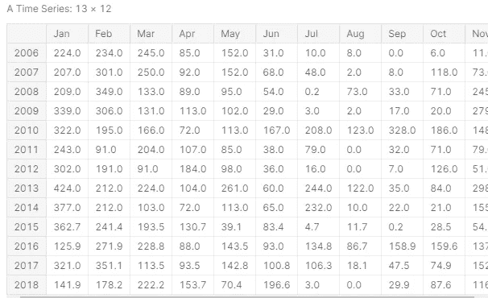

图二。时间序列降雨数据

# 探索性时间序列数据分析

对任何时间序列数据进行探索性数据分析的第一步是可视化相对于时间的值。我们将使用以下代码将我们的降雨量数据可视化为时间序列图(折线图、值与时间的关系):

```
#Plot Time Series Dataautoplot(hujan_ts) + ylab("Rainfall (mm2)") + xlab("Datetime") + 
  scale_x_date(date_labels = '%b - %Y', breaks = '1 year', minor_breaks = '2 month') +
  theme_bw() + ggtitle("Banten Rainfall 2006 - 2018")
```

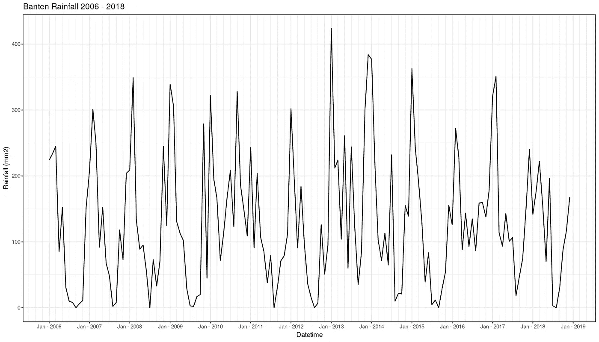

图三。万丹降雨时间序列图

时间序列图显示降雨具有季节性模式，但没有出现任何趋势；降雨量将在年末达到最高值，直到 1 月**(雨季)**，从 3 月到 8 月**(旱季)**开始减少。在 2006 年至 2018 年期间，这种模式每年都会重复。

我们将根据趋势、季节性和剩余部分将时间序列数据分解成更详细的内容。利用这一分解结果，我们希望更精确地了解 2006-2018 年期间的降雨行为。

将使用 **stl()** 函数进行分解，并将时间序列自动分成三个部分(趋势、季节性、余数)。

```
#Decomposition using stl()
decomp <- stl(hujan_ts[,1], s.window = 'periodic')#Plot decomposition
autoplot(decomp) + theme_bw() + scale_x_date(date_labels = '%b - %Y', breaks = '1 year', minor_breaks = '2 month') +
    ggtitle("Remainder")
```

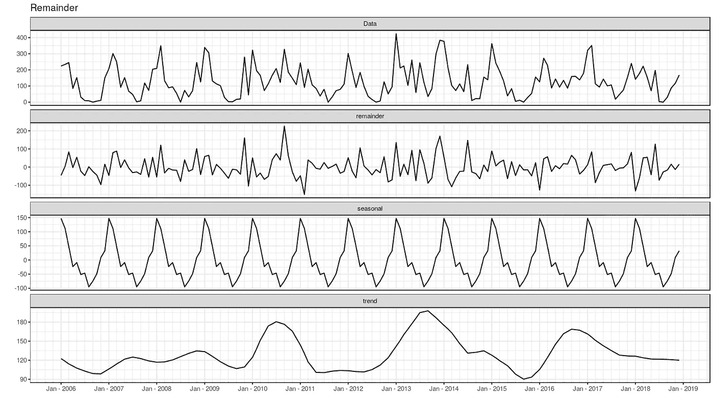

图 4。时间序列分解

趋势周期和季节图显示出现了季节波动，没有特定的趋势和相当随机的剩余/残差。

有一种计算方法可以衡量趋势和季节性强度:

**Ft** :趋势强度

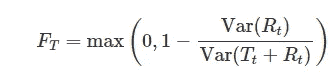

图五。趋势强度公式

**Fs** :季节性强度

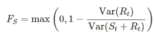

图六。季节性强度公式

趋势和季节性的强度在 0 和 1 之间，而 **"1"** 意味着有很强的趋势和季节性发生。

```
Tt <- trendcycle(decomp)
St <- seasonal(decomp)
Rt <- remainder(decomp)#Trend Strength Calculation
Ft <- round(max(0,1 - (var(Rt)/var(Tt + Rt))),1)#Seasonal Strength Calculation
Fs <- round(max(0,1 - (var(Rt)/var(St + Rt))),1)

data.frame('Trend Strength' = Ft , 'Seasonal Strength' = Fs)
```

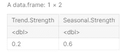

图七。趋势/季节强度计算结果

通过使用测量趋势和季节强度的公式，我们证明了我们的数据具有季节性模式(季节强度:0.6)，而没有出现趋势(趋势强度:0.2)。

**季节性分析**

我们知道我们的数据有季节性模式。因此，探索更多关于我们的降雨数据的季节性；季节图、季节-子系列图和季节箱线图将对我们的数据提供更深刻的解释。

```
#Seasonal Plot
seasonplot(hujan_ts, year.labels = TRUE, col = 1:13, 
   main =  "Seasonal Plot", ylab= "Rainfall (mm2)")
```

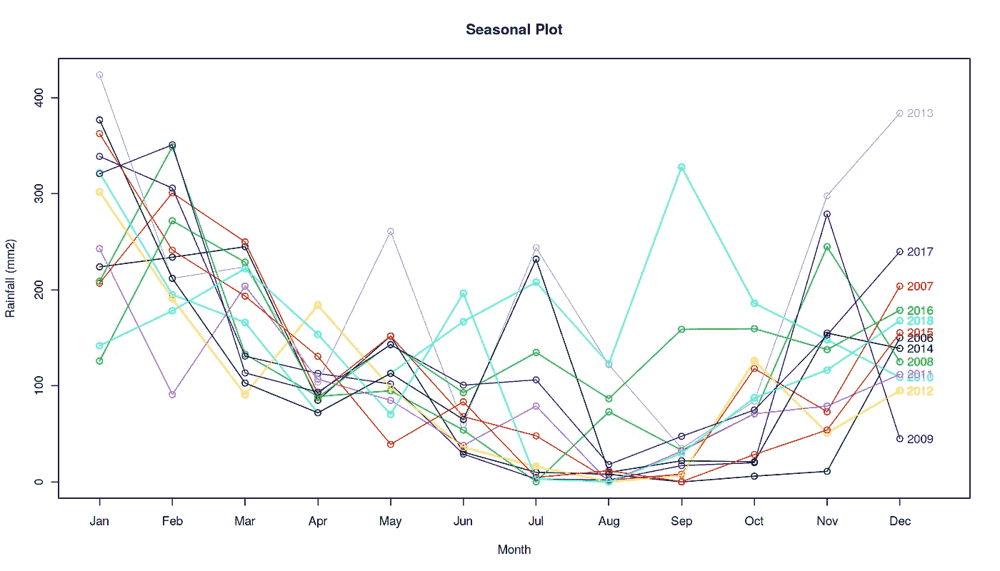

图八。降雨时间序列季节图

季节图确实显示了每年发生的季节模式。尽管如此，由于在此期间几年的差异，我们无法仅使用此图来查看模式。进一步的探索将使用季节性箱线图和子系列图，从我们的数据中获得更深入的分析和见解。

```
#Seasonal Sub-Series Plot
seasplot(hujan_ts, outplot = 3, trend = FALSE, 
      main = "Seasonal Subseries Plot", ylab= "Rainfall (mm2)")#Seasonal Boxplot
seasplot(hujan_ts, outplot = 2, trend = FALSE, 
     main = "Seasonal Box Plot", ylab= "Rainfall (mm2)")
```

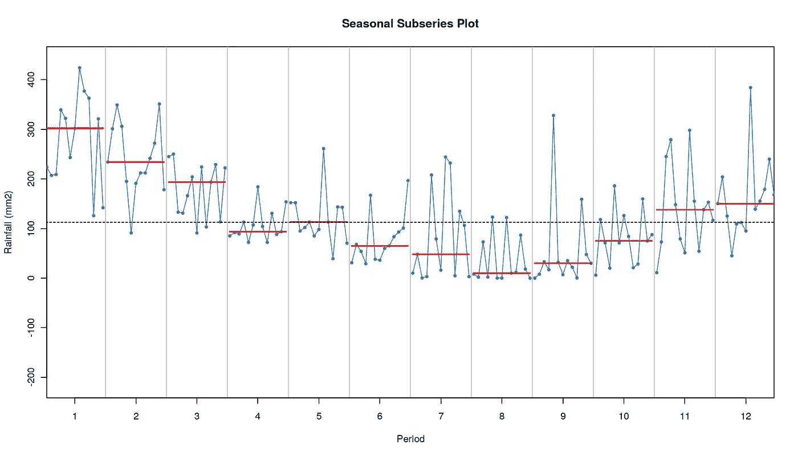

图九。季节性子系列图

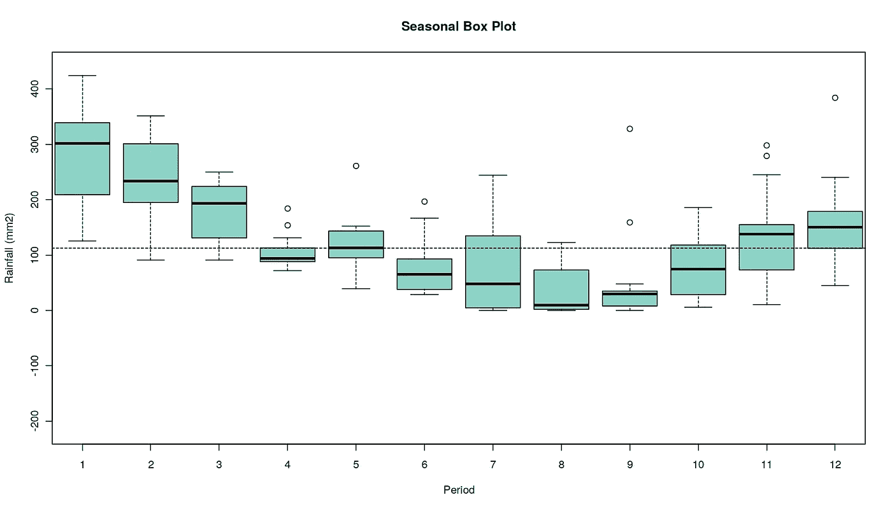

图 10。季节性箱线图

使用季节性箱线图和子系列图，我们可以更清楚地看到数据模式。水平线表示按月分组的降雨量平均值，通过使用此信息，我们了解到降雨量将从 4 月开始减少，并在 8 月和 9 月达到最低点。降雨量将在 9 月后再次开始攀升，并在 1 月达到顶峰。

据此，我们可以将旱季安排在 4 月至 9 月，雨季安排在 10 月至 3 月。这对像印度尼西亚这样依赖农产品的国家来说是一个有益的启示。旱季和雨季预测可用于确定开始种植农业商品并使其产量最大化的正确时间。

此外，这些信息可以帮助政府制定任何政策，作为预防雨季暴雨引发洪水或旱季干旱的方法。

# 2019-2020 年降雨量预测

预测的第一步是选择正确的模型。为此，我们需要将时间序列数据集分为训练集和测试集。训练集将用于训练几个模型，而且，这个模型应该在测试集上进行测试。

**分体列车/测试装置**

**训练集:**我们将使用截至 2017 年 12 月的所有数据作为我们的训练集

**测试集:** 2018 年期间(1 月-12 月)将作为我们的测试集

```
*#Create Train Set*
hujan_train <- window(hujan_ts, end = c(2017,12))*#Create Test Set* 
hujan_test <- window(hujan_ts, start = c(2018,1))
```

**静止测试**

在开始建立 ARIMA 模型之前，应检查列车组数据的平稳性。可以使用 URCA 包装的 ***科维亚特科夫斯基-菲利普-施密特-申恩试验(KPSS)*** 和 ***迪基-富勒试验(D-F 试验)*** 进行静态试验。

```
*#Kwiatkowski–Phillips–Schmidt–Shin Test*
summary(ur.kpss(hujan_train)) *#Dickey-Fuller Test* summary(ur.df(hujan_train)) ####################### 
# KPSS Unit Root Test # 
####################### 

Test is of type: mu with 4 lags. 

Value of test-statistic is: 0.0531 

Critical value for a significance level of: 
                10pct  5pct 2.5pct  1pct
critical values 0.347 0.463  0.574 0.739############################################### 
# Augmented Dickey-Fuller Test Unit Root Test # 
############################################### 

Test regression none 

Call:
lm(formula = z.diff ~ z.lag.1 - 1 + z.diff.lag)

Residuals:
    Min      1Q  Median      3Q     Max 
-176.15  -43.66    3.80   68.21  355.75 

Coefficients:
           Estimate Std. Error t value Pr(>|t|)    
z.lag.1    -0.15081    0.05230  -2.883 0.004555 ** 
z.diff.lag -0.28241    0.08111  -3.482 0.000664 ***
---
Signif. codes:  0 ‘***’ 0.001 ‘**’ 0.01 ‘*’ 0.05 ‘.’ 0.1 ‘ ’ 1

Residual standard error: 96.77 on 140 degrees of freedom
Multiple R-squared:  0.1755,	Adjusted R-squared:  0.1637 
F-statistic:  14.9 on 2 and 140 DF,  p-value: 1.36e-06

Value of test-statistic is: -2.8835 

Critical values for test statistics: 
      1pct  5pct 10pct
tau1 -2.58 -1.95 -1.62
```

使用 95%作为置信水平，两个测试的零假设(ho)定义为:

*   **KPSS 检验:**数据是平稳的
*   **D-F 检验:**数据是非平稳的

因此，对于 KPSS 测试，我们希望 p 值> 0.5，我们可以接受零假设，对于 D-F 测试，我们希望 p 值< 0.05 to reject its null hypothesis. Based on the test which been done before, **我们可以很舒服地说，我们的训练数据是平稳的**。

**型号分配**

将使用 ARIMA 和 ETS 模型进行预测，这些模型之间的比较也将使用测试集的一些参数进行评估。

**ARIMA 模式**

建立 ARIMA 模型的第一步是创建平稳时间序列数据的自相关图。有时为了得到稳定的数据，我们需要做差分；对于我们的例子，我们已经有了一个固定的集合。因此，我们模型上的差异数(D，D)可以设置为零。

我们的数据集具有季节性，因此我们需要构建 **ARIMA (p，D，q)(P，D，Q)m** ，以获得(P，P，Q，Q)我们将看到自相关图(ACF/PACF)并从图中导出这些参数。

```
acf2(hujan_train)
```

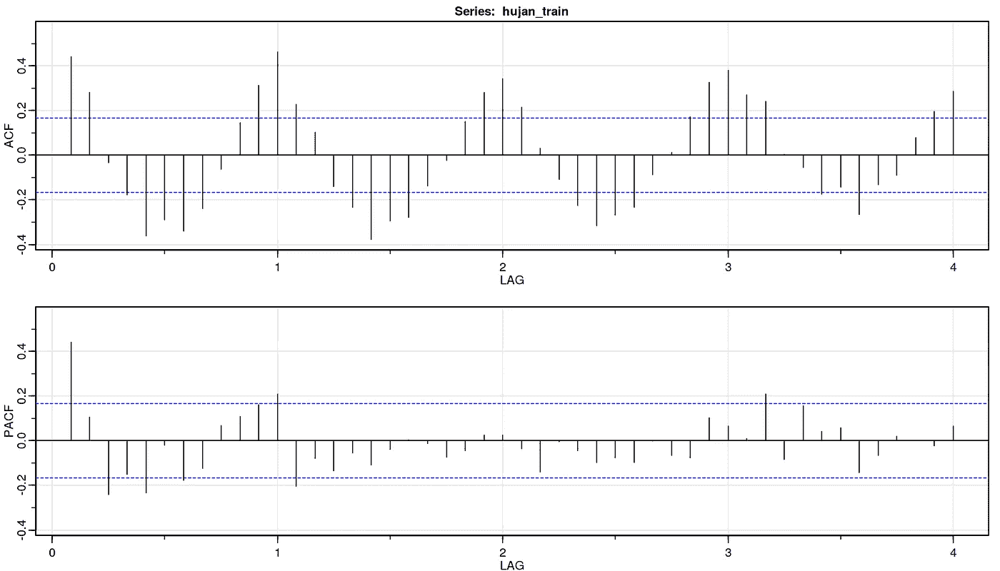

图 11。ACF/PACF 绘图训练装置

ACF 图用于获得 MA 参数(Q，Q)，在滞后 2 处有显著的尖峰，正弦曲线指示年度季节性(m = 12)。PACF 图用于获得 AR 参数(P，P)，AR 参数在滞后 1 时有显著的尖峰。

这个 ACF/PACF 图表明，合适的模型可能是 **ARIMA(1，0，2)(1，0，2)** 。为了确定这个模型，我们将根据我们的建议设置其他模型，用 **1** 修改 **(AR)** 和 **(MA)** 组件。

1.  模型-1 : **ARIMA(1，0，2)(1，0，2)**
2.  模型二: **ARIMA(2，0，2)(2，0，2)**
3.  模型 3 : **ARIMA(1，0，1)(1，0，1)**
4.  模型 4 : **ARIMA(2，0，1)(2，0，1)**
5.  模型-5 : **ARIMA(0，0，2)(0，0，2)**
6.  模型 6 : auto.arima()

我们还将设置 **auto.arima()** 作为我们的模型的另一个比较，并期望找到更适合我们的时间序列。

```
fit1 <- Arima(hujan_train, order = c(1,0,2), seasonal = c(1,0,2))
fit2 <- Arima(hujan_train, order = c(2,0,2), seasonal = c(2,0,2))
fit3 <- Arima(hujan_train, order = c(1,0,1), seasonal = c(1,0,1))
fit4 <- Arima(hujan_train, order = c(2,0,1), seasonal = c(2,0,1))
fit5 <- Arima(hujan_train, order = c(0,0,2), seasonal = c(0,0,2))
fit6 <- auto.arima(hujan_train, stepwise = FALSE, 
        approximation = FALSE)
```

为了在所有 ARIMA 模型中选择最适合我们数据的模型，我们将比较这些模型的 AICc 值。具有最小 AICc 的模型通常是预测的最佳模型。

```
data.frame('Model-1' = fit1$aicc, 'Model-2' = fit2$aicc, 
     'Model-3' = fit3$aicc,
     'Model-4' = fit4$aicc, 
     'Model-5' =  fit5$aicc,'Auto.Arima'= fit6$aicc,
      row.names =   "AICc Value")
```

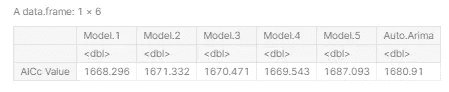

图 12。ARIMA 模型的 AICc 值

模型 1 的 AICc 值在其他模型中是最低的，这就是为什么我们选择这个模型作为我们预测的 ARIMA 模型。但是，我们还需要对该模型进行残差检查，以确保该模型适用于我们的时间序列预测。

```
checkresiduals(fit1) Ljung-Box test

data:  Residuals from ARIMA(1,0,2)(1,0,2)[12] with non-zero mean
Q* = 10.187, df = 17, p-value = 0.8956

Model df: 7\.   Total lags used: 24
```

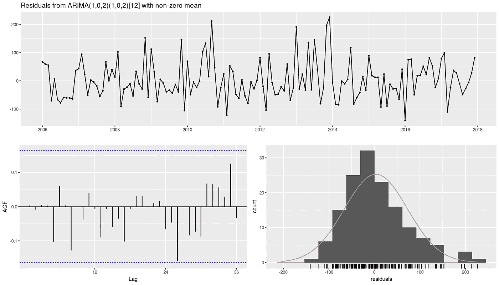

图 13。ARIMA 模型的残差检验

基于模型残差的 Ljung-Box 检验和 ACF 图，我们可以得出结论，该模型适用于预测，因为其残差表现出白噪声行为，并且彼此不相关。

**ETS 模型**

我们将构建 ETS 模型，并将其与我们选择的 ARIMA 模型进行比较，以查看哪个模型更适合我们的测试集。

```
*#ETS Model*
fit_ets <- ets(hujan_train, damped =TRUE)
```

与 ARIMA 模型相似，我们也需要检查其残差行为，以确保该模型能够很好地进行预测。

```
checkresiduals(fit_ets)Ljung-Box test

data:  Residuals from ETS(A,Ad,A)
Q* = 40.433, df = 7, p-value = 1.04e-06

Model df: 17\.   Total lags used: 24
```

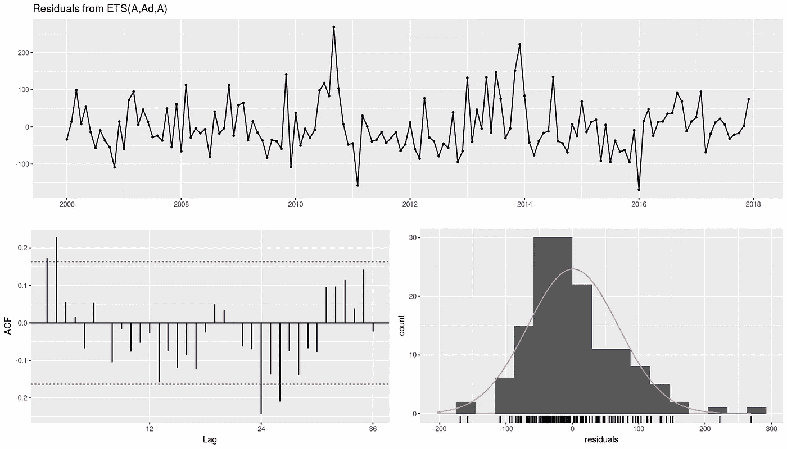

图 14。ETS 模型的残差检验

在残差检查之后，ACF 图显示 ETS 模型残差在几个滞后上相互之间的相关性很小，但是大多数残差仍然在限制范围内，我们将继续使用该模型作为与我们选择的 ARIMA 模型的比较。

**测试集上的 ARIMA vs ETS 模型**

可以使用测试集来检查我们的时间序列数据的更好模型。我们将使用 ARIMA 和 ETS 模型进行预测，并根据测试集(2018 年 1 月至 12 月)查看它们的准确性。

第一步，我们需要在 ARIMA 模型、ETS 模型和我们 2018 年的实际数据之间绘制可视化。但是由于 ggfortify 包不能很好地与其他包相适应，我们应该稍微修改一下代码来显示漂亮的可视化效果。

注意:如果没有加载 ggfortify 包，可以直接使用:autoplot(实际数据)+ autolayer(forecast_data)，来做可视化。

```
#Modifying Data For ggplotmodel_1 <- forecast(fit1, h=12) 
model_ets <- forecast(fit_ets, h=12)

model_1 <- as.data.frame(model_1$mean)
model_ets <- as.data.frame(model_ets$mean)

colnames(model_1) <- "Curah_Hujan"
colnames(model_ets) <- "Curah_Hujan"

hujan_train_df <- as.data.frame(hujan_train)

model_1_plot <- rbind(hujan_train_df,model_1)
model_ets_plot <- rbind(hujan_train_df, model_ets)

model_1_plot <- model_1_plot %>% 
  mutate('Date' = seq(from = as.Date("2006-01-01", '%Y-%m-%d'), to = as.Date("2018-12-31",'%Y-%m-%d'),by = 'month'))

model_ets_plot <- model_ets_plot %>% 
  mutate('Date' = seq(from = as.Date("2006-01-01", '%Y-%m-%d'), to = as.Date("2018-12-31",'%Y-%m-%d'),by = 'month'))

hujan_ts_df <- as.data.frame(hujan_ts)

hujan_ts_df <- hujan_ts_df %>% 
  mutate('Date' = seq(from = as.Date("2006-01-01", '%Y-%m-%d'), to = as.Date("2018-12-31",'%Y-%m-%d'),by = 'month'))

hujan_train_df <- hujan_train_df %>% 
  mutate('Date' = seq(from = as.Date("2006-01-01", '%Y-%m-%d'), to = as.Date("2017-12-31",'%Y-%m-%d'),by = 'month'))

colors <- c("ARIMA Model Forecast 2018" = "blue", "ETS Model Forecast 2018" = "red", "Actual Data" = "black")

#Creating Plotggplot() + geom_line(model_1_plot,
   mapping = aes(x=Date, y=Curah_Hujan, 
   color= "ARIMA Model Forecast 2018"),lty = 2) +
  geom_line(model_ets_plot,
  mapping = aes(x=Date, y=Curah_Hujan, 
  color= "ETS Model Forecast 2018"),lty= 2) +
  geom_line(hujan_ts_df,mapping = aes(x=Date, y=Curah_Hujan, 
  color= "Actual Data"), lty = 1, show.legend = TRUE) +
  ylab("Rainfall (mm2)") + xlab("Datetime") + 
  scale_x_date(date_labels = '%b - %Y', breaks = '1 year', 
  minor_breaks = '2 month') +
  theme_bw() + ggtitle("Banten Rainfall 2006 - 2018") + 
  scale_color_manual(values=colors)
```

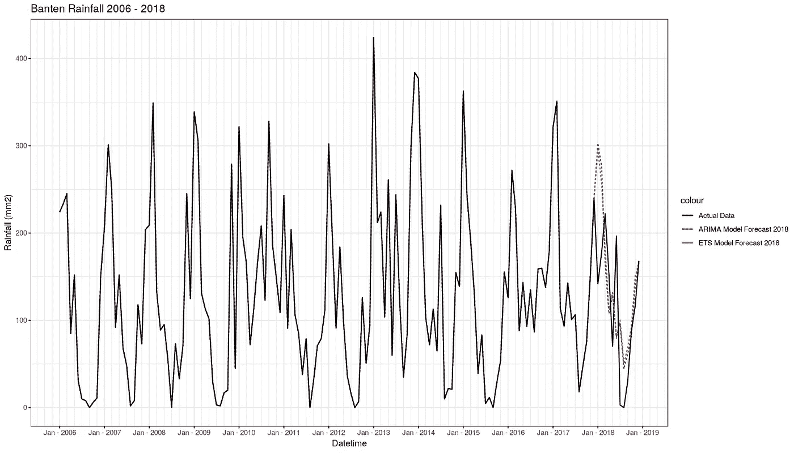

图 15。实际数据与 ARIMA 和 ETS 预测

尽管 ARIMA 和 ETS 的模型并不完全符合实际数据的相同值，但可以肯定的是，他们都策划了一个非常相似的运动来反对它。

在 numbers 中，我们可以用实际数据计算这些模型之间的准确性，并决定哪一个模型最符合我们的数据:

```
#ARIMA Model Accuracy
accuracy(forecast(fit1, h=12), hujan_test)
```

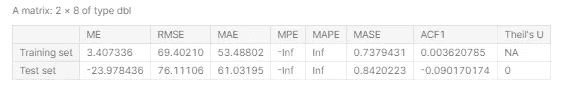

图 16。ARIMA 模型精度

```
#ETS Model Accuracy
accuracy(forecast(fit_ets, h=12), hujan_test)
```

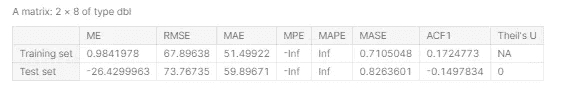

图 17。ETS 模型准确性

从准确性来看，ETS 模型在训练集和测试集上都优于 ARIMA 模型。

**2019-2020 年降雨量预测**

使用与使用我们的训练集创建的模型相同的参数，我们将预测 2019-2020 年的降雨量预测(h=24)。

预测和绘图:

```
*#Create Model*
ARIMA_Model <- Arima(hujan_ts, order = c(1,0,2), 
   seasonal = c(1,0,2))
ETS_Model <- ets(hujan_ts, damped = TRUE, model = "AAA")

*#ARIMA Model Forecast*
autoplot(forecast(ARIMA_Model, h=24)) + theme_bw() + 
  ylab("Rainfall (mm2)") + xlab("Datetime") + 
  scale_x_date(date_labels = '%b - %Y', 
  breaks = '1 year', minor_breaks = '2 month') +
  theme_bw() + ggtitle("Banten Rainfall Forecast 2019-2020 
  ARIMA Model")
*#ETS Model Forecast*
autoplot(forecast(ETS_Model, h=24)) + theme_bw() + 
  ylab("Rainfall (mm2)") + xlab("Datetime") + 
  scale_x_date(date_labels = '%b - %Y', breaks = '1 year', 
  minor_breaks = '2 month') +
  theme_bw() + ggtitle("Banten Rainfall Forecast 2019-2020 
  ETS Model")
```

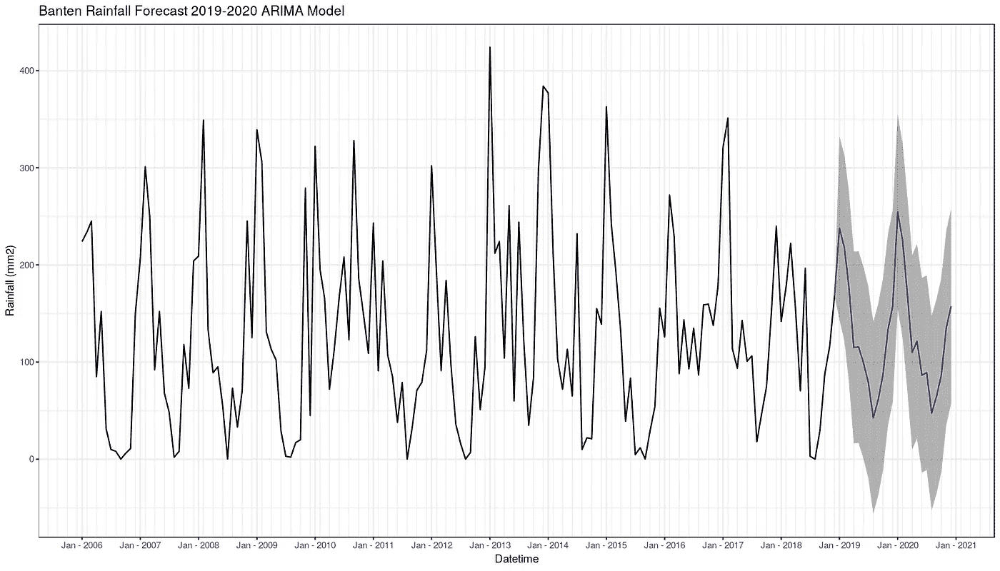

图 18。ARIMA 模型预测 2019–2020


图 19。ETS 模型预测 2019–2020 年

使用这两个模型进行了预测，基于 2019 年和 2020 年 8 月降雨量最低值的绘图，它们共享相似的运动。

我们的预测对于想知道哪个月开始种植最好的农民是有用的，对于需要制定雨季防洪和旱季抗旱政策的政府也是有用的。最重要的是，这种预测仅基于历史趋势，更准确的预测必须结合使用气象数据和气候专家的一些专业知识。

[1] [banten.bps.go.id](https://banten.bps.go.id/) 。于`May,17th 2020`访问

[2]Hyndman，R.J .，& Athanasopoulos，G. (2018) *预测:原理与实践*，第二版，OTexts:澳洲墨尔本。OTexts.com/fpp2.Accessed 在`May,17th 2020`上。