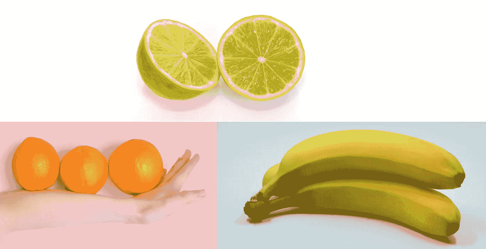
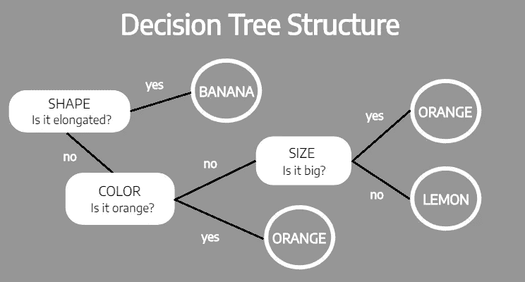

# 随机森林和决策树

> 原文：<https://towardsdatascience.com/random-forest-and-decision-trees-d8f7cd06803b?source=collection_archive---------44----------------------->

## 你已经听说过用于预测疾病、识别图形和面孔，甚至我们的行为的算法。但是你知道这些算法和它们是如何工作的吗？

[@ugodly](https://unsplash.com/@ugodly) 在 [Unsplash](https://unsplash.com/?utm_source=medium&utm_medium=referral) 上的照片

广泛用于解决数据科学问题的最流行(也是最强大)的算法之一是一种叫做**随机森林**的算法。不用说幕后有很多数学和计算机编程，但是让我们把它变得简单，这样即使你以前从未听说过它，你也能理解这个主题。

随机森林源自另一种被称为**决策树**的算法的思想，它基本上使用类似于树及其分支的结构来做出导致最终预测的决策。

但是这实际上是如何工作的呢？你需要知道的第一件事是没有魔法。训练算法时，必须有可用的历史数据。算法要学习的就是这些数据。假设我们想要创建一个模型，该模型能够识别给定了一些特定特征的对象，例如*形状*、*颜色*、*高度、*等等。

为了简化，让我们假设这些对象具体是三种不同的水果:香蕉、橙子和柠檬。决策树算法如何面对这个任务？

为了理解这个过程，让我们想象一下，我们的任务是教一个两岁的孩子区分三种相同的水果。第一个好方法是告诉孩子注意水果的形状:橙子和柠檬是圆形的，而香蕉是细长形的，这与其他两种水果明显不同。

然而，乍看之下，橙子和柠檬似乎更相似，我们必须考虑其他一些特征来完成我们的任务，教会孩子准确地识别这三种水果。

(**上图**)照片由[肖恩·迈因杰斯](https://unsplash.com/@shaunmcreatives)在 [Unsplash](https://unsplash.com/?utm_source=medium&utm_medium=referral) | ( **左下**)照片由 [Unsplash](https://unsplash.com/?utm_source=medium&utm_medium=referral) 伊莲娜·科切娃|(**右下**)照片由[布雷特·乔丹](https://unsplash.com/@brett_jordan)在 [Unsplash](https://unsplash.com/?utm_source=medium&utm_medium=referral)

区分柠檬和橙子的一个很好的参数可能是它们的颜色。假设柠檬通常是绿色的，而橙子通常是……橙色的，这将是一个很好的第二个参数，几乎总能引导我们聪明的孩子正确地识别水果。如果我们的橙子还没熟，还是绿色的，也许我们可以比较一下大小，如果它大于某个标准，我们就说它是橙子，否则，我们就把它归类为柠檬。

这可能看起来很傻，但这正是决策树算法的过程。在描述我们水果的所有可用特征中，它将深入数据，选择最重要的特征，最好地将一个类从其他类中分离出来，并对其余的特征遵循相同的逻辑，直到它找到一种方法来更好地确定它是哪种水果。

这就是决策树算法也可用作**特征选择**工具的原因，在本例中，它将识别对我们的识别更重要的特征，并排除对我们的主要目标贡献很小或没有贡献的特征。

例如，如果我们有谁购买了我们例子中的每一种水果的信息，那么对我们谈论的水果进行分类可能是不相关的信息，而这些树的结构在识别它方面非常好。

作者图片

如果我们能把不同的树放在一起，从几个不同的角度观察这些水果，以更好地了解它们如何区分彼此，会怎么样？这正是随机森林算法的思想。

它创建了一系列决策树，每一个都在寻找相同水果示例的略微不同的组成，并从不同的角度来看待它们:例如，一个决策树使用*颜色*作为第一个参数来构建，而另一个树使用*高度*。

只有当我们保证一棵树不等于另一棵树时，这才有意义，否则我们就不能从不同的“观点”中获益，并且创建一组树所需的计算能力也是不合理的。为了保证一组不同的树，一些参数是可以控制的(考虑到我们正在使用像[**Scikit-Learn**](https://scikit-learn.org/stable/)**这样的库中可用的*框架*，而不是从头开始构建它)。**

**首先，我们的算法将为每棵树选择一组不同的例子。因此，假设我们的原始数据有 1000 个可用的水果示例:该算法将为每棵树随机选择 1000 个示例，这意味着一些示例可能会在同一个集合中被选择多次，而其他示例可能会丢失。**

**除此之外，我们还可以控制参数，比如`max_features`的数量。这个参数将设置一个数字，比如说 2，然后算法将为每棵树选择两个随机特征，并决定其中哪个最重要，以区分不同的果实。**

**这些随机因素实际上保证了所有的决策树都是不同的。另一个重要的参数是`n_estimators`，它允许用户选择要创建的决策树的数量。**

****

**作者图片**

**直观地说，与单个决策结构相比，一系列协同工作的决策树会表现得更好，这说明了使用随机森林算法的强大之处。一旦我们建立了一个森林，我们如何让不同的决策树一起工作？**

**如果我们希望我们的模型预测哪种水果，给定一组新的特征，每棵树都将进行预测，并且该预测将与每类的一个概率相关联。例如，一棵树可以得出结论，给定的特征 80%可能是香蕉，12%可能是橙子，8%可能是柠檬，而其他树可能具有不同的关联概率。**

**最后，将对这些概率计算一个**加权投票**，得出最终结论。这将是一个**分类**任务的基本过程，就像我们的水果示例一样。**

**当我们想要预测一个连续的数字或度量时，如房子的价格或在某个特定时期将要出售的产品的数量，随机森林也可以用在**回归**任务中。在这种情况下，程序基本上是相同的，但是最终的预测不是像在分类任务中那样通过加权投票给出的，而是通过计算个体树预测的平均值**来给出的。****

****

**(**左**)照片由[皮奥特·西霍斯](https://unsplash.com/@ptrc)在 [Unsplash](https://unsplash.com/?utm_source=medium&utm_medium=referral) | ( **右**)照片由[路易·汉瑟@肖特·路易](https://unsplash.com/@louishansel)在 [Unsplash](https://unsplash.com/?utm_source=medium&utm_medium=referral)**

**只是不要忘记，如果你向我们的水果模型分类器展示一个遥控器，它肯定会认为这是一个香蕉。这些模型准确地学习我们告诉它们学习的东西，它们预测的质量取决于我们给它们的例子的质量。**

**在本文中，我们更好地理解了最流行的机器学习算法之一是如何在幕后工作的。既然算法与机器控制一切的电影场景混合在一起的抽象概念已经离开了你的头脑，**试着写下你的第一行代码怎么样？****

**我知道大多数关于数据科学的文章都是用英语写的，所以我创建了一个名为 [**Tech4All-br**](https://medium.com/@tech4all-br) 的项目，目的是用葡萄牙语创建内容。如果你想阅读葡萄牙语的材料，请访问此[链接](https://medium.com/@tech4all-br/floresta-aleat%C3%B3ria-e-%C3%A1rvores-de-decis%C3%A3o-429e127305f0)。**