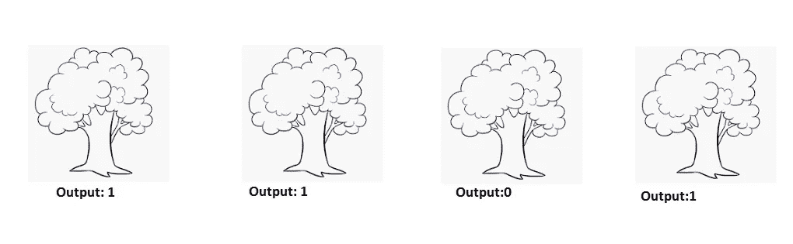
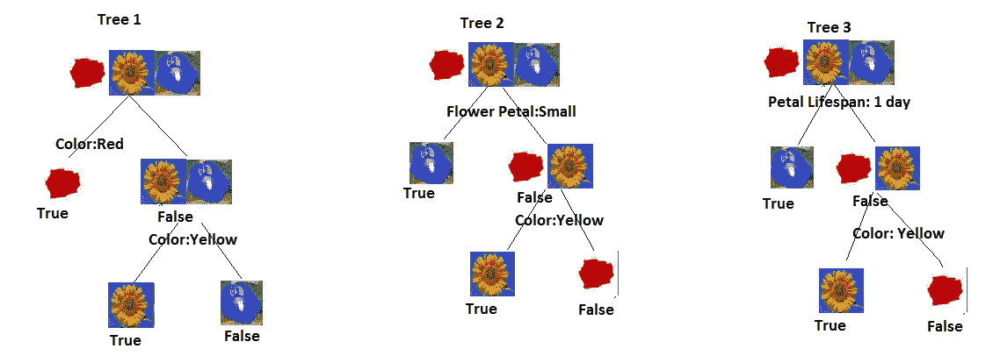
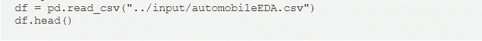
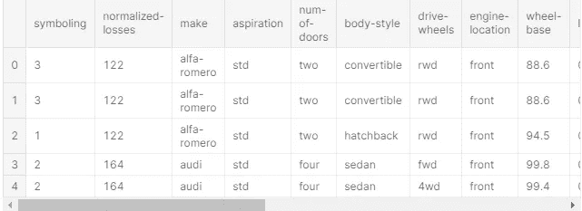
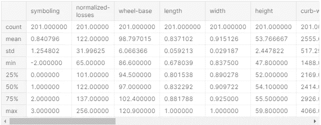
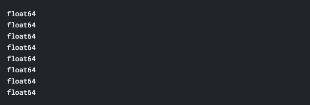
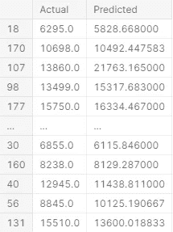
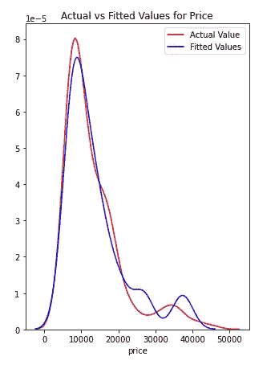
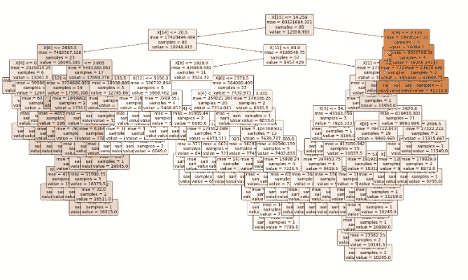

# 预测用随机森林

> 原文：<https://towardsdatascience.com/random-forest-ca80e56224c1?source=collection_archive---------3----------------------->

## 利用随机森林预测汽车价格

这是一个在多个决策树之间操作的过程，通过选择其中的大多数作为最佳值来获得最佳结果。



有输出的多重决策树。(图片鸣谢:[easydrawingguides.com](https://easydrawingguides.com/)，作者编辑)

请将上面的图像视为具有不同结果的多个决策树的代表。在 4 个决策树中，3 个的输出与 1 相同，而一个决策树的输出为 0。应用上面提到的定义，随机森林操作四个决策树，并且为了获得最佳结果，它选择大多数(即 3 个)决策树提供的结果。因此，在这种情况下，最佳结果将是 1。

对于决策树，您可以通过点击链接【https://towardsdatascience.com/decision-tree-ba64f977f7c3 访问更早的故事

**用途**

1.  遥感:随机森林(RF)通常用于遥感，以预测数据的准确性/分类。
2.  物体检测:射频在更短的时间内对物体检测起主要作用。

**为什么？**

1.  因为我们在多个决策树上工作，所以过度拟合的可能性较小。
2.  更高的准确性:因为它运行在更大的数据集上，所以准确性更高。
3.  估计缺失数据:因为它运行在一个更大的数据集上，所以您也可以估计缺失值。

**随机森林是如何工作的？**



多重决策树(图片由作者提供)

在上图中，我们使用 3 个不同的决策树进行了相同的分类。树 1 使用颜色对数据进行分类，树 2 使用花瓣大小和颜色，树 3 使用花瓣寿命和颜色。


缺少颜色数据的花(图片来源:Vectorstock.com)

现在模特训练有素。考虑到我们有一朵缺少颜色数据的花。树 1 将无法识别此数据，因为它用颜色对所有东西进行了分类，所以它会将其归入郁金香花类别。

树 2:它作用于颜色和花瓣大小。根据花瓣的大小，它会变成假的，即不小，然后是颜色，即不是黄色。这是对它是一朵玫瑰的预测。

树 3:它对寿命和颜色有效。第一个分类将是一个错误的类别，随后是非黄色。正如预测的那样，这是一朵玫瑰。

让我们尝试使用 Python 随机森林。首先，我们将导入所需的 python 库。

```
import pandas as pd
import numpy as np
import matplotlib.pyplot as plt
%matplotlib inline
```

我们正在进口熊猫、NumPy 和 matplotlib。接下来，我们将消费数据并查看它。



作者图片



df.head()将给出每一列的前 5 行的详细信息。我们可以使用 df.tail()获得最后 5 行，使用类似的 df.head(10)获得前 10 行。

数据是关于汽车的，我们需要用上面的数据来预测汽车的价格

我们将使用随机森林来获得汽车的价格。

```
df.dtypessymboling              int64
normalized-losses      int64
make                  object
aspiration            object
num-of-doors          object
body-style            object
drive-wheels          object
engine-location       object
wheel-base           float64
length               float64
width                float64
height               float64
curb-weight            int64
engine-type           object
num-of-cylinders      object
engine-size            int64
fuel-system           object
bore                 float64
stroke               float64
compression-ratio    float64
horsepower           float64
peak-rpm             float64
city-mpg               int64
highway-mpg            int64
price                float64
city-L/100km         float64
horsepower-binned     object
diesel                 int64
gas                    int64
dtype: object
```

dtypes 给出列的数据类型。

```
df.describe()
```



作者图片

在上面的数据框中，所有的列都不是数字。因此，我们将只考虑那些数值为数字的列，并使所有的数字都浮动。

```
df.dtypes
for x **in** df:
    if df[x].dtypes == "int64":
        df[x] = df[x].astype(float)
        print (df[x].dtypes)
```



准备数据与分类任务一样，在本节中，我们将把数据划分为属性和标签，从而划分为训练集和测试集。我们将创建 2 个数据集，一个用于价格，另一个(df-price)。由于我们的数据框包含大量对象格式的数据，因此在本次分析中，我们将删除所有对象类型的列，对于所有 NaN 值，我们将删除该行。

```
df = df.select_dtypes(exclude=['object'])
df=df.fillna(df.mean())
X = df.drop('price',axis=1)
y = df['price']
```

这里，X 变量包含数据集中的所有列，除了标签“价格”列。y 变量包含“价格”列中的值，这意味着 X 变量包含属性集，y 变量包含相应的标签。

```
from sklearn.model_selection import train_test_split
X_train, X_test, y_train, y_test = train_test_split(X, y, test_size=0.3, random_state=0)
```

为了训练树，我们将使用 Random Forest 类并用 fit 方法调用它。我们将有一个随机的 1000 棵决策树的森林。

```
from sklearn.ensemble import RandomForestRegressor
regressor = RandomForestRegressor(n_estimators = 1000, random_state = 42)
regressor.fit(X_train, y_train)
```


作者图片

我们来预测一下价格。

```
y_pred = regressor.predict(X_test)
```

让我们检查实际值和预测值之间的差异。

```
df=pd.DataFrame({'Actual':y_test, 'Predicted':y_pred})
df
```



```
from sklearn import metrics
print('Mean Absolute Error:', metrics.mean_absolute_error(y_test, y_pred))
print('Mean Squared Error:', metrics.mean_squared_error(y_test, y_pred))
print('Root Mean Squared Error:', np.sqrt(metrics.mean_squared_error(y_test, y_pred)))Mean Absolute Error: 1993.2901175839186
Mean Squared Error: 9668487.223350348
Root Mean Squared Error: 3109.4191134921566
```

我们算法的平均绝对误差是 1993.2901175839186，小于“价格”列中所有值平均值的 20%。这意味着我们的算法做出了预测，但还需要很多改进。

让我们检查一下我们预测的准确性。

```
*# Calculate the absolute errors*
errors = abs(y_pred - y_test)
*# Print out the mean absolute error (mae)*
print('Mean Absolute Error:', round(np.mean(errors), 2), 'degrees.')

*# Calculate mean absolute percentage error (MAPE)*
mape = 100 * (errors / y_test)
*# Calculate and display accuracy*
accuracy = 100 - np.mean(mape)
print('Accuracy:', round(accuracy, 2), '%.')Mean Absolute Error: 1993.29 degrees.
Accuracy: 87.87 %.
```

87.8%的准确率并不是一个很高的分数，还有很大的提升空间。

让我们画出实际值和预测值之间的差异。

```
import seaborn as sns
plt.figure(figsize=(5, 7))

ax = sns.distplot(y, hist=False, color="r", label="Actual Value")
sns.distplot(y_pred, hist=False, color="b", label="Fitted Values" , ax=ax)

plt.title('Actual vs Fitted Values for Price')

plt.show()
plt.close()
```



实际与预测(图片由作者提供)

以上是实际值和预测值之间的曲线图。让我们想象一下随机的森林树。

```
import pydot
*# Pull out one tree from the forest*
Tree = regressor.estimators_[5]
*# Export the image to a dot file*
from sklearn import tree
plt.figure(figsize=(25,15))
tree.plot_tree(Tree,filled=True, 
              rounded=True, 
              fontsize=14);
```



随机森林树(作者图片)

可以在[https://www.kaggle.com/adityakumar529/random-forest](https://www.kaggle.com/adityakumar529/random-forest)处检查代码。

[https://github . com/adityakumar 529/Coursera _ Capstone/blob/master/Random _ forest . ipynb](https://github.com/adityakumar529/Coursera_Capstone/blob/master/Random_forest.ipynb)