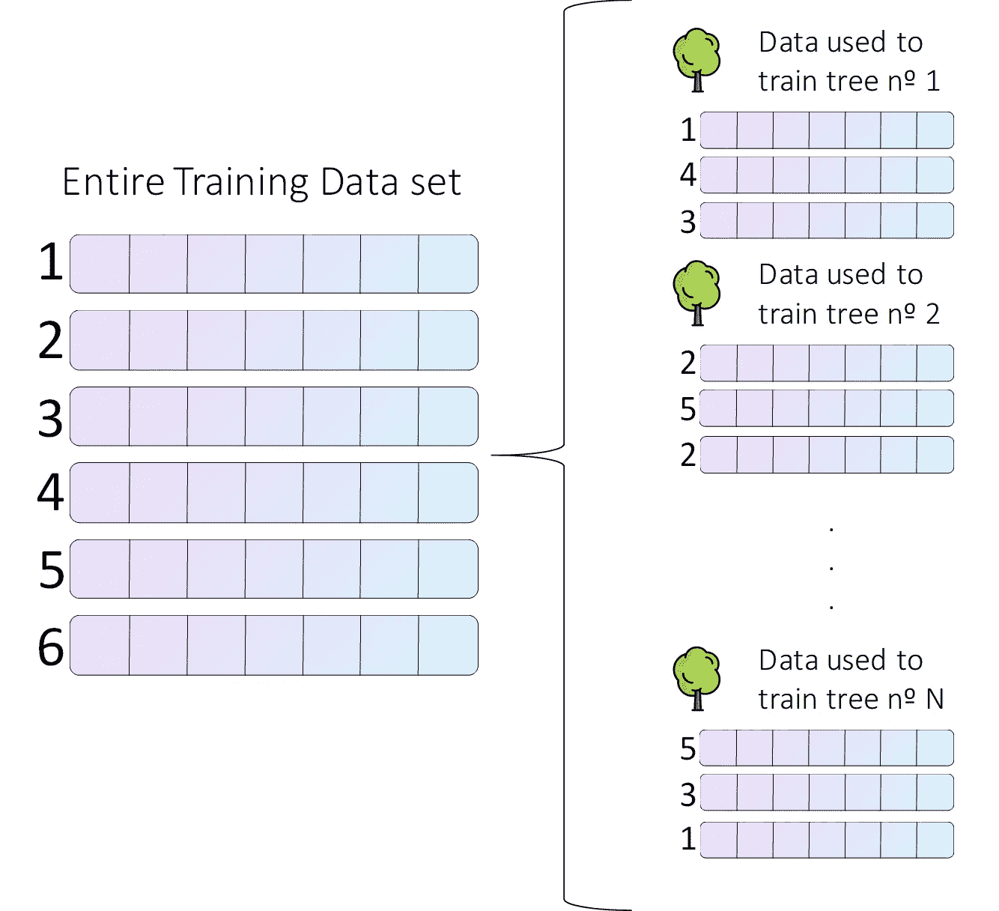
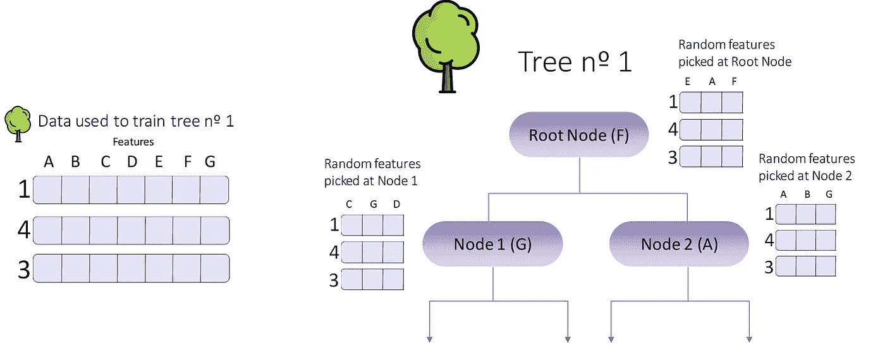
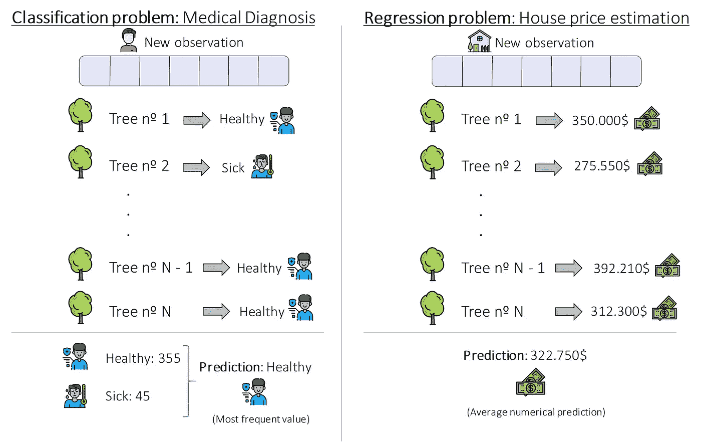

# 兰登森林解释道

> 原文：<https://towardsdatascience.com/random-forest-explained-7eae084f3ebe?source=collection_archive---------3----------------------->


图片来自 [Unsplash](https://unsplash.com/photos/sp-p7uuT0tw) 。

## [Random Forest 简单解释:训练、分类和回归的简单介绍]

*在本帖中，我们将解释什么是随机森林模型，看看它的优点，它是如何构建的，以及它能用来做什么。*

***我们将通过随机森林*** *的理论和直觉，看到理解万物如何运作所必需的最少的数学量，而不深入最复杂的细节。*

*最后，在我们开始之前，这里有一些额外的资源可以让你的机器学习生涯突飞猛进:*

```
*Awesome Machine Learning Resources:**- For* ***learning resources*** *go to* [***How to Learn Machine Learning***](https://howtolearnmachinelearning.com/books/machine-learning-books/)*! 
- For* ***professional******resources*** *(jobs, events, skill tests) go to* [***AIgents.co — A career community for Data Scientists & Machine Learning Engineers***](https://aigents.co/)***.***
```

[](https://z-ai.medium.com/subscribe) [## 订阅我的专属列表！

### 订阅我的专属列表！并获得所有你喜爱的新鲜文章<3! By signing up, you will create a Medium…

z-ai.medium.com](https://z-ai.medium.com/subscribe) 

# 1\. Introduction

In the Machine Learning world, Random Forest models are a kind of **非** **参数模型**既可用于回归又可用于分类。它们是最流行的集成方法之一，属于 Bagging 方法的特定类别。

e*n 集合方法*包括使用**多个学习者**来单独提高其中任何一个人的表现。这些方法可以被描述为使用**一群*弱学习者*** ( *那些平均成绩仅比随机模型*稍好的人)在一起的技术，以便**创建一个更强的、聚合的**。

在我们的例子中，随机森林是许多独立决策树的集合。如果您不熟悉决策树，您可以在这里了解它们:

[](/decision-trees-explained-3ec41632ceb6) [## 决策树解释

### 学习机器学习决策树的所有知识

towardsdatascience.com](/decision-trees-explained-3ec41632ceb6) 

决策树的一个主要缺点是它们很容易过度拟合:它们在训练数据上做得很好，但在对看不见的样本进行预测时却不够灵活。虽然有一些解决办法，比如修剪树木，但这降低了它们的预测能力。一般来说，它们是具有中等偏差和高方差的模型，但是它们简单且易于解释。

如果你对偏差和方差的区别不是很有信心，看看下面的帖子:

[](/quick-bias-variance-trade-off-d4895b126b08) [## 快速偏差/方差权衡

### 偏差/方差的权衡很容易解释

towardsdatascience.com](/quick-bias-variance-trade-off-d4895b126b08) 

随机森林模型结合了决策树 **的**简单性和集合模型**的灵活性和强大功能。在树木的森林中，我们忘记了特定树木的高方差，更少关心每一个单独的元素，所以我们可以种植更好、更大的树，比修剪过的树具有更强的预测能力。**

尽管随机森林模型提供的解释能力不如单棵树，但它们的性能要好得多，而且我们不必像处理单棵树那样担心如何完美地调整森林的参数。

好吧，我明白了，随机森林是一组独立的树。**但为什么取这个名字随机呢？随机性在哪里？**让我们通过学习如何构建随机森林模型来找出答案。

# 2.训练和建立随机森林

构建随机森林有 3 个主要阶段。我们将分解它们，并阐明每个概念和步骤。我们走吧！

## 2.1 为每棵树创建引导数据集

当我们构建一个单独的决策树时，我们使用一个训练数据集和所有的观察。这意味着，如果我们不小心，树可以很好地适应这种训练数据，并对新的、看不见的观察结果进行糟糕的概括。为了解决这个问题，我们阻止树变得非常大，通常是以降低其性能为代价。

为了建立一个随机森林，我们必须训练 N 棵决策树。我们是否一直使用相同的数据来训练这些树？我们使用整个数据集吗？没有。

这是第一个随机特征出现的地方。为了训练每一棵树，我们从整个数据集中随机抽取一个样本，如下图所示。



构建单独的数据集。图片作者。来自[平面图标](https://www.flaticon.com/free-icon/tree_616707)的图标。

**从这个图可以推断出各种事情**。首先，用于训练每棵树的数据的大小不一定是整个数据集的大小。此外，一个数据点可以在用于训练单个树的数据中出现多次(就像在树 n 2 中一样)。

这称为替换抽样或引导抽样:每个数据点都是从整个数据集中随机选取的，并且一个数据点可以被多次选取。

通过使用不同的数据样本来训练每棵树，我们减少了他们的一个主要问题:他们非常喜欢他们的训练数据。如果我们训练一个有很多树的森林，每棵树都用不同的数据训练过，我们就解决了这个问题。他们都很喜欢自己的训练数据，但森林不喜欢任何具体的数据点。这允许我们种植更大的单棵树，因为我们不再那么关心单棵树的过度生长。

如果我们使用整个数据集的很小一部分来训练每棵树，我们会增加森林的随机性(减少过度拟合)，但通常是以较低的性能为代价的。

在实践中，默认情况下，大多数随机森林实现(如 Scikit-Learn 中的实现)选择用于每棵树的训练数据样本，其大小与原始数据集相同(但是它不是相同的数据集，请记住，我们选择的是随机样本)。

这通常提供了良好的偏差-方差折衷。

## 2.2 使用这些随机数据集训练森林树，并通过特征选择增加一点随机性

如果您记得不错，为了构建一个单独的决策树，我们在每个节点评估了某个指标(如基尼指数或信息增益),并选择数据的特征或变量放入最小化/最大化该指标的节点。

当只训练一棵树的时候，这种方法还不错，但是现在我们想要一整片树林！我们如何做到这一点？如果单个模型(在我们的例子中是单棵树)不相关，集合模型(如随机森林)效果最好。在随机森林中，这是通过在每个节点随机选择某些特征进行评估来实现的。



构建树 n 1 的随机特征选择。图片作者。来自[平板图标](https://www.flaticon.com/free-icon/tree_616707)的图标。

正如您在前面的图像中看到的，在每个节点上，我们只评估所有初始特征的子集。对于根节点，我们考虑 E、A 和 F(并且 F 获胜)。在节点 1 中，我们考虑 C、G 和 D(并且 G 获胜)。最后，在节点 2 中，我们只考虑 A、B 和 G(A 获胜)。我们将继续这样做，直到我们建立了整个树。

通过这样做，我们避免在每个树中包括具有非常高预测能力的特征，同时创建许多不相关的树。这是第二次随机扫描。在构建每棵树时，我们不仅使用随机数据，还使用随机特征。树的多样性越大越好:我们减少了方差，得到了一个性能更好的模型。

## 2.3 对 N 棵树重复上述步骤，创建我们的神奇森林。

太棒了，我们已经学会了如何建立一个单独的决策树。现在，我们将**对 N 棵树**重复这一过程，在每棵树的每个节点上随机选择哪些变量进入竞争，被选为分割的特征。

总之，整个过程如下:

1.  为每棵树创建一个引导数据集。
2.  使用相应的数据集创建决策树，但在每个节点使用变量或特征的随机子样本进行分割。
3.  重复这三个步骤数百次，建立一个拥有各种各样树木的大森林。这种多样性使得随机森林比单一决策树好得多。

一旦我们建立了我们的森林，我们就准备用它来做令人敬畏的预测。让我们看看如何！

# 3.使用随机森林进行预测

用随机森林做预测非常容易。我们只需获得我们的每一棵树，通过它们传递我们想要进行预测的观察值，从每棵树获得一个预测值(总计 N 个预测值)，然后获得一个整体的、聚合的预测值。

对数据进行自举，然后使用一个聚合来进行预测，这被称为 Bagging，如何进行预测取决于我们所面临的问题的类型。

对于回归问题，集合决策是每个决策树决策的平均值。对于分类问题，最终预测是森林所做的最频繁的预测。



使用随机森林的预测。图片作者。来自[平面图标](https://www.flaticon.com/free-icon/money_2916115?term=Money&page=1&position=4)的图标。

上图展示了这个非常简单的过程。**对于分类问题**我们想预测某个病人是生病了还是健康了。为此，我们通过随机森林中的每棵树传递他的医疗记录和其他信息，并获得 N 个预测(在我们的例子中是 400 个)。在我们的例子中，355 棵树表示病人健康，45 棵树表示病人生病，因此森林判定病人健康。

**对于回归问题**我们想预测某个房子的价格。我们通过 N 棵树传递这个新房子的特征，从每棵树上得到一个数字预测。然后，我们计算这些预测的平均值，得到最终值 322.750 美元。

**简单对吧？**我们对每一棵树都进行预测，然后使用平均值或众数(最频繁值)汇总这些预测。

[](https://z-ai.medium.com/subscribe) [## 订阅我的专属列表！

### 订阅我的专属列表！并获得所有你喜欢的新鲜文章<3! By signing up, you will create a Medium…

z-ai.medium.com](https://z-ai.medium.com/subscribe) 

# 4\. Conclusion and other resources

In this post we have seen what a Random Forest is, how it overcomes the main issues of Decision Trees, how they are trained, and used to make predictions. They are very flexible and powerful Machine Learning models that are highly used in commercial and industrial applications, along with [Boosting 模型](/what-is-boosting-in-machine-learning-2244aa196682)和人工神经网络。

在以后的文章中，我们将探索随机森林的技巧和诀窍，以及它们如何用于特征选择。此外，如果你想知道它们是如何建造的，可以看看 StatQuest 的视频，非常棒:

*就是它！一如既往，我希望你* ***喜欢这个职位。***

*有关机器学习和数据科学的更多资源，请查看以下资源库:* [***如何学习机器学习***](https://howtolearnmachinelearning.com/books/machine-learning-books/) *！有关职业资源(工作、事件、技能测试)，请访问*[***AIgents.co——数据科学家职业社区&机器学习工程师***](https://aigents.co/) *。*

非常感谢您的阅读，祝您愉快！