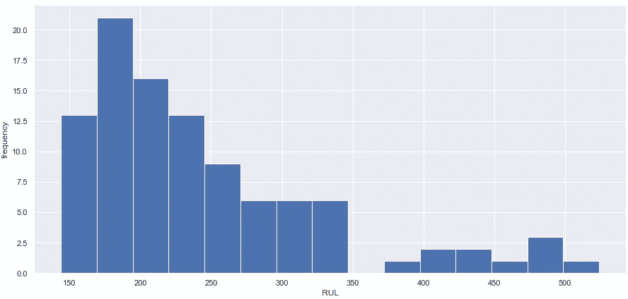

# 涡轮风扇发动机预测维修的随机森林

> 原文：<https://towardsdatascience.com/random-forest-for-predictive-maintenance-of-turbofan-engines-5260597e7e8f?source=collection_archive---------13----------------------->


戴维·科瓦连科在 [Unsplash](https://unsplash.com?utm_source=medium&utm_medium=referral) 上拍摄的照片

## [探索美国宇航局的涡轮风扇数据集](https://towardsdatascience.com/tagged/exploring-nasa-turbofan)

## FD003 的探索性数据分析和超参数调整

<*免责声明:我的目的是展示模型开发过程中不同方法和选择的效果。这些影响经常使用测试集来显示，这被认为是(非常)不好的做法，但有助于教育目的。* >

欢迎来到“探索 NASA 的涡轮风扇数据集”系列的另一部分。在[上一篇文章](/survival-analysis-for-predictive-maintenance-of-turbofan-engines-7e2e9b82dc0e?sk=d290f4c4a5c112360e679f12234043bf)中，我们看了生存分析，并总结了我们对数据集 FD001 的分析。虽然最终的 RMSE 没有我们之前创建的模型好，但这是一个非常有趣的技术，因为它可以处理经过审查的数据。今天，我们将深入第三个数据集(FD003)，其特征是发动机有两种可能的故障模式。


数据集元数据

我选择了交换在 FD002 和 FD003 上发布的顺序，因为在我看来，这个顺序会使复杂性逐渐增加。起初，我已经开始在 FD002 上安装随机森林(RF ),但结果并不理想。FD002 看起来确实需要更复杂的预处理和建模来处理各种操作条件。然而，在 FD003 上，我认为 RF 将表现得相当好，因为它自然能够区分故障模式。让我们一起来了解一下吧！

# 探索性数据分析

我们可以在 FD001 上重复 EDA 中的许多步骤。首先，让我们读入数据。

```
# returns
# (24720, 26)
```


train.head()的结果

看起来不错，接下来我们将考察一些描述性统计。


我们的数据集包括 24.7k 行和 26 列，第一个引擎在 145 个时间周期后失败，而最后一个引擎在 525 个时间周期后失败。接下来，我们将检查传感器描述符。


根据(几乎)为零的标准偏差来判断，传感器 1、5、16、18 和 19 没有保存有价值的信息。

在我们开始绘制数据之前，让我们计算一下列车组的剩余使用寿命(RUL)。

RUL 在击穿时可以认为是 0，我们天真地假设 RUL 是一个线性函数。意味着在击穿前的 10 个周期时 RUL 是 10，在击穿前的 50 个周期时是 50，等等。


既然已经添加了，我们将检查分布情况，以便获得比检查描述性表更好的理解。



RUL 的分布。

RUL 很明显是右斜的，左边根本没有尾巴。偏斜分布会对模型性能产生很大影响。EDA 完成后，我们会将计算的 RUL 限制在 125 的上限，用于模型训练，因为它更好地代表了我们对训练集[1，2]的 RUL 的了解。

## 标绘信号

接下来，我们将检查传感器值，看看我们是否可以直观地区分不同的故障模式，并确定在模型开发中要放弃的传感器。


S1 对 RUL 的曲线图

传感器 1、5、16、18 和 19 看起来都很相似。我们可以再次确认他们的排除，因为他们似乎没有任何信息。


S2 对 RUL 的曲线图

传感器 2、3、4、8、11、13 和 17 显示出类似的上升趋势，应包括在模型开发中。


S6 对 RUL 的图表

传感器 6 是一个有点奇怪的传感器，但在怀疑中受益。


七国集团对 RUL 的图表

传感器 7、12、15、20 和 21 清楚地显示了两种故障模式，并且应该明确地包括在模型中。


S9 对 RUL 的图表

传感器 9 和 14 显示了类似的趋势，但不能很好地区分故障模式。测试它们对模型性能的影响必须指出它们是否应该包含在内。


s_10 vs RUL 的图表

最后，传感器 10，也是一个奇怪的传感器，因为它似乎有上升趋势，所以被认为是有益的。EDA 完成后，是时候创建基线模型了。

# 基线模型

就像我们对 FD001 所做的一样，我喜欢从一个最简单的模型开始，一个没有额外预处理的回归模型。

```
# returns
# train set RMSE:19.33013490506061, R2:0.7736110804777467
# test set RMSE:22.31934448440365, R2:0.7092939799790338
```

基线模型的测试 RMSE 是 22.319，这将是我们要打破的分数。接下来是我们对随机森林回归器的第一次尝试。

# 随机森林

与单一决策树相比，随机森林(RF)的一个关键优势是它们能够生成不同的树。让我解释一下。创建单个决策树时，该算法会尝试基于单个要素(所有可用要素中的一个)创建一个决策节点，该要素可以最好地分割数据集。对于下一个节点，它将重新检查所有可用的特征，以创建以下最佳分割。如果你在这些条件下第二次拟合决策树，它会生成完全相同的树。然而，当创建分割时，RF 仅考虑所有特征的子集。这迫使算法生成不同的树，因为创建最佳分割的特征可能不可用。可能会产生比常规决策树的单个最佳分割更好的分割*组合*。

虽然上面的描述是我学习 RF 工作原理的方式，但检查您使用的工具是否也以同样的方式实现它也很重要。


scikit 的部分 RF 文档-了解 v0.22.2 [3]


scikit 的部分 RF 文档-了解 v0.22.2 [3]

检查 sklearns RandomForestRegressor 的文档显示，它默认考虑所有特性，本质上是一遍又一遍地创建同一个树。因此，我们将 max_features 指定为可用功能的平方根。此外，我们设置了 random_state，因此树总是以相同的方式生成。否则，随机树的生成将影响模型结果，使得很难判断一个模型是否因为我们改变了一些特征或由于随机性而表现得更好。

```
# returns
# train set RMSE:5.9199939580022525, R2:0.9787661901585051
# test set RMSE:21.05308450085165, R2:0.7413439613827657
```

虽然 RF 已经比我们的基线模型表现得好一点。根据训练集和测试集之间的 RMSE 和方差的差异来判断，该模型似乎非常适合。让我们检查一些树的特征来验证我的怀疑。

```
# returns
# 33
# array([15616, 11694,  7793, ...,     1,     1,     4], dtype=int64)
```

这棵树的最长路径由 33 个节点组成，是我们放入的特征数量的两倍多。当查看 n_nodes_samples 时，我们可以看到树的最后几片叶子每个都包含很少的样本。该树变得如此具体，它创建了分裂标准，直到大多数样本可以被区分，这对于泛化来说是非常糟糕的(因此在训练集上过度拟合)。我们可以通过设置 RF 的 max_depth 和 min_samples_leaf 来尝试解决这个问题。

```
# returns
# train set RMSE:15.706704198492831, R2:0.8505294865338602
# test set RMSE:20.994958823842456, R2:0.7427702419664686
```

尝试这些设置可以减少过度拟合，同时获得轻微的性能提升。在没有 s_6 和 s_10 的情况下拟合相同的模型表现更差，因此保留了这些传感器。我们将把这个模型作为进一步改进的基础。

## 可视化射频

我们可以将我们的树中的一棵形象化，试图找出改进点【4，5】。


决策树的一部分，请注意，此可视化仅代表 RF 的单个树

似乎有一些节点会导致非常不准确的预测(mse > 500)。还记得传感器 9 和 14 吗，它们不能很好地区分故障模式？它们在树的这一部分显示为分裂标准，但结果仍然黯淡无光。让我们尝试在没有这两个传感器的情况下安装一个 RF，并检查其性能。

重新运行粗略调整的 RF 返回:

```
# train set RMSE:17.598192835079978, R2:0.8123616776758054
# test set RMSE:22.186214762363356, R2:0.7127516253047333
```

不幸的是，性能变得相当糟糕，所以我们将保留传感器 9 和 14。

# 浅谈特征工程

对于这种特定的数据集-算法组合，没有太多的特征工程的可能性。随机森林天生擅长学习复杂的数据模式，并且对缩放或特征变换不变[6]。因为所有的特征都已经是数字了，所以我们没有更多的事情可做。

我试着用简单的移动平均数来平滑数据。理论上，这将使算法更容易正确地应用其分裂，并使其更容易区分故障，因为噪声已从信号中去除。但遗憾的是，性能并没有提升。平滑传感器信号的代码可以在笔记本上找到(文章底部的链接)。接下来，我们将深入研究超参数调优。

# 超参数

我们可以调整哪些参数？

```
# returns
{'bootstrap': True,
 'ccp_alpha': 0.0,
 'criterion': 'mse',
 'max_depth': 8,
 'max_features': 'sqrt',
 'max_leaf_nodes': None,
 'max_samples': None,
 'min_impurity_decrease': 0.0,
 'min_impurity_split': None,
 'min_samples_leaf': 50,
 'min_samples_split': 2,
 'min_weight_fraction_leaf': 0.0,
 'n_estimators': 100,
 'n_jobs': None,
 'oob_score': False,
 'random_state': 42,
 'verbose': 0,
 'warm_start': False}
```

有关所有参数的完整描述，请参考官方文档[3]。拟合随机森林的最大挑战是过度拟合。参数 max_depth、min_samples_leaf、ccp_alpha 和 min _ infinity _ decrease 有助于减少过拟合并生成整体性能更好的模型。因此，我选择这些来进行模型调整。

最大深度和最小样本叶应该是不言自明的，但是 ccp 阿尔法和最小杂质减少需要更多的解释。

## ccp 阿尔法

成本复杂性修剪α是用于修剪树的参数。修剪是在拟合后删除节点，因此本质上 CCP _ 阿尔法是使用最小 _ 样本 _ 叶子和最大 _ 深度来防止过度拟合的替代方法。

节点的成本复杂度可以从拟合树中检索。较低的 ccp 阿尔法值表示较高的成本复杂度。通过移除具有小 CCPα的节点，树被修剪，并且整体复杂性降低[7]。

为了指示超参数调谐使用的 CCPα的范围，最好将有效α与叶子的杂质可视化。注意，下面的分析来自 RF 的单个树。


总叶杂质与有效α的关系图

当有效 alpha 从大约 70 下降到稍微超过 20 时，树的成本复杂性确实增加了，但是对于较低的 alpha 值，成本复杂性对叶子杂质的影响很难确定，让我们放大一点。


总叶杂质与有效α的放大图

当有效阿尔法从 2 下降到 0 时(成本复杂性达到最大值)，叶子杂质似乎减少了约 50 点，相当于约 7 个训练 RMSE。鉴于我们的第一个 RF 的极端过拟合，这似乎是超参数调谐的合适范围。

## 最小杂质减少量

最小杂质减少是一种测量方法，用于指示分离后误差的减少。杂质减少是一个加权值，计算如下:


计算杂质减少的公式[3]

杂质减少通常是为单个决策树计算的。所以，我们先提取单棵树所需的数据。

```
# returns shape (227, 5)
```


杂质结果 _df.head(10)

在查看前几行时，您应该注意到一些 child_id 的值为-1。这表明父节点是一个叶节点，因此没有进行进一步的分割。

利用数据帧中的所有数据，我们可以使用上述公式计算最小杂质减少量。

最好将结果可视化，以了解最小杂质减少的合适值。


杂质减少直方图

杂质减少非常右偏，这可以通过树的前几个节点对减少误差贡献很大来解释。检查描述符显示 25%的杂质减少值低于 14.59，这似乎是最小杂质减少参数的合适上限。


杂质减少的描述性统计和放大直方图

# 随机搜索

在研究完要优化的参数之后，我们现在可以设置合适的评估范围。

```
# returns
1571724
```

注意，如果我们想测试所有可能的组合，我们必须适应超过 150 万个模型。乏味的任务。幸运的是，通过随机挑选 60 个独特的组合来应用 Randomsearch 应该可以得到 95%的最优解[8]。

增加迭代次数会增加找到更好解决方案的可能性。除了使用 Randomsearch，我更喜欢保持较低的树数以加快训练时间。这种组合允许相对快速的搜索。

我已经执行了几次搜索，选择了性能最好的设置。在展示代码之前，还有一件事需要讨论:我们需要创建验证集来验证所选择的超参数。

## 确认

为该数据创建验证集需要考虑一个重要因素。包含在训练集中的引擎不能包含在验证集中，反之亦然。

通常，您会在数据中创建一个随机分割，其中 80 %属于定型集，20 %属于验证集。然而，如果我们随机分割而不考虑单元号，我们可能会在训练集和验证集中结束单个引擎的部分数据。然后，该模型可以学习在时间步长之间进行外推，并对验证集进行非常准确的预测。然而，对于真正的新数据，模型性能会受到影响。

为了防止这种形式的“数据泄漏”,我们必须确保将单个引擎的所有记录分配给训练集或验证集。为了实现这种形式的数据分割，我们将使用 GroupKFold。


随机搜索的打印进度

由于训练时间相对较短，我将迭代次数设置为 300 次。接下来，RandomizedSearchCV 用裸 RF、用于超参数调整的采样参数和 GroupKFold 实例化，其中组基于 unit_nr。随机搜索需要不到 15 分钟的时间，我们可以将结果转换成数据帧以供进一步检查。


随机搜索的结果

检查结果有助于了解哪些超参数表现良好，并有可能用于优化您的搜索空间(我们暂时不做讨论)。

不幸的是，结果是不可重复的，这意味着重新启动内核并再次运行笔记本不会产生相同的结果。我将在下一篇分析中尝试解决这个问题。执行了几次搜索后，我找到的性能最好的参数集是:

```
{'min_samples_leaf': 11, 'min_impurity_decrease': 0.0, 'max_depth': 15, 'ccp_alpha': 0.125}.
```

平均测试分数为-16.577。

# 最终模型

使用这些参数，我们可以训练我们的最终模型。

```
# returns:
# train set RMSE:13.95446880579081, R2:0.8820190156933622
# test set RMSE:20.61288923394374, R2:0.7520472702746352
```

现在你有了它，一个没有特征工程(只有一些特征选择)但仍然有很好结果的调整随机森林。20.612 的测试 RMSE 比我们的基线模型提高了 7.65%。这可能看起来不多，但就 RMSE 而言，这个 RF 优于我们之前在 FD001 上拟合的时间序列模型(其 RMSE 为 20.852)，而 FD003 是一个更复杂的数据集！

完整的笔记本你可以在这里查看我的 github 页面。我要感谢迈克尔·格罗贝的意见和评论。[下一次](/lagged-mlp-for-predictive-maintenance-of-turbofan-engines-c79f02a15329?sk=84c2225e20760c04e9f27234c3803175)，我们将使用 Tensorflow 深入研究更加复杂的 FD002 和神经网络。有任何问题或意见吗？请在下面的评论中告诉我！

参考文献
【1】[监督预测维护解决方案问题框架的重要性](/the-importance-of-problem-framing-for-supervised-predictive-maintenance-solutions-cc8646826093?source=friends_link&sk=ec51cbfa29f084ed94fe59d0daf51df0)
【2】f . o . Heimes，“剩余使用寿命估计的递归神经网络”， *2008 年国际预测和健康管理会议*，丹佛，CO，2008，第 1–6 页，doi:10.1109/PHM . 2008 . 4711422 .
【3】[https://sci kit-https 评估机器学习模型。奥莱利媒体公司 2015](https://scikit-learn.org/stable/modules/generated/sklearn.ensemble.RandomForestRegressor.html)