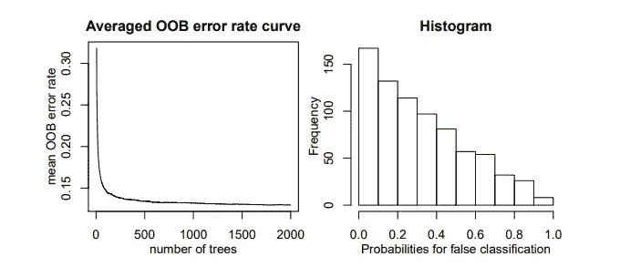
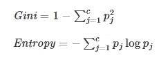

# 随机森林:超参数以及如何微调它们

> 原文：<https://towardsdatascience.com/random-forest-hyperparameters-and-how-to-fine-tune-them-17aee785ee0d?source=collection_archive---------5----------------------->

图片来自[来源](https://unsplash.com/)。

## 如何优化最常用的机器学习模型之一

随机森林是一种很棒的机器学习模型。它们解决了单个决策树的许多问题，并且在构建某个应用程序时，它们总是最准确的候选模型。

如果你不知道什么是决策树或随机森林，不要担心；我给你准备了以下文章。快速看一眼，然后回到这里。

 [## 决策树解释

### 学习机器学习决策树的所有知识

towardsdatascience.com](/decision-trees-explained-3ec41632ceb6)  [## 兰登森林解释道

### Random Forest 简单地解释了:训练、分类和回归的简单介绍

towardsdatascience.com](/random-forest-explained-7eae084f3ebe) 

在这篇简短的文章中，我们将探索随机森林的一些基本优化，以及每个超参数是什么，哪些值得优化。

我们走吧！

 [## 订阅我的专属列表！

### 订阅我的专属列表！并获得所有你喜欢的新鲜文章<3! By signing up, you will create a Medium…

z-ai.medium.com](https://z-ai.medium.com/subscribe) 

# Hyper-parameter considerations, tips and tricks

The most important hyper-parameters of a Random Forest that can be tuned are:

*   **森林中决策树的 N 个**(在 Scikit-learn 中这个参数被称为 *n_estimators* )
*   **在**每个节点上分割的标准(分类任务的基尼系数或熵，或回归的 MSE 或 MAE)
*   **单棵树的最大深度**。个体树越大，越有可能过度拟合训练数据，然而，由于在随机森林中我们有许多个体树，这不是一个大问题。
*   **在树的内部节点**上分割的最小样本。如果需要的话，我们可以用这个参数和前一个参数来调整单个的树。
*   **叶节点的最大数量。**在随机森林中，这并不重要，但是在单个决策树中，这也可以极大地帮助减少过度拟合，并且通过减少到叶节点的可能路径数量来帮助增加树的可解释性。了解如何使用决策树来构建可解释的 ML 模型[在这里](/explainable-artificial-intelligence-14944563cc79)。
*   **包括在每个分割节点的随机特征数量**。
*   **用来训练每个决策树的引导数据集**的大小。

好了，现在我们知道应该在哪里优化和调整我们的随机森林，让我们看看触摸这些参数会做什么。

## 森林中的树木数量:

通过用大量的树(大量的估计量)建立森林，我们可以以更长的训练时间为代价，创建一个方差更小的更健壮的集合模型。大多数情况下，这里的秘密是评估您的数据:有多少数据可用，以及每个观察值有多少个特征。

由于随机森林的随机性，如果您有大量的要素和少量的树，一些具有高预测能力的要素可能会被排除在森林之外，无论如何都不会被使用，或者很少被使用。

这同样适用于数据:如果您有大量的观察值，并且您没有使用整个数据集来训练每棵树，如果您有少量的树，那么一些观察值可能会被忽略。

由于随机森林很少过度拟合，在实践中，您可以使用大量的树来避免这些问题，并遵循以下准则获得良好的结果:当所有其他超参数都固定时，增加树的数量通常会以更长的训练时间为代价来减少模型误差。

不过，不要被这种说法所迷惑，用 10K 树建造一个森林是一种疯狂而无用的方法:主要的收获是，随着你增加树的数量，你将减少模型方差，通常模型误差将接近最佳值。

随着我们增加树的数量和对具有 100000 棵树的 RF 的估计直方图，分类误差减少。[来源](https://arxiv.org/pdf/1705.05654.pdf)。

***结论*** *:微调树的数量是不必要的，只需将树的数量设置为一个大的、计算上可行的数字，就可以了。*

## 在树的每个节点上拆分的标准

决策树通过计算哪个特征和该特征的哪个值最好地分割到该点的观察，在每个节点做出局部最优决策。

为了做到这一点，他们使用了一个特定的指标(基尼系数或熵值用于分类)和(MAE 或 MSE 用于回归)。对于回归，如果数据中没有很多异常值，一般规则是采用 MSE，因为它会严重惩罚那些远离平均值的观察值。

对于分类，事情有点棘手。我们必须用基尼系数或熵值来计算杂质，这有时会导致不同的分裂。以下面的问题为例，我们有两个类，A 和 B:

*   *根据基尼系数和熵，仅具有 A 类观测值的节点是 100%纯的。*
*   *根据基尼系数和熵，具有 10 个 A 类观测值和 10 个 B 类观测值的节点是 100%不纯的。*
*   *具有 3 个 A 类观察值和 1 个 B 类观察值的节点是 75%或 81%不纯的，这取决于我们是否分别使用基尼或熵。*

根据我们使用两者中的哪一个，我们的模型可以改变。这里没有一个真正的经验法则来知道该选择哪一个。不同的决策树算法使用不同的指标(CART 使用 Gini，而 ID3 使用熵)。

基尼系数和熵的公式。自制图像。

话虽如此，基尼系数通常计算成本较低，因为它不计算对数。RandomForestClassifier 的 Scikit-Learn 实现允许我们从两者中进行选择，因此尝试两种方法并查看哪种方法导致的错误更小可能是值得的。

***结论*** *:微调分割标准可能会导致不同的森林，由于只有两个可能的值，我们建议对分类森林尝试这两个值。*

## 单棵树的最大深度

增加单个树的深度会增加被考虑的特征/值组合的可能数量。树越深，它的分割就越多，它考虑的数据信息就越多。

在单个树中，这会导致过度拟合，但是在随机森林中，由于集合的构建方式，很难过度拟合，尽管对于较大的深度值仍有可能。

这个参数应该根据你的树的特征的数量设置一个合理的数量:不要建造树桩(非常浅的树)也不要建造大得吓人的树；将此参数设置为一个合理的值，如果需要的话可以稍微调整一下，但是合理值附近的变化不会对林的性能产生太大影响，所以如果您不需要，不必将它包括在像网格搜索这样的过程中。

***结论*** *:不需要微调树的深度，取一个合理的值，继续其他超参数。*

## 每次分割时要考虑的随机要素的数量

这是随机森林集合中最重要的超参数之一，所以请密切注意。

这个超参数的最佳值在没有实验的情况下很难选择，因此获得它的最佳方法是使用交叉验证的网格搜索，并考虑以下因素:

*   较小的值(在每个节点进行分割时考虑较少的特征)将减少集合的方差，代价是较高的个体树(可能还有集合)偏差。
*   该值应根据您拥有的信息量或质量要素的数量进行设置，并考虑到包含许多异常值的噪声要素。如果您的数据集具有非常干净、完美和高质量的要素，那么每个分割上的随机要素数量的值可能相对较小:所有考虑的要素都将是酷的。如果您有很多嘈杂的数据，那么这个值可能应该更高，以增加质量特征被包括在竞赛中的机会。
*   增加分割中考虑的随机要素的最大数量往往会降低模型的偏差，因为包含好要素的机会更大，但是这可能会以增加方差为代价。此外，当我们在每个节点包含更多要测试的特性时，训练速度会降低。

这里最实用的方法是交叉验证您的可能选项，并保留产生最佳结果的模型，同时考虑前面的考虑因素。您可以尝试在 Scikit-learn 的 [RandomForestClassifier 的网格搜索空间中设置以下值。](https://scikit-learn.org/stable/modules/generated/sklearn.ensemble.RandomForestClassifier.html)

1.  ***无*** :这将考虑你的数据的所有特征，从随机森林中取出一些随机性，并可能增加方差。
2.  ***sqrt*** :该选项将取单个每次分割的特征总数的平方根。如果我们的数据中有 25 个特征，那么它将在每个节点随机选取 5 个特征。这个选项通常适用于分类问题。
3.  ***0.2***(0 到 1 之间的十进制值):该选项允许随机森林在个体分割中取%的变量。在这个例子中，我们将选择 20%的特性，如果我们有许多特性，这是一个合理的数量。尝试 0.3、0.4 和 0.5，如果您有非常嘈杂的数据，甚至可能是更高的值。对于回归问题，0.33%是一个很好的起点。

## **引导数据集的大小**

**最后，我们将讨论增压数据集大小的重要性。这是用于训练每棵树的训练数据的百分比。**

**因为观察值是通过替换进行采样的，所以即使引导数据集的大小与整个训练集相同，两个数据集也会不同，所以很多时候该参数保持不变，并且每棵树都用具有相同初始训练数据大小的随机观察值集进行训练。**

**在 Sklearn 中，这由 *max_samples* 超参数控制，该参数默认采用初始数据集的大小。**

**在预期中，从大小为 N 的数据集中抽取 N 个替换样本将从原始集中选择大约 2/3 个唯一样本，留下 1/3 个样本(所谓的出袋或 OOB 数据，然后可用于评估森林)。**

**出于这些考虑，使用完整大小的训练数据没有坏处，因此大多数情况下，最好的办法是不要接触这个超参数。**

** [## 订阅我的专属列表！

### 订阅我的专属列表！获得所有你喜欢的关于随机森林超参数调整的最新文章<3! By signing up, you will create a Medium…

z-ai.medium.com](https://z-ai.medium.com/subscribe) 

# Conclusion and further Resources.

In this post we have seen what the most important Hyper parameters of Random Forest are, how to set their values, and which of them are worth fine-tuning.

Like any ML problem, this is all dependent on your data, resources, and goal, so if you have time, do a sparse grid search first around the recommended values for each hyper-parameter and then a second, more specific search close to the optimal values found in the previous step.

The best parameter values should always be cross-validated if there is time for it, and at least a couple of combinations should be tried. For further information take a look at the following resources:

*   [。](https://scikit-learn.org/stable/modules/ensemble.html#parameters)
*   [围绕这个问题的讨论令人敬畏。](https://www.kaggle.com/general/4092)

*有关机器学习和数据科学的更多资源，请查看以下资源库:* [***如何学习机器学习***](https://howtolearnmachinelearning.com/books/machine-learning-books/) *！有关职业资源(工作、事件、技能测试)，请访问*[***AIgents.co——数据科学家职业社区&机器学习工程师***](https://aigents.co/) *。*

还有，你可以订阅我的邮箱列表在这里获取最新更新和独家内容:[订阅邮箱列表](https://z-ai.medium.com/subscribe)。

非常感谢您的阅读，祝您愉快！**