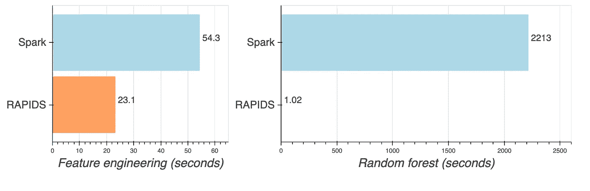

# GPU 上的随机森林:比 Apache Spark 快 2000 倍

> 原文：<https://towardsdatascience.com/random-forest-on-gpus-2000x-faster-than-apache-spark-9561f13b00ae?source=collection_archive---------18----------------------->

## 闪电般的快速模型训练与急流

在 [Unsplash](https://unsplash.com?utm_source=medium&utm_medium=referral) 上由[巴迪·阿巴斯](https://unsplash.com/@bady?utm_source=medium&utm_medium=referral)拍摄的照片

声明:我是[土星云](https://www.saturncloud.io/)的高级数据科学家——我们用 Python、Dask 和 RAPIDS 让企业数据科学变得快速而简单。

更喜欢看？点击查看视频演练[。](https://youtu.be/IrbX9qhj5v4)

随机森林是一种机器学习算法，因其鲁棒性、准确性和可扩展性而受到许多数据科学家的信任。该算法通过 bootstrap 聚合来训练许多决策树，然后通过聚合森林中树的输出来进行预测。由于其整体特性，随机森林是一种可以在分布式计算环境中实现的算法。可以跨集群中的进程和机器并行训练树，从而比使用单个进程显著缩短训练时间。

在本文中，我们探索了使用 [Apache Spark](http://spark.apache.org/) 在 CPU 机器集群上实现分布式随机森林训练，并将其与使用 [RAPIDS](https://rapids.ai/) 和 [Dask](https://dask.org/) 在 GPU 机器集群上训练的性能进行比较。虽然 ML 世界中的 GPU 计算传统上是为深度学习应用程序保留的，但 RAPIDS 是一个在 GPU 上执行数据处理和非深度学习 ML 工作负载的库，与在 CPU 上执行相比，导致了巨大的性能加速。我们使用 3 亿个实例训练了一个随机森林模型: **Spark 在 20 节点 CPU 集群上花费了 37 分钟**，而 **RAPIDS 在 20 节点 GPU 集群上花费了 1 秒**。这比 GPU 快了 2000 多倍🤯！

曲速随机森林与 GPU 和急流！

# 实验概述

我们使用公开可用的[纽约出租车数据集](https://www1.nyc.gov/site/tlc/about/tlc-trip-record-data.page)并训练一个随机森林回归器，该回归器可以[使用与乘客接送相关的属性预测出租车的费用金额](https://www.kaggle.com/c/new-york-city-taxi-fare-prediction)。将 2017 年、2018 年和 2019 年的出租车乘坐次数作为训练集，总计 **300，700，143 个实例**。

火花和急流代码可在 Jupyter 笔记本[这里](https://github.com/saturncloud/saturn-cloud-examples/tree/main/machine_learning/random_forest)获得。

# 五金器具

Spark 集群使用亚马逊 EMR 管理，而 Dask/RAPIDS 集群使用[土星云](https://www.saturncloud.io/)管理。

两个集群都有 20 个带有这些 AWS 实例类型的工作节点:

**火花** : `r5.2xlarge`

*   8 个 CPU，64 GB 内存
*   按需价格:0.504 美元/小时

**急流** : `g4dn.xlarge`

*   4 个 CPU，16 GB 内存
*   1 个 GPU，16 GB GPU 内存(英伟达 T4)
*   点播价格:0.526 美元/小时

土星云也可以使用 NVIDIA Tesla V100 GPUs 启动 Dask 集群，但我们选择了`g4dn.xlarge`进行此次测试，以保持与 Spark 集群类似的每小时成本。

# 火花

[Apache Spark](https://spark.apache.org/) 是一个开源的大数据处理引擎，内置于 Scala 中，带有一个 Python 接口，向下调用 Scala/JVM 代码。它是 Hadoop 处理生态系统中的一个主要部分，围绕 MapReduce 范式构建，具有数据帧接口和机器学习接口。

[设置 Spark 集群](http://spark.apache.org/docs/latest/cluster-overview.html)超出了本文的范围，但是一旦集群准备好了，就可以在 Jupyter 笔记本中运行以下命令来初始化 Spark:

`findspark`包检测 Spark 安装在您系统上的位置；如果火花包是可发现的，则不需要这样做。需要设置几个[配置设置](https://spark.apache.org/docs/latest/configuration.html)来获得高性能的 Spark 代码，这取决于您的集群设置和工作流。在这种情况下，我们设置`spark.executor.memory`来确保我们不会遇到任何内存溢出或 Java 堆错误。

# 湍流

[RAPIDS](https://rapids.ai/) 是一个开源的 Python 框架，它在 GPU 而不是 CPU 上执行数据科学代码。这为数据科学工作带来了巨大的性能增益，类似于训练深度学习模型所看到的那些。RAPIDS 有数据帧、ML、图形分析等接口。RAPIDS 使用 [Dask](https://dask.org/) 来处理具有多个 GPU 的机器的并行化，以及每个具有一个或多个 GPU 的机器集群。

设置 GPU 机器可能有点棘手，但 [Saturn Cloud](https://www.saturncloud.io/) 有用于启动 GPU 集群的预建映像，因此您只需几分钟就可以启动并运行！要初始化指向集群的 Dask 客户端，可以运行以下命令:

要自己设置 Dask 集群，请参考[本文档页面](https://docs.dask.org/en/latest/setup.html)。

# 数据加载

数据文件托管在一个公共的 S3 存储桶上，因此我们可以直接从那里读取 CSV。S3 存储桶将所有文件放在同一个目录中，所以我们使用`s3fs`来选择我们想要的文件:

使用 Spark，我们需要单独读取每个 CSV 文件，然后将它们组合在一起:

使用 Dask+RAPIDS，我们可以一次性读入所有 CSV 文件:

# 特征工程

我们将根据拾取时间生成一些要素，然后缓存/保存数据帧。在这两个框架中，这会执行所有的 CSV 加载和预处理，并将结果存储在 RAM 中(在 RAPIDS 中是 GPU RAM)。我们将用于培训的功能有:

对于 Spark，我们需要将特性收集到一个`Vector`类中:

对于 RAPIDS，我们将所有浮点值转换为 GPU 计算的`float32`精度:

# 训练随机森林！

我们用几行代码为两个包初始化并训练随机森林。

火花:

急流:

# 结果

我们在 Spark (CPU)和 RAPIDS (GPU)集群上对纽约市出租车数据的 300，700，143 个实例训练了一个随机森林模型。两个集群都有 20 个工作节点，小时价格大致相同。以下是工作流程各部分的结果:

随机森林的火花与急流

> Spark 是 37 分钟，而 RAPIDS 是 1 秒钟！

赢得胜利的 GPU！想想当你不需要为一个*单次拟合*等待超过 30 分钟时，你可以多快地迭代和改进你的模型。一旦您添加了超参数调整或测试不同的模型，每次迭代很容易增加到几个小时或几天。

需要看到才相信？你可以在这里找到笔记本[，自己运行！](https://github.com/saturncloud/saturn-cloud-examples/tree/main/machine_learning/random_forest)

# 你需要更快的随机森林吗？

是啊！有了[土星云](https://www.saturncloud.io/)，你可以在几秒钟内进入 Dask/RAPIDS 集群。Saturn 处理所有工具基础设施、安全性和部署方面的问题，让您立即开始使用 RAPIDS。点击[在你的 AWS 账户中免费试用](https://manager.aws.saturnenterprise.io/register)Saturn！

查看[用 Dask 调节增压超参数](/supercharging-hyperparameter-tuning-with-dask-ab2c28788bcf)