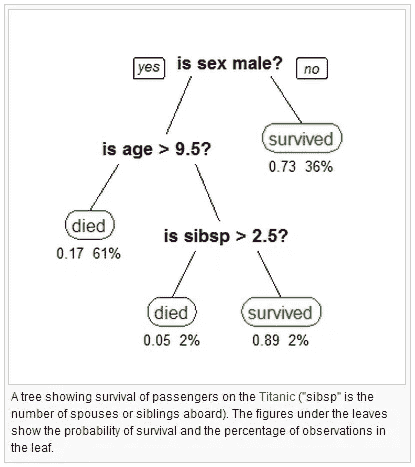
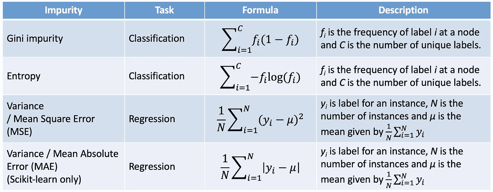
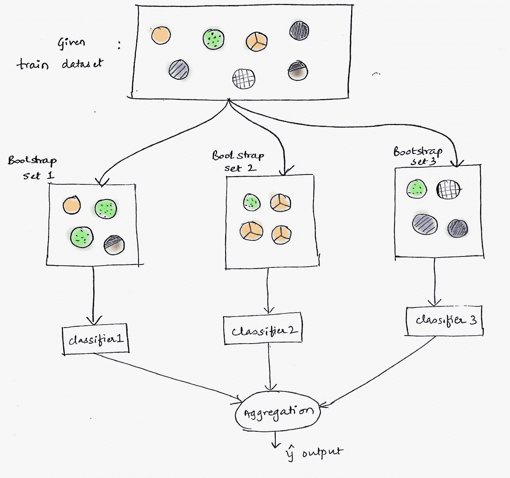

# 随机森林概述

> 原文：<https://towardsdatascience.com/random-forest-overview-746e7983316?source=collection_archive---------14----------------------->

## 随机森林的概念概述

图 1:[玛丽塔·卡韦拉什维利](https://unsplash.com/@maritafox?utm_source=medium&utm_medium=referral)在 [Unsplash](https://unsplash.com?utm_source=medium&utm_medium=referral) 上的照片

由于 Keras、Tensorflow、Py-torch 和 Scikit-Learn 等令人惊叹的开源框架，机器学习和深度学习算法变得更加民主化，每个人都可以参与到下一代的建设中来。因此，我们不再需要用自己的代码从头开始构建任何算法，因为轮子已经发明出来了。然而，尽管我们现在可以实现算法，而不必深入了解幕后发生的事情，但我强烈认为，彻底了解我们的机器学习或深度学习算法在幕后做什么仍然是极其重要的，因为它使调试算法变得更加容易，这样我们就可以更好地解释模型的结果，并使用它来进行精心设计的实验，以找到我们可以用来优化模型的程序。

学习技术概念时可以采用的一个很好的框架被称为“**自顶向下方法**”。该领域的主要从业者/导师[杰瑞米·霍华德](https://medium.com/u/34ab754f8c5e?source=post_page-----746e7983316--------------------------------)和[雷切尔·托马斯](https://medium.com/u/ee56d0bac1b7?source=post_page-----746e7983316--------------------------------),[fast . ai](https://www.fast.ai/)的创始人，不断地倡导这种方法，以至于我被激怒去读保罗·洛克哈特的书，书名为“[数学家的哀叹](https://www.amazon.co.uk/Mathematicians-Lament-School-Fascinating-Imaginative/dp/1934137170)”(他们经常用这本书来支持这种方法)。自上而下方法的思想是颠倒用于常规学习的传统方法(即在从事实际工作之前接受多年的理论教育),首先从事实际工作，然后再回来学习理论。

我发现这种方法有助于我建立一个关于特定技术方法的心智模型，因此当我访问关于该技术的理论时，我倾向于更加好奇为什么某些组件允许某些东西以这种方式工作。

在这篇博文中，我将分享对随机森林内部运作的概述。但是，我建议，如果您以前从未实现过随机森林，那么在阅读这篇概述文章之前，您可以这样做，并对超参数(训练前设置的参数)进行一些更改，以更好地了解它们如何影响算法的输出。

> 由于有大量非常广泛的资源覆盖随机森林，这将有助于开始，我没有准备自己的笔记本来浏览，尽管如果有人要求我这样做，我会这样做——在 kurtispykes@gmail.com 留下回复或给我发电子邮件。相反，我链接了一个资源，在我学习 Random forest 的时候，我发现这个资源非常有用。

在《Fast.ai 程序员机器学习入门》的[第 1-rf](https://github.com/fastai/fastai/blob/master/courses/ml1/lesson1-rf.ipynb) 课是一门 MOOC，杰瑞米·霍华德使用 Kaggle [Bluebook for 推土机](https://www.kaggle.com/c/bluebook-for-bulldozers)数据集穿越随机森林。我相信克隆这个库并通过笔记本唤醒真的很有用(即使没有视频)。我的建议是改变算法中的东西，直到你破坏了它(一旦你破坏了它就试图修复它)，这样你就可以直观地理解改变一个特征是如何影响模型预测的结果的。

附注:使用[此链接](https://www.kaggle.com/c/bluebook-for-bulldozers/data)下载用于此笔记本的数据集。

 [## 法斯泰/法斯泰

### 此时您不能执行该操作。您已使用另一个标签页或窗口登录。您已在另一个选项卡中注销，或者…

github.com](https://github.com/fastai/fastai/tree/master/courses/ml1) 

**在随机森林的地基上推车**

为了理解随机森林算法的内部工作原理，我们必须首先对决策树有一个直观的了解。决策树是一种高度可解释且重要的预测模型，能够执行分类和回归任务——决策树是最初用于算法的经典名称，但是在更现代的教科书和上下文中，决策树可能被称为 CART 算法，这是表示分类和回归树的首字母缩写词，因为该算法能够进行回归和分类。

虽然算法有看起来相当复杂的趋势，但手推车一直存在于我们的日常生活中。事实上，当人们了解手推车是如何工作的，并看到它与我们用来做决定的思维过程有多么相似时，他们仍然会感到惊讶。例如，如果我在考虑周末做什么活动，在对一项任务得出一些结论之前，我会考虑许多特征/变量。首先，我可能会考虑是否会下雨；如果周末下雨，我可能会决定呆在家里看书，但是如果不下雨，我会考虑切尔西俱乐部是否会在周末进行比赛。如果切尔西在比赛，我会问他们是在主场还是客场比赛；如果切尔西主场比赛，我会去看比赛，但是如果他们客场比赛，我会继续问问题，直到我决定周末做什么。

图 Titanic 数据集上使用的决策树。[【来源:维基百科】](https://www.google.com/url?sa=i&url=https%3A%2F%2Fen.wikipedia.org%2Fwiki%2FDecision_tree_learning&psig=AOvVaw0Li-54o-A6v38evo5aBEHd&ust=1584266288029000&source=images&cd=vfe&ved=0CAIQjRxqFwoTCJCW2P7ZmegCFQAAAAAdAAAAABAT)

这种类似流程图的结构就是手推车的工作原理。从技术上来说，CARTs 试图通过提供最大信息增益的划分来划分协变量空间。因为我认为有时解释是不必要的复杂，所以我将其解释为，CARTs 试图将数据分割成子集(称为节点)，树中的第一个节点称为根节点，进行二进制分割的节点称为内部节点，因此剩下的不进行分割的节点称为叶节点，它们最好地分离了结果。

为了在每个节点上进行二进制分割，该算法必须找到这样的特征(以及特征阈值，如果特征值不是二进制的话),该特征的分割最好地分离了类，因此命名为信息增益，因为我们获得了关于最终结果的最多信息。为了确定“最佳”分割，定义了一个成本函数，例如用于分类任务的[基尼系数](https://en.wikipedia.org/wiki/Decision_tree_learning#Gini_impurity)或[熵](https://en.wikipedia.org/wiki/Entropy_(information_theory))(实际上，你决定优化哪一个并不重要)和用于回归任务的 [RMSE](https://en.wikipedia.org/wiki/Root-mean-square_deviation) (均方根误差)，目的是在特征空间中找到使这些标准最小化的分割，从而在每一步产生最佳分割。此外，CARTs 也被称为贪婪算法，因为在树的每一步，该算法都试图进行最优分割，以便达到全局最优解。

图 sklearn 中使用的杂质公式。[ **来源**:[Stacey Ronaghan](https://medium.com/u/60a50d133053?source=post_page-----746e7983316--------------------------------)—[sci kit 中的决策树、随机森林和特性重要性的数学-learn 和 Spark](/the-mathematics-of-decision-trees-random-forest-and-feature-importance-in-scikit-learn-and-spark-f2861df67e3)

没有正则化，更好地称为树结构中的修剪，树将在每个节点递归地分裂，直到每个节点，直到每个叶节点只剩下一个结果。虽然在我们决定周末应该做什么活动的场景中，这很好，因为我们总是会对我们应该做什么活动得出结论，但在应用机器学习中，这是一个主要问题，因为算法无法归纳(这是应用机器学习的全部目的)到看不见的实例，因为它只是记忆训练数据，这被称为过度拟合。

有各种剪枝方法来对抗 CARTs 泛化失败，但是这些技术经常导致训练期间的准确度降低和算法复杂度降低。使用多个决策树并取树的平均值(回归)或取多数投票(分类)很快成为解决这个问题的方法，并由此诞生了随机森林。目标是保持树的复杂性，同时保持训练数据的高准确性，并允许算法可以很好地推广到看不见的实例。

**购物车的伪代码(无调整)**

`1) Define a cost function i.e. Gini index or Entropy (Classification) RMSE or MAE(Regression)
2) Perform binary split on the feature that minimise cost function
2) Repeat step 2 until you reach leaf node in all branches`

**随机森林概念**

图 5:汤米·克兰巴赫在 [Unsplash](https://unsplash.com?utm_source=medium&utm_medium=referral) 上拍摄的照片

花点时间想想一片森林。一片森林是由许多独立的树木组成的。当我们将一组项目作为一个整体而不是一个个来识别时，我们称之为“集合*”,因此森林是由大量单独的树组成的集合(当我们分解随机森林算法时，请记住这一点)。*

*随机森林是 Leo Breiman 在 2001 年开发的一种集成方法(它将多个决策树预测器分组)。在[2]中，Breiman 陈述了“树分类器森林的泛化误差取决于森林中个体树的强度以及它们之间的相关性”。也就是说，随机森林使用一种称为 bootstrap aggregation 的有效方法，以及随机子空间 method⁴来生长单个树，以实现非常强大的聚合预测器，能够进行分类和回归，比单个决策树具有更好的泛化误差。*

***引导汇总(打包)***

***B**ootstrap**agg**regatin**g**或者简单地说，Bagging，是一种用于生成预测器的多个版本并使用这些预测器来实现聚合预测器的方法[3]。通过制作 bootstrap 复制——通过替换从训练集中随机采样实例——并将此作为新的 bootstrap 数据作为训练集，随机性被引入到每个预测器中。请注意，当实例被随机采样到引导集时，它们将被替换回原始训练集，因此某些实例可能会在训练预测器的引导训练集中出现多次。此外，输入每个预测模型的每个引导样本具有相同的分布。*

*在这种情况下，聚合预测器是我们的随机森林，当我们解决回归型问题时，它输出每个决策树预测的平均值，我们试图预测一个连续的结果，如房子的价格。另一方面，当我们在进行分类任务时——我们试图预测一些离散的标签，如一幅图像是否是一只猫——我们的随机森林输出每个模型的相对大多数预测。*

**

*图 6:装袋示例。【来源:[叶达鑫·纳伊克](https://medium.com/u/cc231c450ec4?source=post_page-----746e7983316--------------------------------) - [装袋:通过视觉进行机器学习。#1:什么是“打包”集成学习？](https://medium.com/machine-learning-through-visuals/machine-learning-through-visuals-part-1-what-is-bagging-ensemble-learning-432059568cc8) ]*

***随机子空间方法***

*在[4]中，Kam Ho Tin 提出了随机子空间方法，通过降低集成中预测模型之间的相关性，在不牺牲训练数据准确性的情况下，提高决策树分类器的泛化准确性。这种方法在某种意义上类似于 bagging，即在具有替换的特征的随机样本上训练集成中的每个预测模型，而不是在所有特征上训练模型。该技术允许预测者不将其全部注意力集中在看起来比其他特征更具预测性的特征上。*

***改善泛化误差***

*上面提到的技术被引入到随机森林中，以降低每个预测器的相关性，用方差换取一些偏差。尽管每个单独的决策树本质上都是过度拟合的(每个树在训练数据上单独获得 100%的分数)，但是用于构建每个树的训练数据和特征是不同的。先前调整的结果是决策树模型的相关性较低，并产生不同的错误，从而导致模型在正确性上互补。*

*改善随机森林的泛化误差的另一种方法是改善每个个体树的强度。通过构建具有强预测准确性的树(降低树的错误率)，我们降低了随机森林的整体错误率。*

> *减小 m 会降低相关性和强度。增加它会增加两者。介于两者之间的是 m 的“最佳”范围——通常相当宽。这是随机森林稍微敏感的唯一可调参数。*

*随机森林中一个非常有用的机制叫做 OOB 错误。这是一种用于评估模型中错误率的技术，该模型使用引导聚合(Bagging)来获得用于训练的引导样本。OOB 是通过仅使用未在构建树的引导示例中选择的实例进行预测而得到的。*

**

*图 7:[米洛·米洛耶格](https://unsplash.com/@miloezger?utm_source=medium&utm_medium=referral)在 [Unsplash](https://unsplash.com?utm_source=medium&utm_medium=referral) 拍摄的照片*

***随机森林的伪代码***

*`1) For a training set of length N, sample N instances at random with replacement.
2) Grow a tree on the bootstrap training set using a specified number of random features
3) Repeat step 1 and 2 for the set number of estimators.
4) Average predictions or take majority vote (depending on type of task)`*

*随机森林是一种非常强大集合方法。虽然他们可能不再赢得 Kaggle 比赛，但在现实世界中，0.0001 的额外准确性并不重要(在大多数情况下)，随机森林是一个非常有效的开始实验的模型。*

*P.S. Kaggle 被认为是“数据科学之家”,平心而论，不难看出这是为什么。有一个很好的功能叫做笔记本，人们可以在里面分享他们的代码。如果你只是想运行一些算法，这是一个很好的开始。一个好主意是改变一些功能，并试图击败他们的分数，我发现这真的有助于学习。*

*基于你对随机森林了解，我推荐的其他帖子有:*

*   *[Eryk Lewinson](https://medium.com/u/44bc27317e6b?source=post_page-----746e7983316--------------------------------) - [以随机森林为例解释特征重要性](/explaining-feature-importance-by-example-of-a-random-forest-d9166011959e)*

* [## 以随机森林为例解释特征的重要性

### 了解 Python 中最流行的确定要素重要性的方法

towardsdatascience.com](/explaining-feature-importance-by-example-of-a-random-forest-d9166011959e) 

*   [将科尔森](https://medium.com/u/e2f299e30cb9?source=post_page-----746e7983316--------------------------------) - [随机森林简单解说](https://medium.com/@williamkoehrsen/random-forest-simple-explanation-377895a60d2d)

 [## 随机森林简单解释

### 用直观的例子理解随机森林

medium.com](https://medium.com/@williamkoehrsen/random-forest-simple-explanation-377895a60d2d) 

*   [饶彤彤](https://medium.com/u/840a3210fbe7?source=post_page-----746e7983316--------------------------------) - [了解随机森林](/understanding-random-forest-58381e0602d2)

 [## 了解随机森林

### 该算法如何工作以及为什么如此有效

towardsdatascience.com](/understanding-random-forest-58381e0602d2) 

*   [Stacey Ronaghan](https://medium.com/u/60a50d133053?source=post_page-----746e7983316--------------------------------)-[sci kit-learn 和 Spart 中决策树、随机森林和特征重要性的数学运算](/the-mathematics-of-decision-trees-random-forest-and-feature-importance-in-scikit-learn-and-spark-f2861df67e3)

 [## Scikit-learn 和 Spark 中决策树、随机森林和特征重要性的数学

### 介绍

towardsdatascience.com](/the-mathematics-of-decision-trees-random-forest-and-feature-importance-in-scikit-learn-and-spark-f2861df67e3) 

*   [叶达鑫·纳伊克](https://medium.com/u/cc231c450ec4?source=post_page-----746e7983316--------------------------------) - [装袋:通过视觉进行机器学习。#1:什么是“打包”集成学习？](https://medium.com/machine-learning-through-visuals/machine-learning-through-visuals-part-1-what-is-bagging-ensemble-learning-432059568cc8)

 [## 装袋:通过视觉进行机器学习。#1:什么是“打包”集成学习？

### 作者叶达鑫·纳伊克和阿尔琼·乔哈里

medium.com](https://medium.com/machine-learning-through-visuals/machine-learning-through-visuals-part-1-what-is-bagging-ensemble-learning-432059568cc8) 

*   [Jason Brownlee](https://medium.com/u/f374d0159316?source=post_page-----746e7983316--------------------------------) - [机器学习的分类和回归树](https://machinelearningmastery.com/classification-and-regression-trees-for-machine-learning/)

 [## 机器学习的分类和回归树-机器学习掌握

### 决策树是预测建模机器学习的一种重要算法。经典的决策树…

machinelearningmastery.com](https://machinelearningmastery.com/classification-and-regression-trees-for-machine-learning/) 

**参考文献:**

Breiman，l .，J. Friedman，R. Olshen 和 C. Stone。(1984):分类和回归树。

布雷曼，利奥。(2001).随机森林

布雷曼，利奥。(1996).打包预测值

何天锦，⁴(1995)。随机决策森林*